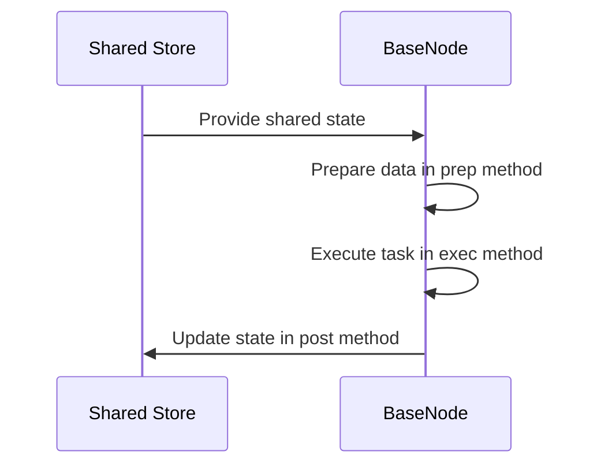

# Chapter 1: BaseNode

Have you ever watched an assembly line in a factory? Raw components arrive at the first station, a worker performs a specific action—like tightening a bolt or soldering a wire—and then passes the modified part down the line to the next person. 

What happens if you try to build an LLM application without a clean structure? Your code quickly turns into a tangled bowl of spaghetti. Prompts, API calls, and data transformations get mashed together into massive functions, making it nearly impossible to debug or scale.

In [PocketFlow](01_basenode.md), the fundamental building block representing a single step or operation is the `BaseNode`. It functions exactly like an individual worker on an assembly line passing components to the next station.

---

### The Three-Phase Lifecycle

Instead of cramming all your logic into a single monolithic function, `BaseNode` breaks every operation down into a clear, three-phase lifecycle:

1. **`prep(shared)`**: Pulls the exact data your worker needs from a shared state dictionary.
2. **`exec(prep_res)`**: Performs the heavy lifting (like calling an LLM or running a calculation) using *only* the prepared data.
3. **`post(shared, prep_res, exec_res)`**: Takes the results, updates the shared state, and decides what happens next.

Here is what the core structure looks like in code:

```python
from pocketflow import BaseNode

class ProcessStep(BaseNode):
    def prep(self, shared):
        return shared.get("input_data")
```

Next, the worker executes its designated task:

```python
    def exec(self, prep_res):
        return prep_res.upper()
```

Finally, the aftermath phase saves the work:

```python
    def post(self, shared, prep_res, exec_res):
        shared["output_data"] = exec_res
        return "default"
```

---

### How Data Moves Through a Node

To visualize how data flows through these three phases, let's look at the lifecycle sequence:



When you call a node, it executes these methods in strict sequence behind the scenes via its internal run mechanism, keeping your data pipeline predictable and easy to reason about.

---

### Looking Ahead

Now that you understand how an individual worker processes data step-by-step using `BaseNode`, you might wonder: what happens when things go wrong? What if an API call times out or an LLM returns malformed text? 

That brings us to the next chapter, where we look at [Node](02_node.md) and how to handle retries and failures gracefully.