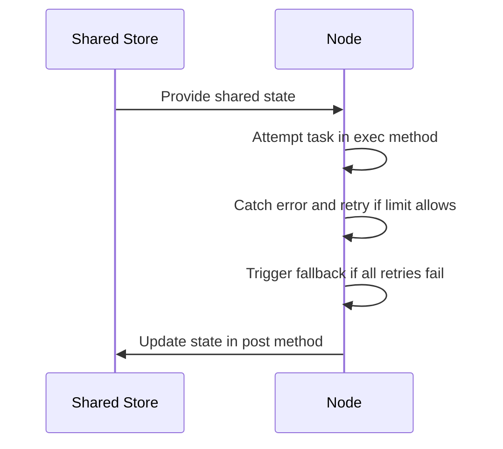

# Chapter 2: Node

Imagine you are running an automated factory line, and one of your robotic arms suddenly drops a bolt because of a temporary power glitch. If the entire factory screeches to a halt and throws up its hands the very first time an external API times out or an LLM returns a messy response, your application will constantly crash. 

As we saw in [BaseNode](01_basenode.md), a standard worker handles its task once and immediately fails if anything goes wrong. But real-world network requests and LLM endpoints are notoriously fragile. How do you keep your pipeline running smoothly when external services inevitably hiccup?

That is where `Node` comes in. 

---

### The Built-In Safety Net

Building on top of [BaseNode](01_basenode.md), `Node` acts like an automated circuit breaker protecting a vulnerable component. If a task fails, it automatically retries up to a configured limit before calling a fallback method. 

You can configure your safety net by passing `max_retries` and a `wait` interval when initializing your node:

```python
from pocketflow import Node

class RobustSearch(Node):
    def __init__(self):
        super().__init__(max_retries=3, wait=2)
```

If the execution phase throws an exception, the node catches it, waits for the specified seconds, and tries again. 

---

### How Retries and Fallbacks Work

To visualize how a node guards against transient errors, let's look at the retry lifecycle sequence:



If all retry attempts are exhausted, the node hands the error over to an `exec_fallback` method instead of crashing your program. By default, `exec_fallback` simply re-raises the exception, but you can override it to supply a graceful default value:

```python
    def exec_fallback(self, prep_res, exc):
        print(f"All retries failed due to: {exc}. Using fallback data.")
        return "Fallback search result"
```

---

### Looking Ahead

Now that you know how individual tasks can protect themselves against sudden failures with built-in retries, you might wonder: what happens when you need to run the exact same operation across a whole list of items simultaneously? 

That brings us to the next chapter, where we look at [BatchNode](03_batchnode.md) and how to process collections of data effortlessly.