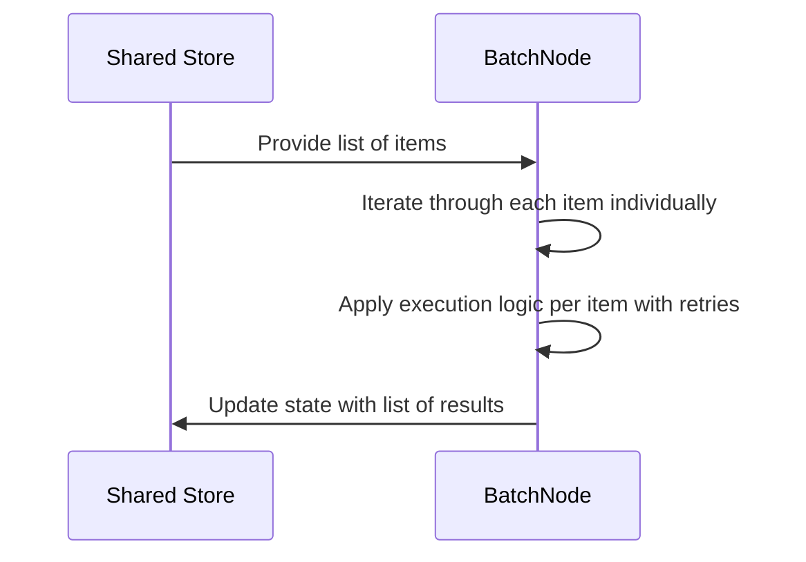

# Chapter 3: BatchNode

Imagine you run an automated fulfillment center where a box containing a dozen identical parts arrives at your station. If you had to unpack the box, write a manual loop to inspect each individual widget, handle errors for each one, and repack them all by hand every single time, your workflow would quickly become bogged down in repetitive boilerplate code.

As we saw in [BaseNode](01_basenode.md) and [Node](02_node.md), standard nodes are designed to handle a single task operation at a time. But what happens when your LLM application needs to translate a list of strings, analyze a batch of customer reviews, or process an array of independent database entries? Writing manual `for` loops inside your execution logic creates messy, repetitive code.

That is where `BatchNode` comes in. It acts like a conveyor belt that automatically iterates over a collection of items, executing the core operation for each one individually.

---

### The Conveyor Belt for Collections

`BatchNode` inherits directly from [Node](02_node.md), meaning it keeps all the built-in retry safety nets you learned about previously. However, it overrides how execution handles data: instead of passing a single value into your `exec` method, it automatically loops through an iterable collection of items, running your logic on every single element.

Here is how simple it looks to define a batch processing step:

```python
from pocketflow import BatchNode

class TranslateText(BatchNode):
    def prep(self, shared):
        return shared.get("sentences", [])
```

Next, the node handles the heavy lifting for each individual piece:

```python
    def exec(self, item):
        return item.upper()
```

Finally, the post-processing phase collects the results and saves them back to your shared state:

```python
    def post(self, shared, prep_res, exec_res):
        shared["translated"] = exec_res
        return "default"
```

---

### How Batch Iteration Works

To visualize how items flow through a `BatchNode`, let's look at the sequence of operations:



Behind the scenes, `BatchNode` takes the collection returned by your `prep` method, feeds each element into the underlying execution and retry pipeline, and automatically bundles the outputs into a neat list for your `post` method.

---

### Looking Ahead

Now that you know how to effortlessly process collections of items one by one using `BatchNode`, you might wonder: how do we chain multiple steps together into an automated pipeline or workflow? 

That brings us to the next chapter, where we look at [Flow](04_flow.md) and how to orchestrate nodes into a complete, end-to-end application.