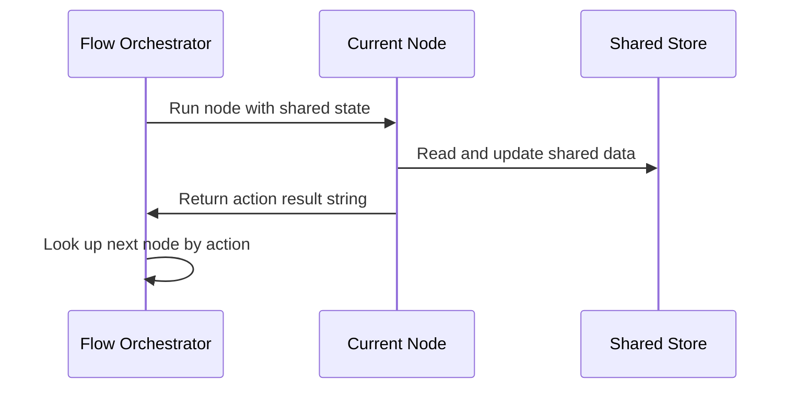

# Chapter 4: Flow

Imagine you are running a bustling restaurant kitchen. You have a chef slicing vegetables, a line cook grilling steaks, and a waiter ferrying plates to customers. If every station just operated in isolation whenever they felt like it, chaos would ensue. Raw meat would hit the table before it was cooked, and customers would get bills before they ordered. You need a floor manager who directs tasks from one department to the next depending on the outcome of each step.

As we saw in [BaseNode](01_basenode.md), [Node](02_node.md), and [BatchNode](03_batchnode.md), individual workers can execute tasks, handle retries, and process collections. But what happens when you need to string multiple distinct operations together into a coherent, directional pipeline where the next step depends entirely on what the previous step decided?

That is where `Flow` comes in. It acts as the orchestrator that chains multiple nodes together into a directional graph, executing them in sequence based on action results.

---

### The Project Manager for Nodes

`Flow` inherits from `BaseNode`, meaning it fits right into the same predictable structure you already know. Instead of performing a single atomic calculation, its execution loop continuously runs the current node, inspects the resulting action string, and looks up the next station in the graph.

Wiring nodes together in `Flow` is remarkably intuitive. You can use the `>>` shift operator combined with an action name to establish directed paths between your stations:

```python
from pocketflow import Flow
from nodes import DecideAction, SearchWeb

def create_agent_flow():
    decide = DecideAction()
    search = SearchWeb()
    
    # If DecideAction returns "search", go to SearchWeb
    decide - "search" >> search
    
    # After SearchWeb completes and returns "decide", go back to DecideAction
    search - "decide" >> decide
    
    return Flow(start=decide)
```

Behind the scenes, when an action like `"search"` is returned by a node's `post` method, the flow's orchestrator looks up that exact key in the node's successors dictionary and transitions smoothly to the designated next worker.

---

### How Flow Orchestrates Execution

To visualize how an orchestrator routes data and directs tasks from department to department, let's look at the orchestration sequence:



When you invoke the flow, the orchestrator sets the starting node, passes along any global parameters, captures the resulting action string, and loops until no further successors remain.

---

### Looking Ahead

Now that you know how to orchestrate a dynamic sequence of nodes into a cohesive, conditional workflow using `Flow`, you might wonder: what happens when you want to run entire multi-step flows across a batch of independent inputs concurrently? 

That brings us to the next chapter, where we look at [BatchFlow](05_batchflow.md) and how to scale your pipelines effortlessly.