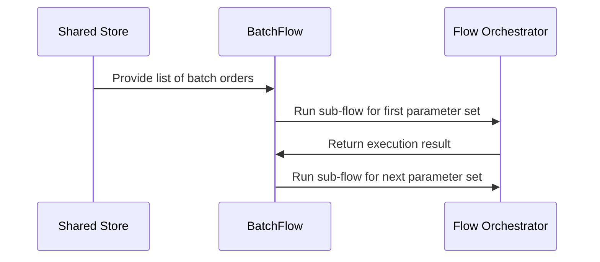

# Chapter 5: BatchFlow

Imagine you are running a custom printing factory. Instead of taking a single order for custom t-shirts, a major corporate client sends you a list of fifty separate branch offices, each with its own specific logo design, color scheme, and delivery address. If you tried to handle this with a single worker node or even a basic collection loop, you would quickly find yourself drowning in conditional logic, trying to remember which style guide belongs to which branch while running your multi-step proofing and validation pipeline.

As we saw in [Flow](04_flow.md), you can connect multiple nodes into a clean, directional pipeline where the output of one station determines the next. But what happens when you need to run that *entire multi-step flow* repeatedly across a whole list of separate batch orders, feeding customized parameters into each run?

That is where `BatchFlow` comes in. It acts as a specialized pipeline runner that takes a batch of input parameters and executes a complete sub-flow for each item sequentially, exactly like running a complete manufacturing pipeline repeatedly for every batch order received.

---

### The Batch Pipeline Runner

`BatchFlow` inherits from `Flow`, meaning it keeps all the powerful orchestration capabilities you learned about previously. However, it overrides how data is initialized and executed: instead of running your graph once with global settings, it pulls a list of parameter dictionaries and executes the entire sub-flow independently for every single item.

Here is how simple it is to define a batch flow that processes a list of order parameters:

```python
from pocketflow import BatchFlow, Flow

class OrderBatchFlow(BatchFlow):
    def prep(self, shared):
        return shared.get("batch_orders", [])
```

Behind the scenes, `BatchFlow` iterates over each parameter dictionary returned by `prep`, injecting those specific values into the flow's execution engine for that iteration.

---

### How Batch Flows Execute

To visualize how data moves through a `BatchFlow`, let's look at the sequence of operations:



When you invoke the batch flow, it loops through your collection of input items, merging any global flow parameters with the specific batch parameters for each individual run.

---

### Looking Ahead

Now that you know how to execute entire multi-step flows sequentially across a batch of independent inputs using `BatchFlow`, you might wonder: what happens when network latency or external API calls slow down your pipeline, and you need to handle operations asynchronously? 

That brings us to the next chapter, where we look at [AsyncNode](06_asyncnode.md) and how to bring non-blocking execution to your nodes.