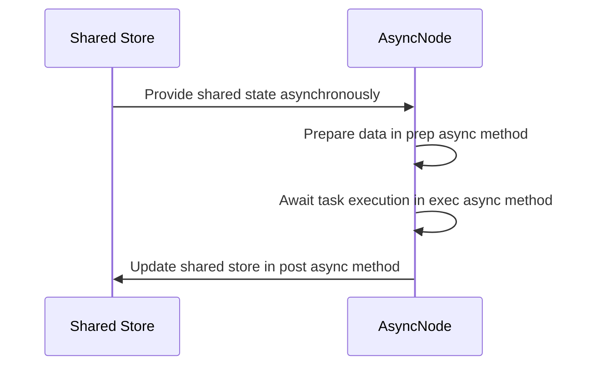

# Chapter 6: AsyncNode

Imagine you are running a bustling coffee shop counter during the morning rush. If your barista took an order, stood frozen staring at the espresso machine while it brewed, and refused to look at the next customer until the entire cup was handed over, your queue would stretch out the door and down the block. A smart barista takes an order, kicks off the brewing process, and immediately pivots to take the next customer's request while waiting.

As we saw in [Node](02_node.md) and [BatchNode](03_batchnode.md), standard nodes handle tasks synchronously, locking up the thread while waiting for external network responses or LLM generations. But what happens when your application needs to handle multiple slow network calls concurrently without blocking the entire program?

That is where `AsyncNode` comes in. It acts as an asynchronous worker capable of multitasking while waiting for network responses or LLM generations.

---

### The Non-Blocking Worker

`AsyncNode` inherits from [Node](02_node.md), meaning it keeps all the built-in retry safety nets and fallback logic you already know. However, it introduces asynchronous equivalents for every phase of the lifecycle: `prep_async`, `exec_async`, and `post_async`.

Here is how simple it is to define a non-blocking operation using Python's `asyncio`:

```python
from pocketflow import AsyncNode
import asyncio

class FetchData(AsyncNode):
    async def prep_async(self, shared):
        return shared.get("endpoint")
```

Next, the worker performs its non-blocking execution:

```python
    async def exec_async(self, prep_res):
        # Simulate waiting for a slow network response
        await asyncio.sleep(1)
        return f"Data from {prep_res}"
```

Finally, the post-processing phase saves the result back to your shared state:

```python
    async def post_async(self, shared, prep_res, exec_res):
        shared["result"] = exec_res
        return "default"
```

---

### How Async Execution Works

To visualize how an asynchronous worker handles non-blocking tasks and retries, let's look at the lifecycle sequence:



When you invoke an `AsyncNode`, you use `run_async` instead of the standard `run` method, allowing your application to yield control back to the event loop whenever it encounters an `await` statement.

---

### Looking Ahead

Now that you know how individual workers can perform non-blocking operations and multitask using `AsyncNode`, you might wonder: what happens when you want to scale this up and run multiple async nodes concurrently across a collection of items? 

That brings us to the next chapter, where we look at [AsyncParallelBatchNode](07_asyncparallelbatchnode.md) and how to supercharge your performance.