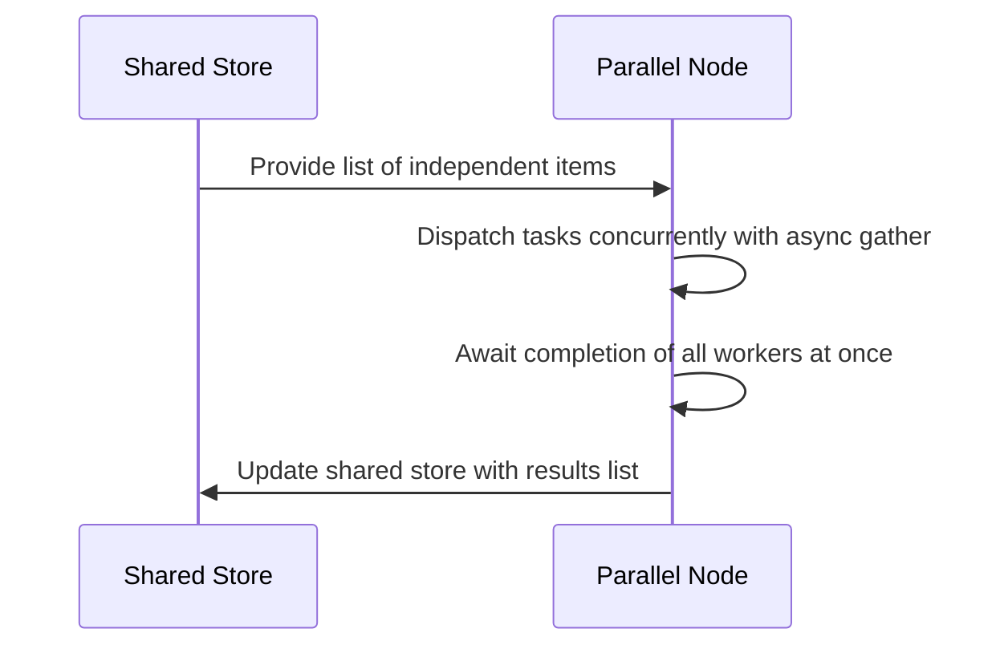

# Chapter 7: AsyncParallelBatchNode

Imagine you are managing a warehouse shipping department, and a truck arrives carrying a hundred independent packages that all need to be inspected and labeled immediately. If your workers formed a single-file line and processed every single box one after another, your delivery truck would be sitting at the loading dock all afternoon. Instead, you assign a team of workers to tackle the entire pile of independent tasks at the exact same time for maximum speed.

As we saw in [BatchNode](03_batchnode.md) and [AsyncNode](06_asyncnode.md), standard batch nodes handle collections sequentially, and non-blocking workers manage individual asynchronous calls. But what happens when your LLM application needs to process a massive list of independent items concurrently using non-blocking execution?

That is where `AsyncParallelBatchNode` comes in. It operates like a team of parallel workers tackling a pile of independent tasks at the exact same time for maximum speed using asynchronous gathering.

---

### The Parallel Processing Crew

`AsyncParallelBatchNode` inherits from both [AsyncNode](06_asyncnode.md) and [BatchNode](03_batchnode.md), combining non-blocking execution with collection iteration. Instead of waiting for each item to finish before starting the next, it dispatches all items to the event loop concurrently.

Here is how simple it is to define a parallel batch node:

```python
from pocketflow import AsyncParallelBatchNode
import asyncio

class ParallelFetch(AsyncParallelBatchNode):
    async def prep_async(self, shared):
        return shared.get("urls", [])
```

Next, the worker defines how a single item is processed asynchronously:

```python
    async def exec_async(self, url):
        await asyncio.sleep(1) # Simulate slow network request
        return f"Downloaded {url}"
```

Finally, the post-processing phase bundles all the concurrent results back into your shared state:

```python
    async def post_async(self, shared, prep_res, exec_res):
        shared["downloads"] = exec_res
        return "default"
```

---

### How Parallel Batching Works

To visualize how multiple workers tackle a pile of tasks simultaneously using asynchronous gathering, let's look at the sequence of operations:



Behind the scenes, `AsyncParallelBatchNode` uses Python's `asyncio.gather` to fire off all execution tasks simultaneously, cutting your total waiting time down to the speed of your single slowest request rather than the sum of them all.

---

### Looking Ahead

Now that you know how to supercharge your performance by processing collections of tasks concurrently using `AsyncParallelBatchNode`, you might wonder: how do we chain entire multi-step flows together asynchronously? 

That brings us to the next chapter, where we look at [AsyncFlow](08_asyncflow.md) and how to orchestrate non-blocking pipelines.