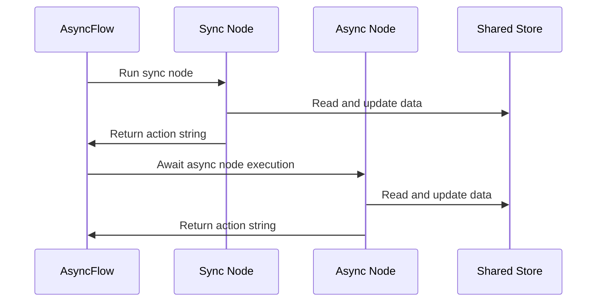

# Chapter 8: AsyncFlow

Imagine you are managing an international shipping hub where some packages require lightning-fast automated barcode scanners while other oversized crates require careful, manual human inspection. If you forced your entire warehouse to freeze up and wait for the manual inspections to finish before processing any automated boxes, your entire logistics network would grind to a frustrating halt. You need an asynchronous project manager who can smoothly coordinate both fast synchronous stations and non-blocking asynchronous nodes within a single, dynamic workflow graph.

As we saw in [Flow](04_flow.md), standard orchestration chains multiple nodes into a directional pipeline, routing tasks based on action results. But what happens when your application mixes synchronous utility calls with slow, non-blocking network operations across a complex network?

That is where `AsyncFlow` comes in. It serves as an asynchronous project manager efficiently steering event-driven operations across a complex workflow graph without blocking the main thread.

---

### The Non-Blocking Project Manager

`AsyncFlow` inherits from both [Flow](04_flow.md) and [AsyncNode](06_asyncnode.md), combining directional graph orchestration with non-blocking execution. When you run an async flow, its internal orchestrator inspects each node dynamically: if a station is asynchronous, it awaits its completion; if a station is synchronous, it executes normally.

Here is how simple it is to set up a mixed asynchronous workflow:

```python
from pocketflow import AsyncFlow, AsyncNode, Node

class FastSyncCheck(Node):
    def prep(self, shared):
        return shared.get("data")
    def exec(self, prep_res):
        return prep_res.strip()
    def post(self, shared, prep_res, exec_res):
        shared["clean"] = exec_res
        return "fetch"
```

Next, we attach an asynchronous node to handle the non-blocking network request:

```python
import asyncio

class SlowAsyncFetch(AsyncNode):
    async def prep_async(self, shared):
        return shared.get("clean")
        
    async def exec_async(self, prep_res):
        await asyncio.sleep(1) # Simulate slow API call
        return f"Response for {prep_res}"
        
    async def post_async(self, shared, prep_res, exec_res):
        shared["result"] = exec_res
        return "done"
```

Finally, we wire them together into an `AsyncFlow`:

```python
def create_mixed_flow():
    check = FastSyncCheck()
    fetch = SlowAsyncFetch()
    
    check - "fetch" >> fetch
    
    return AsyncFlow(start=check)
```

---

### How AsyncFlow Orchestrates Execution

To visualize how an asynchronous project manager delegates tasks between synchronous and non-blocking stations, let's look at the orchestration sequence:



When you invoke `run_async` on your `AsyncFlow`, the orchestrator steps through the graph, seamlessly switching between standard execution and non-blocking `await` calls based on the node's type.

---

### Looking Ahead

Congratulations! You have journeyed all the way from individual assembly-line workers in [BaseNode](01_basenode.md) up to complex asynchronous orchestrators in `AsyncFlow`. You now have the full toolkit needed to build lightning-fast, resilient, and scalable LLM applications with PocketFlow.