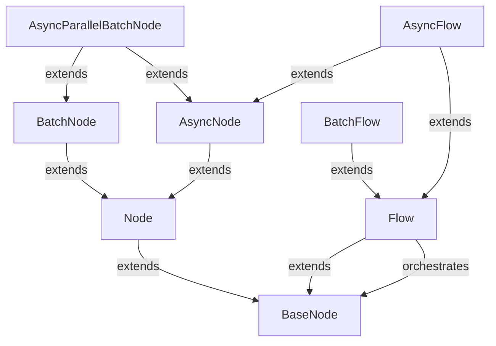

# PocketFlow

_Lens: beginner-tutorial_

PocketFlow is an ultra-minimalist, 100-line Python framework for orchestrating LLM workflows, agents, and pipelines using graph-based nodes and flows. It enables lightweight, zero-dependency development of complex AI applications through a clear graph abstraction.

## Architecture

## Chapters

- [BaseNode](01_basenode.md)
- [Node](02_node.md)
- [BatchNode](03_batchnode.md)
- [Flow](04_flow.md)
- [BatchFlow](05_batchflow.md)
- [AsyncNode](06_asyncnode.md)
- [AsyncParallelBatchNode](07_asyncparallelbatchnode.md)
- [AsyncFlow](08_asyncflow.md)