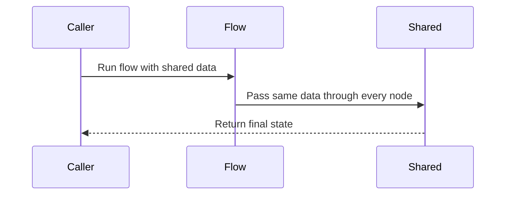

# Chapter 1: shared

Imagine you are building a tiny research assistant.

It needs to do two things:

1. Search the web for information.
2. Answer the user’s question using what it found.

The search step knows the question.  
The answer step also needs the question and the search results.

So how do these separate steps talk to each other?

One lazy answer is to use a global variable:

```python
question = "Who won the Nobel Prize in Physics 2024?"
answer = call_llm("Summarize: " + question)
```

That works for one tiny script.

But what if two people ask different questions at the same time?  
What if you want to test the flow with many inputs?  
What if one step fails and leaves the global variable in a weird state?

Now the program starts feeling like everyone scribbling on the same office wall. Notes get overwritten. Old notes confuse new workers. Nobody knows who wrote what.

Pocket Flow gives you something better: a **shared whiteboard** for each run.

## The running whiteboard

In Pocket Flow, `shared` is an ordinary Python dictionary that gets passed through every node run.

Think of it like a meeting room whiteboard.

You write the question at the top:

> “Who won the Nobel Prize in Physics 2024?”

The search worker adds notes under it:

> Search results found...

The answer worker reads both notes and writes the final answer:

> The answer is...

When the flow finishes, you take the whiteboard with you.

In code, this looks like the agent example from the cookbook:

```python
shared = {"question": question}
agent_flow.run(shared)
print(shared.get("answer", "No answer found"))
```

Three lines tell a big story:

1. `shared` starts as a dictionary containing the question.
2. The flow runs and lets nodes read from and write to that same dictionary.
3. After the flow finishes, the caller reads the final result from `shared`.

The important part is that the same `shared` object travels through the run.



That is the core idea of `shared`.

It is not magic.  
It is not a database.  
It is not a global variable.

It is a container that you hand to the flow, and the flow hands to each node.

## How a node touches the board

A [Node](02_node.md) usually has three steps:

1. `prep` reads inputs from `shared`.
2. `exec` does the main work.
3. `post` writes outputs back into `shared` and chooses what happens next.

Internally, a simple node run looks like this:

```python
def _run(self, shared):
    p = self.prep(shared)
    e = self._exec(p)
    return self.post(shared, p, e)
```

The same `shared` dictionary is passed into `prep` and `post`.

A [Flow](04_flow.md) does the same thing over and over as it moves from node to node. It keeps passing the same board forward.

## Reading from shared

In the research agent, the first node decides whether to search or answer.

Before it can decide, it needs to know:

- What is the question?
- What has already been searched?

It reads those notes from `shared`:

```python
def prep(self, shared):
    context = shared.get("context", "No previous search")
    question = shared["question"]
    return question, context
```

Notice two things.

First, the node does not need to know where the question came from. It only knows that there should be a note called `"question"`.

Second, `shared.get("context", ...)` is used because early in the run there may not be any previous search yet. That is like checking whether someone has already written on the board before adding your own note.

## Writing to shared

After the decision node runs, it writes its next action back onto the board:

```python
def post(self, shared, prep_res, exec_res):
    if exec_res["action"] == "search":
        shared["search_query"] = exec_res["search_query"]
    else:
        shared["context"] = exec_res["answer"]
    return exec_res["action"]
```

This does two jobs at once.

It stores information for the next node:

```python
shared["search_query"] = exec_res["search_query"]
```

And it returns a routing signal:

```python
return exec_res["action"]
```

The returned value is not automatically saved into `shared`. It tells the flow which successor to run next. The [successors](03_successors.md) chapter explains how that string becomes a path through the graph.

## Accumulating history

After searching, the search node needs to save what it found.

It does not replace the whole board. It appends a new note:

```python
def post(self, shared, prep_res, exec_res):
    previous = shared.get("context", "")
    note = "SEARCH: " + shared["search_query"] + "\nRESULTS: " + exec_res
    shared["context"] = previous + "\n\n" + note
    return "decide"
```

Now `shared["context"]` becomes a running history.

It might look like this after one search:

```text
SEARCH: Nobel Prize in Physics 2024
RESULTS: ...
```

After another search, it grows.

This is very common in agent-style flows: the board accumulates context as the system works.

## Writing the final answer

Finally, the answer node reads the question and accumulated context, produces an answer, and writes it back:

```python
def post(self, shared, prep_res, exec_res):
    shared["answer"] = exec_res
    return "done"
```

That is why the caller can do this after the flow finishes:

```python
print(shared.get("answer", "No answer found"))
```

The answer was not returned directly by `flow.run()`.  
It was written onto the shared whiteboard during the run.

## What can live on the whiteboard?

Because `shared` is just a dictionary, it can hold almost anything Python can put into a value:

- strings
- numbers
- lists
- dictionaries
- objects
- queues
- database handles
- embeddings
- search results
- intermediate scratch notes

For example, a batch node may read a list of items from `shared`:

```python
def prep(self, shared):
    return list(shared["resumes"].items())
```

Later, it may write evaluations back into `shared`. That pattern appears in [BatchNode](06_batchnode.md) and [BatchFlow](07_batchflow.md).

Even asynchronous multi-agent systems can put communication channels on the board:

```python
shared = {
    "target_word": "nostalgic",
    "forbidden_words": ["memory", "past"],
    "hinter_queue": asyncio.Queue(),
    "guesser_queue": asyncio.Queue()
}
```

Here, `shared` does not just carry data. It carries coordination objects. Two agents can later wait on queues stored in the same run state. You will see this more clearly in [AsyncNode](08_asyncnode.md) and [AsyncFlow](09_asyncflow.md).

## Why not global variables?

The biggest reason is isolation.

If every run writes to the same global wall, runs interfere with each other.

With `shared`, you can create a fresh board for each request:

```python
run_1 = {"question": "Who won Nobel Prize?"}
run_2 = {"question": "What is RAG?"}
flow.run(run_1)
flow.run(run_2)
```

Now the first run and second run have their own state.

This gives you three nice properties:

### 1. Better testing

You can pass in a small dictionary and inspect what comes out.

No need to reset hidden globals between tests.

### 2. Safer concurrency

If two requests happen at the same time, they can each get their own `shared` dictionary.

That is much safer than having them both scribble on the same global variable.

### 3. Clearer data flow

The board makes it easy to ask:

- What did this node read?
- What did this node write?
- What will the next node see?

It is still possible to make messy code, but the structure gives you a natural place to keep run state.

## Shared versus params

Do not confuse `shared` with parameters.

A [params](05_params.md) value is more like configuration for a node: “use this filter,” “read this file,” “run this subflow.”

`shared` is the working data of the run: “here is the question,” “here are search results,” “here is the history,” “here is the answer.”

A rough rule:

- If it describes **how** to run, it may belong in params.
- If it is produced or consumed during execution, it probably belongs in `shared`.

## A few good habits

### Use clear key names

Since `shared` is just a dictionary, bad naming can create confusion.

Good:

```python
shared["question"]
shared["search_query"]
shared["context"]
shared["answer"]
```

Bad:

```python
shared["x"]
shared["temp2"]
shared["stuff"]
```

The whiteboard works better when sticky notes have readable titles.

### Use `.get()` for optional values

Not every key exists at the start of a run.

```python
context = shared.get("context", "")
```

This is like looking at the board and saying, “If nobody wrote context yet, assume there is none.”

### Keep scratch notes obvious

Some flows use temporary keys for intermediate steps:

```python
shared["_patch_content"] = exec_res
```

The underscore signals: this is a working note, not the final answer.

That kind of pattern appears in more advanced flows where one subflow needs to pass temporary state to another step.

### Store history as structured data

Many agent systems keep a list of events in `shared`.

For example:

```python
shared.setdefault("history", []).append({
    "tool": tool,
    "result": result
})
```

This turns the whiteboard into a notebook. Later nodes can read that notebook to decide what to do next.

### Be careful with shared mutable objects

If you put a list or dictionary inside `shared`, multiple nodes may mutate it.

That is often exactly what you want, especially for history. But it can surprise you if two flows are running at the same time and unintentionally share the same board.

For independent runs, create separate dictionaries.  
For intentional coordination, design the sharing carefully, sometimes with queues.

## The mental model to keep

When you see `shared`, think:

> “This is the whiteboard for this run.”

It can carry:

- questions
- history
- search results
- intermediate outputs
- final answers
- queues
- scratch notes

And it lets separate nodes communicate without global variables.

That is a surprisingly powerful idea for such a simple dictionary.

## Where this goes next

You now know what the whiteboard is and how it travels through a run.

The next question is obvious:

Who writes on it?

That is exactly what the next chapter is about: [Node](02_node.md).