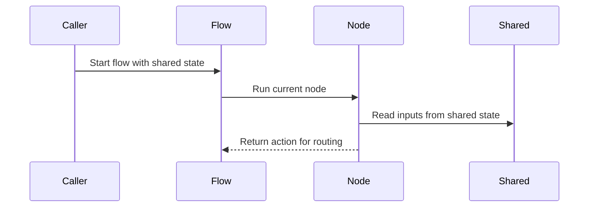

# Chapter 2: Node

Imagine your research assistant fails in the middle of a web search.

If all the logic lives in one giant function, you have a problem: do you rerun the LLM decision? Do you reread the question? Do you throw away partial progress?

You want something more like an assembly line station.

One station does one job:

- gather what it needs
- do its work
- write down what happened
- say what should happen next

That is a **Node**.

In [shared](01_shared.md), you met the whiteboard that travels through a run. A node is the worker who reads from that whiteboard, does something useful, and writes back to it.

## One station, three jobs

A Pocket Flow node usually overrides three methods:

```python
from pocketflow import Node

class SearchWeb(Node):
    def prep(self, shared):
        return shared["search_query"]
```

This is `prep`.

It reads inputs from the shared whiteboard. It does not do the expensive work yet. It just gathers ingredients.

Here, the node says: “Before I search, I need the current query.”

Next comes `exec`:

```python
def exec(self, search_query):
    print(f"Searching for {search_query}")
    return search_web_duckduckgo(search_query)
```

This is the main task.

It takes what `prep` returned and produces a result. If this were a real assembly line station, this is where the machine actually presses, paints, or assembles the part.

Then comes `post`:

```python
def post(self, shared, prep_res, exec_res):
    previous = shared.get("context", "")
    shared["context"] = previous + "\n\n" + exec_res
    return "decide"
```

This does two jobs:

1. Save results back into `shared`.
2. Return a routing signal that tells the flow what to run next.

Notice the last line:

```python
return "decide"
```

That string is not automatically stored in `shared`. It is a signal for the flow. The [successors](03_successors.md) chapter explains how that signal becomes a path through the graph.

## What the framework actually does

Under the hood, running a node looks roughly like this:

```python
inputs = node.prep(shared)
result = node.exec(inputs)
action = node.post(shared, inputs, result)
```

The same `shared` dictionary from [shared](01_shared.md) is passed into `prep` and `post`.

That gives you a clean separation:

- `prep` reads state.
- `exec` does the work.
- `post` writes state and chooses what happens next.

This is useful because each part can fail or be replaced independently. If your search step times out, you can retry just that station without rerunning the whole system.



## A decision node is still just a station

The research agent example has a `DecideAction` node. Its job is to look at the question and decide whether to search or answer.

First, it gathers what it needs:

```python
class DecideAction(Node):
    def prep(self, shared):
        context = shared.get("context", "No previous search")
        return shared["question"], context
```

Then it does the main work:

```python
def exec(self, inputs):
    question, context = inputs
    return ask_llm_for_action(question, context)
```

Finally, it writes state and returns a routing signal:

```python
def post(self, shared, prep_res, exec_res):
    if exec_res["action"] == "search":
        shared["search_query"] = exec_res["search_query"]
    return exec_res["action"]
```

This is the same three-step pattern as before.

The node does not know which nodes exist. It only returns a word like `"search"` or `"answer"`. The flow later decides where that word leads.

## What if `post` returns nothing?

If your `post` method does not return anything, Pocket Flow treats the result as the default path.

That is handy for simple linear steps:

```python
def post(self, shared, prep_res, exec_res):
    shared["summary"] = exec_res
```

In that case, a flow can continue through a `default` successor if one exists.

## A node can be tested by itself

Because a node is just an object with methods, you can test it directly:

```python
node = SearchWeb()
shared = {"search_query": "Nobel Prize in Physics 2024"}
action = node.run(shared)
print(action)
```

This runs only that one station.

It does not automatically run the next node. If a node has successors, Pocket Flow warns you to use [Flow](04_flow.md) for full graph execution. That separation keeps nodes simple and easy to reason about.

## Nodes can also have retries

Real work fails: APIs time out, LLMs return bad JSON, web searches glitch.

Pocket Flow’s `Node` adds retry behavior around `exec`:

```python
summarize = Summarize(max_retries=3, wait=1)
```

That means it will try the main task up to three times, waiting one second between attempts.

You can also provide a fallback:

```python
class Summarize(Node):
    def exec_fallback(self, prep_res, exc):
        return "There was an error processing your request."
```

Think of this like having a backup operator at the station. If the main machine keeps failing, the backup step prevents the whole line from stopping completely.

## Nodes can read configuration too

Sometimes a node needs settings that are not really run data: which filter to apply, which file to read, which subflow to use.

Those often live in `self.params`:

```python
def prep(self, shared):
    return shared["image"], self.params["filter"]
```

That is different from `shared`. The [params](05_params.md) chapter covers that idea more clearly later.

## Good habits for writing nodes

### Keep each step doing one thing

If your `exec` method reads files, calls an LLM, parses YAML, updates state, and chooses the next node all at once, it becomes hard to debug.

A better split looks like:

- `prep`: gather inputs
- `exec`: do the main task
- `post`: save results and route

### Let `exec` be the expensive part

If something can fail or retry, it usually belongs in `exec`. That is where Pocket Flow gives you retry support.

### Let `post` handle routing

Do not try to make a node jump to another node by itself inside `exec`. Return an action from `post`, then connect that action to the next node using [successors](03_successors.md).

### Reuse the pattern for larger shapes

Once you understand this three-part station, other building blocks become easier.

For example:

- [BatchNode](06_batchnode.md) runs a similar pattern over many items
- [AsyncNode](08_asyncnode.md) does the same thing asynchronously

The core idea stays the same: one station, three jobs.

## The mental model to keep

When you see `Node`, think:

> “This is one worker at one assembly line station.”

It reads from the shared whiteboard, does its task, writes back what it learned, and hands a small routing note to the flow.

That is all it needs to do.

Now you know what happens inside a single station. The next natural question is: how does the flow know which station should run after `"search"` or `"answer"`? That mapping is exactly what the next chapter covers: [successors](03_successors.md).