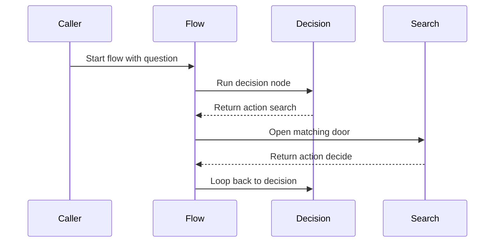

# Chapter 3: successors

Imagine your research assistant just searched the web.

The search node finishes and returns one small thing:

```python
"decide"
```

That is all it says.

So who tells the program to go back to the decision node?  
Who says, “Okay, `"search"` means run the search node”?  
And what happens when the assistant finally wants to answer instead?

If you put that logic inside giant `if` statements, your flow quickly becomes a maze:

```python
if action == "search":
    ...
elif action == "answer":
    ...
elif action == "retry":
    ...
```

Pocket Flow uses a cleaner idea.

Think of every node as a worker standing in a corridor with doors above it.

Each door has a label:

> `search`  
> `answer`  
> `default`  
> `done`

When the worker finishes, they do not drag the whole program by hand to the next station.

They simply say one word.

The sign above the matching door decides where the flow goes next.

That mapping from “word” to “next node” is called **successors**.

## The routing table lives on the node

In [Node](02_node.md), you saw that a node’s `post` method can return a routing signal.

Successors are how Pocket Flow turns that signal into an actual path.

Every node starts with an empty successor table:

```python
class BaseNode:
    def __init__(self):
        self.params = {}
        self.successors = {}
```

That `successors` dictionary is the routing table.

It maps action strings to next nodes.

A simple version looks like this:

```text
{
  "search": SearchWeb node,
  "answer": AnswerQuestion node
}
```

The node does not need to know what those other nodes do.

It only knows that if it returns `"search"`, there should be a door labeled `"search"`.

## Connecting doors between nodes

In the research agent flow from the cookbook, three nodes are connected like this:

```python
decide = DecideAction()
search = SearchWeb()
answer = AnswerQuestion()

decide - "search" >> search
decide - "answer" >> answer
search - "decide" >> decide
```

Then the flow starts at `decide`:

```python
return Flow(start=decide)
```

Let’s read those connections like signs above doors.

The line:

```python
decide - "search" >> search
```

means:

> If the decision node returns `"search"`, go to the search node.

The line:

```python
decide - "answer" >> answer
```

means:

> If the decision node returns `"answer"`, go to the answer node.

And this line:

```python
search - "decide" >> decide
```

means:

> After searching, if the search node returns `"decide"`, loop back to the decision node.

That last connection is what lets the agent keep researching until it has enough information.

## What that funny dash and arrow mean

Pocket Flow uses a small bit of Python operator magic.

When you write:

```python
decide - "search"
```

Python calls `__sub__`, which creates a little “conditional transition” object:

```python
def __sub__(self, action):
    if isinstance(action, str):
        return _ConditionalTransition(self, action)
```

That object remembers two things:

- the source node
- the action string

Then when you write:

```python
decide - "search" >> search
```

the `>>` attaches the target node.

Internally, it does something like this:

```python
class _ConditionalTransition:
    def __rshift__(self, tgt):
        return self.src.next(tgt, self.action)
```

The real work happens in `next`:

```python
def next(self, node, action="default"):
    if action in self.successors:
        warnings.warn("Overwriting successor")
    self.successors[action] = node
    return node
```

So the connection syntax is just a friendly way to fill up the routing table.

## The default door

Sometimes you do not want multiple doors.

You just want one next step.

That is what `default` is for.

Instead of:

```python
node - "default" >> next_node
```

you can write:

```python
node >> next_node
```

This is common in linear flows:

```python
chunk_docs_node >> embed_docs_node >> create_index_node
```

That one line builds a chain.

It works because `>>` returns the target node, so the next connection attaches to that target.

You can also think of `default` as an invisible door.

If a node’s `post` method does not return anything, Pocket Flow treats that as asking for the default door.

This was hinted at in [Node](02_node.md).

Now you know where that signal goes.

## How Flow reads the successor table

A flow does not contain a big if/elif chain saying which node to run next.

Instead, it asks the current node’s routing table:

> “The last action was this. What door matches?”

A simplified version of Pocket Flow’s lookup looks like this:

```python
def get_next_node(self, curr, action):
    nxt = curr.successors.get(action or "default")
    if not nxt and curr.successors:
        warnings.warn("Flow ends")
    return nxt
```

This tells you three important things.

First, the flow looks for the exact action string.

Second, if there is no action, it tries `"default"`.

Third, if the node has successors but none match, the flow warns and stops.

That warning is useful. It usually means you have a typo in an action name or forgot to connect one door.



## Branching without hard-coded control flow

The power of successors is that the decision logic and the graph wiring are separate.

Inside the node, you can use any logic you want.

For example, the research agent’s decision node may return an action chosen by an LLM:

```python
if exec_res["action"] == "search":
    shared["search_query"] = exec_res["search_query"]
return exec_res["action"]
```

The flow does not need to know why the node chose `"search"`.

It only needs to know where `"search"` leads.

That is like a worker saying, “I need the search room,” while the signs above the doors already tell them where it is.

## Looping by pointing back

Successors make loops simple.

In the research agent:

```python
search - "decide" >> decide
```

creates a loop:

1. Decide what to do.
2. Search if needed.
3. Go back and decide again.

The loop stops when the flow reaches a node that does not have a matching door.

For example, `AnswerQuestion` returns `"done"`, but it has no successor table entries.

So the flow ends quietly.

This is a common pattern:

- a node with successors continues
- a terminal node without successors stops the run

## One node can have many doors

A node is not limited to one next step.

It can have several labeled exits:

```python
router - "yes" >> yes_node
router - "no" >> no_node
router - "retry" >> retry_node
```

Then `post` chooses which label to return:

```python
def post(self, shared, prep_res, exec_res):
    if shared["score"] > 80:
        return "yes"
    if shared["score"] < 50:
        return "no"
    return "retry"
```

This is very useful for agents.

The LLM can say `"tool_a"`, `"tool_b"`, `"ask_user"`, or `"finish"`.

You do not need to rewrite the flow every time you add a new behavior.

You just add another door:

```python
router - "tool_c" >> tool_c_node
```

## A few gotchas

### 1. One action string can only point to one node

If you connect the same action twice, the second connection replaces the first:

```python
decide - "search" >> web_search
decide - "search" >> cache_search
```

Pocket Flow will warn you that it is overwriting a successor.

This is usually good because accidental overwrites are easy to miss otherwise.

### 2. Running a node alone does not follow its successors

You can test a single node directly:

```python
node.run(shared)
```

But if that node has successors, Pocket Flow warns you.

Why?

Because running one node is only running one station. It does not automatically walk through the corridor.

For full graph execution, use [Flow](04_flow.md).

### 3. Action strings must match exactly

Successors are just dictionary keys.

That means these are different:

```python
"search"
"Search"
"seach"
```

If your node returns `"seach"` but the door is labeled `"search"`, the flow will not magically fix it.

Clear naming helps a lot here, just like with [shared](01_shared.md).

## The mental model to keep

When you see successors, think:

> “These are signs above doors.”

A node finishes and says one action word.

The successor table maps that word to the next node.

That lets flows branch, loop, and grow without turning the whole program into a pile of hard-coded `if` statements.

Now you know how one node hands off to another.

But who keeps running this corridor?  
Who chooses where the flow starts?  
And what happens when a whole flow becomes one door inside a bigger flow?

That is exactly what the next chapter covers: [Flow](04_flow.md).