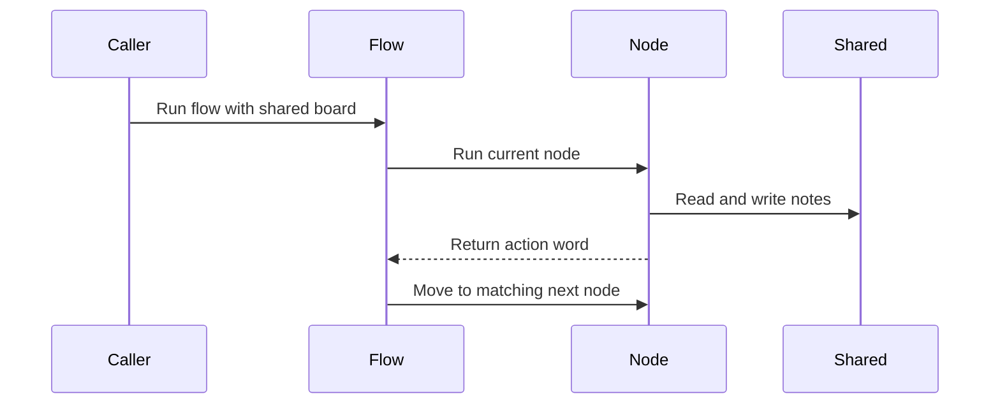

# Chapter 4: Flow

You already have the pieces.

A [Node](02_node.md) is one station that reads from the shared board, does work, and returns a routing word.

[successors](03_successors.md) are the doors above each station: `"search"`, `"answer"`, `"default"`, `"done"`.

But who walks the corridor?

If you run a single node directly, Pocket Flow warns you that it will not follow successors. The nodes can say what should happen next, but nobody is moving the run from one door to another.

That job belongs to **Flow**.

A flow is like a tour guide with a map. It does not decide where to go. It only follows the signs:

1. Start at the first stop.
2. Ask that node what should happen next.
3. Move to the matching successor.
4. Repeat until there is no next stop.

## A flow starts somewhere

In the research agent, three nodes are connected like this:

```python
decide - "search" >> search
decide - "answer" >> answer
search - "decide" >> decide
```

Those lines only build doors. They do not start the run.

To make a runnable tour, you choose a starting node:

```python
return Flow(start=decide)
```

That `Flow` object now knows where the tour begins. The rest of the path comes from each node’s successor table.

## Running the whole tour

The main program creates the flow and runs it with some shared state:

```python
shared = {"question": question}
agent_flow.run(shared)
print(shared.get("answer", "No answer found"))
```

The same [shared](01_shared.md) board travels through every node. The flow does not carry the final answer directly back to the caller. It returns the last routing word, while useful results live on the whiteboard.

## The loop that runs the graph

Under the hood, a flow repeatedly asks: “What is the current node? What action did it return? Which door matches?”

A simplified version looks like this:

```python
curr = copy.copy(self.start_node)
action = None
while curr:
    action = curr._run(shared)
    nxt = self.get_next_node(curr, action)
    curr = copy.copy(nxt) if nxt else None
return action
```

Read it like a tour guide checking the map.

First, it starts at `start_node`.

Then it runs the current node with `_run`. That is still the [Node](02_node.md) pattern you already know: gather inputs, do work, write state, return an action.

Next, it asks the successor table for the next node. If the node returned `"search"`, the flow looks for a door labeled `"search"`. If there is no action, it tries the default door.

If there is no matching door, the loop ends.



That is the whole orchestration idea. No giant `if` chain. No hidden scheduler. Just “run this node, follow its door.”

## Why does it copy nodes?

The simplified loop uses `copy.copy`.

This keeps each run from permanently decorating the original graph with temporary settings. The flow can attach parameters to a copied runner without changing the blueprint you built earlier.

You will meet those parameters properly in [params](05_params.md). For now, think of the copy as a temporary tour badge. It lets one run carry its own context while the original map stays clean for the next run.

## A flow can be a node

Here is the fun part: `Flow` itself behaves like a node.

That means a whole subflow can sit inside a larger flow, like a guided side trip inside a bigger tour.

In the coding agent example, patching a file is split into three small nodes:

```python
pr >> pv >> pa

class PatchFile(Flow):
    def __init__(self): super().__init__(start=pr)
```

Then the outer flow connects `PatchFile` like any other node:

```python
decide - "patch_file" >> PatchFile() >> compact
```

From the outer flow’s point of view, `PatchFile` is just one stop. But when that stop is chosen, the inner flow runs its own little graph: read, validate, apply.

After the subflow finishes, control returns to the outer flow and continues through whatever door comes next.

## A nested flow can also route

Because a flow is node-like, it can have outside doors too.

Inside, it may run many nodes. Outside, it still returns one final routing word.

By default, a flow’s `post` returns the last action produced inside its graph. You can override that behavior to write results into [shared](01_shared.md) and choose what the outer flow should do next.

If the nested flow returns nothing, the parent flow treats that as the default path, just like with an ordinary node.

That is why you can build large systems from smaller flows without losing clarity. Each subflow hides its internal complexity but still exposes one simple handoff to the outside world.

## Linear flows are just boring tours

Not every flow needs branching or looping.

A RAG indexing flow may simply chain nodes together:

```python
chunk_docs_node >> embed_docs_node >> create_index_node
offline_flow = Flow(start=chunk_docs_node)
```

Each node returns nothing, so each one asks for the default door. The tour guide walks straight ahead until there is no next stop.

That is often all you need for simple pipelines: read, transform, write.

## When does a flow stop?

A flow stops when there is no next node to run.

This can happen in two common ways.

First, the current node has no successors at all. That makes it a terminal stop.

Second, the node returns an action that does not match any door. In that case, Pocket Flow warns you and stops. This usually means there is a typo in the action name or a missing connection.

The research agent ends when the answer node finishes. It returns `"done"`, but it has no successor for that word. The tour guide checks the map, finds no next door, and quietly walks away.

## What flows are good at

Flows give you three useful things:

### 1. Repeated stepping

They keep running nodes until the graph is done. That makes loops natural, like searching again and again until enough information exists.

### 2. Clean separation

Nodes decide what to do next. Flows follow the routing table. You do not need one giant function that both performs work and controls every branch.

### 3. Composable subflows

A flow can be a node inside another flow. That lets you build small reusable tours and plug them into bigger systems.

## Where this goes next

You now know how the tour guide moves through the graph: start at one node, follow each returned action, and stop when there is no matching door.

But some nodes need more than shared run data. They need configuration: which filter to apply, which file to read, which subflow to use.

That distinction is what [params](05_params.md) explains next.