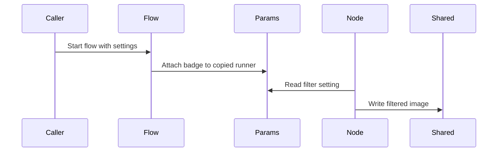

# Chapter 5: params

Imagine you built a tiny image flow.

It loads an image, applies a filter, and saves the result.

```python
load - "apply_filter" >> apply_filter
apply_filter - "save" >> save
```

That works nicely for one job:

> Process `cat.jpg` with `blur`.

Then your boss walks over and says:

> Great. Now process `dog.jpg` with `sepia`, and `bird.jpg` with `grayscale`.

Do you create three new flows?

Do you make `BlurCatFlow`, `SepiaDogFlow`, and `GrayscaleBirdFlow`?

That would turn your clean little graph into a zoo of nearly identical classes.

What you really want is the same stations, but different instructions carried into each station.

That is what **params** are for.

## Params are instruction cards

In [Flow](04_flow.md), you saw that Pocket Flow copies nodes during a run:

```python
curr = copy.copy(self.start_node)
while curr:
    action = curr._run(shared)
    curr = copy.copy(self.get_next_node(curr, action))
```

That copying keeps the original graph clean.

But there was another line in the real code:

```python
curr.set_params(p)
```

That is where params enter the picture.

Think of `params` as an instruction card clipped to a station for one run.

The station itself does not change.

The worker still knows how to load images, apply filters, and save files.

But the card says:

> For this pass, use `blur`.

Or:

> For this pass, use `sepia`.

Same [Node](02_node.md).  
Different instructions.

## Where params live in the code

Every node starts with an empty dictionary called `self.params`:

```python
class BaseNode:
    def __init__(self):
        self.params = {}
        self.successors = {}
```

And it has a small setter:

```python
def set_params(self, params):
    self.params = params
```

That is all.

`params` is not magic state.  
It is just an optional dictionary attached to a node or flow.

## A node reads params

Here is the image filter example from the cookbook, simplified:

```python
class ApplyFilter(Node):
    def prep(self, shared):
        image = shared["image"]
        filter_type = self.params.get("filter", "blur")
        return image, filter_type
```

Notice the difference.

The image itself comes from [shared](01_shared.md):

```python
shared["image"]
```

That is working data for this run.

The filter name comes from params:

```python
self.params.get("filter", "blur")
```

That is configuration for how this station should behave.

Then `exec` does the work:

```python
def exec(self, inputs):
    image, filter_type = inputs
    if filter_type == "grayscale":
        return image.convert("L")
    return image
```

The node does not need a new class for grayscale images.  
It just reads the instruction card.

## Setting params for a flow run

You can attach settings to a flow before running it:

```python
flow = Flow(start=load)
flow.set_params({"input": "cat.jpg", "filter": "blur"})
flow.run(shared)
```

During the run, the flow passes those settings to each copied runner.

A simplified version of Pocket Flow’s orchestration looks like this:

```python
def _orch(self, shared, params=None):
    curr = copy.copy(self.start_node)
    p = params or {**self.params}
    while curr:
        curr.set_params(p)
        action = curr._run(shared)
        curr = copy.copy(self.get_next_node(curr, action))
    return action
```

That means the same flow object can run with different settings.

You do not need to rebuild the graph every time you change a file name or filter type.

## Params versus shared

This is an important distinction.

[shared](01_shared.md) is the whiteboard for the run.

`params` are the instructions attached to the run.

A rough rule:

- If it describes **how** to run, it may belong in `params`.
- If it is produced or consumed during execution, it probably belongs in `shared`.

For example:

```python
class Summarize(Node):
    def prep(self, shared):
        text = shared["text"]
        language = self.params.get("language", "en")
        return text, language
```

Here:

- `shared["text"]` is the thing being processed.
- `self.params["language"]` is how it should be processed.

That one class can summarize in English, French, Spanish, or any other language without becoming four separate classes.

## Params make subflows reusable

You already know that a [Flow](04_flow.md) can behave like a node inside another flow.

That means a whole subflow can also receive params.

Imagine a tiny translation subflow:

```python
load_text - "translate" >> translate_node
translate_node - "save" >> save_node
```

If each node reads `self.params["language"]`, the same subflow can be reused for many languages:

```python
translation_flow.set_params({"language": "fr"})
translation_flow.run(shared)
```

Later:

```python
translation_flow.set_params({"language": "es"})
translation_flow.run(shared)
```

The graph stays the same.

Only the instruction card changes.

That is one of the main reasons params exist: **reusable flows without class explosion**.

## How Flow attaches params during a run

Here is the mental model.

A flow does not permanently glue settings onto your original nodes.

It copies the current runner and gives that copy a params badge.



The original graph remains a clean blueprint.

Each run gets its own temporary instructions.

## Params can carry any Python object

Because `self.params` is just a dictionary, it can hold more than strings.

It can hold:

- file paths
- model names
- thresholds
- prompt templates
- clients
- validators
- small configuration objects

For example:

```python
flow.set_params({"llm": llm_client, "style": "concise"})
```

Then a node could do:

```python
def prep(self, shared):
    return shared["text"], self.params["llm"], self.params["style"]
```

Just be careful.

Params are configuration, not the main working data of the run.

If you find yourself storing long histories, intermediate results, or final answers in params, those probably belong in [shared](01_shared.md) instead.

## Params can influence routing

A node still chooses its next step by returning an action from `post`.

But that choice can use params.

```python
def post(self, shared, prep_res, exec_res):
    if self.params.get("strict"):
        return "validate"
    return "default"
```

Then your [successors](03_successors.md) connect those actions:

```python
node - "validate" >> validate_node
node >> next_node
```

Params do not route the flow by themselves.

They give the node information that can help it decide which routing word to return.

## BatchFlow gives each pass its own params

This is where params become especially powerful.

In the image batch example, a `BatchFlow` prepares a list of parameter dictionaries:

```python
class ImageBatchFlow(BatchFlow):
    def prep(self, shared):
        return [
            {"input": "cat.jpg", "filter": "grayscale"},
            {"input": "dog.jpg", "filter": "blur"}
        ]
```

Each dictionary becomes the params for one pass through the base flow.

Internally, `BatchFlow` does something like this:

```python
for bp in pr:
    self._orch(shared, {**self.params, **bp})
```

That line is very important.

It merges:

- outer flow params
- per-item batch params

Like this:

```python
outer = {"language": "en", "tone": "formal"}
item = {"text": "hello", "tone": "warm"}
run_params = {**outer, **item}
print(run_params["tone"])
```

The later dictionary wins.

So a batch item can override a default setting.

That means one reusable subflow can process many different inputs without rewriting the nodes.

## A node does not need to know it is in a batch

The beauty of this design is that the node stays simple.

This loading node only reads `self.params["input"]`:

```python
class LoadImage(Node):
    def prep(self, shared):
        path = os.path.join("images", self.params["input"])
        return path
```

It does not need to know:

- whether this is a single run
- whether it is inside a batch
- whether the params came from a parent flow
- whether there are three images or three hundred

It just reads its instruction card.

That makes nodes much easier to reuse.

## Params do not automatically go into shared

A common mistake is thinking that `self.params` will appear in `shared`.

It does not.

If you want later nodes to see a param-derived value as run data, copy it explicitly:

```python
def post(self, shared, prep_res, exec_res):
    shared["filter_used"] = self.params.get("filter")
    shared["image"] = exec_res
```

This is useful for debugging or reporting.

But remember the boundary:

- `params` are settings.
- `shared` is run state.

If you blur the line too much, your flows become harder to reason about.

## Good habits with params

### Use clear key names

Just like [shared](01_shared.md), params are dictionaries.

Good:

```python
self.params["input"]
self.params["filter"]
self.params["language"]
```

Bad:

```python
self.params["x"]
self.params["cfg2"]
self.params["stuff"]
```

The instruction card is easier to read when the labels are obvious.

### Use `.get()` for optional settings

If a setting may be missing, provide a default:

```python
filter_type = self.params.get("filter", "blur")
```

This prevents one missing key from crashing the whole run.

Use `self.params["key"]` when you really want failure if the setting is absent.

### Keep params separate from mutable run data

If you put a list or dictionary inside params, multiple runs may share that same object.

Pocket Flow copies the top-level params dictionary during a run:

```python
p = {**self.params}
```

That protects simple replacements.

But nested mutable objects are still references.

So avoid doing this:

```python
flow.set_params({"history": []})
node.params["history"].append("oops")
```

If you need growing state during a run, put it in [shared](01_shared.md).

### For separate runs, use separate settings

If you reuse the same `Flow` object for different jobs, set params before each run:

```python
flow.set_params({"input": "cat.jpg", "filter": "blur"})
flow.run(shared)
```

For concurrent independent runs, prefer fresh flow instances or a batch design that supplies params per pass.

This avoids one run accidentally overwriting another run’s instruction card.

## Params are not successors

Do not confuse `params` with routing.

Params can influence what action a node returns, but they do not connect nodes by themselves.

Connections still live in [successors](03_successors.md):

```python
node - "strict" >> strict_node
node >> normal_node
```

The params tell the node what kind of job this is.

The successors say where each routing word leads.

## Params make one class many jobs

Suppose you want a summarizer that can write in different tones.

Instead of:

```python
class FormalSummarize(Node): ...
class CasualSummarize(Node): ...
class ExcitedSummarize(Node): ...
```

You can write:

```python
class Summarize(Node):
    def prep(self, shared):
        text = shared["text"]
        tone = self.params.get("tone", "neutral")
        return text, tone
```

Then you run the same flow with different params:

```python
flow.set_params({"tone": "formal"})
```

Or:

```python
flow.set_params({"tone": "casual"})
```

Same station.  
Different instruction card.

That is the point of params.

## The mental model to keep

When you see `params`, think:

> “This is the instruction card attached to this run.”

It can carry:

- input file names
- filter names
- language settings
- thresholds
- client objects
- prompt styles
- mode flags

And it lets one reusable [Node](02_node.md) or [Flow](04_flow.md) handle many different jobs without becoming a pile of nearly identical classes.

The [shared](01_shared.md) board holds the working data.  
`params` hold the optional settings telling the system how to work on that data.

Now you know how one flow can receive different instructions for different runs.

The next natural question is: what if one station needs to process many items at once?

That is where a single node starts handling a whole tray of inputs, not just one job at a time.  
That is exactly what the next chapter covers: [BatchNode](06_batchnode.md).