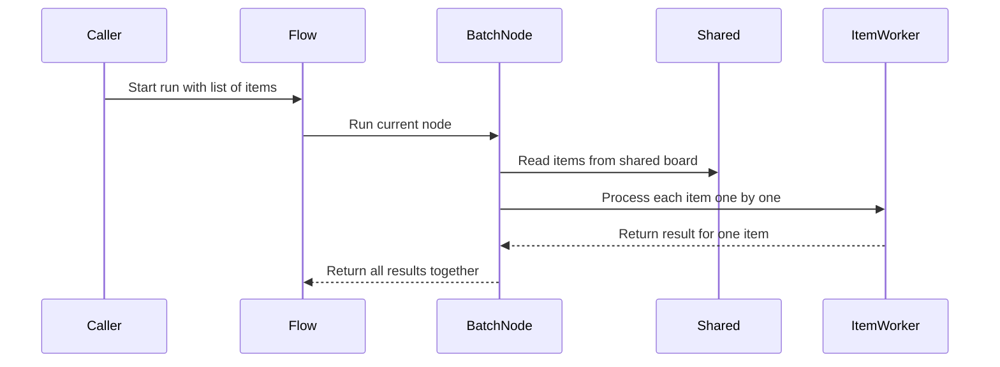

# Chapter 6: BatchNode

Imagine you built a tiny badge machine.

It expects one blank badge. You feed it in, it stamps the company logo, and one finished badge comes out. That is easy to picture.

Now someone drops 200 badges on the table and says:

> Stamp them all.

Do you glue a giant loop onto the machine? Do you teach the machine how to count badges? Do you make it decide what to do after each stamp?

You already know from [Node](02_node.md) that a normal node is one station doing one job. But sometimes the whiteboard from [shared](01_shared.md) contains a whole list of items, and every item needs the same kind of work.

That is where **BatchNode** comes in.

A BatchNode is like a badge machine with a tray feeder. It takes a tray of badges, stamps one badge at a time using the same stamp, and then hands the finished pile to an inspector.

## The three jobs change shape

In [Node](02_node.md), the pattern was:

1. `prep` reads one input from `shared`.
2. `exec` does the main work.
3. `post` writes the result back and returns a routing word.

With a BatchNode, the three jobs are still there, but their shapes change.

First, `prep` returns a list of items:

```python
from pocketflow import BatchNode

class StampBadges(BatchNode):
    def prep(self, shared):
        return shared["badges"]
```

That is the tray.

The node does not stamp anything yet. It just says:

> Here are the badges waiting on the table.

Next, `exec` still processes one item at a time:

```python
    def exec(self, badge):
        return stamp(badge)
```

This is important.

Even though `prep` returned many badges, `exec` only sees one badge. It does not need to loop over the whole tray. The BatchNode handles that for you.

Finally, `post` receives all the finished results together:

```python
    def post(self, shared, prep_res, exec_res_list):
        shared["stamped"] = exec_res_list
```

The third argument is a list of results, in the same order as the items from `prep`.

So the BatchNode pattern is:

> `prep` gives me a tray.  
> `exec` stamps one badge.  
> `post` collects all stamped badges.

## What Pocket Flow does for you

The whole BatchNode trick is surprisingly small.

In the Pocket Flow source, it looks roughly like this:

```python
class BatchNode(Node):
    def _exec(self, items):
        return [super(BatchNode, self)._exec(i) for i in (items or [])]
```

That line does three useful things.

First, if `prep` returns nothing, it uses an empty list:

```python
(items or [])
```

So a missing tray becomes “no badges,” not a crash.

Second, it calls the normal Node execution path for each item:

```python
super(BatchNode, self)._exec(i)
```

That means your `exec` method still runs once per item.

Third, it collects every result into one list.

The BatchNode does not change your node logic. It changes how many times the main work is repeated.



The flow sees one BatchNode. The BatchNode internally repeats the same work for every item.

## A real example: evaluating many resumes

Suppose a previous node read resume files and stored them in `shared`:

```python
shared["resumes"] = {
    "alice.txt": "...",
    "bob.txt": "..."
}
```

A BatchNode can evaluate each resume one by one.

First, it prepares the list of items:

```python
class EvaluateResumesNode(BatchNode):
    def prep(self, shared):
        return list(shared["resumes"].items())
```

Now `prep` returns pairs like:

```python
("alice.txt", "...")
```

Then `exec` evaluates one resume:

```python
    def exec(self, resume_item):
        filename, content = resume_item
        return filename, evaluate_resume(content)
```

Notice what `exec` does not do.

It does not loop over all resumes.  
It does not read from `shared`.  
It does not write to `shared`.

It just answers one question:

> What should I do with this one resume?

Finally, `post` combines the results:

```python
    def post(self, shared, prep_res, exec_res_list):
        shared["evaluations"] = dict(exec_res_list)
```

If each result is a pair like `(filename, evaluation)`, then `dict(exec_res_list)` turns the list into a dictionary.

This is a very common BatchNode shape:

- `prep` returns identifiable items.
- `exec` returns one result plus its identity.
- `post` reassembles everything into a useful collection.

## A batch item can return more than one thing

Sometimes each input produces multiple outputs.

For example, in the RAG indexing flow, one document may become many chunks. A BatchNode is perfect for that.

First, it reads all documents:

```python
class ChunkDocumentsNode(BatchNode):
    def prep(self, shared):
        return shared["texts"]

    def exec(self, text):
        return fixed_size_chunk(text)
```

Each `exec` call returns a list of chunks for one document.

So after the batch runs, `post` receives a list of lists:

```python
[
    ["chunk 1", "chunk 2"],
    ["chunk 3", "chunk 4", "chunk 5"]
]
```

Then `post` can flatten them into one final list:

```python
    def post(self, shared, prep_res, exec_res_list):
        chunks = []
        for result in exec_res_list:
            chunks.extend(result)
        shared["texts"] = chunks
```

This is another useful BatchNode pattern:

> Each item can produce its own little pile of results.  
> `post` decides how to combine those piles.

## The flow still routes only once

A BatchNode runs many items, but it is still one node in the graph.

That means routing happens after the whole batch finishes.

For example:

```python
chunk - "embed" >> embed_docs
offline_flow = Flow(start=chunk)
```

The [Flow](04_flow.md) does not go to the next node after every document chunk. It waits for `ChunkDocumentsNode` to finish all items, then reads the action returned by `post`.

The routing rules from [successors](03_successors.md) still apply exactly as before.

A BatchNode may process 10 documents, 500 images, or 1,000 text fragments, but from the outside it is still just one station with one exit sign.

## Where should context live?

In a normal [Node](02_node.md), `prep` and `post` can read and write `shared`. But `exec` does not receive `shared`.

A BatchNode follows the same rule.

This is good because it keeps each item’s work simple. But it also means you need to pass context into the item itself, or use [params](05_params.md) for settings that stay the same across the batch.

For example:

```python
    def exec(self, text):
        language = self.params.get("language", "en")
        return translate(text, language)
```

Here, `text` is the item from the tray.  
The language setting comes from params.

But if each resume needs a different job description, you should pack that job description into the item:

```python
    def prep(self, shared):
        jobs = shared["job_descriptions"]
        return [
            (filename, content, jobs[filename])
            for filename, content in shared["resumes"].items()
        ]
```

Then `exec` receives everything it needs for that one item.

A good rule:

> If every item uses the same setting, use params.  
> If each item needs its own context, put that context inside the item.

## Retries happen per item

Because BatchNode calls the normal Node execution path for each item, retries apply to each item individually.

You can create a batch node like this:

```python
translate = TranslateMarkdown(max_retries=3, wait=1)
```

If one translation call fails, Pocket Flow will retry that one item up to three times.

You can also provide a fallback:

```python
class TranslateMarkdown(BatchNode):
    def exec_fallback(self, item, exc):
        return {"item": item, "error": str(exc)}
```

This is very useful for batches.

Without a fallback, one stubborn bad item can stop the whole tray from finishing. With a fallback, that item becomes an error result, and the rest of the batch can continue.

Think of it like this:

> One badge has a crooked stamp.  
> You put it in the “needs review” bin.  
> The machine keeps stamping the other badges.

## A few gotchas to avoid

### 1. `exec` does not see the whole list

This is easy to forget.

If you need to compare item 3 with item 7, a BatchNode may be the wrong shape. Or you can do that later in another [Node](02_node.md) or in `post`.

Inside `exec`, think:

> I only have this one badge.

### 2. Return a real list from `prep` when possible

Avoid returning a one-time iterator.

Good:

```python
def prep(self, shared):
    return list(shared["resumes"].items())
```

Why? Because `exec` consumes the items, and `post` may also want to see the original items in `prep_res`. If `prep_res` is a generator, it may already be empty by the time `post` runs.

A list is safer and easier to reason about.

### 3. Strings are iterable too

If you return a string from `prep`, Python will happily treat each character as an item.

That usually surprises people.

If you meant to process lines, say so:

```python
return shared["text"].splitlines()
```

If you meant to process paragraphs:

```python
return shared["text"].split("\n\n")
```

The BatchNode will stamp whatever tray you give it. So make sure the tray contains badges, not crumbs.

### 4. Normal BatchNode is sequential

A standard BatchNode processes items one after another. It is a single machine with a feeder, not ten machines running side by side.

That keeps the model simple and predictable. If you need asynchronous parallel processing, you will meet that idea later in [AsyncNode](08_asyncnode.md).

### 5. Keep identity with each result

If your items are anonymous strings, debugging becomes painful.

Instead of returning only a translation:

```python
return translate(text)
```

It is often better to return the input and output together:

```python
    def exec(self, item):
        name, text = item
        return {"name": name, "translated": translate(text)}
```

Then `post` can save a useful report:

```python
    def post(self, shared, prep_res, exec_res_list):
        pairs = zip(prep_res, exec_res_list)
        shared["pairs"] = list(pairs)
```

The machine should not just stamp badges. It should keep track of which badge came out of which blank.

## The mental model to keep

When you see `BatchNode`, think:

> This is a factory machine with a tray feeder.

It has three simple behaviors:

1. Load the tray from `shared`.
2. Stamp one item at a time using the same work.
3. Collect all stamped items and write them back.

That is it.

You do not need to write the loop yourself.  
You do not need to make `exec` handle the whole list.  
You do not need to change how routing works after the batch finishes.

A BatchNode lets one station process many similar jobs while keeping the clean [Node](02_node.md) pattern you already know.

## Where this goes next

BatchNode is great when every item needs the same single station.

But what if each item needs a whole little graph? What if each pass through that graph should carry its own instruction card from [params](05_params.md)?

That is the job of the next chapter: [BatchFlow](07_batchflow.md).