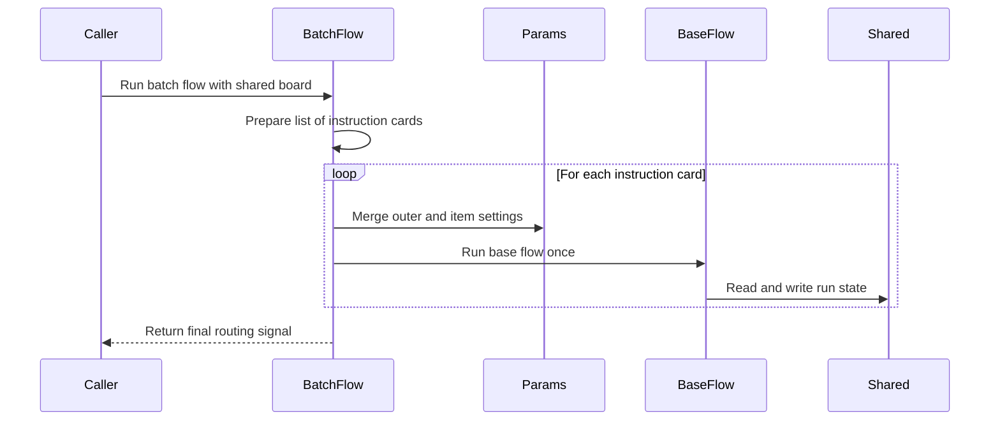

# Chapter 7: BatchFlow

Imagine you built a tiny image workshop.

It has three stations:

1. Load an image.
2. Apply a filter.
3. Save the result.

For one job, it works beautifully:

> Process `cat.jpg` with `blur`.

Then your boss walks in and says:

> Great. Now process `cat.jpg`, `dog.jpg`, and `bird.jpg` with `grayscale`, `blur`, and `sepia`.

Do you build nine separate flows?

Do you make `BlurCatFlow`, `SepiaDogFlow`, and so on?

No.

You want the same little workshop to run again and again, but each time it receives a different instruction card.

That is what **BatchFlow** gives you.

## One workshop, many registration cards

Think of a [Flow](04_flow.md) as a guided tour through several stations.

A BatchFlow is like a scheduler for that tour.

It says:

> Run this same tour once for each set of instructions.

In the image example, one pass might receive:

```python
{"input": "cat.jpg", "filter": "blur"}
```

The next pass receives:

```python
{"input": "dog.jpg", "filter": "sepia"}
```

Those dictionaries are not random data. They are [params](05_params.md) — instruction cards attached to one nested run.

A BatchFlow’s `prep` method returns a list of those instruction cards.

```python
class ImageBatchFlow(BatchFlow):
    def prep(self, shared):
        return [
            {"input": "cat.jpg", "filter": "blur"},
            {"input": "dog.jpg", "filter": "sepia"}
        ]
```

Each dictionary tells one pass of the base flow what to do.

This is different from [BatchNode](06_batchnode.md).

A BatchNode repeats one station over a tray of items.

A BatchFlow repeats an entire little tour, once for each instruction card.

## Wrap the little flow once

First, build the normal single-image flow.

```python
base_flow = Flow(start=load)
```

Now wrap it inside a BatchFlow.

```python
batch_flow = ImageBatchFlow(start=base_flow)
```

This works because a [Flow](04_flow.md) can behave like a node.

From the outside, `batch_flow` is one stop in a bigger graph.

From the inside, it runs the whole base flow again and again.

Run it like any other flow:

```python
shared = {}
batch_flow.run(shared)
```

The same [shared](01_shared.md) whiteboard travels through every pass.

Each pass gets its own instruction card.

## What BatchFlow actually does

Under the hood, `BatchFlow` is surprisingly small.

It inherits from `Flow`, but changes how a run happens.

```python
class BatchFlow(Flow):
    def _run(self, shared):
        pr = self.prep(shared) or []
        for bp in pr:
            self._orch(shared, {**self.params, **bp})
        return self.post(shared, pr, None)
```

Let’s read it slowly.

### Step 1: Prepare instruction cards

```python
pr = self.prep(shared) or []
```

`prep` can read the [shared](01_shared.md) board and build a list of parameter dictionaries.

If `prep` returns nothing, the batch becomes an empty list instead of crashing.

### Step 2: Run the base flow once per card

```python
for bp in pr:
    self._orch(shared, {**self.params, **bp})
```

For each instruction card, it runs `_orch`.

That is the same orchestration loop you met in [Flow](04_flow.md): copy the current runner, attach params, run it, follow its successors.

The important part is this merge:

```python
{**self.params, **bp}
```

This combines:

- the outer BatchFlow’s default params
- the per-pass batch params

As you learned in [params](05_params.md), the later dictionary wins.

So a pass can override a default setting without changing the graph.

### Step 3: Finish with post

```python
return self.post(shared, pr, None)
```

`post` receives:

- `shared`: the run whiteboard
- `pr`: the list of instruction cards that were prepared
- `None`: because BatchFlow does not automatically collect one big result from all passes

That last point matters.

Unlike [BatchNode](06_batchnode.md), a standard BatchFlow does **not** give you an `exec_res_list`.

It just runs each pass.

If you want to keep results, write them into [shared](01_shared.md) or override `post`.



## The inner nodes stay simple

The best part of BatchFlow is that the normal [Node](02_node.md) objects do not need to know they are inside a batch.

This loading node only reads its instruction card:

```python
class LoadImage(Node):
    def prep(self, shared):
        return self.params["input"]
```

It does not ask:

- Is this the first image?
- Is there a list somewhere?
- Am I inside a BatchFlow?

It just reads `self.params["input"]`.

Another node may read another field:

```python
filter_type = self.params.get("filter", "blur")
```

That is the whole magic.

The batch scheduler changes the instruction card.

The stations keep doing their normal job.

## Shared state travels across passes

This is one of the most important things to understand.

A BatchFlow gives each pass its own params, but it does **not** automatically give each pass its own [shared](01_shared.md) board.

The same whiteboard is reused for every pass.

In the image example, that is fine because each pass overwrites the relevant keys:

```python
shared["image"] = loaded_image
shared["filtered_image"] = filtered_image
```

The next pass replaces those notes with its own.

But if you want to collect results from many passes, you need to be careful.

Imagine a base flow that calculates one student’s grade average.

Inside that flow, a node might write:

```python
def post(self, shared, prep_res, exec_res):
    class_name = self.params["class"]
    student = self.params["student"]
    grades = shared.setdefault("grades", {})
    grades.setdefault(class_name, {})[student] = exec_res
```

Now each pass writes into a separate slot:

```python
shared["grades"]["class_a"]["alice.txt"] = 92.5
```

That keeps the whiteboard organized instead of scribbling over itself.

A good rule:

> Params can change per pass. Shared state does not automatically reset per pass.

## Nested batch flows are schedules inside schedules

BatchFlow becomes especially powerful when you nest it.

Imagine a school.

You want to calculate:

1. Each student’s average.
2. Each class’s average.
3. The whole school’s average.

Start with one base flow that processes one student.

Then wrap it in a `ClassBatchFlow`.

```python
class ClassBatchFlow(BatchFlow):
    def prep(self, shared):
        roster = shared["rosters"][self.params["class"]]
        return [{"student": name} for name in roster]
```

This BatchFlow reads the class name from its own params.

Then it creates one instruction card per student.

Now wrap that inside a `SchoolBatchFlow`.

```python
class SchoolBatchFlow(BatchFlow):
    def prep(self, shared):
        return [{"class": folder} for folder in shared["classes"]]
```

Connect them:

```python
class_flow = ClassBatchFlow(start=base_flow)
school_flow = SchoolBatchFlow(start=class_flow)
```

Now the school flow runs once per class.

Each class pass sets a new instruction card:

```python
{"class": "class_a"}
```

Then the class flow reads that card and creates student cards:

```python
{"student": "alice.txt"}
```

Because of the merge inside BatchFlow, the inner nodes can receive both:

```python
self.params["class"]
self.params["student"]
```

That is like a school scheduler saying:

> Today we run the workshop for class A.  
> Inside that workshop, schedule it again for each student in class A.

## BatchFlow and routing

A BatchFlow is still node-like.

So you can connect it to other nodes using [successors](03_successors.md).

For example:

```python
batch_flow >> report_node
```

By default, `BatchFlow` passes `None` as the final result into `post`, and the inherited `Flow.post` returns that value.

So if you do not override `post`, the outer flow usually treats the BatchFlow as returning the default path.

You can override `post` to inspect the run and choose a routing word:

```python
def post(self, shared, prep_res, exec_res):
    shared["passes_run"] = len(prep_res)
    return "report"
```

Then connect the door:

```python
batch_flow - "report" >> report_node
```

The base flow’s internal routing still works normally.

Each pass can branch or loop according to its own [successors](03_successors.md).

But from the outer graph’s point of view, the whole batch is just one stop.

## A few gotchas

### 1. Return dictionaries, not raw items

A BatchFlow expects each entry in `prep`’s result to be a dictionary-like params card.

Good:

```python
return [{"input": "cat.jpg"}]
```

Bad:

```python
return ["cat.jpg"]
```

The second one tries to merge a string into params, which will not work.

### 2. Shared state is not isolated by default

If two passes both write:

```python
shared["result"] = value
```

the second pass overwrites the first.

Use namespaced keys when collecting batch results:

```python
shared.setdefault("results", {})[self.params["input"]] = value
```

Or clear temporary keys at the start of each pass if that makes sense for your flow.

### 3. BatchFlow does not collect outputs automatically

In [BatchNode](06_batchnode.md), `post` receives a list of results.

In BatchFlow, it does not.

If you need a report, build it inside the nodes or in `post`.

For example:

```python
def post(self, shared, prep_res, exec_res):
    shared["passed"] = len(shared.get("results", {}))
```

### 4. Standard BatchFlow is sequential

It runs one pass after another.

That keeps the model simple and predictable.

If you need asynchronous parallel passes, you will meet that idea in [AsyncNode](08_asyncnode.md) and later async flow patterns.

## Good habits for BatchFlow

### Keep instruction cards small

A param card should usually say which job to run, not carry a giant pile of mutable working data.

Good:

```python
{"student": "alice.txt"}
```

Then the node can look up the real data from [shared](01_shared.md):

```python
content = shared["students"][self.params["student"]]
```

This keeps params closer to configuration and shared closer to run state.

### Use clear key names

Just like with [shared](01_shared.md), params become confusing when keys are vague.

Good:

```python
{"input": "cat.jpg", "filter": "blur"}
```

Bad:

```python
{"x": "cat.jpg", "cfg2": "blur"}
```

Instruction cards should be readable at a glance.

### Let per-pass cards override defaults

If you want a default language, set it on the outer flow:

```python
batch_flow.set_params({"language": "en"})
```

Then one pass can override it:

```python
{"text_key": "intro", "language": "fr"}
```

Because of `{**self.params, **bp}`, the per-pass value wins.

### Do not rely on inner flow defaults being merged automatically

A BatchFlow merges its own params with each batch card.

That merged dictionary becomes the params badge for the nested run.

If you have defaults inside the base flow itself, be careful: a BatchFlow pass may replace those settings rather than blending them in.

When in doubt, put shared defaults on the BatchFlow or include them in each prep dictionary.

## The mental model to keep

When you see BatchFlow, think:

> This is a scheduler for a little workshop.

It does not stamp one badge at a time like [BatchNode](06_batchnode.md).

Instead, it says:

> Run this whole tour again for each registration card.

Each card becomes params for that nested run.

The same [shared](01_shared.md) whiteboard stays in the room.

The instruction cards change from pass to pass.

That gives you a clean way to reuse one flow many times without creating a pile of nearly identical classes.

Now you know how to schedule the same little flow for many parameter sets.

But standard BatchFlow runs those passes one after another, like a workshop that waits for each student to finish before calling the next one.

What if some steps involve waiting — network calls, file reads, model responses — and you want several students to progress while others wait?

That is where asynchronous nodes enter the story: [AsyncNode](08_asyncnode.md).