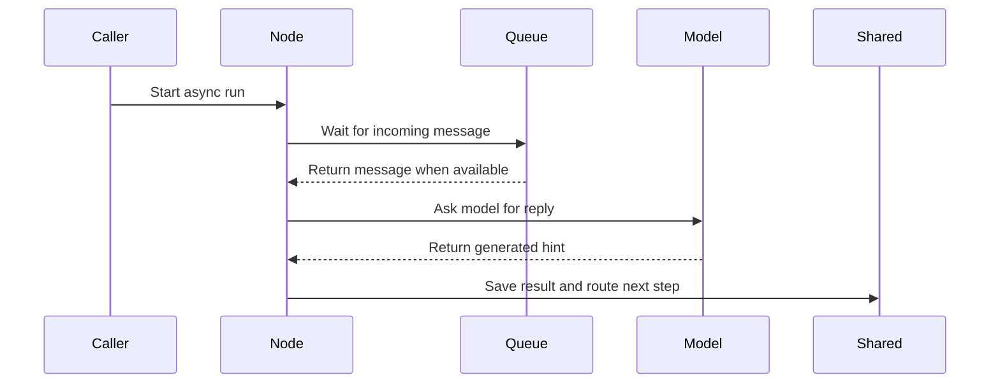

# Chapter 8: AsyncNode

Imagine your agent asks an LLM for a hint.

The model takes five seconds to answer.

During those five seconds, what should the rest of your program do?

If you use a normal [Node](02_node.md), that station is frozen while it waits. It is like a mailroom clerk who stops helping everyone else because they are staring at an empty mailbox.

That becomes painful when multiple agents need to talk to each other. One agent may be waiting for a message, while another agent wants to send one. If both are stuck in blocking code, nobody moves.

What you want is a station that can say:

> “I will wait for mail, but I will not block everyone else.”

That is what **AsyncNode** gives you.

## A node that can pause politely

An `AsyncNode` is the asynchronous version of a [Node](02_node.md).

It still has the same three jobs:

1. gather inputs
2. do the work
3. write results and choose what happens next

But now each job can pause while waiting for something external, such as:

- an LLM response
- a queue message
- a file read done through an async library
- another agent’s reply

The key word is **await**.

When you `await` something in Python asyncio, you are not saying:

> “Freeze the whole program.”

You are saying:

> “Pause this task until the thing I am waiting for arrives. Meanwhile, other tasks can run.”

That is the difference between a frozen clerk and a clerk who can check another mailbox when one is empty.

## The three async jobs

Instead of `prep`, `exec`, and `post`, an `AsyncNode` overrides:

- `prep_async`
- `exec_async`
- `post_async`

First, import the pieces:

```python
import asyncio
from pocketflow import AsyncNode
```

Now imagine a node that summarizes some text.

The async prep step reads from the [shared](01_shared.md) whiteboard:

```python
class Summarize(AsyncNode):
    async def prep_async(self, shared):
        return shared["text"]
```

This is still the same idea as before: gather ingredients.

Next comes the async work step:

```python
    async def exec_async(self, text):
        await asyncio.sleep(0.5)
        return f"Summary of {text}"
```

Here, `asyncio.sleep(0.5)` is pretending to be a slow network call.

In real code, that pause might be an LLM API call or another asynchronous operation.

Finally, the async post step writes back to [shared](01_shared.md):

```python
    async def post_async(self, shared, prep_res, exec_res):
        shared["summary"] = exec_res
```

That is the whole pattern.

The station still reads from the whiteboard, does work, and writes back.  
It just does those steps with `async` and `await`.

## Running one async station

Because the methods are asynchronous, you cannot run an `AsyncNode` with ordinary synchronous code.

You need an event loop:

```python
async def main():
    shared = {"text": "Pocket Flow is tiny."}
    await Summarize().run_async(shared)
    print(shared["summary"])

asyncio.run(main())
```

The important line is:

```python
await Summarize().run_async(shared)
```

`run_async` does the async version of running one node.

Under the hood, Pocket Flow does something like this:

```python
async def _run_async(self, shared):
    p = await self.prep_async(shared)
    e = await self._exec(p)
    return await self.post_async(shared, p, e)
```

That should feel familiar.

It is the same three-step rhythm from [Node](02_node.md), just asynchronous.

## Do not call the synchronous run method

This is one of the most common mistakes.

If you try to run an `AsyncNode` like a normal node, Pocket Flow stops you:

```python
def _run(self, shared):
    raise RuntimeError("Use run_async.")
```

So this will fail:

```python
node = Summarize()
node.run(shared)
```

Use this instead:

```python
await node.run_async(shared)
```

Think of it like a train station with two platforms.

A normal node uses the synchronous platform.  
An async node uses the asynchronous platform.

They look similar, but you cannot board one train as if it were the other.

## Async nodes still have routing signals

In [successors](03_successors.md), you learned that a node’s `post` method can return a routing word:

```python
return "search"
```

An async node does the same thing from `post_async`:

```python
    async def post_async(self, shared, prep_res, exec_res):
        shared["answer"] = exec_res
        return "done"
```

The returned value is still not automatically saved into [shared](01_shared.md).  
It is a signal for the flow.

If `post_async` returns nothing, Pocket Flow treats that as the default path, just like with a normal node.

But there is one important warning:

Running a single async node does not walk its successors.

If you connect doors like this:

```python
hinter = Hinter()
hinter - "continue" >> hinter
```

and then call:

```python
await hinter.run_async(shared)
```

Pocket Flow will warn you that the node has successors but will not follow them.

That is the same rule from [Node](02_node.md).

To walk a whole async graph, you need [AsyncFlow](09_asyncflow.md), which is the next chapter.

## Async retries still happen around exec

In [Node](02_node.md), you saw that Pocket Flow can retry `exec` when it fails:

```python
summarize = Summarize(max_retries=3, wait=1)
```

An `AsyncNode` supports the same idea.

The difference is that waiting between retries is also asynchronous.

A simplified version of the internal retry loop looks like this:

```python
for attempt in range(self.max_retries):
    try:
        return await self.exec_async(prep_res)
    except Exception as exc:
        if attempt == self.max_retries - 1:
            return await self.exec_fallback_async(prep_res, exc)
        await asyncio.sleep(self.wait)
```

That means the retry delay does not freeze the whole event loop.

You can also provide an async fallback:

```python
    async def exec_fallback_async(self, prep_res, exc):
        return "There was an error processing your request."
```

Think of this like a backup operator who is also awake and ready to help while the main machine waits for its retry timer.

## Params still work the same way

An `AsyncNode` can still read instruction cards from [params](05_params.md).

For example:

```python
    async def prep_async(self, shared):
        return shared["text"], self.params.get("tone", "neutral")
```

The difference between `shared` and `params` has not changed.

- `shared` is the run whiteboard from [shared](01_shared.md).
- `params` are optional settings telling the node how to behave.

Async does not change that boundary.

## The real superpower: waiting on queues

Now we get to the fun part.

In [shared](01_shared.md), you saw that the whiteboard can hold more than strings and lists. It can also hold coordination objects like `asyncio.Queue`.

A queue is like a mailbox with two sides:

- one side puts messages in
- the other side waits for messages to arrive

This is perfect for agent communication.

One agent can put a message into a queue.  
Another async node can wait on that queue without freezing everything else.

For example, two agents might share queues like this:

```python
shared = {
    "hinter_queue": asyncio.Queue(),
    "guesser_queue": asyncio.Queue()
}
```

One queue is for guesses sent to the hinter.  
The other queue is for hints sent to the guesser.

A simple async hinter node might start by waiting for a guess:

```python
class Hinter(AsyncNode):
    async def prep_async(self, shared):
        guess = await shared["hinter_queue"].get()
        return shared["target_word"], shared["forbidden_words"]
```

That line is the heart of async coordination:

```python
await shared["hinter_queue"].get()
```

If there is no message yet, this node waits.

But because it is waiting with `await`, other tasks can continue.

The exec step can ask an LLM for a hint:

```python
    async def exec_async(self, inputs):
        target, forbidden = inputs
        prompt = f"Hint for {target} without {forbidden}"
        return await asyncio.to_thread(call_llm, prompt)
```

Then the post step sends the hint to the other agent:

```python
    async def post_async(self, shared, prep_res, exec_res):
        await shared["guesser_queue"].put(exec_res)
        return "continue"
```

This is like a station that checks its mailbox, asks an expert for advice, and drops the answer into another agent’s mailbox.

The routing word `"continue"` can later connect back to the same node using [successors](03_successors.md). But actually running that loop belongs to [AsyncFlow](09_asyncflow.md).

## What the async mailroom looks like

Here is the basic sequence:



The node is not blocking the whole program.

It pauses at the mailbox, wakes up when mail arrives, asks the model for help, writes the result back to [shared](01_shared.md), and returns a routing word.

That is how asynchronous agent communication becomes simple.

## A few gotchas

### 1. Async does not magically fix blocking code

This is important.

An `AsyncNode` gives you an async structure. It does not automatically make every slow operation non-blocking.

For example, this looks async because it lives inside `exec_async`:

```python
    async def exec_async(self, text):
        return requests.get("https://example.com").text
```

But `requests.get` is synchronous.

While that request runs, the event loop is blocked. Your “polite mailroom clerk” suddenly freezes again.

A better pattern is to run blocking work in a thread:

```python
    async def exec_async(self, text):
        response = await asyncio.to_thread(requests.get, "https://example.com")
        return response.text
```

Or use an async HTTP client if you have one.

The rule is simple:

> If something blocks the thread, it can block your async flow.

### 2. Shared queues are shared state

Queues placed in [shared](01_shared.md) are coordination objects.

That is great when agents need to talk.

But if you accidentally reuse the same queue across independent runs, those runs may start talking to each other.

For independent requests, create fresh boards and fresh queues:

```python
run_1 = {"queue": asyncio.Queue()}
run_2 = {"queue": asyncio.Queue()}
```

For intentional coordination, sharing queues is exactly what you want.

### 3. AsyncNode is not automatically parallel batch processing

A normal [BatchNode](06_batchnode.md) processes a tray of items one by one.

An `AsyncNode` is about waiting politely. It can make multiple tasks progress while one waits, but it does not mean every item in a batch runs at the same time unless you explicitly design it that way.

Think of it like this:

- BatchNode says: “Do the same job for each item.”
- AsyncNode says: “This job may need to wait without freezing everyone else.”

Those are different ideas, and they can combine later.

### 4. You still need a flow for graph walking

A single `AsyncNode` can run one turn of work.

But if you want it to loop through successors like:

```python
hinter - "continue" >> hinter
```

you need the async version of [Flow](04_flow.md).

That is exactly what the next chapter covers.

## The mental model to keep

When you see `AsyncNode`, think:

> “This is a station that can wait for mail without blocking others.”

It keeps the familiar three-step pattern from [Node](02_node.md):

1. `prep_async` reads inputs
2. `exec_async` does the main work
3. `post_async` writes results and returns a routing word

But it adds one crucial ability:

> It can pause while waiting for LLM responses, queue messages, or other agents.

That makes it useful for:

- slow LLM calls
- queue-based communication
- concurrent agent systems
- flows where one part must wait without freezing the rest

Now you know how one async station works.

But a single station is not enough for a real multi-agent system. You need a tour guide that can walk an asynchronous graph, follow doors from [successors](03_successors.md), and let several agents make progress while others wait.

That is the job of the next chapter: [AsyncFlow](09_asyncflow.md).