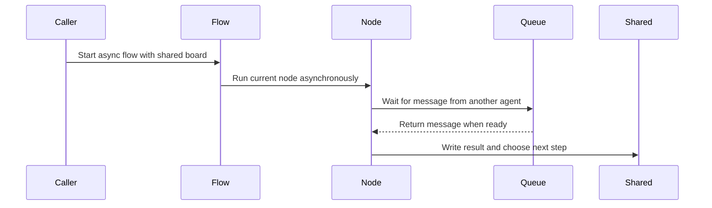

# Chapter 9: AsyncFlow

Imagine two agents playing a word game.

One agent has the secret word and must wait for a guess.  
The other agent must wait for a hint before guessing.

If you ask one agent to finish before starting the other, nothing happens.

The first agent waits forever for a message that will never arrive because the second agent has not started yet.

What you need is a dispatcher.

A dispatcher says:

> “You may wait for mail, but do not block everyone else.”

In [AsyncNode](08_asyncnode.md), you built one polite station that can pause with `await`. Now you need something that can walk a whole graph of stations, including stations that sometimes need to wait.

That is what **AsyncFlow** does.

## A flow that knows when to wait

An `AsyncFlow` is like the tour guide from [Flow](04_flow.md), but it understands asynchronous nodes.

Instead of running with:

```python
flow.run(shared)
```

you run it with:

```python
from pocketflow import AsyncFlow

flow = AsyncFlow(start=hinter)
await flow.run_async(shared)
```

That `await` is the important part.

The flow is not saying:

> “Freeze the whole program while this step runs.”

It is saying:

> “Run this node, and if it pauses to wait for something, let other waiting work continue.”

## The dispatcher rule

Inside an ordinary [Flow](04_flow.md), every node is run with the synchronous path.

An `AsyncFlow` looks at the current runner and chooses a platform.

Simplified, the idea looks like this:

```python
if isinstance(curr, AsyncNode):
    action = await curr._run_async(shared)
else:
    action = curr._run(shared)
```

That is the whole dispatcher trick.

If the current node is an [AsyncNode](08_asyncnode.md), the flow awaits it.

If the current node is a normal [Node](02_node.md), the flow runs it normally.

This means one graph can mix both kinds of workers:

```python
load >> summarize >> save
flow = AsyncFlow(start=load)
await flow.run_async(shared)
```

Here, `load` and `save` might be ordinary synchronous nodes.  
`summarize` might be an async node waiting on an LLM.

The dispatcher handles both.

One warning: if a synchronous node blocks the thread, it can still block your async flow. AsyncFlow gives you a polite structure, but it cannot magically make blocking code non-blocking.

## Mixing sync and async workers

Suppose you have a simple pipeline:

1. Load a file synchronously.
2. Ask an LLM asynchronously.
3. Save the result synchronously.

The graph might look like this:

```python
load >> summarize >> save
flow = AsyncFlow(start=load)
await flow.run_async(shared)
```

The sync nodes are fast helpers.  
The async node is the one that may need to pause.

That is often a good shape for real systems:

- quick file reads and writes stay simple
- slow model calls become async
- routing still uses [successors](03_successors.md) as usual

If you put an [AsyncNode](08_asyncnode.md) inside a plain synchronous [Flow](04_flow.md), it will not work. The plain flow tries the synchronous run path, and the async node refuses:

```python
RuntimeError: Use run_async.
```

So choose your tour guide carefully:

- use [Flow](04_flow.md) when everything is synchronous
- use `AsyncFlow` when any part of the graph needs to await

## Shared state can become a mailbox

In [shared](01_shared.md), you learned that the run whiteboard can hold more than strings and lists. It can also hold coordination objects like queues.

A queue is like a mailbox with two sides:

- one side puts messages in
- the other side waits for messages to arrive

For async agents, this is perfect.

One agent can send a message into a queue.  
Another async node can wait on that queue without freezing the whole program.

Here is the setup from the multi-agent example:

```python
shared = {
    "target_word": "nostalgic",
    "forbidden_words": ["memory"],
    "hinter_queue": asyncio.Queue(),
    "guesser_queue": asyncio.Queue()
}
await shared["hinter_queue"].put("")
```

The whiteboard now carries:

- the game data
- one queue for guesses
- one queue for hints

Those queues are not just data. They are meeting points.

## How two flows cooperate

Imagine two agents:

- a hinter that waits for a guess and sends a hint
- a guesser that waits for a hint and sends a guess

The hinter starts by waiting for mail:

```python
class Hinter(AsyncNode):
    async def prep_async(self, shared):
        guess = await shared["hinter_queue"].get()
        return shared["target_word"], shared["forbidden_words"]
```

That line is the heart of coordination:

```python
guess = await shared["hinter_queue"].get()
```

If there is no message yet, this node waits.

Because it waits with `await`, other work can continue.

After making a hint, the hinter sends it back through the other queue:

```python
    async def post_async(self, shared, prep_res, exec_res):
        await shared["guesser_queue"].put(exec_res)
        return "continue"
```

The guesser does the mirror image: wait for a hint, make a guess, send it back.

Now create one flow for each agent:

```python
hinter_flow = AsyncFlow(start=hinter)
guesser_flow = AsyncFlow(start=guesser)
hinter - "continue" >> hinter
guesser - "continue" >> guesser
await asyncio.gather(
    hinter_flow.run_async(shared),
    guesser_flow.run_async(shared)
)
```

Read this slowly.

First, each agent gets its own flow:

```python
hinter_flow = AsyncFlow(start=hinter)
guesser_flow = AsyncFlow(start=guesser)
```

Then each node loops back to itself using [successors](03_successors.md):

```python
hinter - "continue" >> hinter
guesser - "continue" >> guesser
```

Finally, both flows start together:

```python
await asyncio.gather(
    hinter_flow.run_async(shared),
    guesser_flow.run_async(shared)
)
```

`asyncio.gather` is like a dispatcher starting two tours at the same time.

Both tours share the same [shared](01_shared.md) whiteboard. They coordinate through queues instead of global variables.

## What happens while one agent waits?

This is where async coordination becomes easy to picture.



When the hinter waits on its queue, it is not blocking the guesser.

The event loop can let the guesser run.  
Then the guesser may wait on its own queue.  
Then the hinter wakes up when a message arrives.

That back-and-forth is what lets two agents play together.

## Why running one flow at a time deadlocks

This code looks reasonable:

```python
await hinter_flow.run_async(shared)
await guesser_flow.run_async(shared)
```

But it can deadlock.

The first line starts the hinter flow. The hinter waits for a guess.

That guess will come from the guesser.

But the guesser has not started yet because the second `await` is waiting behind the first one.

That is why the example uses:

```python
await asyncio.gather(...)
```

It starts both flows so they can take turns through queues.

## AsyncFlow can also be a node

You already know from [Flow](04_flow.md) that a flow can behave like a node inside another flow.

`AsyncFlow` keeps that idea, but in the async world.

A nested `AsyncFlow` can sit inside another `AsyncFlow`:

```python
outer = AsyncFlow(start=review_flow)
review_flow - "done" >> report
await outer.run_async(shared)
```

From the outside, `review_flow` is one stop on a bigger tour.

Inside, it may run many async nodes.

Because `AsyncFlow` also behaves like an [AsyncNode](08_asyncnode.md), a parent async flow can await it politely.

You can even override its final routing:

```python
class GameFlow(AsyncFlow):
    async def post_async(self, shared, prep_res, exec_res):
        if shared.get("winner"):
            return "report"
        return exec_res
```

Now the outer flow sees one simple handoff word: `"report"` or whatever the inner flow returns.

That is the same composition idea from [Flow](04_flow.md), just with waiting allowed inside.

## Async batch flows are dispatchers too

In [BatchFlow](07_batchflow.md), you saw how to run a whole subflow once for each set of [params](05_params.md).

AsyncFlow gives async versions of that idea.

A sequential async batch flow can prepare instruction cards asynchronously:

```python
class AsyncImageBatchFlow(AsyncBatchFlow):
    async def prep_async(self, shared):
        return [{"image_path": path} for path in shared["images"]]
```

It runs each pass one after another, but each pass may contain async nodes.

A parallel batch flow goes further:

```python
class AsyncImageParallelBatchFlow(AsyncParallelBatchFlow):
    async def prep_async(self, shared):
        return [{"image_path": path} for path in shared["images"]]
```

The parallel version starts many passes together and lets them overlap while they wait.

This is useful when each pass does something like:

- call an LLM
- fetch a file
- ask another service
- wait on a queue

If the work mostly waits, several passes can make progress at once.

## A few gotchas

### 1. Do not use plain Flow for async nodes

A synchronous [Flow](04_flow.md) calls the normal run path.

An [AsyncNode](08_asyncnode.md) expects the async run path.

If you mix them incorrectly, Pocket Flow will tell you to use `run_async`.

Use `AsyncFlow` when the graph contains async nodes or nested async flows.

### 2. Blocking code still blocks

This warning from [AsyncNode](08_asyncnode.md) becomes even more important in a flow.

A sync node inside an async flow can block the event loop.

Likewise, this looks async but is not:

```python
async def exec_async(self, inputs):
    return call_llm(prompt)
```

If `call_llm` blocks, your dispatcher pauses for everyone.

A safer pattern is:

```python
async def exec_async(self, inputs):
    return await asyncio.to_thread(call_llm, prompt)
```

Think of it as sending the slow errand to another worker while keeping the main dispatch desk open.

### 3. Shared queues can cross-talk between runs

Queues on [shared](01_shared.md) are great for intentional coordination.

But if two independent runs accidentally share the same queue, they may start talking to each other.

For separate requests, create fresh boards and fresh queues:

```python
run_1 = {"queue": asyncio.Queue()}
run_2 = {"queue": asyncio.Queue()}
```

For a multi-agent game, sharing queues is exactly what you want.

### 4. Directly running an AsyncFlow with outer successors may warn

If an `AsyncFlow` object itself has outside [successors](03_successors.md), calling its own `run_async` directly behaves like running a single node: it runs the flow’s inner graph but does not walk the outer doors.

To use it as part of a larger async graph, put it inside another `AsyncFlow` and run the parent.

That keeps the same rule from [Node](02_node.md) and [AsyncNode](08_asyncnode.md): one runner is for one station or one inner tour; a parent flow walks the bigger corridor.

## The mental model to keep

When you see `AsyncFlow`, think:

> “This is a dispatcher for workers who sometimes need to wait.”

It can run:

- normal [Node](02_node.md) stations
- async [AsyncNode](08_asyncnode.md) stations
- nested flows as sub-tours
- batch passes when combined with async batch classes

Most importantly, it lets multiple flows cooperate through the same [shared](01_shared.md) whiteboard.

Queues become mailboxes.  
Flows become independent tours.  
The event loop becomes the dispatcher that lets them take turns.

That is how you build agent systems where one part can wait for another without freezing the whole program.

Now you have the final core concept: a flow that can pause, branch, and coordinate multiple cooperating workers. The next step is not another idea—it is your own multi-agent app: start with two [AsyncNode](08_asyncnode.md) workers, two queues on the [shared](01_shared.md) board, and one `AsyncFlow` for each worker.