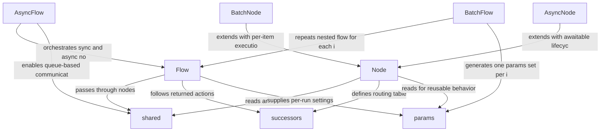

# PocketFlow

_Lens: beginner-tutorial_

Pocket Flow is a minimalist LLM framework that models applications as graphs of reusable nodes and flows.
It keeps state in shared dictionaries while supporting sync, async, batch, and nested workflows.

## Architecture

## Chapters

- [shared](01_shared.md)
- [Node](02_node.md)
- [successors](03_successors.md)
- [Flow](04_flow.md)
- [params](05_params.md)
- [BatchNode](06_batchnode.md)
- [BatchFlow](07_batchflow.md)
- [AsyncNode](08_asyncnode.md)
- [AsyncFlow](09_asyncflow.md)