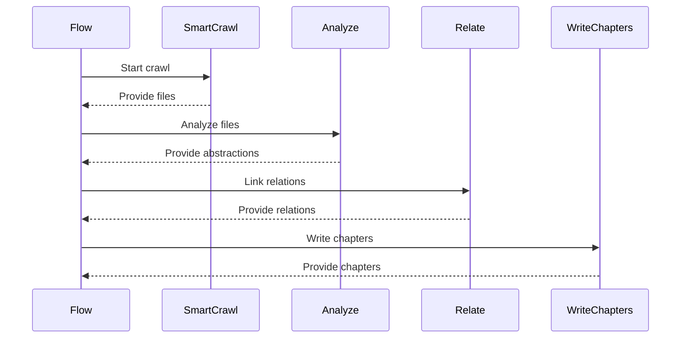

# Chapter 1: Flow

How do you keep a massive project on track when you have hundreds of moving parts? If you try to handle everything at once, you end up with a tangled mess of half-finished work. You need a way to ensure that step B never starts until step A is completely finished.

In this codebase, that responsibility belongs to the **Flow**.

Think of the Flow as a project manager. A project manager doesn't do the actual coding, the searching, or the writing. Instead, they hold the blueprint. They know that first, we must find the files, then we must understand what is inside them, then we must see how those things connect, and finally, we write the summary. If the manager fails to pass the files to the analyst, the whole project stalls.

Here is how that blueprint is defined in `flow.py`:

```python
def create_tour_flow() -> Flow:
    crawl = SmartCrawl()
    analyze = Analyze()
    relate = Relate()
    write = WriteChapters()

    crawl >> analyze >> relate >> write
    return Flow(start=crawl)
```

The `>>` symbol is the orchestrator's hand. It tells the program to take the output from the left side and hand it directly to the right side. This creates a strict, organized sequence. Without this connection, a tool like [SmartCrawl](03_smartcrawl.md) might find the files, but the [Analyze](04_analyze.md) step wouldn't know they exist.

The Flow ensures that each specialized worker receives exactly what it needs, exactly when it needs it.



Every component in this sequence is a specialized [Node](02_node.md). The Flow doesn't care how a node works; it only cares about *when* it works and where its results should go next. It turns a collection of independent tools into a single, cohesive machine.

Now that you understand the master plan, let's meet the individual workers that make it possible. In the next chapter, we will dive into the [Node](02_node.md).