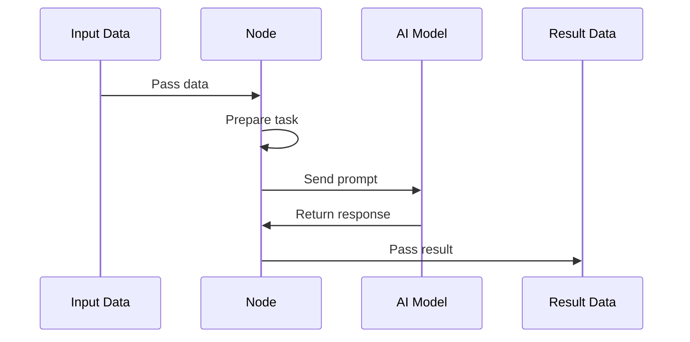

# Chapter 2: Node

What happens when a single part of a complex process fails? 

If you write one massive, monolithic script that tries to do everything, finding a bug is like looking for a needle in a haystack. If the AI returns slightly malformed data, the entire program might crash, leaving you with no idea which part of the logic actually failed.

To solve this, we don't build one giant machine. Instead, we build a [Flow](01_flow.md) made of many small, independent units called **Nodes**.

A Node is a single, discrete step in a workflow. Think of it like a specialized worker on an assembly line. This worker has one specific job—perhaps they only polish gears, or they only inspect labels. They receive specific inputs, perform exactly one job, and then pass the results forward to the next person.



### The Three Stages of a Worker

In our codebase, a Node isn't just a function. To make them reliable and easy to debug, every Node follows a strict three-step lifecycle: **Prepare**, **Execute**, and **Post**.

1.  **Prepare (`prep`)**: This is the "setup" phase. The worker looks at the tools they have and gets them ready. In our case, this often means taking the raw data and turning it into a prompt that an AI can understand.
2.  **Execute (`exec`)**: This is the "work" phase. The worker performs the actual task. This is where the "heavy lifting" happens, such as calling an AI model to analyze code.
3.  **Post (`post`)**: This is the "handover" phase. The worker cleans up their station and hands the finished product to the next person in the [Flow](01_flow.md).

Here is how the [Analyze](04_analyze.md) worker is structured in `nodes.py`:

```python
class Analyze(Node):
    def prep(self, shared):
        return load_prompt("identify-abstractions.md").format(...)

    def exec(self, prompt):
        return parse_yaml(call_llm(prompt))

    def post(self, shared, prep_res, exec_res):
        shared["abstractions"] = exec_res["abstractions"]
```

### Why This Matters

By breaking the work into Nodes, we gain two massive advantages:

*   **Isolation**: If the `Analyze` node fails because the AI returned bad text, the error happens *inside* that node. We know exactly which "worker" failed, and we can tell the [Flow](01_flow.md) to simply ask that worker to try again.
*   **Reusability**: Once you have a worker that can "Identify Abstractions," you can use that same worker in a different [Flow](01_flow.md) without rewriting a single line of code.

This modularity allows us to build complex pipelines like the Codebase Knowledge Builder by simply connecting these specialized experts together.

Now that you understand the individual workers, let's see our first worker in action. In the next chapter, we will dive into [SmartCrawl](03_smartcrawl.md), the node responsible for deciding which files are actually worth reading.