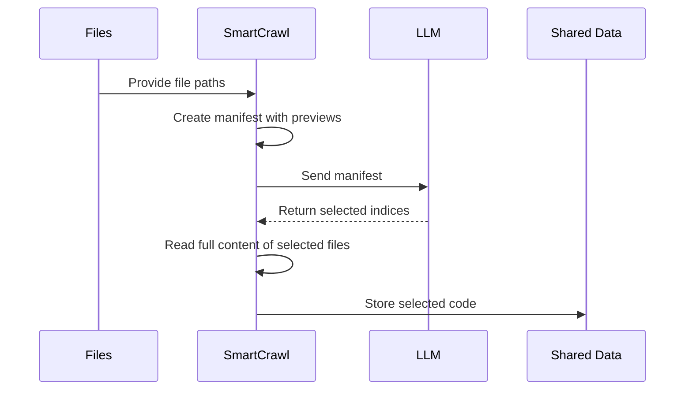

# Chapter 3: SmartCrawl

What happens when you try to read every single file in a massive GitHub repository?

If you are exploring a codebase like React or VS Code, you are looking at tens of thousands of files. Most of them are configuration settings, documentation, or auto-generated code that has nothing to do with the actual logic. If you tried to feed all of that into an AI, you would hit "token limits" (the AI's memory limit) instantly, and you would spend a fortune on API costs just to read files that don't matter.

You don't need to read everything. You just need to find the landmarks.

In our [Flow](01_flow.md), **SmartCrawl** acts as the scout. Its only job is to scan the territory and decide: "These 15 files are the soul of this project. Ignore everything else."

### The Scout's Notebook

Because we can't send full files to the AI yet, the `SmartCrawl` [Node](02_node.md) first creates a "manifest." Think of this as a scout's notebook: it doesn't contain the whole city, just a list of streets and a tiny description of what is on each corner.

In the `prep` stage, the node scans the directory and creates a snippet for every file:

```python
def prep(self, shared):
    files = list_files(shared["repo_path"])
    manifest_parts = []
    for i, path in enumerate(files):
        # We only take a small 'preview' to save space
        preview = safe_read(path)[:800] 
        manifest_parts.append(f"  [{i}] {path}\n{preview}")
    
    # Combine everything into one big list for the AI
    manifest = "\n".join(manifest_parts)
    return manifest, files
```

By only taking the first few hundred characters of each file, we can represent a massive codebase in a single, manageable text block.

### The Interview

Once the scout has their notebook, they go to the expert (the LLM) and ask which files are important. This happens in the `exec` stage. We don't ask the AI to "read the code"; we ask it to "pick the indices."

```python
def exec(self, manifest):
    # We ask the AI to return a YAML list of the file numbers
    prompt = load_prompt("select-files.md").format(manifest=manifest)
    result = parse_yaml(call_llm(prompt))
    return result["selected"] # e.g., [0, 5, 12, 42]
```

This is highly efficient. We are asking the AI to perform a high-level filtering task using only metadata and tiny snippets, rather than deep architectural analysis.

Here is how the data flows through the SmartCrawl node:



### The Handover

The scout's job isn't finished once they find the files. They have to actually go back and collect the "loot"—the full, unabridged source code of those specific files—and hand it off to the next worker.

This happens in the `post` stage. The node takes those indices, opens the real files, and stores their full contents in the [Flow](01_flow.md) "shared" memory.

```python
def post(self, shared, prep_res, exec_res):
    selected_indices = exec_res
    full_code = []
    for i in selected_indices:
        content = safe_read(files[i])
        full_code.append(content)
    
    # This 'codebase' variable is what the next Node will use
    shared["codebase"] = "\n\n".join(full_code)
```

By the end of this step, the "noise" of the repository has been eliminated. The `shared` state no longer contains 10,000 files; it contains only the high-density, high-value code that defines the project's architecture.

Now that the scout has identified the landmarks, the team can actually start studying them. In the next chapter, we will see how the [Analyze](04_analyze.md) node takes this concentrated code and extracts the core concepts.