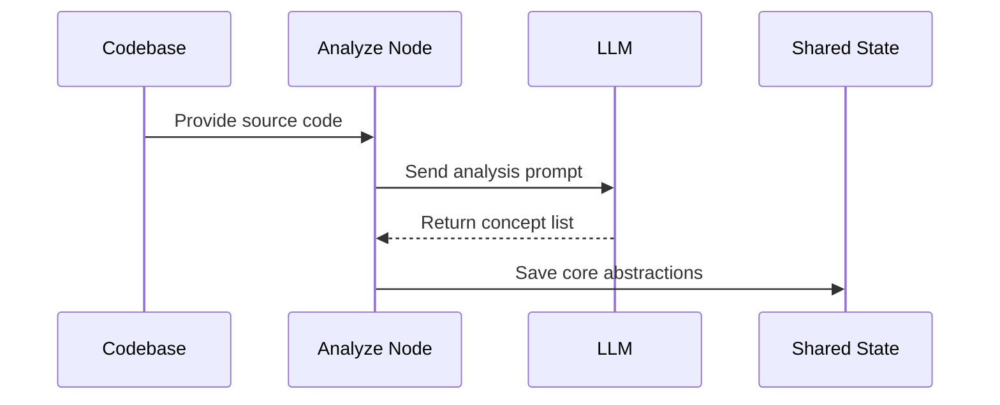

# Chapter 4: Analyze

You have just successfully run [SmartCrawl](03_smartcrawl.md). The scout has returned, and the [Flow](01_flow.md) is now holding a dense, high-quality collection of source code in its "shared" memory. 

But there is a new problem: you have a mountain of code and no idea what it actually *does*. 

If you handed this pile of files to a human, they wouldn't start reading line-by-line immediately. First, they would skim. They would look for recurring patterns, key data structures, and central "engines" of logic. They would try to answer the question: "What are the 5 or 10 most important concepts I need to understand to master this project?"

The **Analyze** [Node](02_node.md) is that scholar. It performs the conceptual discovery phase, scanning the selected files to identify the most important recurring themes and central concepts.

### The Scholar's Method

To turn raw code into a structured list of ideas, the `Analyze` node follows the standard three-stage lifecycle. 

First, it must prepare the data. In the `prep` stage, the node doesn't just dump the code; it wraps the "loot" from the previous step into a specific prompt that tells the AI exactly what to look for.

```python
def prep(self, shared):
    # We take the 'codebase' left behind by SmartCrawl
    return load_prompt("identify-abstractions.md").format(
        codebase=shared["codebase"]
    )
```

Next, it enters the `exec` stage. This is where the "heavy lifting" happens. The node sends the prepared prompt to the LLM. However, the AI can sometimes be unpredictable. It might find 10 concepts, but then list only 9 in its "learning order." To prevent this, our node includes a validation step to ensure the data is structurally sound.

```python
def exec(self, prompt):
    # The AI returns a YAML block of data
    result = parse_yaml(call_llm(prompt))
    
    # We verify the names match the suggested order
    names = {a["name"] for a in result["abstractions"]}
    order = set(result["learning_order"])
    
    # If they don't match, the Node triggers a retry
    assert names == order 
    return result
```

Finally, the `post` stage handles the handover. Once the scholar has identified the core concepts, they write them down in the [Flow](01_flow.md) "shared" memory so the rest of the team knows what to do next.

```python
def post(self, shared, prep_res, exec_res):
    # Store the summary of the project
    shared["summary"] = exec_res["summary"]
    # Store the list of concepts (abstractions)
    shared["abstractions"] = exec_res["abstractions"]
    # Store the suggested order to learn them
    shared["order"] = exec_res["learning_order"]
```

### The Abstraction Map

The goal of this node is to transform a chaotic pile of text into a structured "map" of ideas. This map doesn't just list the concepts; it establishes a logical path for a human to follow.



By the end of this step, the [Flow](01_flow.md) no longer just contains "code." It contains a high-level blueprint of the project’s DNA. We know that the project is built on concepts like `Request Handling`, `State Management`, or `Plugin Architecture`.

Now that we have identified the individual "words" of the codebase, we need to understand how they talk to each other. A list of concepts is useful, but the real magic lies in the connections between them. In the next chapter, we will see how the [Relate](05_relate.md) node maps those connections.