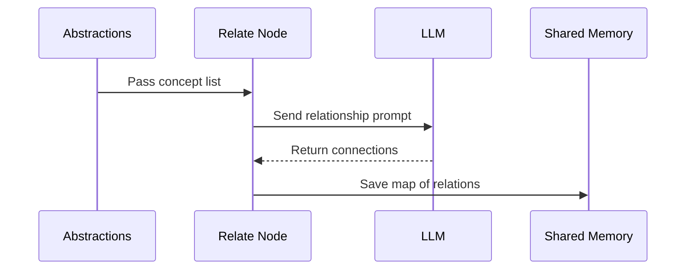

# Chapter 5: Relate

You have a list of the most important concepts in the project. You know that `User Authentication` is a key part of the system, and you know that `Database Connection` is another. But a list of nouns is just a grocery list—it doesn't tell you how to cook the meal.

How does the `User Authentication` system actually talk to the `Database Connection`? Does the user's data flow through a specific manager, or does the authentication service call the database directly? 

If you don't know how these pieces interact, you are looking at a pile of isolated islands. To understand a codebase, you need to see the bridges that connect them.

The **Relate** [Node](02_node.md) is our cartographer. Its job is to take the "cities" identified by [Analyze](04_analyze.md) and draw the "roads" between them.

### The Cartographer's Strategy

Mapping a codebase is harder than listing its parts. To find a connection, the AI has to look at how data moves between different modules. It's not enough to know that two things exist; the AI must prove they interact.

The `Relate` node performs this mapping using the standard three-stage lifecycle.

First, it must prepare the map. In the `prep` stage, the node gathers the descriptions of the concepts found by [Analyze](04_analyze.md) and combines them with the full codebase. It creates a summary list so the AI knows exactly which "cities" it is looking for.

```python
def prep(self, shared):
    listing = "\n".join(
        f"- {a['name']}: {a['description'].strip()}" 
        for a in shared["abstractions"]
    )
    return load_prompt("analyze-relationships.md").format(
        abstractions=listing, codebase=shared["codebase"]
    )
```

Next, it enters the `exec` stage. The node sends this structured list and the codebase to the LLM. We aren't asking the AI to "understand the code" generally; we are giving it a very specific task: "Find the links between these specific concepts."

```python
def exec(self, prompt):
    # The AI returns a list of connections
    result = parse_yaml(call_llm(prompt))
    return result["relationships"]
```

Finally, the `post` stage handles the handover. Once the connections are mapped, the node saves them into the [Flow](01_flow.md) shared memory.

```python
def post(self, shared, prep_res, exec_res):
    # Store the connections for the next worker
    shared["relationships"] = exec_res
    print(f"  Found {len(exec_res)} relationships")
```

### Creating the Map

Think of this process like studying a social network. `Analyze` tells you who the most popular people are. `Relate` tells you that Person A is the boss of Person B, and Person B is the coworker of Person C. 

When the `Relate` node finishes, it has produced a set of "edges"—directional connections that describe the flow of the system.



By the end of this step, we have transformed a flat list of concepts into a web of intelligence. We don't just know *what* is in the codebase; we know *how* it works.

Now that we have a map of the concepts and the roads connecting them, we have everything we need to tell the story. We have the landmarks, the paths, and the logic. In the next chapter, we will see how [WriteChapters](06_writechapters.md) takes all of this information and weaves it into a cohesive narrative.