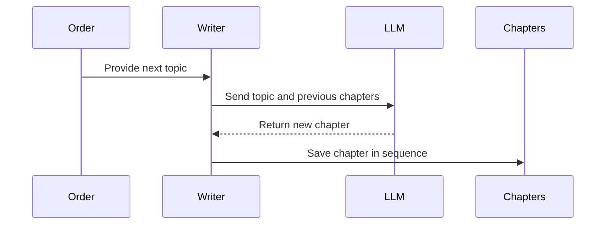

# Chapter 6: WriteChapters

You have successfully scanned the repository with [SmartCrawl](03_smartcrawl.md). You have extracted the core concepts with [Analyze](04_analyze.md). You have even mapped the complex relationships between them using [Relate](05_relate.md).

You are sitting on a goldmine of information. But right now, that information is just a pile of data sitting in the computer's memory. If you handed this raw data to a new developer, they wouldn't find it helpful. They would find it overwhelming. 

Data is not knowledge. Knowledge requires a narrative.

To turn our data into a guide, we need a storyteller. This is the final stage of our [Flow](01_flow.md): the **WriteChapters** [Node](02_node.md).

### The Storyteller's Problem

Most AI agents work by "batching." If you ask an AI to write ten different summaries of ten different files, it treats each task as an isolated event. It finishes Task A, forgets everything, and moves to Task B.

If we used a standard [BatchNode](02_node.md) for our tutorial, we would end up with ten disconnected pages. Chapter 1 might introduce a concept, but Chapter 2 wouldn't know Chapter 1 ever happened. The "story" would feel jumpy, repetitive, and disjointed—like reading a book where every chapter was written by a different person who never spoke to their colleagues.

A great storyteller knows that Chapter 2 depends on the context established in Chapter 1. To write a cohesive guide, our writer needs to remember what they said previously.

### Sequential Context: Writing the Narrative

To solve this, `WriteChapters` is a special kind of [Node](02_node.md). It does not work in parallel; it works sequentially. It carries the "memory" of the previous chapters forward into the prompt for the next one.

Here is how the `exec` stage handles this "memory" in `nodes.py`:

```python
for i, name in enumerate(ctx["order"]):
    # Combine previous chapters to create context
    prev = "\n\n---\n\n".join(prev_chapters)
    
    prompt = load_prompt("write-chapter.md").format(
        name=name,
        prev_chapters=prev,
        # ... other context ...
    )
    content = call_llm(prompt)
    chapters.append({"name": name, "content": content})
    prev_chapters.append(content)
```

In this loop, `prev_chapters` acts as the writer's notebook. Every time a new chapter is written, it is added to the notebook. When the next chapter begins, the AI is given the entire notebook as context. 

This ensures that if Chapter 1 explains a "Database" concept, Chapter 2 can say, "Now that you understand the Database, let's see how it interacts with the User..." instead of re-explaining the Database from scratch.

### The Writer's Workflow

The `WriteChapters` node takes the structural blueprint provided by the previous steps and weaves them together. It uses the "order" from [Analyze](04_analyze.md) to ensure the learning path is logical, and it uses the "relationships" from [Relate](05_relate.md) to build bridges between topics.



The writer follows these rules to ensure the output is high-quality:
1. **The Problem-First Approach**: It doesn't start with "The Authentication module is..." It starts with "How does the system know who you are?"
2. **Incremental Complexity**: It uses the order established by the [Analyze](04_analyze.md) node to ensure the reader isn't thrown into the deep end too early.
3. **The Contextual Thread**: By receiving the `prev_chapters`, it maintains a consistent tone and vocabulary throughout the entire tour.

### The Final Product

Once the `WriteChapters` node finishes its loop, the [Flow](01_flow.md) is complete. The `shared` memory now contains a list of perfectly ordered, contextually aware markdown chapters.

The final step—handled by `main.py`—is to take these markdown chapters and the architecture map created by [Relate](05_relate.md) and wrap them in a beautiful HTML template.

The result is a professional, interactive "Codebase Tour." It includes:
* An **Architecture Map** (a visual Mermaid diagram of your project).
* A **Guided Reading List** of chapters.
* **Detailed Content** that explains not just *what* the code is, but *why* it exists and *how* it works.

You have successfully transformed a chaotic, thousands-of-files repository into a structured, human-readable knowledge base. The machine has done the heavy lifting of reading, analyzing, and relating; now, the human can finally focus on what matters most: building.