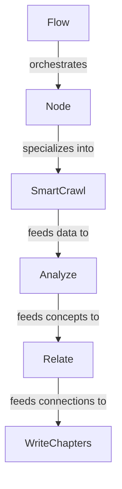

# workflow

_Lens: beginner-tutorial_

This project automates the creation of a guided, interactive tour of a software repository using LLMs. It transforms raw source code into a structured, narrative-driven documentation website by crawling files, identifying core concepts, and mapping their relationships.

## Architecture

## Chapters

- [Flow](01_flow.md)
- [Node](02_node.md)
- [SmartCrawl](03_smartcrawl.md)
- [Analyze](04_analyze.md)
- [Relate](05_relate.md)
- [WriteChapters](06_writechapters.md)