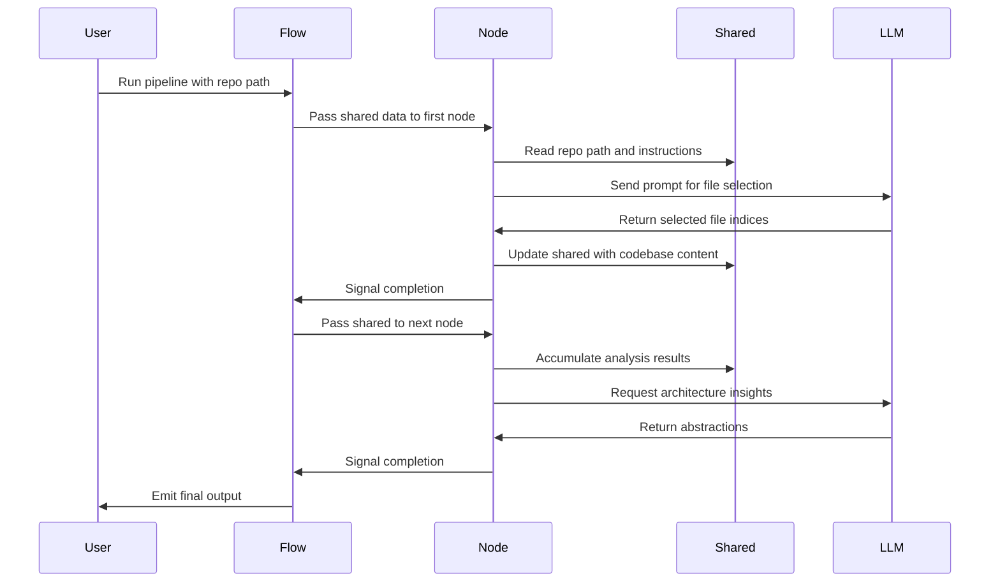

# Chapter 1: Flow

Imagine you hand a developer a random open-source repository and ask for a tutorial. The repo might contain thousands of files: configuration, tests, documentation, and core logic. Where do you even start? If you just dump everything into a language model, you'll hit context limits and get noise. If you try to manually script every step—crawling, filtering, analyzing, writing—you'll end up with a fragile mess of spaghetti code where one failure breaks the whole thing.

You need a reliable way to chain distinct steps together so data flows smoothly from one stage to the next, like a factory assembly line. Raw materials enter one end, pass through specialized stations, and emerge as a polished product. That is exactly what the **Flow** does.

## The Assembly Line

In `flow.py`, the assembly line is defined in a single function. Each node represents a specialized station.

```python
def create_tour_flow() -> Flow:
    crawl = SmartCrawl()
    analyze = Analyze()
    relate = Relate()
    write = WriteChapters()

    crawl >> analyze >> relate >> write
    return Flow(start=crawl)
```

Notice the `>>` operator. This connects nodes in a strict sequence. When `crawl` finishes, control passes automatically to `analyze`, then to `relate`, and finally to `write`. You don't write loops or conditionals to manage the order; the Flow handles the orchestration. It ensures that steps happen exactly when they should, preventing the "writing before analyzing" bug that plagues unstructured scripts.

## The Clipboard of Data

How do stations share information? The Flow passes a `shared` dictionary along the line. Think of this like a clipboard that travels with the product. Each station can read from it and update it.

```python
shared = {"repo_path": args.repo_path, "instructions": args.instructions}
create_tour_flow().run(shared)
```

This bucket starts simple with the repository path and instructions. As the pipeline runs, stations like [SmartCrawl](04_smartcrawl.md) add selected files, and [Analyze](05_analyze.md) adds architectural insights. By the time [WriteChapters](07_writechapters.md) runs, the clipboard is packed with everything needed to generate the tour. The [shared](03_shared.md) object is the memory of the pipeline, accumulating knowledge at every step.

## Sequence of Operations

The diagram below shows how the Flow orchestrates the pipeline. It initializes the nodes, passes the shared context, and triggers execution. Each node performs its work, potentially calling the LLM, and updates the shared data before signaling completion.



Flow gives you structure. It chains the processing steps, manages the flow of data through the `shared` context, and provides a clean, declarative way to define the order of operations.

Now that you see how Flow chains the pipeline together, you might wonder what makes each station tick. How does a step prepare its input, execute its logic, and handle errors? The answer lies in the [Node](02_node.md) class, the fundamental building block that Flow orchestrates.