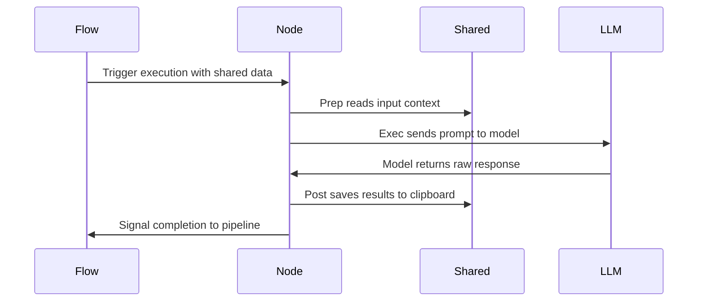

# Chapter 2: Node

You've seen how [Flow](01_flow.md) chains stations together like an assembly line. But what happens inside a single station? If you write a script that reads files, calls an API, and saves results all in one giant block, one failure breaks everything. You need structure inside the step, not just between steps.

Enter the **Node**.

## The Workstation Routine

Think of a Node as a dedicated robot at a workstation. It doesn't just "do stuff." It follows a strict routine to ensure reliability:

1.  **Gather Tools (`prep`)**: Check the clipboard, load the product, and prepare materials.
2.  **Perform Task (`exec`)**: Do the specialized work, like scanning for defects or stamping a part.
3.  **Package Output (`post`)**: Save the result, update the clipboard, and signal that the station is done.

This separation prevents "spaghetti logic" where reading configuration is tangled with calling the LLM. Each phase has a single responsibility.

## The Lifecycle Methods

Every Node defines three methods. Let's look at how a node like [SmartCrawl](04_smartcrawl.md) uses them.

### 1. Prep: Gathering Tools

The `prep` method reads from the [shared](03_shared.md) context and returns exactly what the execution phase needs. It isolates input gathering from the core logic.

```python
def prep(self, shared):
    files = list_files(shared["repo_path"])
    manifest = build_preview(files)
    prompt = load_prompt("select.md")
    return prompt, files
```

Notice `prep` only touches `shared` to read inputs. It doesn't call the LLM or save results. It just packs a bag for `exec`.

### 2. Exec: Performing the Task

The `exec` method takes the inputs from `prep` and does the heavy lifting. This is usually where the LLM is called.

```python
def exec(self, inputs):
    prompt, files = inputs
    response = call_llm(prompt)
    indices = parse_yaml(response)
    return [files[i] for i in indices]
```

`exec` is pure work. It doesn't know about `shared`. It doesn't know about other nodes. It just transforms inputs into outputs. If the LLM returns garbage, `exec` raises an error, and the Node's retry mechanism kicks in automatically.

### 3. Post: Packaging Output

The `post` method takes the result from `exec` and updates the [shared](03_shared.md) clipboard for downstream nodes.

```python
def post(self, shared, prep_res, exec_res):
    selected = exec_res
    shared["codebase"] = read_files(selected)
    shared["selected_files"] = selected
    print(f"  Selected {len(selected)} files")
```

Now the next station can read `shared["codebase"]` without needing to know how [SmartCrawl](04_smartcrawl.md) chose those files.

## Built-in Resilience

Nodes aren't just functions; they are durable workers. In a fragile script, a network blip might crash the whole pipeline. A Node handles errors gracefully.

You can configure retries directly on the class:

```python
class SmartCrawl(Node):
    def __init__(self):
        super().__init__(max_retries=3, wait=2)
```

If `exec` raises an error (for example, because [parse_yaml](08_parse_yaml.md) detected a missing code fence), the Node catches it, waits two seconds, and tries again. You don't need to write `try/except` blocks manually. The Node ensures the work gets done.

## Lifecycle Sequence

The diagram below shows how a Node cycles through its phases. It reads context, performs work, and updates the shared state before signaling the [Flow](01_flow.md) that it is ready for the next step.



## Summary

A Node is the fundamental unit of work. It encapsulates a step's logic into a reliable lifecycle: `prep` gathers inputs, `exec` performs the task, and `post` saves the outcome. This structure keeps your code testable, readable, and resilient against failures.

Now that you understand how a Node packages its work, you might wonder how stations share information without getting tangled. How does one node update a value that another node depends on? The answer lies in the [shared](03_shared.md) context, the clipboard that travels down the assembly line.