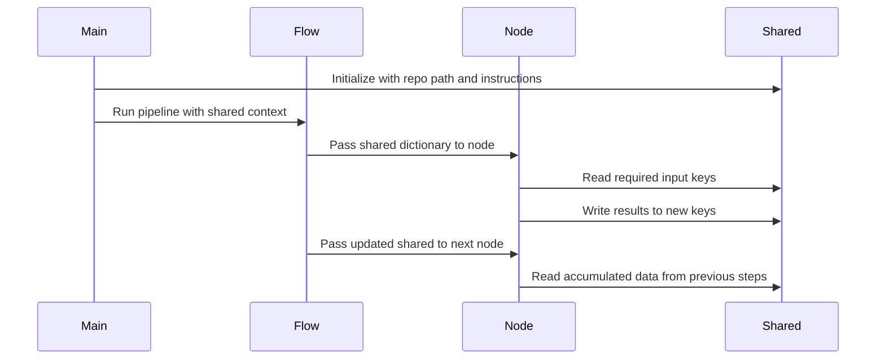

# Chapter 3: shared

Imagine you are building a tutorial by passing a notebook through a line of experts. The researcher writes down key findings. The editor highlights the best quotes. The designer sketches diagrams based on those quotes. If the researcher keeps their findings in a private diary, the editor has nothing to work with. If everyone scribbles on random scraps of paper, the designer will never find the quotes.

You need a single place where every expert can deposit their work and pick up what others have left behind.

That place is `shared`.

## The Project Whiteboard

In this pipeline, `shared` acts as a central whiteboard that travels along with the work. It is a mutable Python dictionary that serves as the pipeline's memory and data exchange layer.

When the pipeline starts, the whiteboard is mostly blank, containing only the initial instructions. As each step completes, it adds its results to the whiteboard. The next step walks up, reads what's there, adds its own contribution, and passes the whiteboard forward.

By the time the pipeline finishes, the whiteboard is packed with everything needed to generate the final tour: the selected code, the architectural insights, the relationships, and the written chapters.

## A Simple Dictionary

At its core, `shared` is just a dictionary. It starts in [main.py](01_flow.md) with a few essential keys:

```python
shared = {
    "repo_path": args.repo_path,
    "instructions": args.instructions,
}
```

This dictionary is passed to the [Flow](01_flow.md), which hands it to each [Node](02_node.md) in sequence. Any node can read from `shared` to get inputs and write to `shared` to save outputs.

```python
def prep(self, shared):
    path = shared["repo_path"]
    return path

def post(self, shared, prep_res, exec_res):
    shared["codebase"] = exec_res
```

Notice that `prep` reads the path, while `post` writes the processed codebase back. The `shared` object is the bridge between the input of one station and the output of another.

## How Data Grows

The power of `shared` lies in accumulation. It starts small and grows organically as the pipeline progresses. Different nodes contribute different pieces of the puzzle.

Here is how the whiteboard fills up during a typical run:

- **Start**: Contains `repo_path` and `instructions`.
- **[SmartCrawl](04_smartcrawl.md)**: Scans the repository, asks the LLM which files matter, and writes `codebase`, `selected_files`, and `selection_reasoning`.
- **[Analyze](05_analyze.md)**: Reads the `codebase`, extracts core concepts, and writes `summary`, `abstractions`, and `order`.
- **[Relate](06_relate.md)**: Reads the `abstractions`, maps how they connect, and writes `relationships`.
- **[WriteChapters](07_writechapters.md)**: Reads everything accumulated so far, generates the tutorial text, and writes `chapters` and `filenames`.

Downstream nodes never need to know *how* upstream nodes did their work. They only need to know what keys exist on the whiteboard. This decoupling makes the pipeline modular and flexible.

## The Flow of State

The diagram below shows how `shared` accumulates data as it moves through the pipeline. Each node reads the current state, performs its task, and enriches the state for the next node.



In this flow, `shared` is the only state that survives between nodes. The [Flow](01_flow.md) manages the order, the [Node](02_node.md) manages the execution, but `shared` holds the knowledge.

## Writing and Reading Rules

Since `shared` is a mutable dictionary, anyone can overwrite anything. To keep the pipeline stable, nodes follow simple conventions:

- **Read in `prep`**: Nodes gather inputs during the `prep` phase. This isolates input dependencies and makes the node easier to test.
- **Write in `post`**: Nodes update `shared` only after successful execution. This prevents partial or corrupted data if a step fails and retries.
- **Use descriptive keys**: Keys like `abstractions` and `selection_reasoning` make the data self-documenting. Avoid single-letter keys or ambiguous names.

The [Node](02_node.md) lifecycle enforces this discipline. If `exec` raises an error, `post` never runs, so `shared` remains unchanged. The [Flow](01_flow.md) can then retry the node without worrying about stale results.

## Summary

The `shared` dictionary is the pipeline's central memory. It starts as a simple clipboard with a few instructions and evolves into a rich context containing code, analysis, relationships, and output. By passing `shared` through the assembly line, nodes can collaborate without tight coupling, and the pipeline can accumulate knowledge step by step.

Now that you understand how data flows between stations, you might wonder how the pipeline decides what code is worth analyzing. A repository can contain thousands of files, but most are irrelevant to a tutorial. How does the system filter the noise and pick the signal? That is the job of [SmartCrawl](04_smartcrawl.md).