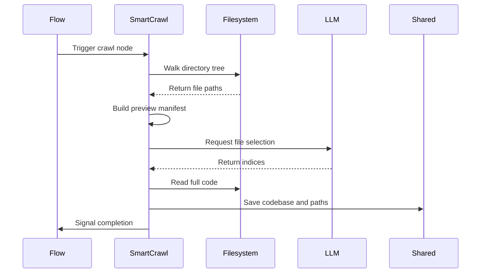

# Chapter 4: SmartCrawl

What happens when you point this pipeline at a repository with ten thousand files? If you blindly copy everything and feed it to a language model, you will instantly hit token limits, waste money on test fixtures and lock files, and drown the model in noise. You cannot analyze what you cannot see. You need a way to find the actual application logic before you even think about writing a tutorial.

Enter [SmartCrawl](04_smartcrawl.md). It operates like a knowledgeable librarian quickly skimming thousands of books to hand you only the essential volumes that truly capture the subject. Instead of reading every page, it uses a two-step filter: a fast local sweep followed by an intelligent review.

## The Preview Manifest

Before asking the model for help, the node needs a map of the territory. In the [prep](02_node.md) phase, SmartCrawl walks the directory tree and grabs a small preview of each file. This creates a manifest, which is simply a numbered list of paths paired with the first few hundred characters of code.

```python
manifest_parts = []
for i, path in enumerate(files):
    preview = safe_read(path)[:800]
    manifest_parts.append(f"[{i}] {path}\n{preview}")
```

This approach keeps the context window extremely light. The model never sees full files yet. It just sees enough to recognize that a configuration file is setup, a core module is logic, and a test directory is noise.

## Delegating the Selection

During the [exec](02_node.md) phase, the manifest is sent to the language model. The prompt asks for a specific number of files that best explain the project's architecture. The model reviews the previews and responds with a YAML list of indices alongside a brief reasoning.

```python
def exec(self, inputs):
    result = parse_yaml(call_llm(inputs))
    indices = result["selected"]
    return [files[i] for i in indices]
```

Notice how [parse_yaml](08_parse_yaml.md) handles the extraction. If the model returns garbage or forgets the code fence, the [Node](02_node.md) retry logic catches the error and asks again. You only get valid file paths, never broken JSON or hallucinated routes.

## Packaging the Codebase

Once the indices are confirmed, the [post](02_node.md) phase steps in. It opens the chosen files, reads their complete contents, and stitches them together into a single text block. This block is written directly to the [shared](03_shared.md) clipboard.

```python
shared["codebase"] = "\n\n".join(read_files(selected))
shared["selected_files"] = selected
shared["selection_reasoning"] = reasoning
```

This is a crucial handoff. Downstream steps never need to know how the files were chosen. They just know that `codebase` contains exactly what they need, ready for deeper inspection. The clipboard now holds the raw materials for the next station.

## The Selection Flow

The diagram below shows how SmartCrawl navigates the filesystem and the model. It gathers previews, gets approval, reads the full text, and updates the pipeline memory.



## Summary

SmartCrawl solves the discovery problem. It prevents the pipeline from choking on irrelevant files while ensuring the model sees enough context to make architectural decisions. By filtering early and reading late, it saves tokens, reduces latency, and keeps the signal strong.

Now that you have a curated list of files packed into the clipboard, you might wonder how the pipeline turns raw code into human readable concepts. How does it spot the core patterns hidden inside those selected files? That is the job of [Analyze](05_analyze.md).