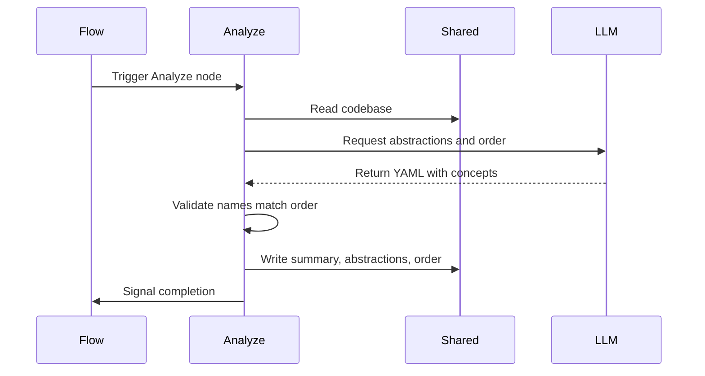

# Chapter 5: Analyze

You've gathered the essential files. Your clipboard holds the raw code, curated by [SmartCrawl](04_smartcrawl.md). But reading code directly is like trying to learn a language by memorizing a dictionary alphabetically. You might find the words, but you won't understand how they fit together until you know the core concepts.

You need a mental map before you navigate the territory.

Enter the **Analyze** node. It operates like a senior technical writer sitting down with the selected volumes. Instead of summarizing every function, it reads the code and distills the five to ten most important conceptual building blocks. The output is a core glossary: each concept gets a name, a plain-English definition, and a place in the learning journey.

## Distilling the Glossary

A codebase is full of details, but most details are noise to a beginner. The **Analyze** node ignores the syntax and focuses on the architecture. It asks the language model to identify the abstractions that form the skeleton of the project.

For a framework, these might be "Components," "State Store," and "Router." For a CLI tool, they might be "Command Registry," "Input Parser," and "Output Formatter." The node extracts these terms and forces the model to define them in plain English, creating a shared vocabulary for the tutorial.

## The Analysis Lifecycle

Like every station in the assembly line, Analyze follows the [Node](02_node.md) lifecycle to ensure reliability.

### 1. Prep: Loading the Source Material

In the `prep` phase, the node grabs the code from the [shared](03_shared.md) clipboard. This is the text block assembled by [SmartCrawl](04_smartcrawl.md). Analyze also loads a prompt template that instructs the model to extract abstractions.

```python
def prep(self, shared):
    return load_prompt("identify-abstractions.md").format(codebase=shared["codebase"])
```

Notice that `prep` only reads `shared["codebase"]`. It doesn't touch the model or write results. It just packages the input for the execution phase.

### 2. Exec: Extracting and Validating

The `exec` phase sends the prompt to the language model. The model responds with a YAML structure containing the abstractions, a project summary, and a recommended learning order.

```python
def exec(self, prompt):
    result = parse_yaml(call_llm(prompt))
    names = {a["name"] for a in result["abstractions"]}
    order = set(result["learning_order"])
    assert names == order, f"Mismatch: {names ^ order}"
    return result
```

This step does two things:
1.  **Extraction**: It uses [parse_yaml](08_parse_yaml.md) to pull the structured data from the model's response.
2.  **Validation**: It asserts that every abstraction has a corresponding entry in the learning order. If the model hallucinates a concept that isn't in the order, or forgets to order a concept, the assertion fails.

Because Analyze is a [Node](02_node.md) configured with retries, a validation failure doesn't crash the pipeline. The node catches the error, waits, and asks the model again until the structure is perfect. This ensures the downstream steps always receive consistent data.

### 3. Post: Updating the Clipboard

Once the abstractions are validated, the `post` phase writes the results to the [shared](03_shared.md) clipboard for the next stations.

```python
def post(self, shared, prep_res, exec_res):
    shared["summary"] = exec_res["summary"]
    shared["abstractions"] = exec_res["abstractions"]
    shared["order"] = exec_res["learning_order"]
    print(f"  Found {len(exec_res['abstractions'])} abstractions")
```

The clipboard now holds three new keys:
-   `summary`: A high-level overview of the project.
-   `abstractions`: The list of concepts with plain-English descriptions.
-   `order`: The sequence in which these concepts should be taught.

These keys are the foundation for the rest of the pipeline. The [Relate](06_relate.md) node will use `abstractions` to map connections, and [WriteChapters](07_writechapters.md) will use `order` to structure the narrative.

## The Analysis Flow

The diagram below shows how Analyze transforms raw code into architectural insights. It reads the codebase, requests abstractions from the model, validates the structure, and enriches the shared context.



## Summary

The Analyze node bridges the gap between raw code and human understanding. It reduces a complex codebase to a manageable set of concepts, each defined in plain English. By validating the structure and handling retries, it ensures that the pipeline always has a clean, consistent glossary to work with.

Now you have a list of concepts and the order to teach them. But a list is static. Code is dynamic. How do these concepts interact? Which abstraction depends on another? The next chapter, [Relate](06_relate.md), maps the connections between them to reveal the architecture.