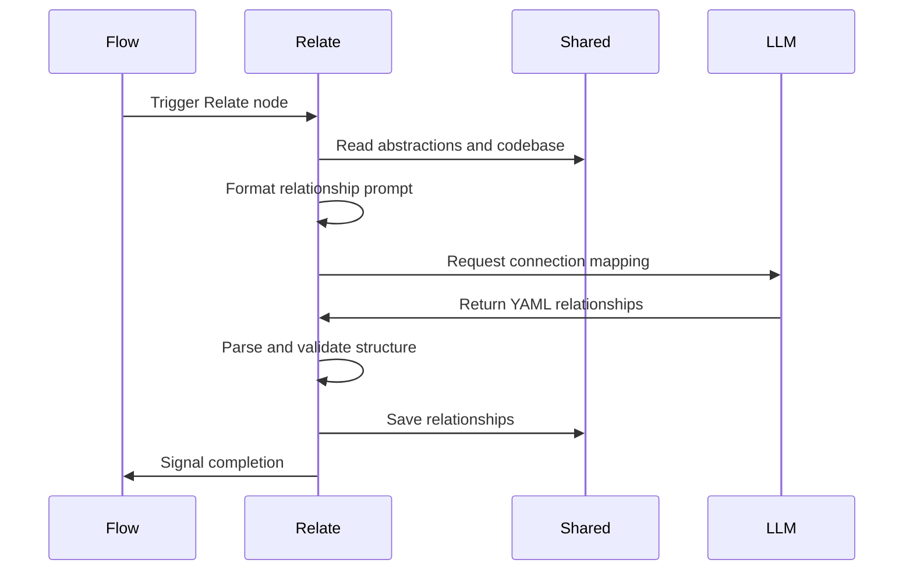

# Chapter 6: Relate

You have the glossary from [Analyze](05_analyze.md). You know the terms. But code isn't a dictionary. It's a living system.

A list of concepts tells you *what* exists, but not *how* it works together. What happens when a component updates state? Does the router care? Does the database trigger a notification? Without connections, your mental map is just a pile of islands.

You need to see the wires.

Enter **Relate**. It operates like a cartographer drawing bridges between those islands. It takes the isolated abstractions and maps the directional dependencies between them. The result is a set of labeled arrows that explain exactly how each idea supports, triggers, or relies on another.

## The Relationship Lifecycle

Like every station in the assembly line, Relate follows the [Node](02_node.md) routine to ensure reliable execution.

### 1. Prep: Gathering the Context

The `prep` phase reads the current state of the [shared](03_shared.md) clipboard. It needs two things: the list of abstractions (the nodes) and the raw code (the evidence). It formats these into a prompt that asks the model to find the connections.

```python
def prep(self, shared):
    listing = "\n".join(
        f"- {a['name']}: {a['description'].strip()}" for a in shared["abstractions"]
    )
    return load_prompt("analyze-relationships.md").format(
        abstractions=listing, codebase=shared["codebase"]
    )
```

Notice that Relate passes both the `abstractions` listing and the `codebase` to the model. The definitions help the model understand the vocabulary, while the code provides the concrete proof needed to infer accurate relationships.

### 2. Exec: Mapping the Connections

The `exec` phase sends the prompt to the language model. The model responds with a YAML structure containing the relationships. Each relationship typically includes a source, a target, and a label describing the interaction.

```python
def exec(self, prompt):
    return parse_yaml(call_llm(prompt))["relationships"]
```

The node relies on [parse_yaml](08_parse_yaml.md) to extract the structured data. If the model returns malformed YAML or forgets a code fence, the parser raises an error. Because Relate inherits from [Node](02_node.md) with `max_retries=3`, the pipeline automatically catches the error and retries, ensuring you get a valid list of relationships every time.

### 3. Post: Saving the Map

Once the relationships are extracted, the `post` phase updates the [shared](03_shared.md) clipboard.

```python
def post(self, shared, prep_res, exec_res):
    shared["relationships"] = exec_res
    print(f"  Found {len(exec_res)} relationships")
```

The clipboard now holds `relationships`, a list of edges ready for downstream use. This data enriches the pipeline's memory, turning the static glossary into a dynamic graph.

## The Relationship Flow

The diagram below shows how Relate orchestrates the mapping process. It reads the accumulated context, requests the connection map from the model, and saves the result for the final output.



## Why Relationships Matter

Relationships transform a list into a map. In the final output, this data powers the architecture diagram. The `main.py` script reads `shared["relationships"]` to draw labeled arrows between nodes in the Mermaid flowchart, giving the reader a visual overview of how the system hangs together.

By accumulating this data in [shared](03_shared.md), the pipeline ensures that the structural insights are available wherever they are needed. Even if a downstream step like [WriteChapters](07_writechapters.md) focuses on narrative, the relationships provide the backbone for a coherent tour.

## Summary

Relate bridges the gap between isolated concepts and system architecture. It extracts directional dependencies and dependency labels, turning a glossary into a connected graph. By leveraging the [Node](02_node.md) lifecycle, it handles retries and validation automatically, guaranteeing that the pipeline always produces a clean, usable map of relationships.

Now you have the concepts, the order, and the connections. You have the map. But a map isn't a guide. You need words. You need a tour. The next chapter, [WriteChapters](07_writechapters.md), takes all this structure and weaves it into a compelling narrative.