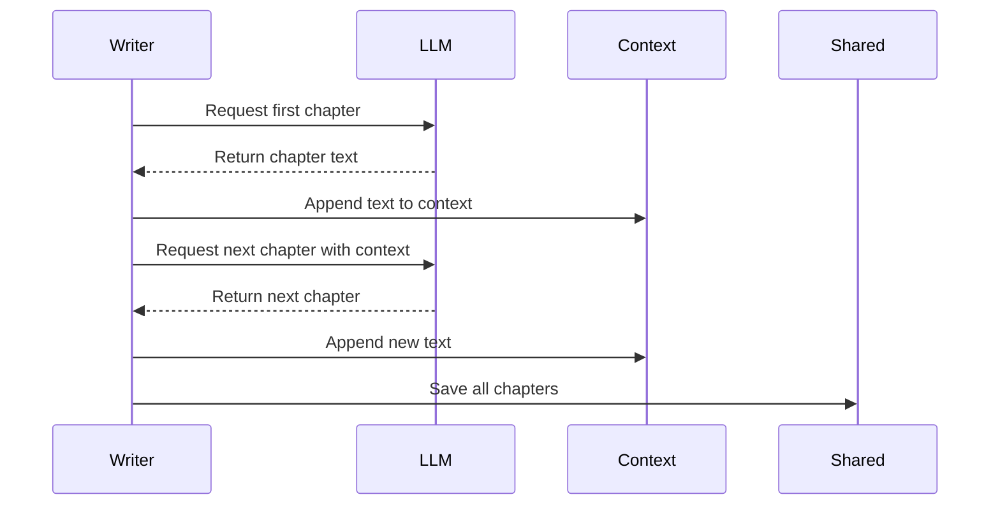

# Chapter 7: WriteChapters

What happens when you ask a language model to write a ten-chapter tutorial in a single prompt? The result is usually disjointed. The tone shifts halfway through, later chapters reference concepts that were never introduced, and the narrative feels like a pile of unrelated essays stapled together. You lose the thread.

To write a coherent guide, you need a sequential narrative. Every new section must remember what came before, building naturally on the previous foundation. You need an author who drafts the book page by page, carrying the memory of the story forward with every step.

Enter **WriteChapters**. It operates like a dedicated writer sitting at a desk, generating each chapter one by one. Instead of firing all requests in parallel, it loops through the outline, writes a chapter, saves it, and then feeds that text back as context for the next request. This ensures the tutorial reads as a unified whole, not a collection of isolated fragments.

## The Sequential Drafting Loop

Most pipeline steps process data in parallel or independently. **WriteChapters** breaks this pattern on purpose. If you generated chapters simultaneously, Chapter 8 might contradict Chapter 2, or the model might hallucinate cross-references to chapters that don't exist yet.

By enforcing a strict loop inside the [`exec`](02_node.md) method, the node guarantees order. It iterates through the learning sequence provided by [`Analyze`](05_analyze.md) and generates content step by step.

```python
def exec(self, ctx):
    prev_chapters = []
    for i, name in enumerate(ctx["order"]):
        prev = "\n\n---\n\n".join(prev_chapters)
        prompt = load_prompt("write-chapter.md").format(
            name=name, prev_chapters=prev, ...
        )
        content = call_llm(prompt)
        prev_chapters.append(content)
```

Notice the `prev_chapters` list. This is the writer's memory. Before requesting a new chapter, the node joins all previously written text with a separator and injects it into the prompt. The model sees exactly what has been written so far, allowing it to maintain continuity, avoid repetition, and link back to earlier ideas smoothly.

## The Context Backpack

As the loop progresses, the prompt grows. Chapter 1 is requested with an empty context. Chapter 2 carries Chapter 1. By Chapter 5, the prompt contains the full text of Chapters 1 through 4.

Think of this like a backpack. The author starts with an empty bag but adds a copy of every finished page before moving to the next. The bag gets heavier, and the context window fills up, but the reward is narrative coherence. The model can write "As we discussed in the first chapter..." because the first chapter is literally right there in the prompt.

The node also loads external instructions during [`prep`](02_node.md). This allows the same codebase to be toured through different lenses. A beginner tutorial focuses on simple analogies, while a security audit might highlight vulnerabilities. The `shared` dictionary provides the path to these instructions, and **WriteChapters** injects them into every prompt.

```python
def prep(self, shared):
    instructions = load_instructions(
        shared.get("instructions", "beginner-tutorial")
    )
    return {
        "codebase": shared["codebase"],
        "instructions": instructions,
        "order": shared["order"],
    }
```

## Why Not Parallel?

You might wonder why this node doesn't use a `BatchNode` to write chapters faster. Speed is tempting, but parallel execution destroys the narrative chain. If chapters are written simultaneously, they are blind to each other. They cannot reference previous content, and the tone may drift wildly between generations.

**WriteChapters** inherits from [`Node`](02_node.md), not `BatchNode`. This design choice trades throughput for quality. The loop inside `exec` forces serialization. Each chapter must be generated, parsed, and appended before the next one begins. This ensures that the tutorial flows logically, with each section acting as a bridge to the next.

## Saving the Tour

Once the loop completes, all chapters are collected into a list. The [`post`](02_node.md) method updates the [`shared`](03_shared.md) clipboard with the final results.

```python
def post(self, shared, prep_res, exec_res):
    shared["chapters"] = exec_res
    shared["filenames"] = prep_res["filenames"]
```

The `chapters` key now holds a list of dictionaries, each containing the chapter name, filename, and full markdown content. The `filenames` key maps abstraction names to file paths, which the rendering script uses to generate the final HTML files. At this point, the pipeline has transformed a raw repository into a complete, navigable tour.

## The Writing Flow

The diagram below shows how **WriteChapters** orchestrates the sequential drafting process. It requests chapters one by one, accumulates context, and saves the complete output at the end.



## Summary

**WriteChapters** bridges the gap between structure and narrative. It takes the abstractions, order, and codebase accumulated by previous steps and weaves them into a cohesive tutorial. By looping through chapters sequentially and feeding prior content back as context, it ensures the output reads like a single, continuous guide rather than disconnected pages.

Now you have the chapters written and saved on the clipboard. But you might notice that every step in this pipeline asks the model for structured data, like lists of file indices or abstraction names. What happens if the model returns messy text instead of clean YAML? The pipeline wouldn't survive without a strict validator to catch errors before they break the flow. That is the job of [`parse_yaml`](08_parse_yaml.md).