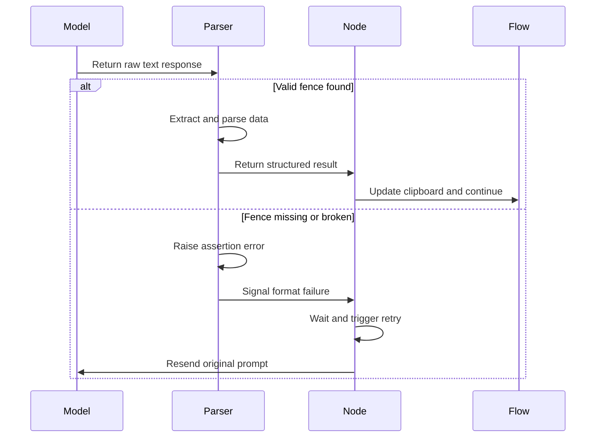

# Chapter 8: parse_yaml

What happens when you ask a language model to return a list of files, but it decides to add a polite greeting first? Or worse, it forgets the closing code fence and spills its answer into the next paragraph? If your pipeline tries to read that messy response as structured data, it crashes immediately. One malformed bracket breaks the entire assembly line.

You cannot trust the model to follow formatting rules on the first try. You need a bouncer at the door.

Enter **parse_yaml**. It acts like a strict quality control gatekeeper who only accepts properly stamped forms. If the handwriting is messy, the stamp is missing, or the ink is smudged, the form gets thrown back until it matches the exact template.

## The Strict Extractor

At its core, `parse_yaml` is a small function with a big responsibility. It sits between the raw text from the model and the structured data your pipeline expects.

```python
def parse_yaml(text):
    m = re.search(r"```yaml\s*\n(.*?)```", text, re.DOTALL)
    assert m, f"Missing code fence"
    return yaml.safe_load(m.group(1))
```

Notice how it refuses to guess. It uses a regular expression to hunt for the markdown code fence markers. If they are not there, the `assert` statement fires an error. If they are there, it hands the contents to `yaml.safe_load`, which safely converts the text into Python dictionaries and lists.

This function never tries to fix broken syntax. It does not attempt to parse JSON when YAML fails. It simply says no and stops.

## Triggering the Retry Loop

You might wonder why failing is a good thing. In this pipeline, failure is the fuel for reliability. Because `parse_yaml` raises an error on bad formatting, it triggers the built-in resilience of the [Node](02_node.md).

Every station that calls the model, like [SmartCrawl](04_smartcrawl.md) or [Analyze](05_analyze.md), inherits a retry mechanism. When `parse_yaml` throws an assertion error, the Node catches it, pauses for a few seconds, and asks the model to try again. This creates a silent feedback loop. The model receives a hard stop instead of partial data, learns that its format was rejected, and corrects itself on the next attempt.

## The Quality Control Flow

The diagram below shows how the gatekeeper interacts with the rest of the system. It validates the output before any data touches the [shared](03_shared.md) clipboard.



This loop ensures that downstream steps never have to write defensive code. [Relate](06_relate.md) does not check if its relationship list is empty. [WriteChapters](07_writechapters.md) does not handle missing abstraction names. The gatekeeper guarantees that only clean, validated structures move forward.

## Why Strictness Wins

Flexible parsers sound convenient, but they quietly accumulate technical debt. If your code tolerates slightly broken output today, the model will learn to produce consistently mediocre output tomorrow. It will find the path of least resistance and fill your results with conversational fluff, inconsistent keys, and hallucinated values.

By enforcing a rigid contract, `parse_yaml` forces the model to align with your pipeline expectations. It turns probabilistic generation into deterministic data. When the pipeline finally reaches the [shared](03_shared.md) clipboard, every key matches the prompt, every list is complete, and every diagram renders correctly.

## The Final Piece

You have now walked through every station on the assembly line. The [Flow](01_flow.md) orchestrates the sequence. The [Node](02_node.md) packages the work. The [shared](03_shared.md) dictionary carries the memory. [SmartCrawl](04_smartcrawl.md) finds the signal. [Analyze](05_analyze.md) maps the concepts. [Relate](06_relate.md) draws the connections. [WriteChapters](07_writechapters.md) weaves the narrative. And **parse_yaml** stands at the intersection of every model call, ensuring the data never breaks the chain.

You now have the full picture of how raw repositories transform into guided tours. When you run the pipeline next time, watch the retry counters climb and fall. Notice how the strict gatekeeper catches errors before they become dead ends. The magic is not in the model alone. It is in the structure that tames it. Now that you understand every gear in the machine, you are ready to point it at your own codebase and watch the assembly line build something remarkable.