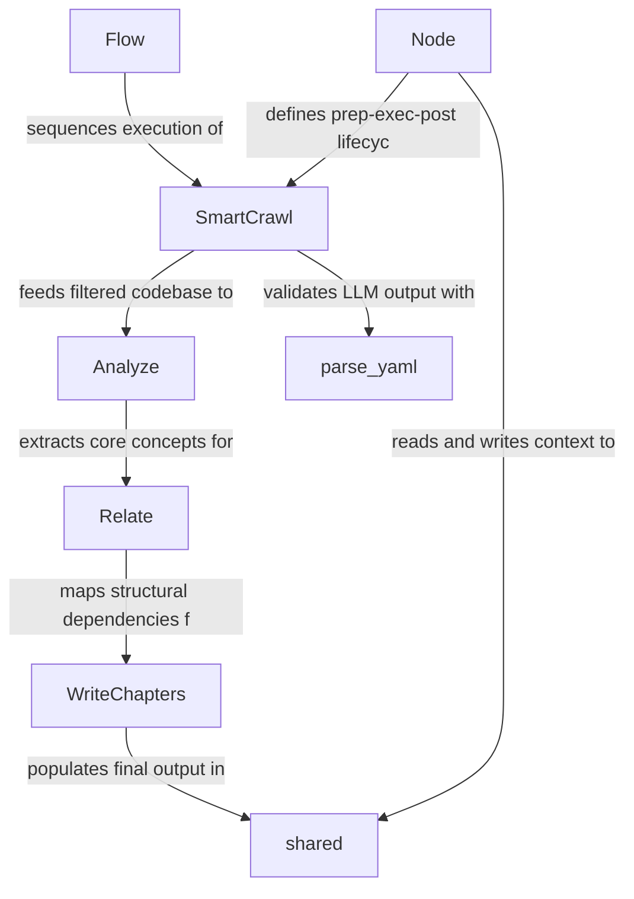

# workflow

_Lens: beginner-tutorial_

This project is an automated codebase documentation generator that uses an LLM-powered pipeline to analyze repositories and produce structured learning guides. It selects key files, extracts core concepts, maps their relationships, and sequentially writes formatted HTML tutorials.

## Architecture

## Chapters

- [Flow](01_flow.md)
- [Node](02_node.md)
- [shared](03_shared.md)
- [SmartCrawl](04_smartcrawl.md)
- [Analyze](05_analyze.md)
- [Relate](06_relate.md)
- [WriteChapters](07_writechapters.md)
- [parse_yaml](08_parse_yaml.md)