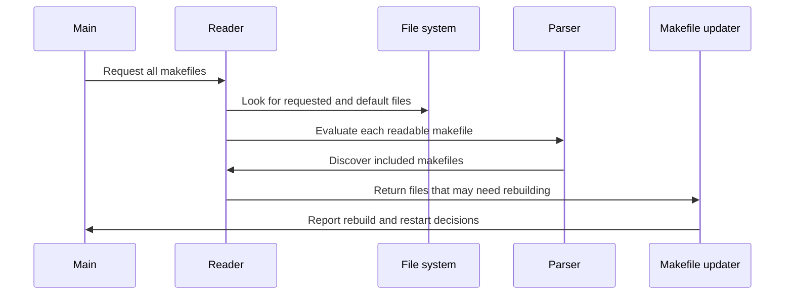

# Chapter 1: read_all_makefiles

Imagine starting a construction project with several instruction manuals on the table:

- one manual was named explicitly by the project manager,
- one is the standard manual found in the room,
- another is an optional supplement,
- and a missing supplement might need to be generated before it can be read.

GNU Make faces the same problem. Before it can decide whether a target is out of date, it must discover every relevant makefile, read them in the correct order, and combine their rules and variables into one internal build plan.

This is the job of `read_all_makefiles`.

> **Description:** This is the entry point for loading and interpreting makefiles. It finds explicit, default, included, and generated makefiles, then feeds their contents to the parser. Think of it as opening a collection of instruction manuals and combining their definitions into one build plan.

## Where the function fits

The entry point is declared in [`src/dep.h`](../src/dep.h):

```c
struct goaldep *read_all_makefiles (const char **makefiles);
```

Its implementation is in [`src/read.c`](../src/read.c):

```c
struct goaldep *
read_all_makefiles (const char **makefiles)
{
  unsigned int num_makefiles = 0;
```

The function accepts a null-terminated list of filenames. This list comes from `-f` command-line options. It returns a chain of `struct goaldep` objects describing makefiles that may need to be rebuilt.

The call happens in `main()`:

```c
read_files = read_all_makefiles
  (makefiles == 0 ? 0 : makefiles->list);
```

At this point, `main()` has already:

- parsed command-line options,
- loaded environment variables,
- changed to the requested `-C` directory,
- constructed the include search path,
- initialized variables and built-in data.

That preparation matters. For example, `read_all_makefiles()` must search for included files using the current directory and the include directories established by `construct_include_path()`.

## The high-level flow

The loading process looks like this:



The important idea is that reading and rebuilding are separate phases:

1. `read_all_makefiles()` discovers and reads what is currently available.
2. It also records missing makefiles that might be generated.
3. `main()` later calls [`update_goal_chain`](07_update_goal_chain.md) to try to rebuild them.
4. If a makefile changed, Make re-executes itself and reads everything again.

This is similar to reading a configuration file, discovering that an imported configuration file is generated, generating it, and then restarting configuration loading so the new settings take effect.

## First step: initialize `MAKEFILE_LIST`

The first action is:

```c
define_variable_cname ("MAKEFILE_LIST", "", o_file, 0);
```

`MAKEFILE_LIST` is a special make variable containing the makefiles that have been read. Each successful call to `eval_makefile()` appends another filename to it.

For example, if Make reads:

```make
# Makefile
include config.mk
```

then `MAKEFILE_LIST` eventually contains something like:

```text
Makefile config.mk
```

This variable is useful inside makefiles for inspecting the current loading history. It also helps Make distinguish “no makefile was found” from “a makefile was found but defined no targets.”

The variable itself is stored using the variable machinery described in [`struct variable`](02_struct_variable.md). Its value is not necessarily expanded immediately; normal make variable expansion rules still apply.

## Reading files from `MAKEFILES`

GNU Make has an environment or make variable named `MAKEFILES`. Its value is a list of additional files that should be read before the normal makefile.

The code expands that variable first:

```c
value = allocated_variable_expand ("$(MAKEFILES)");
p = value;
```

This is important because the value may contain references such as:

```make
MAKEFILES = $(HOME)/company.mk
```

The expansion uses the variable expansion system covered in [`variable_expand`](03_variable_expand.md).

The list is then split into filenames:

```c
while ((name = find_next_token
        ((const char **)&p, &length)) != 0)
  {
    if (*p != '\0')
      *p++ = '\0';
```

Each name is sent to `eval_makefile()` with three flags:

```c
eval_makefile (strcache_add (name),
               RM_NO_DEFAULT_GOAL
               | RM_INCLUDED
               | RM_DONTCARE);
```

These flags say:

- `RM_NO_DEFAULT_GOAL`: targets from this file must not become the default goal.
- `RM_INCLUDED`: search the include-file directories if the file is not in the current directory.
- `RM_DONTCARE`: do not treat a missing file as a fatal error.

Why is `MAKEFILES` treated this way? Think of it as a company-wide policy manual. It can define variables and rules, but it should not unexpectedly decide what the project’s main task is.

## Reading explicitly named makefiles

Next, `read_all_makefiles()` handles the filenames supplied with `-f`.

For example:

```sh
make -f common.mk -f platform.mk all
```

The `makefiles` array contains `common.mk` and `platform.mk`. The function reads each one:

```c
while (*makefiles != 0)
  {
    struct goaldep *d = eval_makefile (*makefiles, 0);
```

The zero flag means that an explicitly named makefile is:

- not an included file,
- allowed to establish the default goal,
- not automatically “optional.”

The function also checks `errno`:

```c
if (errno)
  perror_with_name ("", *makefiles);
```

A failed explicit makefile is different from a missing optional include. If the user explicitly requested `platform.mk`, Make should report a useful error instead of silently continuing.

Then the code updates the caller’s pointer:

```c
*makefiles = dep_name (d);
++num_makefiles;
++makefiles;
```

The `goaldep` entry owns the canonical filename stored by Make. Reusing that name ensures later stages see the same string that the file database uses.

## Choosing a default makefile

If the user did not provide any `-f` options, Make searches a platform-specific list of conventional names.

On a typical Unix-like system, the candidates are:

```text
GNUmakefile
makefile
Makefile
```

On Windows, the list also includes names such as `makefile.mak`.

The relevant branch is:

```c
if (num_makefiles == 0)
  {
    static const char *default_makefiles[] =
      { "GNUmakefile", "makefile", "Makefile", 0 };
```

Make checks the candidates in order:

```c
while (*p != 0 && !file_exists_p (*p))
  ++p;
```

This gives the names a priority. If both `GNUmakefile` and `Makefile` exist, `GNUmakefile` wins.

When a candidate exists, it is read normally:

```c
if (*p != 0)
  {
    eval_makefile (*p, 0);
```

Only one default makefile is selected. The search does not combine all matching conventional names.

This is like looking for a primary instruction manual: if the first preferred manual exists, you do not also open every lower-priority manual automatically.

## Recording missing default files

The more interesting case is when no default makefile exists.

Instead of immediately failing, Make adds every default candidate to the `read_files` chain:

```c
for (p = default_makefiles; *p != 0; ++p)
  {
    struct goaldep *d = alloc_goaldep ();
    d->file = enter_file (strcache_add (*p));
```

Each entry is marked as optional:

```c
d->flags = RM_DONTCARE;
d->next = read_files;
read_files = d;
```

Why record files that do not exist?

Because one of them might be generated by a rule. Consider this setup:

```make
# GNUmakefile is absent

GNUmakefile: generator.sh
	./generator.sh > GNUmakefile
```

The first invocation cannot read `GNUmakefile`, but it can still discover a rule capable of creating it if that rule is available through another source. By recording the candidate, Make gives the later update phase an opportunity to build it.

The `RM_DONTCARE` flag means failure to create one of these default candidates should not automatically produce a “Makefile not found” error. The user may have a project with no makefile at all, or the candidate may simply be irrelevant.

The `struct file` entry created by `enter_file()` is part of the file database discussed in [`struct file`](04_struct_file.md). The returned `goaldep` is a temporary “please consider this file” wrapper, not the same thing as the target’s complete rule record.

## What `eval_makefile()` does

`read_all_makefiles()` delegates the actual reading to the private helper `eval_makefile()`.

The helper creates a dependency record:

```c
deps = alloc_goaldep ();
deps->next = read_files;
read_files = deps;
```

Notice that it inserts at the front of the list. This means the internal `read_files` chain is built in reverse order.

For example, if Make reads:

```text
first.mk
second.mk
third.mk
```

the chain may temporarily be:

```text
third.mk -> second.mk -> first.mk
```

Later, `main()` reverses the chain before trying to rebuild makefiles, so rebuild attempts happen in the order the files were read.

That ordering is important. If `first.mk` defines a variable used to generate `second.mk`, Make must preserve the original reading relationship when it decides what to update.

## Opening and searching for the file

`eval_makefile()` attempts to open the requested name:

```c
errno = 0;
ENULLLOOP (ebuf.fp, fopen (filename, "r"));
deps->error = errno;
```

`ENULLLOOP` retries an operation interrupted by a signal. This is a small portability detail, but it prevents a temporary signal interruption from looking like a missing makefile.

For files marked `RM_INCLUDED`, a missing local file triggers a search through the include path:

```c
if (ebuf.fp == NULL && deps->error == ENOENT
    && include_directories
    && ANY_SET (flags, RM_INCLUDED))
```

The search constructs candidate names such as:

```text
/usr/local/include/config.mk
/usr/include/config.mk
```

The include directories come from:

- `-I` command-line options,
- standard installation directories,
- platform-specific defaults.

They were prepared earlier by `construct_include_path()`.

This distinction matters:

- an explicit `-f config.mk` normally means “open exactly this file”;
- an `include config.mk` directive means “open it here, or search the include path.”

## Canonicalizing the file record

After opening or failing to open the file, Make stores the final name in the string cache:

```c
filename = strcache_add (filename);
deps->file = lookup_file (filename);
```

If no existing file record is found, it creates one:

```c
if (deps->file == 0)
  deps->file = enter_file (filename);
```

The file is marked explicit:

```c
deps->file->is_explicit = 1;
```

This flag has consequences later during implicit rule search. A file mentioned as a makefile is not treated like an arbitrary intermediate file discovered by pattern matching.

The name is cached because many internal structures compare filenames repeatedly. The string cache acts like a shared label maker: rather than allocating a new copy of the same label everywhere, Make can reuse one canonical string.

## Evaluating the contents

If the file opened successfully, `eval_makefile()` adds it to `MAKEFILE_LIST`:

```c
do_variable_definition (&ebuf.floc, "MAKEFILE_LIST",
                        filename, o_file, f_append_value, 0);
```

It then prepares an input buffer:

```c
ebuf.size = 200;
ebuf.buffer = ebuf.bufnext = ebuf.bufstart = xmalloc (ebuf.size);
```

Finally, it establishes the current source location and invokes the parser:

```c
reading_file = &ebuf.floc;
eval (&ebuf, !(flags & RM_NO_DEFAULT_GOAL));
reading_file = curfile;
```

The second argument to `eval()` determines whether targets in this file may establish the default goal.

The parser in `eval()` reads logical lines, recognizes assignments, conditionals, includes, targets, prerequisites, and recipes, and records the resulting information in Make’s databases. The eventual target and prerequisite relationships are represented by the structures explained in [`struct dep`](05_struct_dep.md), [`struct rule`](06_struct_rule.md), and [`struct commands`](08_struct_commands.md).

The parser also handles nested include directives. When it encounters:

```make
include generated.mk
```

it calls `eval_makefile()` again. In other words, `read_all_makefiles()` begins the process, but the parser can expand the collection while it is walking through each manual.

## Included makefiles and generated makefiles

An included file uses flags assembled in the parser:

```c
unsigned short flags = (RM_INCLUDED | RM_NO_TILDE
                        | (noerror ? RM_DONTCARE : 0)
                        | (set_default ? 0 : RM_NO_DEFAULT_GOAL));
```

The meanings are:

- `RM_INCLUDED`: search the include path if necessary.
- `RM_NO_TILDE`: the parser already handled tilde expansion.
- `RM_DONTCARE`: used for `-include` and `sinclude`.
- `RM_NO_DEFAULT_GOAL`: prevents nested files from stealing the default goal when appropriate.

A normal `include` is expected to exist. A `-include` or `sinclude` file is optional:

```make
-include generated-config.mk
```

If `generated-config.mk` is missing, Make records it as a file that may need rebuilding, but does not immediately stop.

This is how generated dependency files commonly work:

```make
-include objects/main.d objects/util.d
```

The `.d` files may not exist during the first invocation. Make can read the rest of the project, discover rules for producing them, rebuild them, and then restart so the newly generated prerequisites become part of the build plan.

## The returned chain is not the goal list

A subtle but important point: `read_all_makefiles()` returns a `struct goaldep` chain, but these are not the user’s requested goals such as `all` or `install`.

They are the makefiles that may need to be updated before ordinary goals are built.

The distinction is:

- command-line targets are stored in the `goals` chain in `main.c`;
- makefiles to rebuild are returned through `read_files`;
- both chains use dependency-shaped structures, but they serve different phases.

This is why `main()` first handles the returned chain, possibly rebuilding and re-executing Make, and only afterward updates the user’s requested goals.

The update phase uses [`update_goal_chain`](07_update_goal_chain.md), which walks the makefile records just as it later walks ordinary target records. During this phase, Make temporarily sets `rebuilding_makefiles` so options such as `-n`, `-q`, and `-t` receive special treatment.

## Why Make re-executes itself

Suppose an included makefile is generated:

```make
-include config.mk

config.mk: config.in
	./configure-config < $< > $@
```

The first pass might proceed like this:

1. `read_all_makefiles()` reads the main makefile.
2. The parser notices `-include config.mk`.
3. `config.mk` is missing, so it is recorded as optional.
4. `main()` tries to update the recorded makefile.
5. The recipe creates `config.mk`.
6. Make notices that a makefile changed.
7. Make re-executes itself.
8. The second process reads the now-existing `config.mk`.
9. The new variables and rules affect the real build.

Re-execution is safer than trying to patch the parser’s state in place. It is like closing a program after installing a new plugin, then starting it again so every component sees the plugin from initialization onward.

The restart logic also preserves special command-line details, including temporary filenames used when standard input was supplied as a makefile. That preparation occurs in `main.c` before `read_all_makefiles()` is called.

## A compact mental model

You can remember `read_all_makefiles()` as a librarian with four shelves:

1. **Preloaded references**  
   Files from `MAKEFILES`, read first and not allowed to choose the default goal.

2. **Explicit requests**  
   Files named with `-f`, read exactly as requested and treated as required.

3. **Default candidates**  
   Conventional names such as `GNUmakefile` and `Makefile`, searched in priority order.

4. **Nested and generated references**  
   Files discovered through `include`, `-include`, or rules that can create missing makefiles.

For every readable file, the librarian:

- opens it,
- records its name in `MAKEFILE_LIST`,
- establishes source-location information,
- sends its contents to `eval()`,
- and lets the parser add variables, targets, prerequisites, and recipes to the shared build database.

For every missing but potentially useful file, the librarian leaves a note for the update phase.

## Key takeaways

- `read_all_makefiles()` is called once during startup from `main()`.
- It initializes `MAKEFILE_LIST`.
- It reads `MAKEFILES` entries before ordinary makefiles.
- Explicit `-f` files take precedence over default discovery.
- Default makefile names are searched in platform-specific order.
- Missing default and optional included files are recorded for possible rebuilding.
- `eval_makefile()` performs opening, include-path searching, bookkeeping, and parsing.
- Nested `include` directives call back into the same loading machinery.
- The returned chain describes makefiles to update, not ordinary build goals.
- If a makefile changes, Make re-executes itself and starts the loading process again.

Now that you understand how Make gathers the manuals, records their source, and combines their contents, the next question is: where do all those variable definitions live, and how does Make decide which definition wins? That is the subject of [struct variable](02_struct_variable.md).