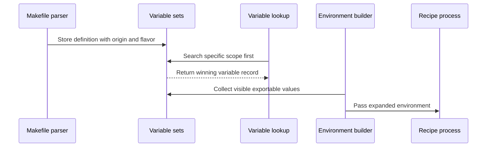

# Chapter 2: struct variable

What should happen when the same setting appears in several places?

For example, suppose `CC` is defined:

- in the process environment,
- in a built-in default,
- in a makefile,
- and on the command line.

Which compiler should Make use? And what if a target wants special compiler flags that should not affect any other target?

GNU Make answers these questions with a variable record. A variable is not just a string such as `gcc`. It is a labeled container that also remembers:

- its name,
- its value,
- how the value should be expanded,
- where it came from,
- where it was defined,
- whether it belongs to one target,
- and whether it should be exported to child processes.

The central record is `struct variable`, declared in [`src/variable.h`](../src/variable.h).

## The variable record

Here is the structure, split into its major parts:

```c
struct variable
  {
    char *name;
    char *value;
    floc fileinfo;
    unsigned int length;
```

The first fields describe the variable’s identity and source location:

- `name` is the variable name, such as `CC`.
- `value` is the stored text, such as `gcc`.
- `fileinfo` records the makefile and line where it was defined.
- `length` stores the name length.

The `floc` type was introduced in the previous chapter’s discussion of makefile reading. It contains a filename, line number, and offset. Keeping this information allows Make to produce messages such as:

```text
Makefile:12: warning: ...
```

Think of `fileinfo` as a label on a storage box saying which manual and page supplied its contents.

## Flags packed into the record

Several properties are stored as one-bit flags:

```c
    unsigned int recursive:1;
    unsigned int append:1;
    unsigned int conditional:1;
    unsigned int per_target:1;
    unsigned int special:1;
```

These flags mean:

- `recursive`: expand the value when it is used.
- `append`: this value came from an append operation.
- `conditional`: the variable was defined with `?=`.
- `per_target`: the variable belongs to a target-specific context.
- `special`: Make gives the variable special behavior.

More flags follow:

```c
    unsigned int exportable:1;
    unsigned int expanding:1;
    unsigned int private_var:1;
    unsigned int exp_count:EXP_COUNT_BITS;
```

They control:

- whether the name is suitable for an environment variable,
- whether the variable is currently being expanded,
- whether a target-specific value is hidden from inherited contexts,
- and how many self-referential expansions are temporarily allowed.

The final fields record the variable’s kind, origin, and export policy:

```c
    enum variable_flavor flavor ENUM_BITFIELD (3);
    enum variable_origin origin ENUM_BITFIELD (3);
    enum variable_export export ENUM_BITFIELD (2);
  };
```

Together, these fields let Make distinguish definitions that look similar to a user but behave differently internally.

## A variable’s flavor: when does expansion happen?

Consider these definitions:

```make
A = $(B)
B = hello
```

and:

```make
A := $(B)
B = hello
```

They look almost identical, but they do not mean the same thing.

With `=`, `A` stores the text `$(B)` and expands it later. With `:=`, Make expands `$(B)` immediately, while reading the assignment.

The `recursive` bit represents this distinction:

- `recursive = 1`: store the expression and expand it later.
- `recursive = 0`: store the already-expanded result.

The parser identifies the assignment operator in `parse_variable_definition()`:

```c
if (c == '=')
  {
    var->flavor = f_recursive;
    break;
  }
```

A simple assignment is recognized separately:

```c
if (c == '=')
  {
    var->flavor = f_simple;
    break;
  }
```

In the actual parser, the surrounding branch distinguishes `=` from `:=`, `::=`, and `:::=`. The important result is the flavor value passed to `do_variable_definition()`.

### Recursive variables

For a recursive definition:

```make
CFLAGS = $(WARN) -O2
```

Make stores the right-hand side largely as written. Later, when `$(CFLAGS)` is expanded, the current value of `WARN` is consulted.

This is like storing a recipe card containing “add whatever is currently in the WARN jar.” The result can change if `WARN` changes later.

In `do_variable_definition()`, recursive values use the `f_recursive` case:

```c
case f_recursive:
  newval = value;
  break;
```

The text is not expanded at definition time.

### Simple variables

For a simple definition:

```make
WARN = -Wall
CFLAGS := $(WARN) -O2
WARN = -Wextra
```

`CFLAGS` becomes `-Wall -O2`. It does not later acquire `-Wextra`.

The implementation expands the value immediately:

```c
case f_simple:
  newval = alloc_value = allocated_variable_expand (value);
  break;
```

This connects directly to the expansion machinery covered in [variable_expand](03_variable_expand.md). The variable record stores the result, rather than the original reference.

### POSIX expanded assignment

GNU Make also supports `:::=`, represented by `f_expand`. It expands the value immediately but stores it as a recursive value after protecting dollar signs.

That behavior is implemented here:

```c
case f_expand:
  {
    char *t = allocated_variable_expand (value);
    char *np = alloc_value = xmalloc (strlen (t) * 2 + 1);
```

The code then doubles each `$` before storing the result. This makes a later recursive expansion produce the intended dollar sign.

### Shell assignments

The `!=` operator runs the right-hand side through a shell:

```make
BUILD_HOST != hostname
```

The value returned by the shell becomes the variable’s value. The implementation expands the command, calls `shell_result()`, and changes the flavor to recursive:

```c
case f_shell:
  {
    char *q = allocated_variable_expand (value);
    alloc_value = shell_result (q);
    free (q);
    flavor = f_recursive;
```

This is more expensive than ordinary assignment because it starts a child process. It also means variable definition can have observable side effects while Make is reading the makefile.

## Origins establish precedence

A variable definition also records where it came from:

```c
enum variable_origin
  {
    o_default,
    o_env,
    o_file,
    o_env_override,
    o_command,
    o_override,
    o_automatic
  };
```

The numeric order is meaningful. Stronger origins have larger values. When a new definition is installed, `define_variable_in_set()` compares origins:

```c
if ((int) origin >= (int) v->origin)
  {
    free (v->value);
    v->value = xstrdup (value);
```

A new definition replaces the old one only when its origin is at least as strong.

The usual precedence, from weaker to stronger, is:

1. built-in default,
2. environment,
3. makefile,
4. environment with `-e`,
5. command line,
6. `override` directive,
7. automatic variables.

The exact behavior also depends on the option and context, but this ordering is the core idea.

Imagine several people writing on a bulletin board:

- a printed default notice is easy to replace;
- a makefile notice replaces the default;
- a command-line instruction is a direct request from the person running Make;
- an `override` directive explicitly says that the makefile should win.

### Environment definitions

In `main.c`, Make reads the process environment before reading makefiles:

```c
v = define_variable (envp[i], len, ep, o_env, 1);
```

The final argument, `1`, marks the value as recursively expanded.

For example, if the shell starts Make with:

```sh
CC=clang make
```

Make initially records `CC` with origin `o_env`.

### Command-line definitions

A command-line assignment such as:

```sh
make CC=clang
```

is parsed by `handle_non_switch_argument()`:

```c
v = try_variable_definition (0, arg, origin, 0);
```

When `origin` is `o_command`, the resulting variable is stronger than an ordinary makefile definition.

Thus this makefile:

```make
CC = gcc
```

does not normally replace:

```sh
make CC=clang
```

The command line acts like a sealed instruction attached to the build request.

### The `override` directive

A makefile can deliberately take precedence:

```make
override CFLAGS += -fno-common
```

The parser recognizes the `override` modifier and selects `o_override`:

```c
enum variable_origin origin =
  vmod.override_v ? o_override : o_file;
```

This is an explicit escalation. It is useful when a project requires a setting even if callers supplied a command-line value.

## Conditional definitions

The `?=` operator defines a variable only if no definition is visible:

```make
CFLAGS ?= -O2
```

The implementation first searches for an existing variable:

```c
case f_conditional:
  v = lookup_variable (varname, strlen (varname));
  if (v)
    goto done;
```

If one exists, the new assignment is skipped. Otherwise, the variable is treated like a recursive definition.

This is similar to filling an empty labeled container only if nobody has already placed something in it. Importantly, an existing variable with an empty value still counts as defined:

```make
CFLAGS =
CFLAGS ?= -O2
```

The second line does not assign `-O2`.

## Appending values

The `+=` operator combines an old value and a new value:

```make
CFLAGS = -O2
CFLAGS += -Wall
```

The result is conceptually:

```text
-O2 -Wall
```

The implementation handles this through `f_append` and `f_append_value`:

```c
case f_append:
case f_append_value:
  {
    if (target_var)
      {
        append = 1;
        v = lookup_variable_in_set (varname, strlen (varname),
                                    current_variable_set_list->set);
```

For ordinary global variables, Make looks up the visible variable. For target-specific variables, it first looks in the target’s own variable set. This distinction prevents an append in one target context from accidentally modifying a global value.

If the old variable was recursive, Make preserves the unexpanded expressions. If it was simple, Make combines the already-expanded old value with the appropriate form of the new value.

That is why these can differ:

```make
A = $(B)
A += $(C)
```

versus:

```make
A := $(B)
A += $(C)
```

The first keeps deferred expressions. The second starts with an already-expanded value.

For a recursively appended variable, expansion has special handling in `expand.c`. The helper `variable_append()` walks through the variable-set chain, collecting appended pieces in order.

This is like assembling a stack of labels from the most general shelf to the most specific shelf, then reading the complete list from bottom to top.

## Where variables are stored

Make does not keep every variable in one flat list. It uses hash tables grouped into variable sets.

The set structure is small:

```c
struct variable_set
  {
    struct hash_table table;
  };
```

The hash table maps a variable name to its `struct variable`.

A linked list connects sets together:

```c
struct variable_set_list
  {
    struct variable_set_list *next;
    struct variable_set *set;
    int next_is_parent;
  };
```

The global variables are represented by a global set list:

```c
static struct variable_set global_variable_set;
static struct variable_set_list global_setlist
  = { 0, &global_variable_set, 0 };
```

The pointer `current_variable_set_list` identifies the context in which definitions are currently being made.

Think of this as a series of bulletin boards:

```text
most specific board
        ↓
target board
        ↓
parent target board
        ↓
global board
```

A lookup starts at the top and stops at the first matching name.

## Looking up a variable

`lookup_variable()` walks the current set list:

```c
for (setlist = current_variable_set_list;
     setlist != 0; setlist = setlist->next)
  {
    const struct variable_set *set = setlist->set;
    struct variable *v;
```

It searches each hash table:

```c
v = hash_find_item ((struct hash_table *) &set->table, &var_key);
if (v && (!is_parent || !v->private_var))
  return v;
```

The first matching record wins. This is the data-structure form of precedence by scope.

If the record is marked `special`, lookup calls `lookup_special_var()`. Special variables include introspection variables such as `.VARIABLES`, whose value is rebuilt when the global variable database changes.

The expansion path eventually uses this same lookup. In `expand.c`, `reference_variable()` finds the record and then chooses whether to expand its value:

```c
value = (v->recursive ? recursively_expand (v) : v->value);
```

So `struct variable` is the bridge between parsing and expansion:

```text
makefile assignment
        ↓
struct variable
        ↓
variable lookup
        ↓
recursive or direct expansion
```

## Target-specific variables

A target-specific variable applies only while building one target and its prerequisites:

```make
debug.o: CFLAGS += -DDEBUG
```

The parser cannot treat this like an ordinary global assignment because the text before the colon is a target name. `eval()` detects the target-specific form and calls:

```c
record_target_var (filenames, p2,
                   vmod.override_v ? o_override : o_file,
                   &vmod, fstart);
```

For each target, `record_target_var()` finds or creates a `struct file`, initializes its variable sets, and temporarily switches the current context:

```c
initialize_file_variables (f, 1);
current_variable_set_list = f->variables;
v = try_variable_definition (flocp, defn, origin, 1);
current_variable_set_list = global;
```

The resulting variable is marked:

```c
v->per_target = 1;
```

Later, when Make prepares a recipe, `variable_expand_for_file()` temporarily uses that file’s variable chain:

```c
savev = current_variable_set_list;
current_variable_set_list = file->variables;
```

The recipe therefore sees the target-specific value, while an unrelated target continues to see the global value.

### Inheritance through prerequisites

Target-specific values are inherited by prerequisites by default. For example:

```make
app: CFLAGS += -DAPP
app: main.o
```

When Make builds `main.o` as part of `app`, the `CFLAGS` context can include `-DAPP`.

The `next_is_parent` field in `struct variable_set_list` records this relationship. `initialize_file_variables()` connects a file’s set list to either:

- its parent target’s variables, or
- the global set list.

This is why a target-specific variable behaves more like a context passed down a dependency tree than like a value attached only to one filename.

### Private target-specific variables

A target-specific variable can be marked `private`:

```make
app: private CFLAGS += -DAPP_ONLY
```

The parser records this with:

```c
if (vmod->private_v)
  v->private_var = 1;
```

When a lookup crosses into a parent context, `private_var` prevents the value from being inherited.

The analogy is a private note on a parent’s work order. The parent can read it, but it is not copied onto every worker’s work order.

## Pattern-specific variables

The same idea applies to patterns:

```make
lib/%.o: CFLAGS += -fPIC
```

Because the target contains `%`, `record_target_var()` creates a `struct pattern_var`:

```c
p = create_pattern_var (name, percent);
p->variable.fileinfo = *flocp;
v = assign_variable_definition (&p->variable, defn);
```

Pattern variables are kept in a separate chain. `create_pattern_var()` inserts them in pattern-length order so that more specific matches can take priority.

When Make later initializes variables for a concrete target, `initialize_file_variables()` searches the pattern-variable list and copies matching definitions into a target-specific set.

This delays pattern matching until Make knows the actual target name. It is like storing a rule saying “all workers assigned to the library department receive this badge,” then applying it when a specific worker arrives.

## The `private_var` and inheritance check

The lookup code tracks whether it is crossing a parent boundary:

```c
is_parent |= setlist->next_is_parent;
```

Once `is_parent` becomes true, private variables are skipped:

```c
if (v && (!is_parent || !v->private_var))
  return v;
```

The condition is compact, but the intent is simple:

- in the current target’s own set, a private variable is visible;
- in a parent set, a private variable is hidden.

This is one reason the variable system uses a linked list of sets instead of copying every inherited variable into every target.

## Exporting variables to recipes

Make variables and shell environment variables are related, but they are not the same storage.

A make variable such as:

```make
CC = clang
```

is available to Make’s expansion engine. It is not automatically placed in the environment of every recipe.

The `export` field controls this:

```c
enum variable_export
{
  v_default,
  v_export,
  v_noexport,
  v_ifset
};
```

The values mean:

- `v_default`: use normal export rules.
- `v_export`: always export.
- `v_noexport`: never export.
- `v_ifset`: export if the variable has a non-default value.

The parser handles directives such as:

```make
export CC
unexport SECRET
```

For an explicit assignment, `parse_var_assignment()` records the modifier, and `eval()` applies it:

```c
if (vmod.export_v != v_default)
  v->export = vmod.export_v;
```

A bare directive applies globally:

```make
export
```

or:

```make
unexport
```

The parser changes the global `export_all_variables` setting for these forms.

## Building a child environment

When Make starts a recipe, `commands.c` eventually requests an environment through `target_environment()`.

That function walks variable sets from most specific to least specific:

```c
for (s = set_list; s != 0; s = s->next)
  {
    struct variable_set *set = s->set;
    const int islocal = s == set_list;
```

The first occurrence of a variable is retained. This ensures a target-specific value can override a global value in the child environment.

The function then tests whether each variable should be exported:

```c
if (! should_export (v))
  continue;
```

Recursive variables are expanded before being converted into environment strings:

```c
if (v->recursive
    && (v->origin != o_env && v->origin != o_env_override))
  value = cp = recursively_expand_for_file (v, file);
```

Finally, Make creates strings in the form:

```text
NAME=value
```

Those strings are passed to the child process. The child sees an environment snapshot, not a pointer to Make’s internal `struct variable`.

The flow is:



## Why `SHELL` is special

`SHELL` demonstrates why a variable record needs more than a value.

On Unix-like systems, Make reads `SHELL` from the environment but generally does not allow a makefile’s `SHELL` assignment to replace the shell used by Make itself in the same way ordinary variables work. The code preserves the original environment value in `shell_var`.

At the same time, Make’s recipe environment may still be constructed according to its own export rules.

On Windows, setting `SHELL` also triggers shell discovery. In `do_variable_definition()`, the Windows-specific path checks whether the requested shell can be found and may replace the stored value with the discovered executable path.

Thus a `struct variable` can be involved in:

- Make-language expansion,
- process environment construction,
- shell selection,
- platform-specific path conversion.

The record remains the common control point, while platform code supplies the special behavior.

## Automatic variables use the same machinery

Automatic variables such as `$@`, `$<`, `$^`, and `$*` are not handled by a separate expansion system. Before a recipe runs, `set_file_variables()` defines them in the target’s variable set:

```c
DEFINE_VARIABLE ("<", 1, less);
DEFINE_VARIABLE ("*", 1, star);
DEFINE_VARIABLE ("@", 1, at);
DEFINE_VARIABLE ("%", 1, percent);
```

These records use origin `o_automatic`:

```c
define_variable_for_file (name, len, value,
                          o_automatic, 0, file)
```

The `o_automatic` origin is stronger than ordinary user definitions, which prevents a makefile from casually replacing Make’s current target information.

For example, when building `obj/main.o`, Make may create records whose values are conceptually:

```text
@ = obj/main.o
< = main.c
* = main
```

The same `lookup_variable()` and `variable_expand_for_file()` functions then make these values available to recipe expansion.

## Recursive expansion and cycle detection

Recursive variables can refer to one another:

```make
A = $(B)
B = $(A)
```

Without protection, expanding `A` would loop forever.

`recursively_expand_for_file()` uses fields in `struct variable` to detect this:

```c
if (v->expanding)
  {
    if (!v->exp_count)
      OS (fatal, *expanding_var,
          _("Recursive variable '%s' references itself (eventually)"),
          v->name);
```

Before expanding the value, it marks the variable:

```c
v->expanding = 1;
value = allocated_variable_expand (v->value);
v->expanding = 0;
```

The `expanding` bit is therefore a small “currently in progress” sign. It is like putting a temporary marker on a folder while opening it; if opening the same folder leads back to itself, Make can report a cycle instead of wandering forever.

`exp_count` permits controlled self-reference for special cases such as nested `call` operations. Normally, an uncontrolled recursive loop produces a fatal diagnostic.

## Definition locations and diagnostics

When Make reads a makefile assignment, `try_variable_definition()` receives the current `floc`:

```c
vp = do_variable_definition (flocp, v.name, v.value,
                             origin, v.flavor, target_var);
```

`define_variable_in_set()` copies that location into the record:

```c
if (flocp != 0)
  v->fileinfo = *flocp;
```

Later, the variable database printer uses it:

```c
if (v->fileinfo.filenm)
  printf (_(" (from '%s', line %lu)"),
          v->fileinfo.filenm,
          v->fileinfo.lineno + v->fileinfo.offset);
```

This is especially useful with:

```sh
make -p
```

The output can show whether a variable came from:

- the environment,
- a built-in default,
- a makefile,
- the command line,
- or an `override` directive.

It also shows whether the variable is recursive, appended, private, or automatic.

## How to inspect variables from a makefile

GNU Make provides the `origin` and `flavor` functions:

```make
$(info CC origin: $(origin CC))
$(info CC flavor: $(flavor CC))
```

For a command-line definition, the result might be:

```text
CC origin: command line
CC flavor: recursive
```

The implementations in `function.c` simply look up the variable record and inspect its fields:

```c
struct variable *v = lookup_variable (argv[0], strlen (argv[0]));
```

The `origin` function maps `v->origin` to text such as `file`, `environment`, or `command line`.

The `flavor` function checks the `recursive` flag:

```c
if (v->recursive)
  o = variable_buffer_output (o, "recursive", 9);
else
  o = variable_buffer_output (o, "simple", 6);
```

These functions are useful when a build behaves unexpectedly. Instead of guessing which definition won, ask Make directly.

## A complete precedence example

Suppose the environment contains:

```sh
CC=clang
```

The command line says:

```sh
make CC=gcc
```

The makefile contains:

```make
CC = cc
override CFLAGS += -O2
```

The sequence is:

1. `main()` imports `CC=clang` with origin `o_env`.
2. Command-line parsing defines `CC=gcc` with origin `o_command`.
3. The makefile defines `CC=cc` with origin `o_file`.
4. `define_variable_in_set()` refuses to replace the command-line value with the weaker makefile value.
5. `override CFLAGS += -O2` uses origin `o_override`, so it can supersede a command-line `CFLAGS` value.
6. Recipe expansion sees `CC=gcc`.
7. The child environment receives the variables that pass export checks.

This is the important mental model:

```text
The last definition does not automatically win.
The strongest applicable definition wins.
```

## Putting the pieces together

A variable definition travels through Make like this:

```text
text in a makefile
        ↓
parse assignment operator
        ↓
choose flavor and origin
        ↓
store struct variable in a hash table
        ↓
select a visible variable set
        ↓
expand immediately or later
        ↓
optionally export to a recipe
```

Different parts of the code handle different stages:

- [`src/read.c`](../src/read.c) recognizes assignments and target-specific syntax.
- [`src/variable.c`](../src/variable.c) stores definitions, compares origins, manages scopes, and builds environments.
- [`src/expand.c`](../src/expand.c) expands recursive values and detects cycles.
- [`src/function.c`](../src/function.c) exposes variable metadata through `origin` and `flavor`.
- [`src/commands.c`](../src/commands.c) creates automatic variables for a target.
- [`src/main.c`](../src/main.c) imports environment variables and records command-line definitions.

The `struct variable` record is the shared ledger connecting all of them.

## Key takeaways

- A Make variable stores much more than a name and string value.
- `recursive` controls whether the value is expanded when used.
- `flavor` distinguishes `=`, `:=`, `+=`, `?=`, `!=`, and related assignments.
- `origin` controls precedence between defaults, environments, makefiles, command lines, and overrides.
- Variables live in hash-table-backed variable sets.
- A linked set list provides global, target-specific, parent, pattern-specific, and temporary scopes.
- Target-specific variables can be inherited or marked `private`.
- Pattern-specific variables are applied when a concrete target matches a pattern.
- Export settings determine which variables enter a recipe’s environment.
- Automatic variables use the same variable machinery as ordinary variables.
- Expansion state prevents uncontrolled recursive loops.
- `origin`, `flavor`, and `make -p` help diagnose which definition Make selected.

Now that you understand how Make stores variable records, chooses between competing definitions, and builds target-specific contexts, the next question is how those stored values are actually expanded into text. That is the subject of [variable_expand](03_variable_expand.md).