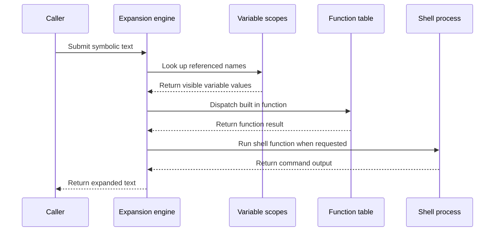

# Chapter 3: variable_expand

What should happen when a makefile says:

```make
CC = gcc
program: main.o
	$(CC) -o $@ $^
```

The recipe is not ready to run when Make first reads it. `$(CC)`, `$@`, and `$^` are symbolic instructions. Make must resolve them at the right time, in the right variable scope, and with the right rules for functions, substitutions, and escaped dollar signs.

This is the job of `variable_expand`.

> **Description:** This engine replaces references such as `$(CC)`, evaluates built-in functions, performs substitutions, and can invoke shell commands. It is the language interpreter inside Make. Like a spreadsheet calculating formulas, it turns symbolic text into the concrete strings needed for prerequisites, recipes, and environments.

The previous chapter explained how definitions are stored in [`struct variable`](02_struct_variable.md). This chapter follows those definitions as they become text.

## Where expansion fits

The main expansion API is declared in [`src/variable.h`](../src/variable.h):

```c
char *variable_expand (const char *line);
char *variable_expand_for_file (const char *line,
                                struct file *file);
char *variable_expand_string (char *line,
                              const char *string,
                              size_t length);
```

There are three closely related entry points:

- `variable_expand()` expands text using the current variable context.
- `variable_expand_for_file()` expands text using a target’s variables.
- `variable_expand_string()` performs the actual scanning and writes into Make’s expansion buffer.

A useful mental model is a printing press:

1. The input is a page containing symbolic marks such as `$(CC)`.
2. The expansion engine reads the page from left to right.
3. It looks up each mark or function.
4. It prints the resulting characters into an output buffer.
5. The returned page is valid until another expansion reuses the press.

The output is therefore usually temporary. Callers that need to keep it use an allocating wrapper such as:

```c
char *allocated_variable_expand_for_file
  (const char *line, struct file *file);
```

The macro in `variable.h` provides the common global-context form:

```c
#define allocated_variable_expand(line) \
  allocated_variable_expand_for_file (line, (struct file *) 0)
```

## The expansion pipeline

Expansion occurs in many parts of Make:

- `read_all_makefiles()` expands `MAKEFILES` before reading those files.
- The parser expands `include` filenames.
- Dependency processing expands prerequisites.
- Recipe execution expands command lines.
- Environment construction expands exported recursive variables.
- Built-in functions expand their arguments.
- The `eval` function sends expanded text back to the makefile parser.

The broad flow looks like this:



The expansion engine is not itself the build scheduler. It does not decide whether a target is out of date; that work belongs to the file and dependency machinery described later in [`struct file`](04_struct_file.md) and [`struct dep`](05_struct_dep.md). Expansion prepares the strings those systems consume.

## The shared variable buffer

Most expansion output is written into a global buffer named `variable_buffer`:

```c
static size_t variable_buffer_length;
char *variable_buffer;
```

The buffer is initialized early in `main()`:

```c
initialize_variable_output ();
```

The initialization function allocates an initial region:

```c
if (variable_buffer == 0)
  {
    variable_buffer_length = 200;
    variable_buffer = xmalloc (variable_buffer_length);
```

The buffer grows when necessary. `variable_buffer_output()` receives a destination pointer, copies characters into the buffer, and returns the next free position.

This is like a reusable clipboard. Every expansion writes onto the same clipboard instead of allocating a new clipboard for every short note.

That reuse is efficient, but it creates an important rule:

> The result of `variable_expand()` is temporary and may be overwritten by the next expansion.

For example, this is unsafe:

```c
char *a = variable_expand ("$(A)");
char *b = variable_expand ("$(B)");
```

After the second call, `a` may point into the same buffer now containing the expansion of `$(B)`.

When a caller needs independent storage, it uses `allocated_variable_expand_for_file()`. That function temporarily replaces the active buffer, performs expansion, and returns a separately allocated result:

```c
char *obuf = variable_buffer;
size_t olen = variable_buffer_length;

variable_buffer = 0;
value = variable_expand_for_file (line, file);
```

It then restores the original buffer:

```c
variable_buffer = obuf;
variable_buffer_length = olen;
return value;
```

This is like temporarily putting the shared clipboard aside, writing on a fresh sheet, and then restoring the clipboard for the caller.

## Scanning ordinary text

The main scanner is `variable_expand_string()`. It first copies the input:

```c
save = length == SIZE_MAX ? xstrdup (string)
                          : xstrndup (string, length);
p = save;
```

The copy protects expansion from changes caused by functions such as `eval`, which can redefine variables while the current string is being processed.

The scanner copies ordinary characters in chunks:

```c
p1 = strchr (p, '$');

o = variable_buffer_output
  (o, p, p1 != 0 ? (size_t) (p1 - p) : strlen (p) + 1);
```

If there is no dollar sign, the remaining text is copied directly. If there is one, the scanner dispatches based on the next character.

The simplest cases are dollar signs:

```c
case '$':
case '\0':
  o = variable_buffer_output (o, p1, 1);
  break;
```

This makes:

```make
literal = $$HOME
```

expand to:

```text
$HOME
```

A dollar sign followed by an ordinary character is a one-character variable reference:

```make
$(info compiler is $CC)
```

`$C` and `$(C)` refer to the same one-character variable name. The code handles this through `reference_variable()`.

A dollar sign followed by whitespace has no useful variable name, so the scanner leaves it alone.

## Looking up a simple variable

`reference_variable()` connects expansion to the variable records described in [`struct variable`](02_struct_variable.md):

```c
v = lookup_variable (name, length);

if (v == 0)
  warn_undefined (name, length);
```

If the variable is absent, Make normally expands it to an empty string. With `--warn-undefined-variables`, the lookup also produces a warning.

If the variable exists, the engine chooses between direct and recursive expansion:

```c
value = (v->recursive
         ? recursively_expand (v)
         : v->value);
```

A simple variable already contains its final value:

```make
CFLAGS := -O2
```

So the stored `v->value` can be copied directly.

A recursive variable contains another expression:

```make
CFLAGS = $(WARN) -O2
```

So Make calls `recursively_expand()` to interpret that expression now.

The result is appended to the output buffer:

```c
o = variable_buffer_output (o, value, strlen (value));

if (v->recursive)
  free (value);
```

The temporary result of recursive expansion is freed after being copied.

## Recursive expansion and cycles

Recursive variables are powerful because their references are delayed:

```make
MESSAGE = hello
GREETING = $(MESSAGE), world
MESSAGE = goodbye
```

When `$(GREETING)` is expanded, the result is:

```text
goodbye, world
```

The current value of `MESSAGE` is consulted at use time.

But delayed evaluation can create a loop:

```make
A = $(B)
B = $(A)
```

`recursively_expand_for_file()` marks a variable while it is being expanded:

```c
if (v->expanding)
  {
    if (!v->exp_count)
      OS (fatal, *expanding_var,
          _("Recursive variable '%s' references itself (eventually)"),
          v->name);
```

Then it sets the marker before recursively expanding:

```c
v->expanding = 1;
value = allocated_variable_expand (v->value);
v->expanding = 0;
```

The `expanding` bit is like a “currently visiting” sign on a folder. If opening folder `A` leads to folder `B`, which leads back to `A`, Make detects the loop rather than recursing forever.

The `exp_count` field supports controlled self-reference used by functions such as `call`. Ordinary cyclic variables have no remaining expansion allowance and produce a fatal diagnostic.

## Nested variable names

Variable names can themselves contain references:

```make
tool = CC
CC = clang

result = $($(tool))
```

To expand `$($(tool))`, Make must:

1. Expand `$(tool)` to `CC`.
2. Use the result `CC` as the name of another variable.
3. Look up `CC`.
4. Produce `clang`.

The scanner detects a dollar sign inside a parenthesized reference:

```c
p1 = lindex (beg, end, '$');
if (p1 != 0)
  {
    abeg = expand_argument (beg, p);
    beg = abeg;
    end = strchr (beg, '\0');
  }
```

`expand_argument()` expands the inner name without destroying the surrounding expansion buffer.

This is similar to looking up a contact using a contact name that was itself retrieved from another address book.

Nested names are useful for tables of settings:

```make
mode = debug
CFLAGS_debug = -g
CFLAGS_release = -O2

CFLAGS = $(CFLAGS_$(mode))
```

The expansion engine does not need a special table feature. Nested variable references provide the indirection.

## Substitution references

Make supports a compact substitution form:

```make
objects = main.o util.o
sources = $(objects:.o=.c)
```

The result is:

```text
main.c util.c
```

When the scanner finds a colon inside a reference, it treats the expression as a possible substitution:

```c
colon = lindex (beg, end, ':');
if (colon)
  {
    const char *subst_beg = colon + 1;
    const char *subst_end = lindex (subst_beg, end, '=');
```

The part before the colon is the variable name. The text between the colon and equals sign is the old suffix or pattern. The text after the equals sign is the replacement.

The engine looks up the source variable:

```c
v = lookup_variable (beg, colon - beg);
```

It then expands that variable if necessary:

```c
char *value = (v->recursive
               ? recursively_expand (v)
               : v->value);
```

Finally, it calls `patsubst_expand_pat()` to perform the replacement.

The implementation represents a suffix substitution as a pattern substitution internally. It adds a temporary `%` to both sides when needed, so the same matching machinery can handle:

- literal suffix changes such as `.o` to `.c`,
- pattern changes such as `src/%.c` to `build/%.o`.

The larger substitution functions are implemented in [`src/function.c`](../src/function.c), alongside functions such as `subst` and `patsubst`.

## Built-in functions

A reference such as:

```make
$(patsubst %.c,%.o,$(SOURCES))
```

looks like an ordinary variable reference because it begins with `$(`. Before treating it as a variable name, `variable_expand_string()` asks `handle_function()` whether the contents name a built-in function:

```c
op = o;
begp = p;
if (handle_function (&op, &begp))
  {
    o = op;
    p = begp;
    break;
  }
```

The function table is initialized by `hash_init_function_table()` in `main.c`. Each entry records:

- the function name,
- its minimum and maximum argument counts,
- whether arguments should be expanded first,
- and the C function that implements it.

For example, the table contains entries like:

```c
FT_ENTRY ("patsubst", 3, 3, 1, func_patsubst),
FT_ENTRY ("shell",   0, 1, 1, func_shell),
FT_ENTRY ("eval",    0, 1, 1, func_eval),
```

`handle_function()` identifies the function name and finds its closing parenthesis while respecting nested references:

```c
entry_p = lookup_function (beg);

if (!entry_p)
  return 0;
```

It then splits the comma-separated arguments. Nested parentheses are counted, so this works:

```make
$(if $(filter %.c,$(file)),yes,no)
```

For functions marked `expand_args`, each argument is expanded before the C implementation receives it. This is appropriate for functions such as `subst`, `filter`, and `patsubst`.

Some functions deliberately delay argument expansion. `foreach`, `let`, `if`, `and`, and `or` need control over which parts are evaluated and when. For example:

```make
$(if $(READY),$(shell expensive-command),)
```

Only the selected branch is expanded. This lets `if` avoid running the shell command when `READY` is empty.

## Function results use the same output buffer

A built-in function receives an output pointer and appends its result:

```c
static char *
func_patsubst (char *o, char **argv,
                const char *funcname UNUSED)
{
  return patsubst_expand (o, argv[2], argv[0], argv[1]);
}
```

Functions do not normally return a separate string. They write into `variable_buffer`, just like ordinary variable references.

Simple text functions such as `words`, `firstword`, and `strip` scan their arguments and call `variable_buffer_output()` for their results.

This design allows nested functions to compose efficiently:

```make
$(addprefix build/,$(notdir $(SOURCES)))
```

The inner `notdir` writes its result into the buffer, and the outer `addprefix` continues processing the resulting text.

## The `value` function: inspect without expanding

Most variable references interpret the variable’s value. The `value` function does not:

```make
A = $(B)
B = hello

$(info normal: $(A))
$(info raw: $(value A))
```

The output is conceptually:

```text
normal: hello
raw: $(B)
```

Its implementation looks up the variable and copies `v->value` directly:

```c
struct variable *v = lookup_variable
  (argv[0], strlen (argv[0]));

if (v)
  o = variable_buffer_output (o, v->value,
                              strlen (v->value));
```

This is useful when generating makefile text or inspecting whether a variable contains a literal reference.

The contrast is:

- `$(A)` means “evaluate A.”
- `$(value A)` means “show me A’s stored text.”

It is like the difference between asking a spreadsheet for a calculated cell and asking to view the formula behind that cell.

## The `eval` function: expansion followed by parsing

The `eval` function makes expansion unusually powerful:

```make
define RULE
$(1): $(2)
	$(CC) -o $$@ $$^
endef

$(eval $(call RULE,app,main.o))
```

The text passed to `eval` is expanded first. Then it is treated as a new makefile fragment.

The implementation temporarily installs a separate variable buffer:

```c
install_variable_buffer (&buf, &len);

eval_buffer (argv[0], NULL);
```

After the parser processes the text, the old buffer is restored:

```c
restore_variable_buffer (buf, len);
return o;
```

`eval` always expands to an empty string. Its purpose is its side effect: it adds variables, rules, and recipes to Make’s internal database.

Because the text is expanded once by the outer expression and then interpreted again as makefile syntax, dollar signs often need doubling. In the example above, `$$@` survives the first expansion as `$@`, allowing the generated recipe to use the automatic variable later.

This is a two-stage printing process:

1. Print a makefile fragment.
2. Hand the printed fragment to the makefile parser.
3. The parser records the new definitions.

That connection reaches back to [`read_all_makefiles`](01_read_all_makefiles.md): `eval_buffer()` reuses the same parser machinery that reads ordinary makefiles, but with an in-memory buffer instead of a file.

## The `shell` function

The `shell` function sends a command to a child process:

```make
HOST := $(shell hostname)
```

The function implementation delegates to `func_shell_base()`:

```c
static char *
func_shell (char *o, char **argv,
            const char *funcname UNUSED)
{
  return func_shell_base (o, argv, 1);
}
```

`func_shell_base()`:

1. Constructs an argument list for the configured shell.
2. Builds an environment with `target_environment()`.
3. Starts a child process.
4. Reads the child’s output through a pipe.
5. Converts newlines to spaces.
6. Appends the result to the variable buffer.

The environment construction is important. A shell function sees Make’s exported variables, including target-independent values and the current environment rules discussed in [`struct variable`](02_struct_variable.md).

The final newline is removed, while other newlines become spaces. Thus:

```make
TEXT := $(shell printf 'one\ntwo\n')
```

becomes approximately:

```text
one two
```

Shell execution is expensive and can introduce side effects. A shell command in a recursively expanded variable may run every time that variable is expanded:

```make
NOW = $(shell date +%s)
```

A simple variable runs it once while the assignment is read:

```make
NOW := $(shell date +%s)
```

The expansion engine therefore determines not only the text of a build, but also when external commands happen.

## Shell status

When a shell function completes, `shell_completed()` records the exit status in the special variable `.SHELLSTATUS`:

```c
sprintf (buf, "%d", exit_code);
define_variable_cname (".SHELLSTATUS", buf,
                      o_override, 0);
```

A makefile can inspect it:

```make
result := $(shell test -f config.h)
status := $(.SHELLSTATUS)
```

This gives shell execution a small amount of structured feedback without changing the returned command output.

## Expansion in a target context

Global expansion is not always enough. A recipe must see target-specific variables and automatic variables.

For example:

```make
debug.o: CFLAGS += -DDEBUG

debug.o:
	$(CC) $(CFLAGS) -c $< -o $@
```

`variable_expand_for_file()` temporarily switches the active variable set:

```c
savev = current_variable_set_list;
current_variable_set_list = file->variables;
```

It also changes the source location used for diagnostics:

```c
savef = reading_file;
if (file->cmds && file->cmds->fileinfo.filenm)
  reading_file = &file->cmds->fileinfo;
```

Then it expands the recipe:

```c
result = variable_expand (line);
```

Finally, it restores the previous context:

```c
current_variable_set_list = savev;
reading_file = savef;
```

This is like temporarily opening a target’s project folder before reading its instructions, then closing that folder when the recipe is finished.

The target’s variable chain may include:

- target-specific variables,
- pattern-specific variables,
- inherited parent variables,
- global variables.

The lookup order is managed by `current_variable_set_list`, which was introduced in [`struct variable`](02_struct_variable.md).

## Automatic variables

Before a recipe is expanded, `set_file_variables()` in [`src/commands.c`](../src/commands.c) creates automatic variables such as:

- `$@`: the target name,
- `$<`: the first prerequisite,
- `$^`: all distinct normal prerequisites,
- `$+`: prerequisites including duplicates,
- `$?`: prerequisites newer than the target,
- `$*`: the implicit stem.

For a target such as:

```make
build/app.o: src/app.c
	$(CC) -c $< -o $@
```

the expansion context might contain:

```text
@ = build/app.o
< = src/app.c
```

The expansion engine treats these as ordinary one-character variable references. There is no separate `$@` parser hidden elsewhere; the automatic values are inserted into the same variable machinery.

The recipe path is:

```text
target selected
      ↓
automatic variables defined
      ↓
target variable context activated
      ↓
recipe expanded
      ↓
shell command constructed
      ↓
child process started
```

`new_job()` in [`src/job.c`](../src/job.c) expands each command line with:

```c
lines[i] = allocated_variable_expand_for_file
  (cmds->command_lines[i], file);
```

Only after this expansion does Make pass the resulting command to `construct_command_argv()`.

This explains why automatic variables are unavailable in many earlier contexts: the target information may not exist yet.

## Expansion of prerequisites

Ordinary prerequisites are expanded while Make reads a rule:

```make
objects = main.o util.o

app: $(objects)
```

The parser in [`src/read.c`](../src/read.c) expands the dependency text before `record_files()` stores it.

If `.SECONDEXPANSION` is enabled, Make can defer some prerequisite expansion:

```make
.SECONDEXPANSION:
main.o: $$($$@_DEPS)
```

The first expansion preserves enough dollar signs for a later expansion. During dependency processing, `expand_deps()` in [`src/file.c`](../src/file.c) calls:

```c
p = variable_expand_for_file (d->name, f);
```

At that point, automatic variables and target-specific variables are available.

This is a two-pass form of expansion:

1. Read the rule and preserve deferred references.
2. Later, after the target and its stem are known, expand them in the target context.

It resembles filling out a form in two stages: first record placeholders, then complete them when the missing target information is available.

## Expansion of makefile names

Expansion is also used before parsing begins. `read_all_makefiles()` expands the `MAKEFILES` variable:

```c
value = allocated_variable_expand ("$(MAKEFILES)");
```

The parser expands `include` arguments in the same way:

```c
p = allocated_variable_expand (p2);
```

This allows:

```make
include config/$(HOST).mk
```

to select a platform-specific makefile.

The resulting filename list is parsed by `parse_file_seq()`, and each file is passed back to `eval_makefile()`. The expansion engine therefore helps determine which input documents the parser will read, while the parser supplies the definitions that later expansions use.

## Expansion and environments

When Make prepares an environment for a recipe or a `shell` function, `target_environment()` walks the visible variable sets.

Recursive variables are expanded before becoming environment strings:

```c
if (v->recursive
    && (v->origin != o_env
        && v->origin != o_env_override))
  value = cp = recursively_expand_for_file (v, file);
```

The result is formatted as:

```text
NAME=value
```

and passed to the child process.

Environment variables originally imported from the operating system are generally preserved without recursive re-expansion. This avoids unexpectedly changing an environment value merely because it contains a dollar sign.

The result is a clear boundary:

```text
Make variable records
        ↓ expansion
environment strings
        ↓ process creation
child process variables
```

A child process never receives a pointer to `struct variable`. It receives a snapshot of expanded text.

## Error locations during expansion

Expansion errors need a source location. For example:

```make
BROKEN = $(UNFINISHED
```

can produce an “unterminated variable reference” diagnostic.

The global pointer `expanding_var` points to the location that should be reported:

```c
const floc **expanding_var = &reading_file;
```

While recursively expanding a variable with recorded file information, Make temporarily points diagnostics at that variable:

```c
if (v->fileinfo.filenm)
  {
    this_var = &v->fileinfo;
    expanding_var = &this_var;
  }
```

This lets Make distinguish between:

- an error in the current makefile line,
- an error in a variable definition from another file,
- an error while expanding a recipe.

The source-location information comes from the file-reading and variable-definition paths described in [`read_all_makefiles`](01_read_all_makefiles.md) and [`struct variable`](02_struct_variable.md).

## Common expansion examples

### Recursive versus simple assignment

```make
A = $(B)
B = later
```

`$(A)` becomes `later` because `A` is recursive.

```make
A := $(B)
B = later
```

`$(A)` remains empty because `B` was empty when `A` was assigned.

### Escaping a dollar sign

```make
show:
	echo $$HOME
```

Make passes `$HOME` to the shell. The shell, not Make, expands `HOME`.

### Function nesting

```make
src = main.c util.c
obj = $(patsubst %.c,%.o,$(src))
```

The inner `$(src)` expands first. Then `patsubst` transforms the resulting word list.

### Target-specific expansion

```make
app: CFLAGS += -DAPP
app:
	echo $(CFLAGS)
```

The recipe sees the target-specific value because it is expanded with `app`’s variable context.

### Shell output

```make
version := $(shell printf '1.2\n')
```

The command runs while the assignment is read, and the trailing newline is removed.

## A compact mental model

You can remember `variable_expand` as a clerk translating shorthand on a work order:

1. Copy ordinary text directly.
2. When the clerk sees `$`, inspect what follows.
3. For `$$`, print one dollar sign.
4. For `$x`, look up one-character variable `x`.
5. For `$(name)`, expand the named variable.
6. For nested names, expand the name first.
7. For function names, split arguments and call the registered implementation.
8. For substitution references, transform the variable’s words.
9. For recursive values, expand again while detecting cycles.
10. For target recipes, use the target’s variable and automatic-variable context.
11. For `shell`, create a child process and capture its output.
12. Write everything into the reusable variable buffer.

The key distinction is timing:

```text
simple value       already concrete
recursive value    expression evaluated when used
target recipe      evaluated with target context
second expansion   evaluated later with automatic variables
shell function     evaluated by an external process
```

## Key takeaways

- `variable_expand()` is the public entry point for ordinary expansion.
- `variable_expand_string()` performs the left-to-right scan.
- Results are normally written into the reusable `variable_buffer`.
- The returned buffer is temporary; allocating wrappers preserve results.
- Variable references use `lookup_variable()` and respect the active scope.
- Recursive variables are expanded when referenced and protected against cycles.
- Nested variable names are expanded before the final lookup.
- Substitution references use the pattern-substitution machinery.
- Built-in functions are found through a hash table and dispatched by `handle_function()`.
- Functions such as `if`, `foreach`, `eval`, and `shell` control when further expansion occurs.
- `eval` expands text and then feeds it back to the makefile parser.
- `shell` runs a child process, captures output, and updates `.SHELLSTATUS`.
- Target recipes use `variable_expand_for_file()` so target-specific and automatic variables are visible.
- Prerequisites can be expanded a second time after the target context is known.
- Exported recursive variables are expanded before Make builds a child environment.

Now that you understand how symbolic text becomes concrete strings, the next question is where those strings attach to targets, timestamps, recipes, and variable contexts. That is the subject of [struct file](04_struct_file.md).