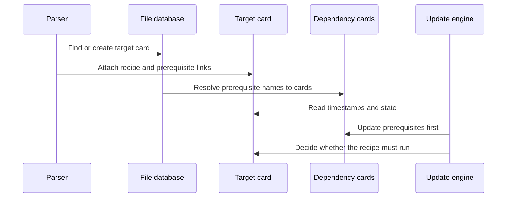

# Chapter 4: struct file

What happens when Make sees this rule?

```make
app: main.o util.o
	$(CC) -o $@ $^
```

At first, `app` might not exist. `main.o` might not exist either. The recipe is only text, and the timestamps have not yet been compared. Make needs a place to collect all of this information before it can decide what to do.

It also needs to remember targets that are not real files:

```make
.PHONY: clean
clean:
	rm -f *.o app
```

`clean` is a named build target even though no file named `clean` should be created.

This is the job of `struct file`.

> **Description:** A `struct file` represents a named target or prerequisite, whether or not it exists on disk. It tracks dependencies, recipes, timestamps, state, special-target flags, and target-specific variables. Think of it as a project card that records what a file is, what creates it, and whether it needs rebuilding.

The structure is declared in [`src/filedef.h`](../src/filedef.h). It is used throughout the file database and dependency engine.

## The central project card

The beginning of the structure looks like this:

```c
struct file
  {
    const char *name;
    const char *hname;
    const char *vpath;
    struct dep *deps;
    struct commands *cmds;
    const char *stem;
```

These fields describe the target’s identity and build instructions:

- `name`: the name Make currently uses for the target.
- `hname`: the name used as the hash-table key.
- `vpath`: a pathname found through VPATH searching.
- `deps`: the target’s prerequisites.
- `cmds`: the recipe used to create or update it.
- `stem`: the part matched by `%` in an implicit or static pattern rule.

You can picture each `struct file` as a card in a filing cabinet:

```text
Target: app
Prerequisites: main.o util.o
Recipe: $(CC) -o $@ $^
Timestamp: unknown
State: not started
```

The card exists inside Make even if the file named `app` does not exist on disk.

## The file database

Make keeps all file records in a hash table in [`src/file.c`](../src/file.c):

```c
static struct hash_table files;
```

The table is initialized during startup:

```c
init_hash_global_variable_set ();
strcache_init ();
init_hash_files ();
```

The `init_hash_files()` function prepares the table used by `lookup_file()` and `enter_file()`.

This is like a library catalog. Make does not repeatedly create a new card every time it encounters `app`; it looks up the existing card and adds information to it.

## Looking up an existing record

`lookup_file()` searches the database by name:

```c
struct file *
lookup_file (const char *name)
{
  struct file *f;
  struct file file_key;
```

The lookup normalizes some names before searching:

```c
while (name[0] == '.' && ISDIRSEP (name[1])
       && name[2] != '\0')
  {
    name += 2;
```

Thus names such as:

```text
./obj/main.o
obj/main.o
```

can refer to the same internal record after the leading `./` is removed.

The lookup then uses the hash table:

```c
file_key.hname = name;
f = hash_find_item (&files, &file_key);
return f;
```

If the name is unknown, `lookup_file()` returns `NULL`. It does not create anything.

## Entering a new record

When Make needs a record, it calls `enter_file()`:

```c
struct file *
enter_file (const char *name)
{
  struct file *f;
  struct file *new;
```

The function first checks whether the name already exists:

```c
file_key.hname = name;
file_slot = hash_find_slot (&files, &file_key);
f = *file_slot;
```

For an ordinary single-colon target, an existing record is reused:

```c
if (! HASH_VACANT (f) && !f->double_colon)
  {
    f->builtin = 0;
    return f;
  }
```

A new record is initialized with an unknown update status:

```c
new = xcalloc (sizeof (struct file));
new->name = new->hname = name;
new->update_status = us_none;
```

The filename is normally stored in the string cache. This gives Make one stable copy of the name and allows fast comparisons.

## How parsing fills the card

The parser described in [read_all_makefiles](01_read_all_makefiles.md) eventually reaches `record_files()` in [`src/read.c`](../src/read.c).

For a rule such as:

```make
app: main.o util.o
	$(CC) -o $@ $^
```

the parser collects:

- target names,
- prerequisite text,
- recipe text,
- recipe source location.

Then `record_files()` finds or creates the target record:

```c
f = enter_file (strcache_add (name));
```

It marks the record as an explicitly described target:

```c
f->is_explicit = 1;
f->is_target = 1;
```

The parser does not need the target to exist. A makefile declaration is enough to create its project card.

## Recipes belong to `struct commands`

A `struct file` does not contain recipe text directly. It points to a `struct commands`:

```c
struct commands
  {
    floc fileinfo;
    char *commands;
    char **command_lines;
    unsigned char *lines_flags;
```

The details of this recipe record are covered in [struct commands](08_struct_commands.md). For now, the important relationship is:

```text
struct file
      |
      +-- cmds --> struct commands
```

When `record_files()` has collected recipe text, it creates the command record:

```c
cmds = xmalloc (sizeof (struct commands));
cmds->fileinfo.filenm = flocp->filenm;
cmds->fileinfo.lineno = cmds_started;
```

It stores the recipe as one text block:

```c
cmds->commands = xstrndup (commands, commands_idx);
cmds->command_lines = 0;
cmds->recipe_prefix = prefix;
```

The lines are split later by `chop_commands()`, shortly before execution. This postpones work until Make knows the recipe will actually be used.

## Prerequisites point to other file cards

The `deps` field points to a chain of `struct dep` records:

```c
struct dep
  {
    DEP (struct dep);
  };
```

Each dependency record can point to another `struct file`:

```c
struct file *file;
```

For the rule:

```make
app: main.o util.o
```

the relationship eventually looks like:

```text
app
 |
 +-- dep --> main.o
 |
 +-- dep --> util.o
```

The parser first stores prerequisite names. `split_prereqs()` breaks the text into dependency records, and `enter_prereqs()` connects each name to a file record:

```c
d1->file = lookup_file (d1->name);
if (d1->file == 0)
  d1->file = enter_file (d1->name);
```

This is why Make can track a prerequisite before it exists. `main.o` gets a card even when there is no `main.o` on disk.

The dependency record itself is the link between cards. Its fields are explained in [struct dep](05_struct_dep.md).

## The complete build graph

After parsing several rules, the database forms a graph:



The important point is that Make does not build from the text of the makefile directly. It builds from this connected graph of `struct file` records and dependency links.

## Names, hashing, and renaming

A file record has both `name` and `hname`:

```c
const char *name;
const char *hname;
```

Usually they are identical. They differ when VPATH or another pathname search finds the actual file in a different location.

For example:

```make
VPATH = src
```

and:

```make
app: main.c
```

If `main.c` is found as `src/main.c`, Make may keep:

```text
name  = src/main.c
hname = main.c
```

The hash key must remain stable while Make decides how to use the file. Once the correct pathname is known, `rehash_file()` or `rename_file()` updates the database.

`rehash_file()` is more than a string assignment because changing a hash key requires moving the record to a different hash bucket. It may also merge the renamed record with an existing record under the new name.

This is like moving a library card to a new catalog drawer while preserving all notes already written on it.

## Timestamps are cached in the record

The timestamp fields are:

```c
FILE_TIMESTAMP last_mtime;
FILE_TIMESTAMP mtime_before_update;
```

They use special values:

```c
#define UNKNOWN_MTIME       0
#define NONEXISTENT_MTIME   1
#define OLD_MTIME           2
```

The meanings are:

- `UNKNOWN_MTIME`: Make has not checked the timestamp yet.
- `NONEXISTENT_MTIME`: the named file was not found.
- `OLD_MTIME`: treat the file as older than ordinary files.
- ordinary values: the actual filesystem timestamp.
- `NEW_MTIME`: treat the file as newer than everything else.

The `file_mtime()` macro avoids repeated filesystem checks:

```c
#define file_mtime(f) file_mtime_1 ((f), 1)
```

It uses the cached value when available:

```c
#define file_mtime_1(f, v) \
  ((f)->last_mtime == UNKNOWN_MTIME ? f_mtime ((f), v) \
                                    : (f)->last_mtime)
```

The record is therefore both a description of the target and a small cache of what Make learned about it.

## Reading the timestamp

`f_mtime()` in [`src/remake.c`](../src/remake.c) checks the filesystem and stores the result:

```c
mtime = name_mtime (file->name);
```

If the file is missing and VPATH searching is allowed, Make searches for another pathname:

```c
if (mtime == NONEXISTENT_MTIME && search
    && !file->ignore_vpath)
  {
    const char *name = vpath_search (file->name,
                                     &mtime, NULL, NULL);
```

After the search, the result is stored in the record:

```c
file->last_mtime = mtime;
```

For ordinary targets, Make can now compare the target timestamp with each prerequisite timestamp.

## Deciding whether a target is out of date

The update engine starts with the target’s card:

```c
static enum update_status
update_file_1 (struct file *file, unsigned int depth)
```

It reads the current timestamp:

```c
this_mtime = file_mtime (file);
noexist = this_mtime == NONEXISTENT_MTIME;
```

A missing target normally needs to be built:

```c
must_make = noexist;
```

Then Make visits the prerequisites. For each one, it calls `check_dep()` and compares timestamps:

```c
mtime = file_mtime (d->file);
```

A prerequisite requires the target to be reconsidered when it is newer:

```c
d->changed |= noexist || d_mtime > this_mtime;
```

The basic decision is therefore:

```text
target is missing
    or a prerequisite is newer
    or the target is always made
        => run the recipe
```

This is the central purpose of the `struct file` timestamp fields: they let the update engine make a decision from cached facts.

## Update status and command state

A target can be up to date, waiting, running, or failed. These conditions are represented by two enumerations stored in the record.

The update status is:

```c
enum update_status
  {
    us_success = 0,
    us_none,
    us_question,
    us_failed
  } update_status;
```

The meanings are:

- `us_success`: the last update succeeded.
- `us_none`: no update attempt has been made.
- `us_question`: `-q` determined that work is needed.
- `us_failed`: the update failed.

The command state is separate:

```c
enum cmd_state
  {
    cs_not_started = 0,
    cs_deps_running,
    cs_running,
    cs_finished
  } command_state;
```

These answer different questions:

- **Update status:** did the attempted update succeed?
- **Command state:** where are we in the current execution?

For example, a target may have `us_none` while its prerequisites are still being updated and its `command_state` is `cs_deps_running`.

This separation is like a delivery order that has both:

- a result field: successful, failed, or not attempted;
- a progress field: waiting, being packed, or shipped.

## Starting and finishing a target

When a target needs a recipe, `remake_file()` eventually calls:

```c
execute_file_commands (file);
```

That function prepares the target context:

```c
initialize_file_variables (file, 0);
set_file_variables (file, file->stem);
```

The first call prepares target-specific variables. The second defines automatic variables such as `$@`, `$<`, and `$^`.

Then it starts the job:

```c
new_job (file);
```

The job machinery, described later in [struct child](09_struct_child.md), runs the expanded recipe.

When the recipe completes, `notice_finished_file()` updates the card:

```c
file->command_state = cs_finished;
file->updated = 1;
```

It also refreshes the timestamp if necessary:

```c
file->last_mtime = i == 0 ? UNKNOWN_MTIME : NEW_MTIME;
```

The `updated` flag means that Make has already finished considering this record during the current build.

## Why `updated` matters

The update engine may encounter the same target through several paths:

```make
all: app
test: app
```

If the user requests both `all` and `test`, Make should not build `app` twice.

The `considered` field helps prune repeated graph walks:

```c
unsigned int considered;
```

The `updated` field records that an update attempt has completed:

```c
unsigned int updated:1;
```

At the start of `update_file_1()`:

```c
if (file->updated)
  {
    if (file->update_status > us_none)
      return file->update_status;
```

A project card can therefore answer, “Have we already dealt with this target during this build?”

## Detecting circular dependencies

The `updating` flag detects cycles:

```c
unsigned int updating:1;
```

Before Make starts processing a file, it marks it as updating:

```c
start_updating (file);
```

If a prerequisite leads back to a file already being updated, Make reports a circular dependency:

```c
if (is_updating (d->file))
  {
    OSS (error, NILF,
         _("Circular %s <- %s dependency dropped."),
         file->name, d->file->name);
```

The dependency is removed from consideration rather than causing infinite recursion.

This is like following arrows on a project chart and discovering that task A is waiting for B while B is waiting for A. The `updating` mark is the “currently visiting” stamp that reveals the loop.

## Implicit rules and the stem

A target may have no explicit recipe:

```make
app.o: app.c
```

Make can still find a built-in or pattern rule such as:

```make
%.o: %.c
	$(CC) -c $< -o $@
```

If `file->cmds` is empty, the update engine asks the implicit-rule machinery for help:

```c
if (!file->phony && file->cmds == 0
    && !file->tried_implicit)
  {
    try_implicit_rule (file, depth);
    file->tried_implicit = 1;
  }
```

The `tried_implicit` flag prevents repeated searches.

When a pattern matches, the matched portion is stored in `stem`:

```c
file->stem = strcache_add_len (stem, stemlen);
```

For `build/main.o` matched by a suitable pattern, the stem might be:

```text
main
```

The stem later supplies the automatic variable `$*` and helps expand pattern prerequisites.

## Target-specific variables live through `struct file`

A target-specific assignment such as:

```make
debug.o: CFLAGS += -DDEBUG
```

needs somewhere to store the special variable scope. The `struct file` fields are:

```c
struct variable_set_list *variables;
struct variable_set_list *pat_variables;
```

When the parser encounters a target-specific variable, `record_target_var()` finds or creates the target’s file record:

```c
f = lookup_file (name);
if (!f)
  f = enter_file (strcache_add (name));
```

It initializes the target’s variable chain:

```c
initialize_file_variables (f, 1);
current_variable_set_list = f->variables;
```

Then it defines the variable in that target’s set:

```c
v = try_variable_definition (flocp, defn, origin, 1);
```

The details of variable records and scope are covered in [struct variable](02_struct_variable.md). The important connection here is that every target-specific variable scope is attached to a `struct file`.

## Parent targets and inherited variables

The `parent` field records the target whose dependency caused this file to be updated:

```c
struct file *parent;
```

During dependency processing:

```c
d->file->parent = file;
```

This relationship serves several purposes:

- diagnostics can say which target needed a missing prerequisite;
- target-specific variables can be inherited;
- recursive update logic can understand the path through the graph.

For example:

```make
app: CFLAGS += -DAPP
app: main.o
```

When Make updates `main.o` because `app` needs it, the variable chain can connect `main.o` back to `app`.

Think of `parent` as the folder that handed a worker their current assignment. The worker can use the folder’s inherited instructions while performing the task.

## Pattern-specific variable records

The `pat_variables` field remembers pattern-specific variable information:

```c
struct variable_set_list *pat_variables;
```

For:

```make
lib/%.o: CFLAGS += -fPIC
```

Make stores the pattern definition separately. Later, when it has a concrete target such as `lib/math.o`, `initialize_file_variables()` searches the pattern-variable list and applies matching definitions.

The `pat_searched` flag prevents repeating that search:

```c
unsigned int pat_searched:1;
```

This keeps pattern-specific behavior lazy. Make does not need to match every pattern against every possible filename while reading the makefile.

## Special targets are ordinary records with special flags

Special targets such as `.PHONY`, `.PRECIOUS`, and `.INTERMEDIATE` are represented by ordinary `struct file` records. Their names give them special meaning.

For example, `snap_deps()` processes `.PHONY`:

```c
for (f = lookup_file (".PHONY"); f != 0; f = f->prev)
  for (d = f->deps; d != 0; d = d->next)
```

Each named prerequisite is marked:

```c
f2->phony = 1;
f2->is_target = 1;
f2->last_mtime = NONEXISTENT_MTIME;
```

A phony target is treated as nonexistent even if a file with that name happens to appear on disk. This forces its recipe to run whenever it is requested.

Other special-target flags include:

```c
unsigned int precious:1;
unsigned int intermediate:1;
unsigned int secondary:1;
unsigned int notintermediate:1;
unsigned int dontcare:1;
```

They control behavior such as:

- whether a target may be deleted after interruption;
- whether it may be removed as an intermediate;
- whether missing files should produce diagnostics;
- whether a target is protected from intermediate-file cleanup.

## `also_make`: grouped and peer targets

Some recipes create several targets at once:

```make
program program.map &: main.o
	ld -o program main.o
```

The `also_make` field records the peer targets:

```c
struct dep *also_make;
```

When the primary target is updated, Make also updates the state of these related records.

Pattern rules can create grouped targets as well. In `implicit.c`, Make creates peer records and links them into `file->also_make`.

This is like one construction job producing several labeled products. The build card for the job needs to remember every product so Make does not later believe that one of them is still missing.

## Double-colon rules use multiple records

A double-colon rule can define multiple independent recipes:

```make
archive:: source-a
	recipe-a

archive:: source-b
	recipe-b
```

Make represents these with multiple `struct file` records connected through:

```c
struct file *prev;
struct file *last;
struct file *double_colon;
```

The first record represents the shared name. Each double-colon entry gets its own record, prerequisites, recipe, timestamp state, and update status.

`enter_file()` detects this situation:

```c
if (! HASH_VACANT (f) && !f->double_colon)
  return f;
```

When a double-colon record already exists, it creates another record and links it into the chain:

```c
new->double_colon = f;
f->last->prev = new;
f->last = new;
```

The update engine walks the chain and considers each double-colon rule separately.

This is like several independent work orders filed under the same product name. They share a label but retain separate instructions.

## Built-in records and user records

The `builtin` flag identifies records created from Make’s built-in rules:

```c
unsigned int builtin:1;
```

For example, `set_default_suffixes()` creates `.SUFFIXES` and marks it:

```c
suffix_file->builtin = 1;
```

When a user later defines a matching target, `enter_file()` clears the built-in status:

```c
f->builtin = 0;
```

This lets user definitions take precedence over built-in information while preserving the database structure.

The `-r` and `-R` options also use this distinction when Make removes or suppresses built-in rules and variables.

## Loaded objects and renamed records

The record also supports dynamically loaded objects:

```c
unsigned int loaded:1;
unsigned int unloaded:1;
```

The `load` directive can associate a loaded object with a file record. If Make needs to rebuild it, `execute_file_commands()` unloads it first:

```c
if (file->loaded && unload_file (file->name) == 0)
  {
    file->loaded = 0;
    file->unloaded = 1;
  }
```

The `renamed` pointer handles a different situation: a file record may move from one name to another because of VPATH, archive handling, or another lookup operation.

The macro:

```c
#define check_renamed(file) \
  while ((file)->renamed != 0) (file) = (file)->renamed
```

follows the chain until it reaches the current record.

## Cleaning up intermediate files

Implicit rule search may create temporary prerequisites:

```text
source.c -> source.o -> app
```

If `source.o` was created only as an intermediate step, Make may delete it after the build.

The relevant flags are:

```c
unsigned int intermediate:1;
unsigned int secondary:1;
unsigned int notintermediate:1;
unsigned int precious:1;
```

`remove_intermediates()` checks these fields:

```c
if (f->intermediate && (f->dontcare || !f->precious)
    && !f->secondary && !f->notintermediate
    && !f->cmd_target)
```

Only records satisfying the cleanup policy are removed.

This is like a workshop throwing away temporary jigs after a product is finished, while keeping anything labeled precious, reusable, or explicitly requested by the customer.

## Inspecting records with `make -p`

The file database can be printed with:

```sh
make -p
```

`print_file_data_base()` walks the file hash table:

```c
void
print_file_data_base (void)
{
  puts (_("\n# Files"));
  hash_map (&files, print_file);
```

For each record, `print_file()` displays:

- the target name;
- whether it is a target;
- prerequisites;
- target-specific variables;
- special flags;
- the timestamp;
- whether it was updated;
- update status;
- recipe text.

Typical output may include:

```text
#  File does not exist.
#  File has not been updated.
#  Successfully updated.
```

This is one of the best ways to see the project cards Make has constructed.

## A complete example

Consider:

```make
VPATH = src

app: main.o util.o
	$(CC) -o $@ $^

main.o: main.c
util.o: util.c

.PHONY: clean
clean:
	rm -f app *.o
```

After parsing, Make has records conceptually like these:

```text
app
  deps: main.o, util.o
  cmds: $(CC) -o $@ $^
  is_target: yes

main.o
  deps: main.c
  cmds: implicit rule or none
  is_target: yes

main.c
  name: src/main.c or main.c
  last_mtime: cached timestamp

clean
  phony: yes
  cmds: rm -f app *.o
```

When Make builds `app`:

1. It reads `app->last_mtime`.
2. It updates `main.o` and `util.o`.
3. Each object target may use an implicit rule.
4. It compares prerequisite timestamps with `app`.
5. It initializes automatic variables and target-specific variables.
6. It expands the recipe using `variable_expand_for_file()`, described in [variable_expand](03_variable_expand.md).
7. It starts the commands.
8. It records the final state in `app`.

The target card is the shared object passed through every stage.

## The lifecycle of a `struct file`

A file record typically follows this path:

```text
name encountered
      ↓
lookup_file or enter_file
      ↓
prerequisites and recipe attached
      ↓
special flags applied
      ↓
target-specific variables initialized
      ↓
timestamp checked
      ↓
dependencies updated
      ↓
recipe selected and expanded
      ↓
commands executed
      ↓
status and timestamp recorded
      ↓
optional intermediate cleanup
```

Different source files handle different parts:

- [`src/file.c`](../src/file.c): database operations, timestamps, prerequisites, special flags, and printing.
- [`src/read.c`](../src/read.c): creates records while parsing rules.
- [`src/remake.c`](../src/remake.c): decides whether records need updating.
- [`src/implicit.c`](../src/implicit.c): finds pattern recipes and stems.
- [`src/variable.c`](../src/variable.c): attaches variable scopes to records.
- [`src/commands.c`](../src/commands.c): defines automatic variables for a record.
- [`src/job.c`](../src/job.c): runs the record’s recipe.

## A compact mental model

Think of `struct file` as a project card with several sections:

### Identity

```text
name, hname, vpath
```

Where is this target known, and where was it found?

### Build instructions

```text
deps, cmds, stem, also_make
```

What does it depend on, what creates it, and what other outputs are produced?

### Time information

```text
last_mtime, mtime_before_update
```

When did it exist, and what was its timestamp before Make tried to update it?

### Progress

```text
considered, updating, updated
update_status, command_state
```

Has Make visited it? Is it currently being processed? Did its update succeed?

### Special behavior

```text
phony, precious, intermediate, secondary
dontcare, is_explicit, builtin
```

Should it always run? Can it be deleted? Is it optional or built in?

### Variable context

```text
variables, pat_variables, parent
```

Which target-specific and inherited variables apply while this target is being built?

This organization explains why one structure is central to so many parts of Make. The target card is where identity, dependency information, timestamps, execution state, and variable context meet.

## Key takeaways

- Every named target or prerequisite can have a `struct file` record, even when no disk file exists.
- The file database is a hash table accessed through `lookup_file()` and `enter_file()`.
- `record_files()` attaches recipes and prerequisite links while parsing makefiles.
- Recipes are stored through `struct commands`.
- Prerequisites are connected through `struct dep` records.
- `last_mtime` caches filesystem timestamps, including special values for missing and artificial files.
- `update_status` records the result of an update; `command_state` records execution progress.
- `updated`, `considered`, and `updating` prevent duplicate work and detect cycles.
- `stem` records the `%` match used by implicit and static pattern rules.
- `variables`, `pat_variables`, and `parent` provide target-specific and inherited variable contexts.
- Special targets such as `.PHONY` modify flags on ordinary file records.
- `also_make` represents grouped or peer targets created by one recipe.
- Double-colon rules use multiple linked file records for the same name.
- VPATH can cause records to be renamed or merged while preserving their build information.
- `make -p` prints the file database and exposes these internal cards.

Now that you understand the project card that connects targets to recipes, timestamps, and state, the next question is how the individual prerequisite links inside `deps` carry ordering, second-expansion, and timestamp rules. That is the subject of [struct dep](05_struct_dep.md).