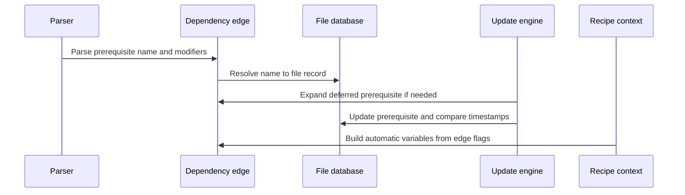

# Chapter 5: struct dep

What happens when Make reads this rule?

```make
app: main.o config.h | build
```

Make must answer several different questions:

- Which files must be updated before `app`?
- Which prerequisite affects whether `app` is out of date?
- Which prerequisite only needs to exist first?
- Should a prerequisite be expanded now or later?
- What does `%` mean for this particular target?
- Should the prerequisites run in their written order, or in a shuffled order?
- Where should `.WAIT` pause parallel execution?

A target’s `struct file` is the project card described in [struct file](04_struct_file.md). Its `deps` field points to a chain of smaller records. Each record is one arrow leaving that target.

> **Description:** A struct dep is one edge in the dependency graph, connecting a target to another file. It also records details such as order-only status, second expansion, stems, and shuffle order. Think of dependencies as arrows on a map: each arrow says what must be ready before a target can be updated.

For the rule above, the graph is conceptually:

```text
app
 ├── main.o
 ├── config.h
 └── build
```

The first two arrows affect whether `app` needs rebuilding. The third arrow only says that `build` must be ready first.

## Where the structure is declared

The definition is in [`src/dep.h`](../src/dep.h). The common fields are introduced by the `DEP` macro:

```c
#define DEP(_t)                         \
    NAMESEQ (_t);                       \
    struct file *file;                  \
    _t *shuf;                           \
    const char *stem;                   \
    unsigned int flags : 8;
```

The macro continues with several one-bit flags:

```c
    unsigned int changed : 1;           \
    unsigned int ignore_mtime : 1;      \
    unsigned int staticpattern : 1;     \
    unsigned int need_2nd_expansion : 1;
```

And the complete `struct dep` adds no fields of its own:

```c
struct dep
  {
    DEP (struct dep);
  };
```

The macro is reused for `struct goaldep`, the records used for goals and makefiles. This saves GNU Make from maintaining two almost-identical linked-list structures.

## The basic dependency record

Expanding the macro mentally gives a structure like this:

```c
struct dep
  {
    struct dep *next;
    const char *name;
    struct file *file;
    struct dep *shuf;
    const char *stem;
```

The first fields form a linked list:

- `next`: the next prerequisite in the ordinary order.
- `name`: the prerequisite name while it is still text.
- `file`: the resolved `struct file` record.
- `shuf`: an alternate traversal link used by shuffle mode.
- `stem`: the stem associated with a static or implicit pattern match.

The remaining flags describe how Make should interpret this edge.

Think of a `struct dep` as an arrow with a label:

```text
arrow destination: main.o
arrow kind: normal prerequisite
arrow status: not changed yet
arrow route: ordinary order
```

The destination eventually becomes a `struct file`. The extra fields describe how the update engine should travel along the arrow.

## A dependency chain belongs to a file

The `struct file` definition contains:

```c
struct dep *deps;
```

For:

```make
app: main.o util.o
```

the records may look like:

```text
app->deps
  |
  v
dep(main.o) -> dep(util.o) -> NULL
```

Each `dep` points to another file record after resolution:

```text
app
 |
 +-- dep --> main.o
 |
 +-- dep --> util.o
```

The target card and its arrows therefore form a two-level structure:

```text
struct file
    |
    +-- deps --> struct dep --> struct file
                    |
                    +-- metadata about this particular edge
```

The destination `struct file` is shared. If `main.o` appears as a prerequisite of several targets, Make does not create a separate full file record each time. It creates separate dependency edges that point to the same `main.o` record.

## Names before file records

While Make is parsing a rule, a dependency may exist only as text:

```make
app: $(OBJECTS)
```

The parser first expands ordinary prerequisites and passes the resulting text to `split_prereqs()`:

```c
struct dep *
split_prereqs (char *p)
{
  struct dep *new = PARSE_FILE_SEQ
    (&p, struct dep, MAP_PIPE, NULL, PARSEFS_WAIT);
```

`PARSE_FILE_SEQ` is a typed wrapper around `parse_file_seq()`. It allocates one `struct dep` for each parsed word.

At this stage, each record primarily has a `name`. The `file` pointer is connected later by `enter_prereqs()`:

```c
d1->file = lookup_file (d1->name);
if (d1->file == 0)
  d1->file = enter_file (d1->name);
```

The destination file card is created even if the file does not exist yet. This is the same idea explained in [struct file](04_struct_file.md): Make can build an internal record for a future file.

After resolution, the dependency no longer needs its own name:

```c
d1->name = 0;
```

The `dep_name` macro hides this transition:

```c
#define dep_name(d) \
  ((d)->name ? (d)->name : (d)->file->name)
```

So callers can ask for the dependency’s name whether the edge is still textual or already connected to a file record.

## The normal parsing path

For a simple rule:

```make
app: main.o util.o
```

the path is approximately:

```text
prerequisite text
        ↓
split_prereqs
        ↓
struct dep chain with names
        ↓
enter_prereqs
        ↓
lookup_file or enter_file
        ↓
struct dep chain pointing to struct file records
```

The target’s `deps` field receives this chain in `record_files()`.

For an ordinary, fully expanded dependency list, `record_files()` calls:

```c
deps = split_prereqs (depstr);
```

Then, when appropriate, it resolves the names:

```c
deps = enter_prereqs (deps, NULL);
```

The `NULL` stem means this is not currently expanding a static pattern prerequisite.

## Normal prerequisites and order-only prerequisites

GNU Make separates two kinds of arrows with the pipe character:

```make
app: main.o | build
```

The rule means:

- `main.o` must exist and may make `app` out of date.
- `build` must be updated first, but its timestamp does not make `app` out of date.

`split_prereqs()` parses the normal portion first:

```c
struct dep *new = PARSE_FILE_SEQ
  (&p, struct dep, MAP_PIPE, NULL, PARSEFS_WAIT);
```

The parser stops when it reaches `|`. It then parses the order-only portion:

```c
++p;
ood = PARSE_FILE_SEQ
  (&p, struct dep, MAP_NUL, NULL, PARSEFS_WAIT);
```

Every order-only record receives the `ignore_mtime` flag:

```c
for (; ood != NULL; ood = ood->next)
  ood->ignore_mtime = 1;
```

The name “ignore mtime” is literal: the update engine ignores that prerequisite’s modification time when deciding whether the target is stale.

### Why the flag matters

In `update_file_1()`, Make processes every dependency, but only normal prerequisites can set `must_make` from their result:

```c
if (! d->ignore_mtime)
  must_make = maybe_make;
```

Later, timestamp comparisons also skip the order-only edge:

```c
if (! d->ignore_mtime)
  deps_changed |= d->changed;
```

The order-only prerequisite is still visited and updated. It is simply not allowed to push the target into the “must rebuild” state because it is newer.

This is like requiring a loading dock to be ready before delivering a package. A newly painted loading dock does not mean the package itself has changed.

## Automatic variables distinguish the two kinds

Order-only status also affects automatic variables.

In `set_file_variables()`, `$<` selects the first non-order-only prerequisite:

```c
less = "";
for (d = file->deps; d != 0; d = d->next)
  if (!d->ignore_mtime && !d->ignore_automatic_vars
      && !d->need_2nd_expansion)
    {
      less = dep_name (d);
      break;
    }
```

The normal prerequisite list used for `$^`, `$+`, and `$?` also treats order-only entries separately.

The `$|` automatic variable is specifically built from order-only prerequisites. The implementation collects them into `bar_value`:

```c
if (d->ignore_mtime)
  {
    bp = mempcpy (bp, c, len);
    *bp++ = FILE_LIST_SEPARATOR;
  }
```

So this rule:

```make
app: main.o | build
	@echo first=$< all=$^ order_only=$|
```

conceptually produces:

```text
first=main.o all=main.o order_only=build
```

The dependency record is therefore not merely used by timestamp logic. Its flags also shape the values exposed to recipes, as described in [struct commands](08_struct_commands.md).

## The `.WAIT` marker

GNU Make can place an explicit wait point between prerequisites:

```make
all: first second .WAIT third fourth
```

With parallel execution enabled, Make may build `first` and `second` in parallel, but it waits for both before starting `third` or `fourth`.

The parser recognizes `.WAIT` while reading file sequences. In `parse_file_seq()`, the `PARSEFS_WAIT` option enables this behavior:

```c
if (ANY_SET (flags, PARSEFS_WAIT)
    && p - s == CSTRLEN (".WAIT")
    && memcmp (s, ".WAIT", CSTRLEN (".WAIT")) == 0)
  {
    found_wait = 1;
    continue;
  }
```

`.WAIT` itself is not stored as a dependency. Instead, the next real dependency receives `wait_here`:

```c
if (found_wait)
  {
    ((struct dep*)_ns)->wait_here = 1;
    found_wait = 0;
  }
```

For the example:

```make
all: first second .WAIT third
```

the chain is conceptually:

```text
first -> second -> third
                    ^
                    |
               wait_here
```

The marker belongs to `third`, meaning “pause before processing this edge if earlier work is running.”

The update engine checks it here:

```c
if (d->wait_here && running)
  break;
```

The chain still contains the same prerequisites. The flag changes when Make is allowed to cross a particular arrow.

## `.NOTPARALLEL` uses the same flag

The special target `.NOTPARALLEL` can cause Make to insert wait points automatically.

In `snap_deps()`:

```c
if (!f->deps)
  not_parallel = 1;
else
  for (d = f->deps; d != NULL; d = d->next)
```

For each target named by `.NOTPARALLEL`, Make marks every prerequisite after the first with `wait_here`:

```c
for (d2 = f2->deps->next; d2 != NULL; d2 = d2->next)
  d2->wait_here = 1;
```

This reuses the same edge-level mechanism as an explicit `.WAIT`. The difference is only where the flag came from.

A useful design lesson is visible here: rather than inventing a second scheduling system for `.NOTPARALLEL`, Make annotates the dependency arrows it already has.

## Second expansion: storing a deferred edge

Normally, prerequisite variables are expanded while Make reads the rule:

```make
OBJECTS = main.o util.o
app: $(OBJECTS)
```

But `.SECONDEXPANSION` allows a prerequisite to be expanded later, when the target and its automatic variables are known:

```make
.SECONDEXPANSION:
main.o: $$($$@_DEPS)
```

The first expansion must preserve the escaped dollar signs. `record_files()` detects this situation:

```c
if (second_expansion && strchr (depstr, '$'))
  {
    deps = alloc_dep ();
    deps->name = depstr;
```

The record is marked for later processing:

```c
deps->need_2nd_expansion = 1;
deps->staticpattern = pattern != 0;
```

Unlike an ordinary dependency, this record is not immediately split into individual files. Its `name` still contains an unevaluated dependency expression.

Think of it as an arrow whose destination is written on a sealed envelope. Make knows there is a destination, but waits until it has the target’s context before opening the envelope.

## Expanding deferred dependencies

Before updating a target’s prerequisites, the update engine calls:

```c
if (second_expansion)
  expand_deps (ad->file);
```

`expand_deps()` skips records that are already resolved:

```c
if (!d->name || !d->need_2nd_expansion)
  {
    dp = &d->next;
    d = d->next;
    continue;
  }
```

For a deferred record, Make initializes the target’s variable context:

```c
initialize_file_variables (f, 0);
set_file_variables (f, d->stem ? d->stem : f->stem);
```

This makes target-specific and automatic variables available. The context machinery is described in [struct variable](02_struct_variable.md).

Then it expands the saved expression:

```c
p = variable_expand_for_file (d->name, f);
```

This is the target-aware expansion path explained in [variable_expand](03_variable_expand.md).

The expanded text is parsed into new dependency records:

```c
new = split_prereqs (p);
```

The old deferred record is replaced:

```c
free_dep (d);
*dp = new;
```

Each newly created dependency is then connected to a `struct file`:

```c
d->file = lookup_file (d->name);
if (d->file == 0)
  d->file = enter_file (d->name);
d->name = 0;
```

The life cycle is:

```text
saved prerequisite expression
        ↓
target variables initialized
        ↓
second expansion
        ↓
split into individual names
        ↓
file records entered
        ↓
ordinary dependency edges
```

## Static pattern rules and stems

A static pattern rule looks like this:

```make
objects: %.o: %.c
	$(CC) -c $< -o $@
```

The target list contains concrete names such as `main.o` and `util.o`, while the pattern describes how their prerequisites should be formed.

When `record_files()` handles a static pattern rule, it computes the stem for each target:

```c
f->stem = strcache_add_len
  (variable_buffer, o - variable_buffer);
```

For `main.o` matched against `%.o`, the stem is:

```text
main
```

The dependency edge remembers this stem:

```c
this->stem = f->stem;
```

If the prerequisite can be expanded immediately, `enter_prereqs()` substitutes the stem into names such as `%.c`:

```c
if (stem)
  {
    const char *pattern = "%";
    struct dep *dp = deps;
```

It then turns the pattern into a concrete prerequisite:

```text
%.c + stem main  =>  main.c
```

The edge is marked as a static-pattern edge while this work is occurring:

```c
dp->staticpattern = 1;
```

Once the prerequisite is connected to its file record, the temporary pattern information is no longer needed:

```c
d1->staticpattern = 0;
```

The stem is also used for `$*`, as described in [struct file](04_struct_file.md) and [struct commands](08_struct_commands.md).

## Static pattern rules with second expansion

Static pattern rules become more subtle when second expansion is enabled.

In `expand_deps()`, Make temporarily uses the dependency’s own stem:

```c
set_file_variables (f, d->stem ? d->stem : f->stem);
```

This matters when multiple targets share a static pattern rule. Each edge may have a different stem even though the target’s general `struct file` record has only one current `stem`.

The dependency record acts as a small per-edge workspace:

```text
target list: main.o util.o
        ↓
main.o edge: stem = main
util.o edge: stem = util
```

Without `dep->stem`, Make could not safely perform deferred expansion for each target independently.

## Pattern rules and `%`

Implicit pattern rules also use dependency records:

```make
%.o: %.c
	$(CC) -c $< -o $@
```

Pattern rules are stored as `struct rule` records, discussed in the next chapter, and their prerequisites are also a `struct dep` chain.

During implicit rule search, `pattern_search()` substitutes the matched stem into each prerequisite. It copies properties from the rule’s dependency to the resulting dependency:

```c
d->ignore_mtime = dep->ignore_mtime;
d->ignore_automatic_vars = dep->ignore_automatic_vars;
d->wait_here |= dep->wait_here;
d->is_explicit = is_explicit;
```

This preserves edge behavior while changing the destination name.

For example, if a pattern rule has an order-only prerequisite:

```make
%.o: %.c | generated
```

the concrete `main.o` dependency list must retain the order-only property after `%` becomes `main`.

## The `is_explicit` flag

The `is_explicit` bit has a specialized purpose during implicit rule search. The comment in [`src/dep.h`](../src/dep.h) describes it:

> `explicit` is set when implicit rule search is performed and the prerequisite does not contain `%`. When explicit is set the file is not intermediate.

Consider:

```make
%.o: %.c
```

The prerequisite `%.c` is generated from a pattern. It may be considered an intermediate candidate during implicit rule search.

But a prerequisite explicitly named in a rule is different:

```make
app.o: app.c
```

The source file `app.c` was directly mentioned. Make should not casually classify it as an automatically generated temporary file.

`enter_prereqs()` marks explicitly entered files:

```c
if (!stem)
  d1->file->is_explicit = 1;
```

The implicit-rule code also propagates this information while deciding whether a candidate file should be intermediate.

This is another example of an edge carrying information that affects the destination file’s eventual status.

## The `changed` flag

The meaning of `changed` depends somewhat on the phase.

During ordinary dependency processing, it records whether the prerequisite changed or was newer in a way relevant to automatic variable `$?`:

```c
d->changed = ((file_mtime (d->file) != mtime)
              || (mtime == NONEXISTENT_MTIME));
```

Later, `set_file_variables()` uses it when building `$?`:

```c
if (d->changed || always_make_flag)
  qp = mempcpy (qp, c, len);
```

So a changed dependency appears in `$?`.

The flag is also used by implicit rule search for related decisions. In `rule.c`, a pattern prerequisite in a nonexistent subdirectory uses `changed` to remember that condition:

```c
dep->changed = !dir_file_exists_p (name, "");
```

This is not a contradiction. The same compact record is used in several stages of Make’s work, and the interpretation is controlled by the stage using it.

A beginner-friendly way to remember this is: `changed` is a pencil mark on the arrow. Different phases may write or inspect the mark for different local decisions.

## Ignoring automatic variables

The `ignore_automatic_vars` flag prevents a dependency from appearing in automatic variables.

This is used for extra prerequisites. The `.EXTRA_PREREQS` variable can add files to a target without changing values such as `$^` or `$<`.

`expand_extra_prereqs()` creates the edges:

```c
for (d = prereqs; d; d = d->next)
  {
    d->file = lookup_file (d->name);
    if (!d->file)
      d->file = enter_file (d->name);
```

Then it marks them:

```c
d->name = NULL;
d->ignore_automatic_vars = 1;
```

The prerequisites still participate in updating and ordering. They are simply hidden from the recipe-facing automatic-variable lists.

This is like adding a supervisor to a task’s checklist. The supervisor must be present before work begins, but should not be counted as one of the project’s visible inputs.

## Shuffle order

GNU Make supports prerequisite shuffling through `--shuffle`. The purpose is to expose incomplete dependency declarations: a build that accidentally relies on the written order may fail when prerequisites are visited differently.

The `struct dep` record has two links:

```c
struct dep *next;
struct dep *shuf;
```

`next` preserves the normal dependency chain. `shuf` can point through the same records in a different order.

The update engine chooses the shuffled link when available:

```c
d = du->shuf ? du->shuf : du;
```

This means Make can change traversal order without destroying the original order needed for:

- `$+`,
- printing the database,
- preserving makefile order,
- and reconstructing the dependency list.

The distinction is similar to a map with two routes:

```text
original route: A -> B -> C -> D
shuffle route:  C -> A -> D -> B
```

Both routes visit the same places. They simply choose different next arrows.

Whenever second expansion changes the dependency chain, Make regenerates shuffle links:

```c
if (changed_dep)
  shuffle_deps_recursive (f->deps);
```

The comment explains the invariant: the `next` and `shuf` links must traverse the same dependencies, even if they do so in different sequences.

## Copying dependency chains

A single dependency chain cannot safely be attached to several targets because each target owns and later modifies its own links.

For a multi-target rule:

```make
one two: input
```

`record_files()` copies the chain for all but the last target:

```c
this = nextf != 0 ? copy_dep_chain (deps) : deps;
```

This gives the targets independent edge records:

```text
one->deps -> dep(input copy A)
two->deps -> dep(input copy B)
```

They point to the same `struct file` for `input`, but their flags and list links are separate.

The same principle applies to grouped targets and implicit rule results. A dependency edge is owned by the target’s chain, even when its destination file record is shared.

## Memory ownership

Dependency records are allocated with:

```c
#define alloc_dep() alloc_seq_elt (struct dep)
```

which expands to an `xcalloc()` of the structure’s size.

A single record is freed with:

```c
free_dep (d);
```

A complete chain is freed with:

```c
free_dep_chain (deps);
```

These helpers are defined in [`src/dep.h`](../src/dep.h). They are intentionally small because `struct dep` has no nested allocation by default; names are usually string-cached, and the destination `struct file` is owned by the file database.

A deferred second-expansion record is a special case because its `name` is allocated text. `expand_deps()` frees that saved expression before replacing the record:

```c
free ((char*)d->name);
new = split_prereqs (p);
```

When debugging memory ownership, ask two questions:

1. Does this dependency still own a temporary `name`?
2. Has its `file` pointer been connected to the file database?

Once `name` is set to `NULL`, use `dep_name(d)` rather than reading `d->name` directly.

## Printing prerequisites

The file database printer uses dependency flags to reconstruct a readable rule.

`print_prereqs()` prints normal dependencies first:

```c
for (; deps != 0; deps = deps->next)
  if (! deps->ignore_mtime)
    printf (" %s%s",
            deps->wait_here ? ".WAIT " : "",
            dep_name (deps));
```

It then prints order-only prerequisites after a pipe:

```c
if (ood)
  {
    printf (" | %s%s",
            ood->wait_here ? ".WAIT " : "",
            dep_name (ood));
```

Thus:

```sh
make -p
```

can display the logical form of the graph rather than exposing the internal distinction between `name` and `file`.

The output is a useful diagnostic:

```text
app: main.o config.h | .WAIT build
```

It shows both the dependency names and the scheduling or timestamp semantics attached to them.

## A complete example

Consider this makefile:

```make
.SECONDEXPANSION:

app: main.o | build
	$(CC) -o $@ $^

main.o: $$(HEADERS_$$@)
```

The edges for `app` are conceptually:

```text
app
 ├── main.o
 └── build
       ignore_mtime = 1
```

The edge for `main.o` initially contains deferred text:

```text
name = $(HEADERS_$@)
need_2nd_expansion = 1
```

When Make updates `main.o`:

1. `expand_deps()` initializes `main.o`’s variable context.
2. `$@` becomes `main.o`.
3. The deferred expression expands to the appropriate header list.
4. The result is split into new `struct dep` records.
5. Each record is connected to a `struct file`.
6. The update engine visits those files.
7. The `ignore_mtime` flag on `build` prevents it from making `app` stale.
8. `set_file_variables()` uses the dependency flags to build `$^`, `$?`, and `$|`.

The dependency record is the small piece of state that carries each edge through all of these phases.

## Dependency processing sequence

The following sequence shows how one prerequisite travels from makefile text to an update decision:



The same edge can therefore participate in parsing, graph construction, scheduling, timestamp comparison, and recipe expansion.

## Inspecting dependency behavior

Several debugging techniques reveal what `struct dep` is doing.

### Print the database

```sh
make -p
```

Look for:

- the prerequisite list;
- the `|` separator for order-only dependencies;
- `.WAIT` markers;
- implicit or static pattern stems;
- target-specific variables.

### Enable verbose debugging

```sh
make --debug=v
```

Messages from `remake.c` identify whether a prerequisite is:

- newer;
- older;
- missing;
- order-only;
- being waited on;
- involved in a circular dependency.

### Test second expansion

```make
.SECONDEXPANSION:
x: $$($$@_DEPS)
```

Then define a target-specific variable such as:

```make
x_DEPS = input.h
```

This makes the timing visible: the dependency cannot be resolved correctly until `$@` has a target value.

### Test order-only behavior

```make
out: source | directory
	@echo rebuilding
```

Changing `directory` should not force `out` to rebuild, while changing `source` should.

### Test shuffle behavior

```sh
make --shuffle=random
```

If the build fails under a different prerequisite order, the makefile may be relying on an undeclared dependency.

## A compact mental model

Think of every `struct dep` as a labeled arrow with five layers of information:

### Destination

```c
name
file
```

Where does the arrow point? It may begin as text and later point to a `struct file`.

### Traversal

```c
next
shuf
wait_here
```

What is the ordinary route? What is the shuffled route? Should Make pause before crossing this edge?

### Timestamp meaning

```c
ignore_mtime
changed
```

Does this prerequisite affect out-of-date decisions? Did it change during the current update?

### Expansion meaning

```c
need_2nd_expansion
staticpattern
stem
```

Should the name be expanded later? Did `%` produce a stem? Which stem belongs to this particular target?

### Recipe visibility

```c
ignore_automatic_vars
is_explicit
```

Should this edge appear in automatic variables? Was the prerequisite explicitly named rather than discovered by pattern search?

Put together:

```text
makefile prerequisite
        ↓
struct dep edge
        ↓
struct file destination
        ↓
timestamp and ordering decisions
        ↓
automatic variables and recipe
```

## Key takeaways

- A `struct dep` is one prerequisite edge in a target’s dependency chain.
- `next` links dependencies in their ordinary makefile order.
- `file` points to the destination `struct file` record.
- `name` holds a prerequisite name before it is resolved.
- `dep_name()` works whether the edge still has a name or already has a file.
- `ignore_mtime` marks order-only prerequisites written after `|`.
- `wait_here` represents `.WAIT` and automatically inserted `.NOTPARALLEL` barriers.
- `need_2nd_expansion` keeps prerequisite text until target context is available.
- `stem` stores the `%` match for static and implicit pattern rules.
- `staticpattern` identifies dependency data associated with a static pattern rule.
- `changed` helps timestamp decisions and automatic variable `$?`.
- `ignore_automatic_vars` hides extra prerequisites from variables such as `$^` and `$<`.
- `is_explicit` helps implicit rule search distinguish declared files from generated candidates.
- `shuf` provides an alternate traversal order without destroying the original chain.
- Dependency chains are copied when several targets need independent edge records.
- Order-only, second-expansion, and shuffle behavior all work by annotating the same basic edge structure.

Now that you understand how individual arrows carry names, timestamps, expansion rules, and scheduling hints, you might wonder where reusable collections of arrows and recipes are stored for pattern matching. That is the subject of [struct rule](06_struct_rule.md).