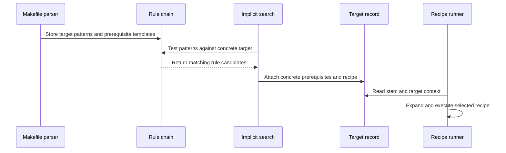

# Chapter 6: struct rule

Suppose Make is asked to build `build/main.o`, but the makefile contains no explicit rule for that exact filename:

```make
build/main.o:
```

How can Make know that it should compile `src/main.c`? Where is the reusable recipe stored? How does Make compare several possible recipes and choose the best one?

The answer is a pattern rule:

```make
%.o: %.c
	$(CC) -c $< -o $@
```

GNU Make stores this reusable template in a `struct rule`.

> **Description:** A rule describes how one or more targets can be produced from prerequisites and commands. Pattern rules use `%` to generalize over filenames, such as `%.o` from `%.c`. Think of a rule as a reusable recipe template that Make matches against a specific target when no explicit recipe is available.

The previous chapter explained how [`struct dep`](05_struct_dep.md) stores individual prerequisite edges. This chapter explains how those edges, target patterns, and recipes are bundled into reusable implicit rules.

## Where `struct rule` fits

The structure is declared in [`src/rule.h`](../src/rule.h):

```c
struct rule
  {
    struct rule *next;
    const char **targets;
    unsigned int *lens;
    const char **suffixes;
```

The remaining fields are:

```c
    struct dep *deps;
    struct commands *cmds;
    char *_defn;
    unsigned short num;
    char terminal;
    char in_use;
  };
```

A rule therefore contains:

- a link to the next rule;
- one or more target patterns;
- lengths of those patterns;
- pointers to the characters after each `%`;
- prerequisite records;
- a recipe;
- a printable cached definition;
- the number of target patterns;
- and state used while searching.

A useful picture is a recipe card:

```text
Target pattern: %.o
Prerequisites:  %.c
Recipe:         $(CC) -c $< -o $@
```

The card does not describe only `main.o`. It describes every object file that can match `%.o`.

## The global pattern-rule chain

Pattern rules are stored in a global linked list:

```c
struct rule *pattern_rules;
struct rule *last_pattern_rule;
unsigned int num_pattern_rules;
```

The first pointer identifies the first rule. The second makes it efficient to append a new rule. The count records how many rules exist after Make finishes preparing the database.

This is like a shelf of recipe cards:

```text
rule 1 -> rule 2 -> rule 3 -> ...
```

When Make searches for a way to build a target, [`pattern_search`](../src/implicit.c) walks this collection and tests each candidate.

The chain contains both:

- rules written by the user;
- rules installed by GNU Make’s built-in defaults.

Built-in rules are installed later in startup, after makefiles have been read:

```c
install_default_implicit_rules ();
```

This ordering is deliberate. User-defined pattern rules must be able to take precedence over equivalent built-in rules.

## How a makefile line becomes a rule

The parser in [`src/read.c`](../src/read.c) first collects:

- target names;
- prerequisite text;
- recipe text;
- whether the rule uses one or two colons;
- whether it is grouped;
- and whether a target pattern was present.

Eventually it calls:

```c
record_files (filenames, also_make_targets, pattern,
              pattern_percent, depstr, cmds_started,
              commands, commands_idx, two_colon,
              prefix, &fi);
```

Inside `record_files()`, Make checks whether the first target contains `%`:

```c
name = filenames->name;
implicit_percent = find_percent_cached (&name);
```

If the target contains `%`, the parser treats the rule as an implicit pattern rule rather than an ordinary file rule.

For example:

```make
%.o: %.c
	$(CC) -c $< -o $@
```

is not attached directly to a `struct file` for `%.o`. It becomes a `struct rule` in the pattern-rule chain.

## Creating the recipe record

Before creating the rule, `record_files()` packages the recipe into a `struct commands`:

```c
if (commands_idx > 0)
  {
    cmds = xmalloc (sizeof (struct commands));
    cmds->fileinfo.filenm = flocp->filenm;
    cmds->fileinfo.lineno = cmds_started;
```

It then stores the recipe text:

```c
    cmds->commands = xstrndup (commands, commands_idx);
    cmds->command_lines = 0;
    cmds->recipe_prefix = prefix;
  }
```

The recipe is not expanded here. Variables such as `$(CC)` and automatic variables such as `$@` must wait until Make has selected a concrete target.

That is the same deferred-recipe idea described in [struct file](04_struct_file.md) and [struct commands](08_struct_commands.md). A pattern rule stores a template; a later target-specific operation expands it.

## Creating the prerequisite chain

The prerequisite text becomes a chain of `struct dep` records:

```c
deps = split_prereqs (depstr);
free (depstr);
```

For an ordinary explicit rule, `enter_prereqs()` immediately connects each dependency to a `struct file`.

Pattern rules are different. Make must not turn `%.c` into an actual file while reading the rule. The `%` has meaning only after a target is matched.

That is why `record_files()` intentionally avoids entering prerequisites for an implicit rule:

```c
if (! pattern && ! implicit_percent)
  deps = enter_prereqs (deps, NULL);
```

The dependency remains a reusable pattern such as `%.c`.

This is like storing “the matching source document” on a recipe card rather than choosing a particular document before you know which project is being built.

## The target arrays

A pattern rule can describe more than one target:

```make
%.tab.c %.tab.h: %.y
	$(YACC) $<
```

The `struct rule` stores target patterns in an array:

```c
const char **targets;
```

For every target, it also stores:

```c
unsigned int *lens;
const char **suffixes;
```

These arrays have parallel entries:

```text
targets[0]  = %.tab.c
lens[0]     = length of %.tab.c
suffixes[0] = address just after the %

targets[1]  = %.tab.h
lens[1]     = length of %.tab.h
suffixes[1] = address just after the %
```

Why store `suffixes` instead of repeatedly searching for `%`?

During implicit rule search, Make needs to compare a candidate filename with the part before and after `%` many times. A pointer directly into the cached target pattern makes those comparisons faster.

For `%.o`, the pattern is divided conceptually into:

```text
prefix: ""
stem:   main
suffix: ".o"
```

For `lib/%.o`, the prefix is `lib/` and the suffix is `.o`.

## `create_pattern_rule()`

The helper `create_pattern_rule()` assembles a complete `struct rule`:

```c
r = xmalloc (sizeof (struct rule));

r->num = n;
r->cmds = commands;
r->deps = deps;
r->targets = targets;
r->suffixes = target_percents;
```

It allocates and fills the target-length array:

```c
r->lens = xmalloc (n * sizeof (unsigned int));
r->_defn = NULL;
```

Then it records each target’s length and advances the `%` pointer:

```c
for (i = 0; i < n; ++i)
  {
    r->lens[i] = (unsigned int) strlen (targets[i]);
    ++r->suffixes[i];
  }
```

The caller transfers ownership of the arrays to the rule. They remain valid until the rule is removed.

Finally, the rule is installed:

```c
if (new_pattern_rule (r, override))
  r->terminal = terminal ? 1 : 0;
```

The `override` parameter controls what happens if an equivalent rule already exists.

## Installing a rule into the chain

`new_pattern_rule()` initializes search-related state:

```c
rule->in_use = 0;
rule->terminal = 0;
rule->next = 0;
```

It then searches the existing chain for a duplicate. Two rules are considered equivalent when their target patterns and prerequisite names match.

If the new rule does not override an existing equivalent rule, the new rule is discarded:

```c
if (d == 0 && d2 == 0)
  {
    if (override)
      {
        freerule (r, lastrule);
```

If it does override, the old rule is removed and the new one takes its place in the chain.

Otherwise, the rule is appended:

```c
if (pattern_rules == 0)
  pattern_rules = rule;
else
  last_pattern_rule->next = rule;

last_pattern_rule = rule;
```

This gives the chain stable definition order. Later, the search algorithm may sort matching candidates by stem specificity, but definition order remains useful as a tie-breaker.

## Pattern rules versus static pattern rules

These two forms look similar but are stored differently.

### Ordinary pattern rule

```make
%.o: %.c
	$(CC) -c $< -o $@
```

This rule is reusable for any matching target. It becomes a `struct rule`.

### Static pattern rule

```make
objects: %.o: %.c
	$(CC) -c $< -o $@
```

This rule applies only to the explicit target list in `objects`. It is attached to concrete `struct file` records rather than inserted into the global pattern-rule chain.

In `record_files()`, the presence of a target pattern is passed separately from the target names:

```c
if (pattern && !pattern_matches (pattern, pattern_percent, name))
  OS (error, flocp,
      _("target '%s' doesn't match the target pattern"), name);
```

For a static pattern rule, Make computes a stem for each concrete target:

```c
f->stem = strcache_add_len
  (variable_buffer, o - variable_buffer);
```

Then it expands the prerequisite patterns with that stem:

```c
this = enter_prereqs (this, f->stem);
```

The result is stored on the target’s `struct file`, as described in [struct file](04_struct_file.md).

The distinction is:

```text
pattern rule          reusable global template
static pattern rule   concrete target rule with a pattern-shaped recipe
```

## Matching a target

When `update_file_1()` finds a target without a recipe, it calls:

```c
try_implicit_rule (file, depth);
```

This happens in [`src/remake.c`](../src/remake.c), after Make has inspected the target’s timestamp but before it updates prerequisites.

`try_implicit_rule()` delegates to `pattern_search()`:

```c
if (pattern_search (file, 0, depth, 0, 0))
  return 1;
```

`pattern_search()` receives a concrete `struct file`, such as:

```text
build/main.o
```

It then examines the global `pattern_rules` chain.

The search first collects rules whose target patterns could match:

```c
for (rule = pattern_rules; rule != 0; rule = rule->next)
  {
    unsigned int ti;
```

For each target pattern in a multi-target rule, it calculates a possible stem:

```c
stem = filename + (suffix - target - 1);
stemlen = namelen - rule->lens[ti] + 1;
```

For `main.o` and `%.o`, the stem is `main`.

For `lib/main.o` and `%.o`, Make also considers whether the directory portion should be handled separately. This is why pattern matching has special logic for slashes and VPATH directories.

## Candidate sorting

A target may match several pattern rules:

```make
%.o: %.c
	$(CC) -c $< -o $@

lib/%.o: lib/%.c
	$(CC) -fPIC -c $< -o $@
```

For `lib/main.o`, both patterns may look relevant. Make records possible candidates in `struct tryrule`:

```c
struct tryrule
  {
    struct rule *rule;
    size_t stemlen;
    unsigned int matches;
    unsigned int order;
```

The `matches` field identifies which target pattern in a multi-target rule matched. The `order` field preserves definition order.

Candidates are sorted with:

```c
qsort (tryrules, nrules, sizeof (struct tryrule),
       stemlen_compare);
```

The comparison function prefers shorter stems:

```c
int
stemlen_compare (const void *v1, const void *v2)
{
  const struct tryrule *r1 = v1;
  const struct tryrule *r2 = v2;
  int r = (int) (r1->stemlen - r2->stemlen);
```

The shorter stem usually means the longer fixed prefix and suffix matched, which makes the rule more specific.

This is like choosing between:

```text
Any department / any document
Library department / any document
```

The second instruction is more specific because it says more about where the item belongs.

## Checking prerequisites

Finding a target-pattern match is not enough. Make must also determine whether the resulting prerequisites exist or can be built.

For a candidate `%.o: %.c`, matching `main.o` produces:

```text
main.c
```

The implicit search substitutes the stem into each dependency:

```c
if (! dep->need_2nd_expansion)
  {
    const char *cp = strchr (nptr, '%');
    if (cp == 0)
      strcpy (depname, nptr);
```

When `%` is present, the code copies the prefix, stem, and suffix:

```c
o = mempcpy (o, nptr, cp - nptr);
o = mempcpy (o, stem, stemlen);
strcpy (o, cp + 1);
```

The resulting name is tested through several possibilities:

1. It may already exist.
2. It may be found through VPATH.
3. It may be explicitly expected by another rule.
4. Another implicit rule may be able to create it.
5. If none applies, the candidate rule is rejected.

This recursive search is what allows chains such as:

```text
program
  depends on program.o
    depends on program.c
```

or more complex chains involving generated intermediates.

The dependency metadata from [`struct dep`](05_struct_dep.md) is copied into the concrete dependencies:

```c
d->ignore_mtime = dep->ignore_mtime;
d->ignore_automatic_vars = dep->ignore_automatic_vars;
d->wait_here |= dep->wait_here;
d->is_explicit = is_explicit;
```

The rule template supplies the edge behavior; the concrete target receives a new set of edges.

## Second expansion in pattern rules

Pattern rules may use secondary expansion:

```make
.SECONDEXPANSION:

%.o: $$($$*_INPUT)
	$(CC) -c $< -o $@
```

For second expansion, Make cannot simply replace `%` with the raw stem before expansion. The stem itself might contain characters that should not be expanded again.

The implementation replaces `%` with an automatic-variable reference:

```c
if (check_lastslash)
  o = mempcpy (o, "$(*F)", 5);
else
  o = mempcpy (o, "$*", 2);
```

Then it expands the resulting expression in the target’s context:

```c
p = variable_expand_for_file (depname, file);
```

This connects the rule engine to the variable and expansion systems explained in [struct variable](02_struct_variable.md) and [variable_expand](03_variable_expand.md).

The sequence is:

```text
pattern prerequisite
        ↓
substitute stem placeholder
        ↓
activate target variables
        ↓
perform second expansion
        ↓
create concrete dependency edges
```

## Building the concrete target

Once a suitable rule is found, `pattern_search()` transfers its recipe and prerequisites to the target’s `struct file`.

The selected recipe is shared:

```c
file->cmds = rule->cmds;
file->is_target = 1;
```

The concrete dependencies are already stored in `file->deps`.

Make also records the matched stem:

```c
file->stem = strcache_add_len (stem, stemlen);
```

That stem later becomes automatic variable `$*`. When the recipe runs, `set_file_variables()` uses the target’s stem to define automatic variables such as `$@`, `$<`, and `$*`.

This is an important ownership boundary:

```text
struct rule
  owns the reusable template

struct file
  owns the selected concrete build state
```

The rule remains available for other targets. The file record now knows which rule was selected for this particular target.

## Multi-target pattern rules

A pattern rule may create several related targets:

```make
%.tab.c %.tab.h: %.y
	$(YACC) $<
```

The rule stores both target patterns in `targets` and sets `num` to `2`.

When one target matches, `pattern_search()` creates the other targets as peers:

```c
new->name = strcache_add (nm);
new->file = enter_file (new->name);
new->next = file->also_make;
```

The peer is linked through the selected target’s `also_make` field.

This is the pattern-rule counterpart to grouped targets explained in [struct file](04_struct_file.md). One recipe produces multiple outputs, so Make must remember all of them.

The resulting conceptual state is:

```text
main.tab.c
  recipe: YACC
  also_make -> main.tab.h

main.tab.h
  same grouped build state
```

If the recipe updates one output but not the other, Make can warn:

```text
warning: pattern recipe did not update peer target
```

## Terminal rules

A rule can be marked terminal:

```c
char terminal;
```

Terminal pattern rules are installed by `install_pattern_rule()` with a nonzero terminal argument:

```c
r->terminal = terminal ? 1 : 0;
```

Terminal rules tell implicit search not to continue through certain chains. They are commonly used for source-control extraction rules such as:

```make
%: %,v
	$(CHECKOUT,v)
```

Once Make finds a terminal rule that can produce a target, it should not keep treating the result as an intermediate candidate for another pattern search.

The search checks this state:

```c
if (intermed_ok && rule->terminal)
  continue;
```

The exact search policy is complex, but the intuition is simple: a terminal rule is an endpoint on the recipe map.

## The `in_use` flag prevents recursive loops

Implicit rule search can recurse. To build a missing prerequisite, Make may search for another implicit rule, which may search for another prerequisite, and so on.

The `in_use` flag marks a rule currently being explored:

```c
if (rule->in_use)
  {
    DBS (DB_IMPLICIT,
         (_("Avoiding implicit rule recursion for rule '%s'.\n"),
          get_rule_defn (rule)));
    continue;
  }
```

Before searching its prerequisites, Make marks the rule:

```c
rule->in_use = 1;
```

After the candidate has been tested, it clears the mark:

```c
rule->in_use = 0;
```

This is like placing a “currently visiting” sign on a recipe card. If following a dependency brings Make back to the same card, it skips that route rather than looping forever.

The `updating` flag in `struct file`, discussed in [struct file](04_struct_file.md), catches cycles among concrete targets. `in_use` catches recursive reuse of a pattern-rule template. They solve related but distinct problems.

## Built-in suffix rules become pattern rules

GNU Make supports older suffix rules such as:

```make
.c.o:
	$(CC) -c $(CFLAGS) -o $@ $<
```

Internally, Make converts these into pattern rules.

`convert_to_pattern()` walks the suffix list stored in `.SUFFIXES`:

```c
for (d = suffix_file->deps; d != 0; d = d->next)
  {
    size_t slen;
```

For a suffix rule `.c.o`, it constructs:

```text
%.o: %.c
```

through `convert_suffix_rule()`:

```c
p[0] = '%';
memcpy (p + 1, target, len);
```

The dependency receives the same transformation:

```c
p[0] = '%';
memcpy (p + 1, source, len);
```

Then the converted rule is installed with:

```c
create_pattern_rule (names, percents, 1, 0, deps, cmds, 0);
```

This unifies old and new syntax. Once conversion is complete, the implicit search machinery can treat a suffix rule and a user-written `%` rule in the same general way.

## Default pattern rules

Built-in pattern rules are described in [`src/default.c`](../src/default.c) using `struct pspec`:

```c
struct pspec
  {
    const char *target;
    const char *dep;
    const char *commands;
  };
```

For example, a built-in rule may be represented conceptually as:

```text
target:   %.o
dependency: %.c
commands: $(COMPILE.c) $(OUTPUT_OPTION) $<
```

`install_default_implicit_rules()` walks the built-in specifications:

```c
for (p = default_pattern_rules; p->target != 0; ++p)
  install_pattern_rule (p, 0);
```

`install_pattern_rule()` allocates a `struct rule`, parses its prerequisites, creates its `struct commands`, and adds it to the chain.

The same path is used for terminal defaults:

```c
for (p = default_terminal_rules; p->target != 0; ++p)
  install_pattern_rule (p, 1);
```

The built-in recipe text is not fundamentally different from user recipe text. It is simply installed before the build begins.

## Rule definition caching

The `_defn` field caches a printable representation of a rule:

```c
char *_defn;
```

It starts as `NULL`. `get_rule_defn()` constructs it on first use and stores it:

```c
if (r->_defn == NULL)
  {
    size_t len = 8;
    unsigned int k;
```

The resulting string includes:

- all target patterns;
- `:` or `::`;
- normal prerequisites;
- order-only prerequisites after `|`;
- `.WAIT` markers.

For example:

```text
%.o: %.c | .WAIT generated
```

The cached definition is used in:

- implicit-rule debug messages;
- recursion diagnostics;
- `make -p`;
- rule comparison explanations.

Caching avoids rebuilding the same printable text every time Make reports the rule.

## Printing the rule database

The rule database is visible with:

```sh
make -p
```

`print_rule_data_base()` walks `pattern_rules`:

```c
for (r = pattern_rules; r != 0; r = r->next)
  {
    ++rules;
    print_rule (r);
```

Each rule is printed using `get_rule_defn()`:

```c
fputs (get_rule_defn (r), stdout);
putchar ('\n');
```

If it has a recipe, Make prints that too:

```c
if (r->cmds != 0)
  print_commands (r->cmds);
```

This output helps answer questions such as:

- Did Make install the built-in rule?
- Did the user rule replace a duplicate?
- Is the rule terminal?
- What prerequisite patterns does it contain?
- Which file and line supplied its recipe?

## Removing a rule

When an equivalent rule is overridden, `freerule()` releases the rule’s private storage:

```c
free_dep_chain (rule->deps);
free ((void *)rule->targets);
free ((void *)rule->suffixes);
free (rule->lens);
```

The recipe is deliberately not freed:

```c
/* We can't free the storage for the commands because there
   are ways that they could be in more than one place. */
```

A `struct commands` may be shared by:

- multiple suffix-rule file records;
- several pattern rules;
- a converted suffix rule;
- or multiple targets from one parsed rule.

The rule owns its target arrays and dependency chain, but command ownership can be shared elsewhere.

This is similar to deleting one index card while leaving a shared recipe booklet in the library because other cards still refer to it.

## One complete example

Consider:

```make
CC = cc

%.o: %.c | generated
	$(CC) -c $< -o $@

generated:
	mkdir -p generated
```

The process is approximately:

1. The parser recognizes `%.o` and finds `%`.
2. It creates a `struct commands` for the compile recipe.
3. It creates `struct dep` records for `%.c` and `generated`.
4. It creates a `struct rule` containing:
   - target array: `%.o`;
   - dependency chain: `%.c`, `generated`;
   - recipe pointer;
   - cached pattern metadata.
5. Later, Make encounters `main.o`.
6. `try_implicit_rule()` starts pattern search.
7. `%.o` matches, producing stem `main`.
8. `%.c` becomes `main.c`.
9. `generated` remains an order-only prerequisite.
10. Make copies the selected dependencies into `main.o->deps`.
11. Make assigns the shared recipe to `main.o->cmds`.
12. Make records `main` as `main.o->stem`.
13. Recipe expansion later provides `$<`, `$@`, and `$*`.

The reusable rule stays on the global shelf. The concrete target receives a selected copy of the dependency edges and a pointer to the shared recipe.

## The complete rule-selection path



The important transition is from reusable text to concrete build state:

```text
pattern rule template
        ↓
target match
        ↓
stem substitution
        ↓
concrete struct dep records
        ↓
struct file with selected recipe
        ↓
recipe execution
```

## A compact mental model

Think of `struct rule` as a reusable recipe card with several compartments.

### Target patterns

```c
targets
lens
suffixes
num
```

These say which filenames the card can describe and make `%` matching efficient.

### Prerequisite templates

```c
deps
```

These are dependency arrows before their `%` placeholders have been replaced. Their edge flags come from [`struct dep`](05_struct_dep.md).

### Recipe template

```c
cmds
```

This points to the reusable command text. It is expanded only after a concrete target is selected.

### Search state

```c
terminal
in_use
```

These control where the rule may be used and prevent recursive searches from reusing a rule incorrectly.

### Rule-list links

```c
next
```

This connects all pattern rules into the global search chain.

### Diagnostics

```c
_defn
```

This caches a readable description for debugging and database printing.

The full lifecycle is:

```text
makefile pattern rule
        ↓
parse targets, prerequisites, and recipe
        ↓
create struct rule
        ↓
add to pattern_rules
        ↓
search for a concrete target
        ↓
calculate the stem
        ↓
substitute prerequisite patterns
        ↓
attach commands and deps to struct file
        ↓
expand and execute the recipe
```

## Key takeaways

- A `struct rule` stores a reusable implicit or pattern-rule template.
- Pattern rules are kept in the global `pattern_rules` linked list.
- `record_files()` recognizes target patterns and calls `create_pattern_rule()`.
- Target patterns, lengths, and pointers after `%` are stored in parallel arrays.
- Prerequisites remain as pattern-shaped `struct dep` records until a target matches.
- Recipes are stored through `struct commands` and expanded only for a concrete target.
- `new_pattern_rule()` handles duplicate rules, override behavior, and chain insertion.
- `pattern_search()` tests rules against concrete targets and calculates stems.
- Candidate rules are sorted by stem length and definition order.
- A matching rule must also have usable prerequisites; pattern matching alone is not enough.
- Pattern prerequisites can be found locally, through VPATH, or through recursive implicit searches.
- Static pattern rules are attached to concrete `struct file` records rather than the global rule chain.
- Multi-target pattern rules use `also_make` to represent peer outputs.
- Terminal rules stop certain forms of recursive implicit search.
- `in_use` prevents a pattern rule from recursively selecting itself.
- Old suffix rules are converted into pattern rules so the implicit search engine can use one representation.
- Built-in rules use the same `struct rule` machinery as user-defined rules.
- `make -p` prints the rule database and its recipes.
- Rule-owned dependency and target storage can be freed, but command records may be shared.

Now that you understand how Make stores reusable rule templates and turns them into concrete target recipes, the next question is how a chain of goals is walked, updated, and reported as complete. That is the subject of [update_goal_chain](07_update_goal_chain.md).