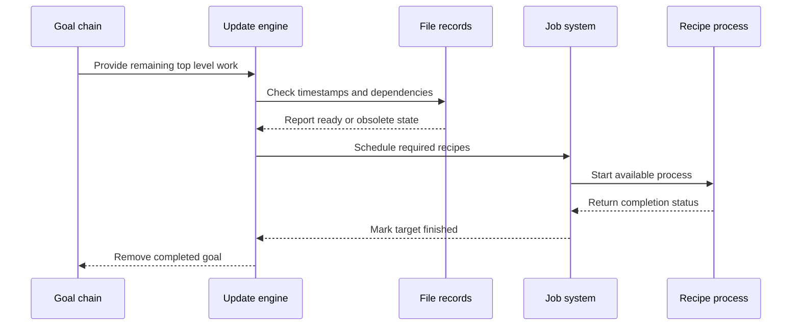

# Chapter 7: update_goal_chain

What happens after Make has read every makefile and collected all the targets?

Suppose you run:

```sh
make all
```

Make now has a list containing `all`, but `all` is only the visible entrance to a much larger project:

```text
all
 ├── app
 │    ├── main.o
 │    └── util.o
 └── tests
      └── test.o
```

Some files may be missing. Some may be older than their prerequisites. Some may be generated through implicit rules. Several branches may be safe to build in parallel, while others must wait.

The function that coordinates this work is `update_goal_chain`.

> **Description:** This is the high-level dependency-solving operation. Starting from requested goals, it recursively checks timestamps, updates prerequisites, detects cycles, chooses implicit rules, and schedules recipes. Think of it as a project manager walking a dependency tree, rebuilding only the branches whose outputs are missing or obsolete.

## Where the function fits

The public declaration is in [`src/dep.h`](../src/dep.h):

```c
enum update_status update_goal_chain (struct goaldep *goals);
```

Its implementation is in [`src/remake.c`](../src/remake.c):

```c
enum update_status
update_goal_chain (struct goaldep *goaldeps)
{
  unsigned long last_cmd_count = 0;
```

`update_goal_chain()` is called twice from `main()`:

1. First, to update makefiles that may have been generated or included.
2. Later, to update the user’s requested goals.

The first call follows the result of [`read_all_makefiles`](01_read_all_makefiles.md). The second follows the `goals` chain built while parsing command-line targets.

Conceptually:

```text
read makefiles
     ↓
possibly rebuild makefiles
     ↓
re-execute if their contents changed
     ↓
update requested goals
     ↓
run recipes or report that nothing is needed
```

This separation is important. A generated makefile can change the rules and variables used by the real build, so Make must finish that preparation before updating ordinary targets.

## Goals are dependency-shaped records

The function accepts a chain of `struct goaldep` records. `struct goaldep` reuses the same fields as [`struct dep`](05_struct_dep.md):

```c
struct goaldep
  {
    DEP (struct goaldep);
    int error;
    floc floc;
  };
```

Each goal record points to a `struct file`:

```text
goaldep
   |
   +-- file --> struct file for "all"
```

The `struct file` is the project card described in [`struct file`](04_struct_file.md). It contains:

- the target name;
- its prerequisites;
- its recipe;
- its timestamp cache;
- its update state;
- its target-specific variables;
- and its implicit-rule information.

The goal chain is therefore not a second build graph. It is a short list of starting points into the existing file database.

For example:

```text
goal chain:
  all -> install

file database:
  all -> app -> main.o
       -> tests
  install -> app
```

The same `struct file` can be reached from several goals.

## Why the chain is copied

The first operation inside `update_goal_chain()` is:

```c
struct dep *goals_orig = copy_dep_chain
  ((struct dep *)goaldeps);
struct dep *goals = goals_orig;
```

The function makes a private copy because it removes completed goals while scanning.

Imagine a project manager with a clipboard of tasks. As each top-level task finishes, the manager crosses it off the working list. The original request list remains intact, but the temporary working list becomes shorter.

The copied records still point to the same `struct file` objects. Only the dependency-shaped wrappers are duplicated:

```text
original goaldep --> file "all"
working dep      --> file "all"
```

This distinction matters because the file record stores the shared state. If `all` is reached through two goals, both paths observe the same `updated`, `update_status`, and `command_state` fields.

## The overall control loop

The central loop continues until the working goal list is empty:

```c
while (goals != 0)
  {
    struct dep *gu, *g, *lastgoal;

    start_waiting_jobs ();
    reap_children (last_cmd_count == command_count, 0);
```

There are three important actions here:

1. Start jobs that were waiting for the load average to drop.
2. Reap completed child processes.
3. Walk the remaining goals and update them.

The loop may need several passes. In a parallel build, a target can be waiting for prerequisites whose recipes are still running. Make returns to the goal chain after children finish and continues the work.

This is like a construction manager who:

1. assigns available crews;
2. checks which crews have finished;
3. updates the schedule;
4. assigns newly unblocked tasks;
5. repeats until every requested product is complete.

## Fresh consideration passes

The static variable `considered` tracks a scan through the dependency graph:

```c
static unsigned int considered = 0;
```

At the beginning of `update_goal_chain()`:

```c
++considered;
```

Each `struct file` has a matching field:

```c
unsigned int considered;
```

When Make begins processing a file, it records the current pass number. If another path reaches the same file during that pass, Make can avoid walking the same subtree again.

The check is in `update_file()`:

```c
if (f->considered == considered)
  {
    DBF (DB_VERBOSE, _("Pruning file '%s'.\n"));
    return f->command_state == cs_finished
           ? f->update_status : us_success;
  }
```

This is not the same as saying the target is permanently finished. It means only that this pass has already examined it and no relevant state change has occurred since then.

The distinction is useful in parallel builds. A file may have been considered while one of its prerequisites was still running. Once that prerequisite finishes, Make resets the relevant state and allows another pass to revisit the file.

## The goal-scanning loop

Inside the outer loop, Make walks each remaining goal:

```c
lastgoal = 0;
gu = goals;

while (gu != 0)
  {
    g = gu->shuf ? gu->shuf : gu;
    goal_dep = g;
```

The `shuf` link comes from the dependency structure explained in [`struct dep`](05_struct_dep.md). If prerequisite or goal shuffling is enabled, Make uses the alternate traversal order. Otherwise, it uses the ordinary chain.

`goal_dep` records the goal currently being processed. Error reporting for missing makefiles uses this pointer to identify the relevant goal record and source location.

## Double-colon goals

A target can have multiple independent double-colon rules:

```make
report::
	echo first

report::
	echo second
```

The file database represents these as several linked `struct file` records. `update_goal_chain()` iterates over them:

```c
for (file = g->file->double_colon
       ? g->file->double_colon : g->file;
     file != NULL;
     file = file->prev)
  {
    enum update_status fail;
```

Each double-colon entry is updated independently. The goal is removed from the working chain only after all its entries have finished.

This is like several independent work orders filed under the same product name. The project manager must complete every order before declaring the product finished.

## Updating one file

The actual recursive work begins here:

```c
fail = update_file (file,
                    rebuilding_makefiles ? 1 : 0);
```

`update_file()` is a wrapper around `update_file_1()`.

Its responsibilities include:

- pruning files already considered in the current pass;
- walking double-colon entries;
- freeing temporary allocation state;
- propagating failures;
- and calling `update_file_1()` for the detailed dependency logic.

The recursive depth argument is used for diagnostics and implicit-rule searches. Debug output can indent messages according to this depth, making a dependency walk easier to read.

The call graph looks like this:

```text
update_goal_chain
       ↓
  update_file
       ↓
 update_file_1
       ↓
    check_dep
       ↓
  update_file
```

This cycle is intentional. A target asks `check_dep()` to update a prerequisite, and that prerequisite may recursively update its own prerequisites.

## The detailed decision process

`update_file_1()` begins by checking whether the file has already been handled:

```c
if (file->updated)
  {
    if (file->update_status > us_none)
      return file->update_status;

    return us_success;
  }
```

Then it checks the command state:

```c
switch (file->command_state)
  {
  case cs_not_started:
  case cs_deps_running:
    break;
  case cs_running:
    return us_success;
```

The states come from [`struct file`](04_struct_file.md):

- `cs_not_started`: no recipe is running.
- `cs_deps_running`: prerequisites are still being built.
- `cs_running`: this target’s recipe is running.
- `cs_finished`: the work is complete.

The update status is separate:

- `us_success`: the update succeeded or nothing needed to be done.
- `us_none`: no final result has been recorded yet.
- `us_question`: `-q` found work that would be needed.
- `us_failed`: an update failed.

The two fields are like two labels on a delivery order:

```text
progress: waiting / packing / shipped
result:   not decided / successful / failed
```

## Marking a file as updating

Before descending into prerequisites, Make marks the file:

```c
start_updating (file);
```

The macro sets the `updating` bit on the root of a double-colon chain:

```c
#define start_updating(_f) \
  (((_f)->double_colon ? (_f)->double_colon : (_f))->updating = 1)
```

When processing is complete, Make clears it:

```c
finish_updating (file);
finish_updating (ofile);
```

This marker detects cycles in the concrete dependency graph.

For example:

```make
a: b
b: a
```

The walk looks like:

```text
update a
  update b
    update a again
```

When the second visit reaches `a`, `is_updating()` is true. Make reports:

```text
Circular a <- b dependency dropped.
```

Then it removes the circular edge from the active dependency chain instead of recursing forever.

This is like marking rooms while exploring a maze. If you enter a room that is already marked “currently exploring,” you have found a loop.

## Reading the target timestamp

The target’s timestamp is fetched early:

```c
this_mtime = file_mtime (file);
check_renamed (file);
noexist = this_mtime == NONEXISTENT_MTIME;
```

`file_mtime()` is the cached timestamp interface described in [`struct file`](04_struct_file.md). It may:

- call `stat`;
- search VPATH;
- resolve archive members;
- update `last_mtime`;
- rename a file record when a VPATH result becomes authoritative.

A missing target sets:

```c
must_make = noexist;
```

A nonexistent output is like an empty warehouse: regardless of the age of its inputs, Make needs to find a way to produce it.

Make also checks grouped targets stored in `also_make`. If a peer output is missing, the primary target must be rebuilt too:

```c
for (ad = file->also_make; ad && !noexist; ad = ad->next)
  {
    FILE_TIMESTAMP fmtime = file_mtime (ad->file);
    noexist = fmtime == NONEXISTENT_MTIME;
```

This supports grouped and multi-output pattern rules described in [`struct rule`](06_struct_rule.md).

## Choosing an implicit rule

If a target has no recipe, Make tries the implicit-rule machinery:

```c
if (!file->phony && file->cmds == 0
    && !file->tried_implicit)
  {
    try_implicit_rule (file, depth);
    file->tried_implicit = 1;
  }
```

This connects directly to [`struct rule`](06_struct_rule.md).

The search may:

- match a `%` pattern;
- calculate a stem;
- substitute that stem into prerequisite names;
- search VPATH;
- recursively search for rules to create missing intermediate files;
- attach the selected recipe to `file->cmds`;
- attach concrete prerequisites to `file->deps`.

For example:

```make
%.o: %.c
	$(CC) -c $< -o $@
```

When Make considers `main.o`, implicit search may produce:

```text
target: main.o
stem:   main
dep:    main.c
recipe: $(CC) -c $< -o $@
```

The rule is reusable. The `struct file` now contains the concrete choice for this target.

If no implicit rule is found, Make may use `.DEFAULT`:

```c
if (file->cmds == 0 && !file->is_target
    && default_file != 0 && default_file->cmds != 0)
  file->cmds = default_file->cmds;
```

If there is still no recipe, `remake_file()` later distinguishes between:

- a declared target that needs no actual file;
- a phony target;
- and an undeclared prerequisite that cannot be made.

## Updating prerequisites first

After selecting a recipe, Make walks the target’s prerequisites:

```c
amake.file = file;
amake.next = file->also_make;
ad = &amake;

while (ad)
  {
    du = ad->file->deps;
    ad = ad->next;
```

The `also_make` loop ensures that peer targets’ prerequisites are also considered. A grouped recipe may create several outputs, but all their dependency work must be complete before the recipe starts.

If secondary expansion is enabled, Make expands deferred prerequisite records:

```c
if (second_expansion)
  expand_deps (ad->file);
```

`expand_deps()` is the mechanism described in [`struct dep`](05_struct_dep.md). It activates the target’s variable context, sets automatic variables such as `$*`, expands saved prerequisite text, and replaces it with concrete dependency edges.

This is why a prerequisite can depend on the target name:

```make
.SECONDEXPANSION:
main.o: $$($$@_DEPS)
```

The expression is not resolved until Make is actually updating `main.o`.

## Order-only prerequisites

Each dependency edge may have `ignore_mtime` set. This flag comes from the pipe syntax:

```make
app: main.o | build
```

The update loop still visits `build`:

```c
new = check_dep (d->file, depth, this_mtime, &maybe_make);
```

But it only lets ordinary prerequisites force the target to rebuild:

```c
if (!d->ignore_mtime)
  must_make = maybe_make;
```

So `build` must be updated first, but a newer timestamp on `build` does not make `app` obsolete.

This is a useful distinction between two questions:

```text
Must this prerequisite be ready?       Yes.
Does its timestamp make me rebuild?   Not if it is order-only.
```

The same flag later affects automatic variables such as `$^`, `$?`, and `$|`, as explained in [`struct commands`](08_struct_commands.md).

## `.WAIT` and scheduling barriers

The dependency record can also carry `wait_here`, set when the parser sees `.WAIT`:

```make
all: first second .WAIT third
```

During the dependency walk:

```c
if (d->wait_here && running)
  break;
```

If earlier prerequisites are still running, Make stops before crossing the wait point. It can return to the goal in a later pass after those jobs finish.

This does not necessarily disable parallelism everywhere. It creates a barrier at one point in the dependency list.

The same flag is inserted for some `.NOTPARALLEL` cases by `snap_deps()`. One scheduling mechanism is reused for both explicit and implicit barriers.

## Checking dependency timestamps

For each prerequisite, Make records its original timestamp:

```c
mtime = file_mtime (d->file);
check_renamed (d->file);
```

It then recursively updates the prerequisite:

```c
d->file->parent = file;
maybe_make = must_make;

new = check_dep (d->file, depth, this_mtime, &maybe_make);
```

`check_dep()` handles two broad cases:

- ordinary or phony prerequisites are fully updated;
- intermediate prerequisites may be inspected and rebuilt only when necessary.

After the prerequisite update, Make checks whether it is now newer or still missing:

```c
if (!running)
  d->changed = ((file_mtime (d->file) != mtime)
                || (mtime == NONEXISTENT_MTIME));
```

The `changed` flag later contributes to `$?` and to the target’s rebuild decision.

Then the target’s `must_make` value is updated:

```c
if (!d->ignore_mtime)
  must_make = maybe_make;
```

The logic is recursive, but the rule is straightforward:

```text
A target must be rebuilt if:
  - it does not exist;
  - a normal prerequisite does not exist;
  - a normal prerequisite changed;
  - a normal prerequisite is newer;
  - the target is phony;
  - or always-make mode is active.
```

## Handling intermediate files

Implicit rule search can create a chain such as:

```text
program
   ↓
program.o
   ↓
program.c
```

Sometimes `program.o` is only a temporary intermediate file. Make does not always update such files during the first dependency scan, because it may not yet know whether the final target needs rebuilding.

After determining that a target must be remade, `update_file_1()` makes a second pass over intermediate prerequisites:

```c
if (must_make || always_make_flag)
  {
    for (du = file->deps; du != 0; du = du->next)
      {
        d = du->shuf ? du->shuf : du;
```

It then recursively updates prerequisite files marked `intermediate`.

This two-stage approach avoids unnecessary work. An intermediate file may be left untouched if the final target is already current.

After the build, [`remove_intermediates`](04_struct_file.md) may delete temporary files unless they are protected by `.PRECIOUS`, `.SECONDARY`, or `.NOTINTERMEDIATE`.

## Deciding whether the target is stale

Once prerequisites have been processed, Make scans their timestamps again:

```c
deps_changed = 0;

for (d = file->deps; d != 0; d = d->next)
  {
    FILE_TIMESTAMP d_mtime = file_mtime (d->file);
    check_renamed (d->file);
```

Normal prerequisites contribute to `deps_changed`:

```c
if (!d->ignore_mtime)
  deps_changed |= d->changed;
```

Make also marks a dependency as changed when the target itself did not exist or when the dependency is newer:

```c
d->changed |= noexist || d_mtime > this_mtime;
```

Then several special cases are handled:

- a double-colon target with no prerequisites is always made;
- a target with no recipe and no changed prerequisites may not need rebuilding;
- `always_make_flag` forces recipes to run.

The final decision is:

```c
if (!must_make)
  {
    notice_finished_file (file);
    return us_success;
  }
```

If no recipe is needed, `notice_finished_file()` marks the target complete without starting a child process.

## Starting a recipe

When a target must be remade, Make calls:

```c
remake_file (file);
```

If the target has no recipe, `remake_file()` reports an appropriate failure or treats a declared target as successfully considered.

If a recipe exists, it prepares the command record:

```c
chop_commands (file->cmds);
execute_file_commands (file);
```

The details of `struct commands` come in [struct commands](08_struct_commands.md), but the important sequence is:

1. Split recipe text into logical lines.
2. Initialize target-specific variables.
3. Define automatic variables such as `$@`, `$<`, `$^`, and `$?`.
4. Expand each command for this target.
5. Hand the command to the job subsystem.

The automatic-variable setup happens in `execute_file_commands()`:

```c
initialize_file_variables (file, 0);
set_file_variables (file, file->stem);
new_job (file);
```

The target-specific variable chain comes from [`struct variable`](02_struct_variable.md). Recipe expansion uses [`variable_expand`](03_variable_expand.md).

## Running jobs and returning later

`new_job()` may start a child immediately, place it on a waiting list, or wait for a job slot.

The job subsystem tracks each running process with a `struct child`, covered in [struct child](09_struct_child.md).

A target whose prerequisites or recipe are still running receives an intermediate status:

```c
if (running)
  {
    set_command_state (file, cs_deps_running);
    return us_success;
  }
```

Returning `us_success` here does not necessarily mean the final recipe has completed. It means no failure has been recorded yet and Make should continue the broader scheduling loop.

Later, `reap_children()` notices that a child has exited. It calls `notice_finished_file()`, which:

- marks the target finished;
- stores the update status;
- refreshes the timestamp cache;
- propagates state to grouped peer targets;
- and allows dependent targets to continue.

The project manager analogy is especially useful here: assigning a task is not the same as completing it. Make records the assignment, continues with other work, and later processes the completion report.

## Status propagation

After `update_file()` returns, `update_goal_chain()` examines the result:

```c
if ((fail || file->updated) && status < us_question)
  {
    if (file->update_status)
      status = file->update_status;
```

The target’s `update_status` is authoritative when it is nonzero.

Possible outcomes include:

```text
us_success   all requested work succeeded or was unnecessary
us_question  -q found work that would be needed
us_failed    a recipe or dependency failed
us_none      nothing produced a final result yet
```

The function keeps the highest-severity result encountered. This allows the caller in `main()` to choose the final process exit status:

```c
switch (update_goal_chain (goals))
  {
  case us_none:
  case us_success:
    break;
  case us_question:
    makefile_status = MAKE_TROUBLE;
    break;
  case us_failed:
    makefile_status = MAKE_FAILURE;
    break;
  }
```

The shell-level result is therefore translated from Make’s internal update status:

```text
us_success  → exit 0
us_question → exit 1
us_failed   → exit 2
```

## Removing completed goals

A goal is removed from the working chain when:

- its update has finished;
- all double-colon entries are complete;
- or Make is instructed to stop at a successfully rebuilt makefile.

The removal logic is:

```c
if (stop || !any_not_updated)
  {
    if (lastgoal == 0)
      goals = gu->next;
    else
      lastgoal->next = gu->next;
```

`lastgoal` tracks the previous goal in the linked list. Removing a node does not alter the file database; it only removes that starting point from the current work queue.

If there is nothing to remove, the function advances:

```c
else
  {
    lastgoal = gu;
    gu = gu->next;
  }
```

When the scan reaches the end of the list, `considered` is incremented so the next pass can distinguish new work from the previous pass.

## The special makefile-rebuild mode

The same `update_goal_chain()` function updates both ordinary goals and makefiles. The global variable is set by `main()`:

```c
rebuilding_makefiles = 1;
status = update_goal_chain (read_files);
rebuilding_makefiles = 0;
```

The function saves the normal values of three command-line modes:

```c
int t = touch_flag, q = question_flag, n = just_print_flag;
```

While rebuilding makefiles, these modes are normally disabled for makefiles that were not explicitly requested as command-line goals:

```c
if (file->cmd_target)
  {
    touch_flag = t;
    question_flag = q;
    just_print_flag = n;
  }
else
  touch_flag = question_flag = just_print_flag = 0;
```

Why?

Imagine that `-n` means “show me what the project would do,” but Make needs to generate a makefile before it can understand the project. If Make merely printed the makefile-generation command and then re-executed, it could enter an endless restart loop without ever creating the file.

The same concern applies to:

- `-t`, which touches instead of running recipes;
- `-q`, which asks whether work is needed;
- and `-n`, which only prints commands.

The special makefile mode makes sure generated makefiles can actually be prepared when necessary.

## Stopping after a rebuilt default makefile

When Make starts with no default makefile, [`read_all_makefiles`](01_read_all_makefiles.md) records several candidates:

```text
GNUmakefile
makefile
Makefile
```

Each candidate has `RM_DONTCARE`. During the update, if one is successfully created, `update_goal_chain()` marks the goal as finished and sets `stop`:

```c
if (rebuilding_makefiles && file->dontcare)
  stop = 1;
```

This prevents Make from trying to rebuild every possible default name. Once one candidate exists, Make stops and `main()` re-executes so the new makefile can be read.

This is like searching for a primary manual in priority order. Once the first usable manual has been generated, there is no reason to generate all the alternatives.

## The makefile restart decision

`update_goal_chain()` itself returns a status. `main()` compares makefile timestamps before and after the update:

```c
if (file->updated)
  {
    if (file->update_status == us_success)
      any_remade |= (file_mtime_no_search (d->file)
                     != makefile_mtimes[i]);
  }
```

If a makefile changed, control reaches the restart path:

```c
case us_success:
re_exec:
  remove_intermediates (0);
```

Make then reconstructs its argument list and executes itself again. The second process reads the changed makefile through [`read_all_makefiles`](01_read_all_makefiles.md).

This restart is why `update_goal_chain()` serves two kinds of projects:

```text
ordinary goals:
  update targets and finish

makefile goals:
  update generated inputs, then restart the parser
```

## Parallel scheduling

The update engine does not directly fork processes. It asks the job subsystem to start work through `new_job()`.

However, `update_goal_chain()` is responsible for repeatedly creating opportunities to run jobs:

```c
start_waiting_jobs ();
reap_children (...);
```

The job subsystem uses:

- the jobserver for parallel slots;
- load-average limits;
- waiting jobs;
- child completion notifications;
- and output synchronization.

The high-level relationship is:



The key idea is that dependency traversal and process scheduling are interleaved. Make does not first calculate an entire static schedule and then execute it. It walks as far as it can, starts available work, waits for completions, and resumes the walk.

## `-q`, `-n`, and `-t`

Several command-line modes change what “update” means.

### Question mode: `-q`

With `-q`, Make should not run recipes. `start_job_command()` detects this:

```c
if (argv != 0 && question_flag
    && NONE_SET (flags, COMMANDS_RECURSE))
  {
    child->file->update_status = us_question;
    notice_finished_file (child->file);
    return;
  }
```

A nonempty recipe means the target would need work, so the target receives `us_question`.

`update_goal_chain()` stops early for ordinary goals when `-q` has established the answer:

```c
stop = (question_flag && !keep_going_flag
        && !rebuilding_makefiles);
```

### Just-print mode: `-n`

With `-n`, Make expands and prints recipes but does not execute ordinary commands. The job layer still increments `commands_started` when a command would have started.

That matters because `update_goal_chain()` uses the command count to set the goal’s `changed` flag:

```c
if (commands_started > ocommands_started)
  g->changed = 1;
```

Make can therefore distinguish:

```text
nothing needed
from
a recipe would have run
```

even though no child process was created.

### Touch mode: `-t`

With `-t`, Make updates timestamps instead of running ordinary recipes. `notice_finished_file()` calls `touch_file()` when appropriate.

Recursive make commands receive special handling so that a parent Make can still invoke a child Make when needed. This prevents `-t` from pretending that an entire recursive build happened merely because the top-level recipe was touched.

## Error handling and `dontcare`

Missing prerequisites and failed included makefiles do not all have the same severity.

The `dontcare` flag is inherited during makefile rebuilding:

```c
dontcare = d->file->dontcare;
d->file->dontcare = file->dontcare;
```

If a missing file is optional, Make may defer or suppress its diagnostic. If the file was required, `complain()` eventually reports:

```text
No rule to make target 'missing.h', needed by 'app'.
```

For included makefiles, `show_goal_error()` uses `goal_dep` and `goal_list` to report the original source location and error:

```c
if ((goal_dep->flags & (RM_INCLUDED|RM_DONTCARE)) != RM_INCLUDED)
  return;
```

This lets Make distinguish:

```text
optional generated include
from
required include
from
ordinary missing prerequisite
```

The flags on `struct goaldep`, introduced in [`struct dep`](05_struct_dep.md), therefore influence both scheduling and diagnostics.

## A complete example

Consider:

```make
app: main.o util.o | build
	$(CC) -o $@ $^

main.o: main.c
util.o: util.c

build:
	mkdir -p build
```

Assume:

- `app` does not exist;
- `main.o` exists but is older than `main.c`;
- `util.o` is current;
- `build` does not exist.

The update proceeds conceptually like this:

1. `update_goal_chain()` receives the goal `app`.
2. `update_file(app)` checks that `app` is missing.
3. It visits `main.o`.
4. `main.o` is older than `main.c`, so its recipe is scheduled.
5. It visits `util.o`.
6. `util.o` is already current.
7. It visits `build`.
8. `build` is created because it is missing.
9. Because `build` is order-only, its timestamp does not independently make `app` stale.
10. `main.o` changed, so `app` must be rebuilt.
11. Make initializes `$@`, `$^`, and other automatic variables.
12. Make expands and runs the link recipe.
13. Child completion marks `app` finished.
14. The goal is removed from the working chain.
15. `update_goal_chain()` returns `us_success`.

The important observation is that Make did not rebuild every branch equally:

```text
main.o: rebuilt
util.o: skipped
build: created as a prerequisite
app: rebuilt because main.o changed
```

That selective behavior is the purpose of the timestamp and state machinery.

## A second example: a cycle

```make
a: b
b: c
c: a
```

The walk is:

```text
update a
  update b
    update c
      update a
```

When the final `update a` sees that `a` is already marked `updating`, Make drops the circular dependency and reports it.

The function does not rely on recursion depth alone. A deep but valid dependency tree is allowed; the `updating` marker identifies a path that returns to an active ancestor.

## A third example: implicit construction

```make
app.o: app.c
```

If `app.o` has no recipe, Make may discover:

```make
%.o: %.c
	$(CC) -c $< -o $@
```

The process becomes:

```text
update app.o
     ↓
try implicit rule
     ↓
match %.o
     ↓
stem = app
     ↓
prerequisite = app.c
     ↓
update app.c
     ↓
schedule compile recipe
```

The selected rule is attached to `app.o`’s `struct file`, while the reusable `struct rule` remains available for other object files.

## Why update status starts at `us_none`

`us_none` does not mean failure. It means that the update has not yet produced a final result.

For example, while prerequisites are running:

```text
update_status = us_none
command_state = cs_deps_running
```

When the prerequisites finish and no recipe is needed, `notice_finished_file()` changes the status to `us_success`.

When `-q` finds that a recipe would be required:

```text
update_status = us_question
```

When a child exits unsuccessfully:

```text
update_status = us_failed
```

Keeping “not finished yet” separate from “failed” is essential for parallel scheduling. Otherwise, Make could mistake a target waiting for a child for a target that has already failed.

## Inspecting the update process

The most useful diagnostic options are:

```sh
make --debug=v
```

This shows verbose dependency decisions, including:

- when a target is considered;
- when a prerequisite is newer;
- when an implicit rule is searched;
- when a circular dependency is dropped;
- when a target is skipped;
- when a recipe starts or finishes.

For more detail:

```sh
make --debug=a
```

This enables all available debug categories, including job and implicit-rule messages.

The internal database is useful after the build:

```sh
make -p
```

Look at each file record for:

- cached modification time;
- update status;
- command state;
- selected implicit stem;
- prerequisites;
- intermediate and phony flags.

To test parallel behavior:

```sh
make -j4 --debug=j
```

This exposes jobserver tokens, waiting jobs, child processes, and completion events.

To test undeclared ordering dependencies:

```sh
make --shuffle=random
```

If the build fails only when prerequisites are shuffled, the makefile may rely accidentally on written order instead of declaring the true dependency.

## The complete mental model

You can remember `update_goal_chain()` as a project manager using a live task board.

### 1. Start with top-level requests

```text
all
install
test
```

These are `struct goaldep` records pointing into the file database.

### 2. Pick a goal still on the board

The working chain contains goals not yet finished.

### 3. Inspect the target card

Read:

- cached timestamp;
- recipe;
- prerequisites;
- special flags;
- current command state.

### 4. Choose a recipe if needed

If no explicit recipe exists, search the pattern-rule collection described in [`struct rule`](06_struct_rule.md).

### 5. Visit prerequisites

For each `struct dep` edge:

- expand deferred names;
- detect cycles;
- update the prerequisite recursively;
- compare timestamps;
- honor order-only and `.WAIT` flags.

### 6. Schedule work

If the target is missing or obsolete, pass its recipe to the job subsystem described in [struct child](09_struct_child.md).

### 7. Wait and resume

Parallel jobs may still be running. Reap finished children, update file state, and revisit goals that were waiting.

### 8. Complete or report

Mark the file successful, questionable, or failed. Remove completed top-level goals from the working chain.

The overall algorithm is:

```text
goal
 ↓
target timestamp
 ↓
implicit rule selection if necessary
 ↓
prerequisite expansion
 ↓
recursive prerequisite updates
 ↓
cycle and ordering checks
 ↓
timestamp comparison
 ↓
recipe scheduling
 ↓
child completion
 ↓
goal removal
```

## Key takeaways

- `update_goal_chain()` is the top-level coordinator for dependency solving.
- It is used both for rebuilding makefiles and for updating ordinary user goals.
- It copies the goal chain so completed goals can be removed safely.
- `considered` prevents repeated graph walks during one scheduling pass.
- `update_file()` and `update_file_1()` perform the recursive target update.
- `file_mtime()` supplies cached timestamps and may perform VPATH searches.
- Missing targets normally need rebuilding.
- Prerequisites are updated before their target’s recipe is scheduled.
- `ignore_mtime` implements order-only prerequisites.
- `wait_here` implements `.WAIT` and related scheduling barriers.
- `updating` detects circular dependencies.
- `tried_implicit` prevents repeated implicit-rule searches.
- Pattern rules can be selected lazily when a concrete target needs a recipe.
- Intermediate prerequisites are reconsidered after Make knows the final target must be rebuilt.
- `changed` contributes to timestamp decisions and automatic variable `$?`.
- `command_state` tracks progress while `update_status` records the final outcome.
- Parallel builds repeatedly schedule available work and revisit goals after children finish.
- `-q`, `-n`, and `-t` alter what it means to update a target.
- Makefile rebuilding temporarily changes those options to avoid restart loops.
- A changed makefile causes `main()` to re-execute Make and reread the build description.
- The final status becomes Make’s process exit code.

Now that you understand how Make walks dependency edges, chooses recipes, and decides which targets need work, the next question is how recipe text is split, expanded, and turned into executable command lines. That is the subject of [struct commands](08_struct_commands.md).