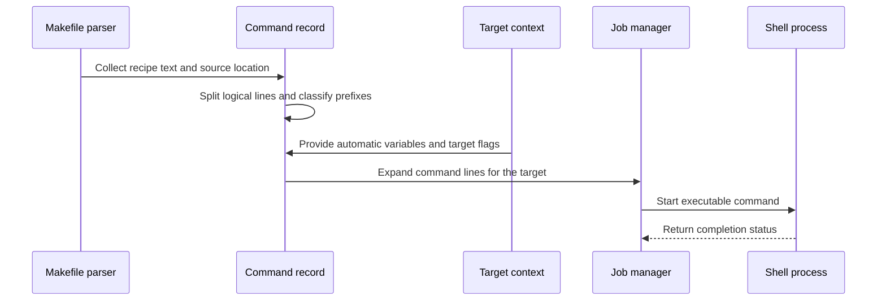

# Chapter 8: struct commands

What happens when Make reads this target?

```make
app: main.o
	@echo Building $@
	$(CC) -o $@ $^
```

The recipe looks like two command lines, but Make cannot execute it immediately. It must remember:

- where the recipe came from;
- the complete recipe text;
- which character introduces recipe lines;
- whether each line is silent;
- whether errors should be ignored;
- whether a line invokes another Make;
- and how to split the text into executable commands later.

That information is stored in `struct commands`.

> **Description:** A `struct commands` stores the recipe text associated with a target, its source location, recipe prefix, and per-line flags such as silent, ignore-error, or recursive. It is the build instruction sheet attached to a target, later split into executable command lines and expanded with variables.

The target itself is represented by `struct file`, described in [struct file](04_struct_file.md). Its `cmds` field points to this recipe record:

```text
struct file
    |
    +-- cmds --> struct commands
```

The prerequisite links remain in `struct dep`, covered in [struct dep](05_struct_dep.md). The recipe is the part that eventually turns a ready target into a shell process.

## Where the structure is declared

The definition is in [`src/commands.h`](../src/commands.h):

```c
struct commands
  {
    floc fileinfo;
    char *commands;
    char **command_lines;
    unsigned char *lines_flags;
```

The remaining fields are:

```c
    unsigned short ncommand_lines;
    char recipe_prefix;
    unsigned int any_recurse:1;
  };
```

Each field has a distinct responsibility:

- `fileinfo`: source filename and line information;
- `commands`: the original recipe text;
- `command_lines`: the recipe split into logical lines;
- `lines_flags`: flags associated with each logical line;
- `ncommand_lines`: number of logical lines;
- `recipe_prefix`: the character that introduced the recipe;
- `any_recurse`: whether at least one line invokes a recursive Make.

Think of the structure as an instruction sheet with two versions:

```text
original sheet:
  one block of recipe text

execution sheet:
  one expanded command line at a time
```

Make keeps the original form because it is useful for diagnostics, printing the database, and delaying work until the target actually needs rebuilding.

## Recipes are collected while parsing

The parser in [`src/read.c`](../src/read.c) reads makefiles one logical line at a time. When it sees a line beginning with the current recipe prefix, usually a tab, it treats that line as recipe text:

```c
if (line[0] == cmd_prefix)
  {
    if (no_targets)
      continue;
```

If a target is currently being collected, the parser appends the line:

```c
memcpy (&commands[commands_idx], line + 1,
        linelen - 1);
commands_idx += linelen - 1;
commands[commands_idx++] = '\n';
```

The leading tab is not stored. It tells the parser that the line is a recipe; the shell should receive the text after that prefix.

For example:

```make
app:
	echo hello
```

is stored conceptually as:

```text
echo hello\n
```

not:

```text
\t echo hello\n
```

The parser accumulates recipe lines in a temporary buffer. It does not allocate a `struct commands` for every line. It waits until the complete rule is known.

## The recipe prefix

The normal recipe prefix is a tab:

```c
char cmd_prefix = '\t';
```

The special variable `.RECIPEPREFIX` can change it:

```make
.RECIPEPREFIX = >
app:
>echo hello
```

When `.RECIPEPREFIX` is assigned, `set_special_var()` updates the global prefix:

```c
else if (streq (var->name, RECIPEPREFIX_NAME))
  {
    cmd_prefix = var->value[0] == '\0'
                 ? RECIPEPREFIX_DEFAULT : var->value[0];
  }
```

The parser uses the current value when reading subsequent rules.

When Make stores a recipe, it records the prefix that was active at that point:

```c
cmds->recipe_prefix = prefix;
```

This matters because `.RECIPEPREFIX` can change later. The recipe must still remember how it was written.

The analogy is a form printed with a particular margin marker. Even if the office changes its preferred marker tomorrow, the old form retains the marker that explains its layout.

## Creating `struct commands`

Once the parser reaches the next rule, a variable assignment, an include directive, or the end of the file, it calls `record_files()`.

If recipe text was collected, `record_files()` creates the command record:

```c
cmds = xmalloc (sizeof (struct commands));
cmds->fileinfo.filenm = flocp->filenm;
cmds->fileinfo.lineno = cmds_started;
```

It stores the remaining metadata:

```c
cmds->fileinfo.offset = 0;
cmds->commands = xstrndup (commands, commands_idx);
cmds->command_lines = 0;
cmds->recipe_prefix = prefix;
```

At this point:

- `commands` contains the complete unexpanded recipe;
- `command_lines` is still `NULL`;
- `lines_flags` has not been allocated;
- variable references such as `$(CC)` remain untouched.

The `struct commands` is then attached to the target’s `struct file`:

```c
if (cmds != 0)
  f->cmds = cmds;
```

If another single-colon rule supplies a different recipe for the same target, Make warns about overriding the old recipe:

```text
warning: overriding recipe for target 'app'
warning: ignoring old recipe for target 'app'
```

The target keeps one effective recipe pointer, although command records can be shared by pattern and suffix rules.

## Source locations travel with recipes

The `fileinfo` member is a `floc`, the source-location structure used throughout Make:

```c
typedef struct
  {
    const char *filenm;
    unsigned long lineno;
    unsigned long offset;
  } floc;
```

For a recipe read from:

```text
Makefile:12
```

the command record remembers that location.

This supports diagnostics such as:

```text
Makefile:12: warning: overriding recipe for target 'app'
```

It also lets `job.c` report failures using the recipe’s source location:

```text
Makefile:12: *** [app] Error 1
```

For built-in recipes, `fileinfo.filenm` is `NULL`. Printing code identifies these as built-in commands:

```c
if (cmds->fileinfo.filenm == 0)
  puts (_(" (built-in):"));
```

The location is like a return address written on an instruction sheet. If the instruction causes trouble, Make can tell you which document and line supplied it.

## One block first, lines later

Why does Make store the recipe as one string before splitting it?

Because the exact execution boundaries are not always obvious while parsing. A recipe may contain:

```make
app:
	echo one \
	     two
	echo three
```

The backslash-newline joins the first two physical lines into one logical shell command.

A recipe may also be affected by:

- `.ONESHELL`;
- escaped newlines;
- shell-specific quoting;
- variable expansion;
- commands generated by `define`;
- and recipes inherited from pattern rules.

Therefore, `struct commands` keeps the source text intact until Make knows how the recipe should be interpreted.

This is similar to storing a paragraph before deciding where sentences end. The paragraph preserves the author’s original formatting; a later pass can identify the actual units needed by the reader.

## Splitting with `chop_commands()`

The recipe is split by:

```c
void
chop_commands (struct commands *cmds)
```

The first guard prevents repeated work:

```c
if (!cmds || cmds->command_lines != NULL)
  return;
```

If `.ONESHELL` is active, all recipe text becomes one command line:

```c
if (one_shell)
  {
    size_t l = strlen (cmds->commands);
    nlines = 1;
```

Make copies the complete recipe:

```c
lines = xmalloc (nlines * sizeof (char *));
lines[0] = xstrdup (cmds->commands);
```

It then removes the final newline. The shell receives one script rather than one process per recipe line.

Without `.ONESHELL`, `chop_commands()` searches for unescaped newlines:

```c
const char *p = cmds->commands;
while (*p != '\0')
  {
    const char *end = strchr (p, '\n');
```

If the newline is escaped, it continues scanning:

```c
else if (end > p && end[-1] == '\\')
  {
    ++end;
    goto find_end;
  }
```

Each logical line is copied into `command_lines`:

```c
lines[nlines++] = xstrndup (p, end - p);
```

The result for:

```make
app:
	echo one \
	     two
	echo three
```

is conceptually:

```text
command_lines[0] = "echo one \\\n     two"
command_lines[1] = "echo three"
```

The first recipe line still contains the escaped newline. Later command construction decides how to pass it to the shell.

## The line flags

After splitting, `chop_commands()` allocates one flag byte for each logical line:

```c
cmds->ncommand_lines = nlines;
cmds->command_lines = lines;
cmds->any_recurse = 0;
cmds->lines_flags = xmalloc (nlines);
```

The flags are declared in [`src/commands.h`](../src/commands.h):

```c
#define COMMANDS_RECURSE  1
#define COMMANDS_SILENT   2
#define COMMANDS_NOERROR  4
```

They represent:

- `COMMANDS_RECURSE`: invoke another Make or explicitly marked recursive command;
- `COMMANDS_SILENT`: do not echo this line;
- `COMMANDS_NOERROR`: ignore an error from this line.

The parser examines prefix characters at the start of each line:

```c
while (ISBLANK (*p) || *p == '-' || *p == '@' || *p == '+')
  switch (*(p++))
```

An `@` sets silent mode:

```c
case '@':
  flags |= COMMANDS_SILENT;
  break;
```

A `-` sets ignore-error mode:

```c
case '-':
  flags |= COMMANDS_NOERROR;
  break;
```

A `+` marks the line as recursive:

```c
case '+':
  flags |= COMMANDS_RECURSE;
  break;
```

For this recipe:

```make
app:
	@echo quiet
	-rm temporary-file
	+$(MAKE) helper
```

the flags are conceptually:

```text
line 0: COMMANDS_SILENT
line 1: COMMANDS_NOERROR
line 2: COMMANDS_RECURSE
```

The prefixes are instructions to Make, not necessarily text that should be passed to the shell.

## Detecting recursive Make commands

A command can be recursive because it begins with `+`:

```make
	+$(MAKE) subdir
```

It can also be recognized through a reference to `$(MAKE)` or `${MAKE}`:

```c
if (!ANY_SET (flags, COMMANDS_RECURSE)
    && (strstr (p, "$(MAKE)") != 0
        || strstr (p, "${MAKE}") != 0))
  flags |= COMMANDS_RECURSE;
```

This matters for special modes such as `-n`.

Normally, `-n` prints commands without running them. But recursive Make commands must still be allowed to run so the parent Make can delegate work to a child Make:

```make
subsystem:
	$(MAKE) -C subdir
```

The recursive flag tells the job system that this command has special behavior.

After processing all lines, `chop_commands()` summarizes the recipe:

```c
cmds->any_recurse |=
  ANY_SET (flags, COMMANDS_RECURSE) ? 1 : 0;
```

`any_recurse` is a quick answer to the question:

```text
Does any line in this recipe need recursive-command treatment?
```

It avoids repeatedly scanning every line when Make prepares a job.

## Prefixes are interpreted again at execution time

The initial scan in `chop_commands()` identifies common flags early. But command expansion can reveal more prefix characters.

For example:

```make
prefix = @
app:
	$(prefix)echo hello
```

The stored line does not visibly begin with `@` until variable expansion occurs.

In `job.c`, `start_job_command()` combines the saved flags with the actual expanded command text:

```c
flags = (child->file->command_flags
         | child->file->cmds->lines_flags[child->command_line - 1]);
```

It then scans the command beginning:

```c
while (*p != '\0')
  {
    if (*p == '@')
      flags |= COMMANDS_SILENT;
```

It also recognizes `+` and `-` after expansion.

This is a two-stage inspection:

```text
stored recipe text
        ↓
initial prefix scan
        ↓
variable expansion
        ↓
final prefix scan
        ↓
actual execution flags
```

The first stage supports early scheduling decisions. The second stage handles prefixes produced by variables.

## Target-wide command flags

Per-line flags are not the only source of command behavior. A target can receive flags through special targets.

For example:

```make
.SILENT: app
.IGNORE: generated.txt
```

During `snap_deps()`, Make marks the corresponding `struct file` records:

```c
f2->command_flags |= COMMANDS_NOERROR;
```

or:

```c
f2->command_flags |= COMMANDS_SILENT;
```

These target-wide flags are combined with the individual line flags in `start_job_command()`.

The distinction is:

```text
lines_flags:
  behavior of one recipe line

file->command_flags:
  behavior of all lines for one target
```

This is like a workplace with both:

- a note attached to one task: “do not announce this task”;
- a policy attached to the whole project: “ignore failures for every task.”

## Preparing a target for execution

The update engine calls `remake_file()` after deciding that a target needs rebuilding. If a recipe exists, it first ensures the command lines are ready:

```c
chop_commands (file->cmds);
execute_file_commands (file);
```

`execute_file_commands()` handles empty recipes specially:

```c
for (p = file->cmds->commands; *p != '\0'; ++p)
  if (!ISSPACE (*p) && *p != '-' && *p != '@' && *p != '+')
    break;
```

If nothing meaningful remains, Make treats the recipe as successful without starting a shell:

```c
if (*p == '\0')
  {
    set_command_state (file, cs_running);
    file->update_status = us_success;
```

Otherwise, it prepares target variables:

```c
initialize_file_variables (file, 0);
set_file_variables (file, file->stem);
```

This creates automatic variables such as:

- `$@`: target name;
- `$<`: first normal prerequisite;
- `$^`: distinct normal prerequisites;
- `$?`: prerequisites newer than the target;
- `$|`: order-only prerequisites;
- `$*`: pattern stem.

The variable context comes from [struct variable](02_struct_variable.md), and the expansion engine comes from [variable_expand](03_variable_expand.md).

## The `new_job()` handoff

After setting automatic variables, `execute_file_commands()` calls:

```c
new_job (file);
```

This transfers the prepared recipe to the job subsystem.

The overall path is:



`new_job()` performs several important steps:

1. calls `chop_commands()` if needed;
2. allocates a `struct child`;
3. expands every command line for the target;
4. obtains the first command to run;
5. waits for an available job slot;
6. starts the command or places it on a waiting list.

The `struct child` that tracks the running process is the subject of [struct child](09_struct_child.md).

## Expansion occurs in `new_job()`

The command lines stored in `struct commands` are still unexpanded. `new_job()` creates a separate expanded copy for the child:

```c
lines = xmalloc (cmds->ncommand_lines * sizeof (char *));
for (i = 0; i < cmds->ncommand_lines; ++i)
  {
    cmds->fileinfo.offset = i;
```

The final expansion call is:

```c
lines[i] = allocated_variable_expand_for_file
  (cmds->command_lines[i], file);
```

The `file` argument is essential. It makes target-specific variables and automatic variables visible.

For:

```make
CC = cc
app: main.o
	$(CC) -o $@ $^
```

the stored line is:

```text
$(CC) -o $@ $^
```

The expanded child line becomes something like:

```text
cc -o app main.o
```

The original line remains in `cmds->command_lines`. The expanded line belongs to the child job.

This separation is like a reusable form template and a completed copy:

```text
template:
  $(CC) -o $@ $^

completed form:
  cc -o app main.o
```

The same template can be used for another target with different automatic-variable values.

## Backslash-newline cleanup inside references

Before final expansion, `new_job()` performs a small cleanup pass for backslash-newline sequences inside variable and function references.

For example:

```make
app:
	echo $(subst a, b, \
	             value)
```

The parser preserves some formatting so that the recipe can be displayed attractively. But the function should not receive the newline and indentation as literal argument text.

The cleanup code searches for dollar signs:

```c
while ((ref = strchr (in, '$')) != 0)
  {
    ++ref;
```

When it finds a reference, it counts parentheses and removes unescaped continuation sequences inside that reference. It replaces the continuation and following whitespace with one space.

This gives Make two useful behaviors at once:

- command echoing can preserve readable line formatting;
- function and variable expansion can see normalized arguments.

## Choosing a shell or direct execution

After expansion, `new_job()` asks the job layer to prepare a command:

```c
job_next_command (c);
```

Eventually, `start_job_command()` calls:

```c
argv = construct_command_argv
  (p, &end, child->file,
   child->file->cmds->lines_flags[child->command_line - 1],
   &child->sh_batch_file);
```

`construct_command_argv()` decides whether Make can execute the line directly or must invoke the shell.

A simple command such as:

```text
cc -c main.c -o main.o
```

may be parsed directly into an argument vector.

A shell-sensitive command such as:

```text
echo $HOME > output
```

requires shell interpretation because it contains shell syntax.

On Unix, the shell is normally:

```text
/bin/sh
```

On Windows, Make may use a batch file or a discovered shell executable. The command record does not need to know these platform details. It only supplies the recipe text and flags; `job.c` chooses the execution strategy.

## Recursive commands and `-n`

Suppose the user runs:

```sh
make -n
```

For an ordinary command, Make prints the expanded recipe and does not start a child.

For a recursive command:

```make
subdir:
	$(MAKE) -C subdir
```

the `COMMANDS_RECURSE` flag tells Make that this line is allowed to run even under print-only mode.

In `start_job_command()`:

```c
if (argv != 0 && question_flag
    && NONE_SET (flags, COMMANDS_RECURSE))
```

question mode reports that work is needed only for nonrecursive commands. Similar logic appears for `just_print_flag`.

The reason is practical: a top-level Make must be able to coordinate sub-Makes. Treating every recursive invocation as mere text would prevent the child build from receiving the parent’s jobserver and variable environment.

## Silent commands

A recipe line beginning with `@` is not echoed:

```make
app:
	@echo Building app
```

The command still runs. Only Make’s own display is suppressed.

In `start_job_command()`, Make decides whether to print:

```c
if (just_print_flag || ISDB (DB_PRINT)
    || (NONE_SET (flags, COMMANDS_SILENT) && !run_silent))
  OS (message, 0, "%s", p);
```

The command is printed when:

- `-n` is active;
- database printing or command tracing requests it;
- and the command is not silent.

A global `-s` or `.SILENT` affects `run_silent` or `command_flags`, while `@` affects only the relevant line.

## Ignoring errors

A recipe line beginning with `-` tells Make to continue if that command fails:

```make
clean:
	-rm generated-file
```

The line still executes. If the shell returns an error, the job layer marks it as ignored rather than failing the target.

The per-line flag is copied into the child state:

```c
child->noerror = ANY_SET (flags, COMMANDS_NOERROR);
```

When the child exits, `reap_children()` checks:

```c
if (child_failed && !c->noerror
    && !ignore_errors_flag)
```

If `c->noerror` is true, Make reports the failure as ignored and continues.

This is like a checklist item labeled “best effort.” The worker should try it, but failure does not cancel the rest of the project.

## The command environment

Before launching a real child process, Make constructs its environment:

```c
child->environment = target_environment
  (child->file, child->file->cmds->any_recurse);
```

`target_environment()` walks the target’s variable sets and exports the variables selected by their export policies.

The resulting environment includes values such as:

```text
CC=cc
MAKEFLAGS=-j4
MAKELEVEL=1
```

The environment may differ between an ordinary recipe and a recursive Make recipe. Recursive commands need jobserver information and Make-specific variables so that the child can coordinate correctly.

The variable records and export rules are explained in [struct variable](02_struct_variable.md). The command record simply provides the target context in which those variables should be expanded.

## Commands can be shared

A `struct commands` may be referenced from several places:

- one explicit target;
- several targets listed on one rule;
- a pattern rule;
- converted suffix rules;
- a default recipe;
- grouped outputs.

For example:

```make
one two:
	echo building both
```

Both file records may point to the same command record:

```text
one->cmds --+
            +--> struct commands
two->cmds --+
```

This is safe because the original recipe text is shared and read-only during execution. Per-target expansion happens later and produces separate strings for each `struct child`.

Pattern rules use the same idea. A `struct rule` stores a reusable `cmds` pointer, as described in [struct rule](06_struct_rule.md). When a concrete target is selected, its `struct file` points at the shared recipe.

The template is shared; the expanded command lines are target-specific.

## Grouped and peer targets

A grouped rule can produce several targets:

```make
program program.map &: main.o
	ld -o program main.o
```

The target records are connected through `also_make`, described in [struct file](04_struct_file.md). They may share the same command record.

When the recipe finishes, `notice_finished_file()` propagates state to peer targets:

```c
for (d = file->also_make; d != 0; d = d->next)
  {
    d->file->command_state = cs_finished;
    d->file->updated = 1;
```

The peers receive the same update status:

```c
d->file->update_status = file->update_status;
```

This prevents Make from trying to run the same grouped recipe again merely because another output was reached through a different dependency path.

## The child owns expanded commands

The `struct commands` record owns the reusable recipe description. The `struct child` owns the expanded command lines for one execution.

The child structure contains:

```c
struct child
  {
    struct child *next;
    struct file *file;
    char *sh_batch_file;
    char **command_lines;
```

It also tracks which line is currently active:

```c
    char *command_ptr;
    unsigned int command_line;
    pid_t pid;
```

The ownership boundary is:

```text
struct commands:
  source recipe and reusable line metadata

struct child:
  expanded lines and process state
```

When the child is freed, `free_child()` releases its expanded lines:

```c
if (child->command_lines != 0)
  {
    for (i = 0; i < child->file->cmds->ncommand_lines; ++i)
      free (child->command_lines[i]);
    free (child->command_lines);
  }
```

The original `struct commands` remains available for database printing or another target that shares it.

## Advancing through command lines

`job_next_command()` selects the next nonempty command:

```c
while (child->command_ptr == 0
       || *child->command_ptr == '\0')
  {
    if (child->command_line
        == child->file->cmds->ncommand_lines)
```

When all lines have been consumed, it returns zero:

```c
child->command_ptr = 0;
return 0;
```

Otherwise, it points to the next expanded line:

```c
child->command_ptr =
  child->command_lines[child->command_line++];
return 1;
```

The job system may execute recipe lines one at a time, reaping the shell process for one line before starting the next. This is why a single target can have one `struct child` whose command pointer moves through several expanded lines.

For `.ONESHELL`, there is only one logical command line, so the entire recipe is passed as one script.

## Command completion

When the shell exits, `reap_children()` determines whether it succeeded:

```c
if (exit_sig == 0 && exit_code == 0)
  child_failed = MAKE_SUCCESS;
else
  child_failed = MAKE_FAILURE;
```

If more commands remain and the previous line succeeded, Make starts the next one:

```c
if (job_next_command (c))
  {
    start_job_command (c);
    continue;
  }
```

If no lines remain, the target receives a successful status:

```c
else
  c->file->update_status = us_success;
```

Then Make calls:

```c
notice_finished_file (c->file);
```

This updates the target’s `struct file`, including:

- `command_state`;
- `updated`;
- `update_status`;
- cached timestamps;
- grouped peer targets.

The full execution path is:

```text
struct commands
        ↓
chop_commands
        ↓
target-specific expansion
        ↓
struct child
        ↓
shell or direct process
        ↓
reap_children
        ↓
notice_finished_file
        ↓
struct file marked complete
```

## Printing recipes with `make -p`

The database printer calls:

```c
print_commands (f->cmds);
```

The function reports the source location:

```c
fputs (_("#  recipe to execute"), stdout);

if (cmds->fileinfo.filenm == 0)
  puts (_(" (built-in):"));
else
  printf (_(" (from '%s', line %lu):\n"),
          cmds->fileinfo.filenm,
          cmds->fileinfo.lineno);
```

It then prints logical recipe lines, preserving escaped newlines:

```c
printf ("%c%.*s\n", cmd_prefix,
        (int) (end - s), s);
```

Use:

```sh
make -p
```

to inspect:

- where a recipe came from;
- which recipe prefix it uses;
- whether it is attached to a target;
- and the original unexpanded command text.

Remember that `make -p` displays the template, not necessarily the final command after variables are expanded.

For the expanded command, use:

```sh
make -n
```

or:

```sh
make --debug=j
```

The first shows what Make would print; the second provides job-level scheduling information.

## A complete example

Consider:

```make
CC = cc
CFLAGS = -O2

app: main.o
	@echo Linking $@
	$(CC) $(CFLAGS) -o $@ $^
```

### During parsing

The parser collects:

```text
echo Linking $@
$(CC) $(CFLAGS) -o $@ $^
```

It creates:

```text
cmds->commands
cmds->fileinfo.filenm = "Makefile"
cmds->fileinfo.lineno = recipe line
cmds->recipe_prefix = '\t'
cmds->command_lines = NULL
```

### During update

`update_goal_chain()` determines that `app` needs rebuilding, as described in [update_goal_chain](07_update_goal_chain.md).

`remake_file()` calls:

```c
chop_commands (file->cmds);
execute_file_commands (file);
```

`chop_commands()` creates two logical lines and records:

```text
line 0: silent
line 1: ordinary
```

### During expansion

`execute_file_commands()` defines:

```text
@ = app
^ = main.o
```

`new_job()` expands the lines:

```text
echo Linking app
cc -O2 -o app main.o
```

### During execution

The first line is printed only if Make’s output policy allows it:

```text
Linking app
```

The second line is printed and sent to the shell. After both succeed, `notice_finished_file()` marks `app` updated.

## A compact mental model

Think of `struct commands` as a reusable instruction sheet with a preparation pipeline.

### Original recipe

```c
commands
```

The complete text exactly as Make collected it.

### Source label

```c
fileinfo
```

The makefile and line that supplied the recipe.

### Line organization

```c
command_lines
ncommand_lines
```

The logical commands after handling escaped newlines and `.ONESHELL`.

### Per-line instructions

```c
lines_flags
```

Whether each line is:

- silent;
- ignore-error;
- recursive.

### Recipe syntax

```c
recipe_prefix
```

The character that introduced the recipe when it was read.

### Fast summary

```c
any_recurse
```

Whether any line needs recursive-command behavior.

The lifecycle is:

```text
recipe text in makefile
        ↓
parser accumulates one text block
        ↓
struct commands records source and prefix
        ↓
chop_commands splits logical lines
        ↓
lines_flags classify prefixes
        ↓
target variables are installed
        ↓
each line is expanded
        ↓
struct child owns expanded lines
        ↓
shell or direct process runs them
        ↓
completion updates struct file
```

## Key takeaways

- `struct commands` is the recipe record attached to a target’s `struct file`.
- `fileinfo` records where the recipe came from.
- `commands` stores the original, unexpanded recipe as one text block.
- `recipe_prefix` remembers the prefix active when the recipe was parsed.
- `command_lines` is created later by `chop_commands()`.
- `.ONESHELL` makes the complete recipe one logical command line.
- Otherwise, escaped newlines remain part of one logical line.
- `lines_flags` stores per-line behavior.
- `COMMANDS_SILENT` represents `@`.
- `COMMANDS_NOERROR` represents `-`.
- `COMMANDS_RECURSE` represents `+` or a reference to `$(MAKE)`.
- `any_recurse` quickly records whether any line is recursive.
- Target-wide `.SILENT` and `.IGNORE` settings are stored separately in `file->command_flags`.
- Recipes are expanded only after Make has selected a concrete target.
- `new_job()` creates expanded command lines for one execution.
- Target-specific and automatic variables are supplied through the target’s variable context.
- The original command record can be shared by several targets or pattern rules.
- A `struct child` owns the expanded lines and process state for one running job.
- `start_job_command()` combines line flags, target flags, and flags revealed by expansion.
- `reap_children()` advances through the recipe and reports failures or success.
- `notice_finished_file()` transfers the result back to the target’s `struct file`.
- `make -p` shows stored recipe text and source locations; `make -n` shows expanded commands.

Now that you understand how Make stores recipe text, classifies command prefixes, expands target-specific commands, and hands them to the job system, the next question is how one running process is tracked from launch through completion. That is the subject of [struct child](09_struct_child.md).