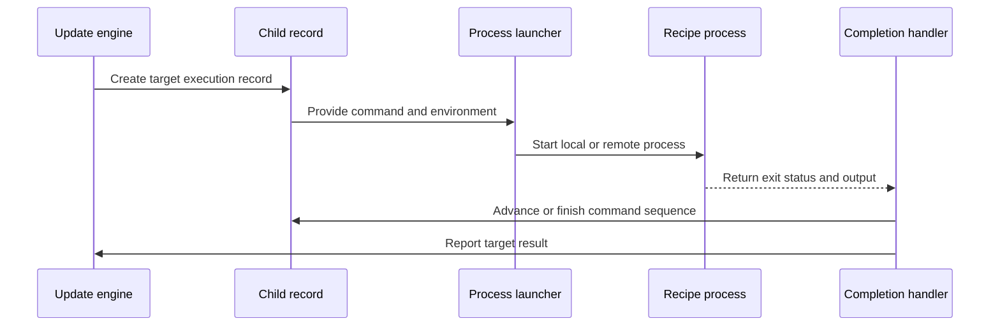

# Chapter 9: struct child

What happens after Make decides that `app` must be rebuilt?

The recipe has already been read, split, and expanded:

```text
cc -o app main.o util.o
```

But Make still needs to:

- start a subprocess;
- remember its process ID;
- capture its output;
- know which target the process belongs to;
- decide whether errors should be ignored;
- start the next recipe line when this one finishes;
- and report success or failure back to the target.

This is the job of `struct child`.

> **Description:** A struct child represents a running or recently completed subprocess used to execute a recipe. It tracks the target, process ID, environment, command position, output handling, and failure state. Think of it as a delivery runner carrying out one recipe while Make coordinates other runners and collects results.

The previous chapter explained how [`struct commands`](08_struct_commands.md) stores a reusable recipe and turns it into expanded command lines. This chapter follows those expanded lines into the job system.

## Where `struct child` fits

The structure is declared in [`src/job.h`](../src/job.h):

```c
struct child
  {
    CHILDBASE;

    struct child *next;
    struct file *file;
```

The remaining fields are:

```c
    char *sh_batch_file;
    char **command_lines;
    char *command_ptr;
    unsigned int command_line;
    pid_t pid;
```

And finally:

```c
    unsigned int remote:1;
    unsigned int noerror:1;
    unsigned int good_stdin:1;
    unsigned int deleted:1;
    unsigned int recursive:1;
    unsigned int jobslot:1;
    unsigned int dontcare:1;
  };
```

The structure combines three kinds of information:

1. **What is being built?**  
   The `file` pointer identifies the target.

2. **What process is running?**  
   The `pid`, `remote`, and process-related fields describe execution.

3. **What remains to do?**  
   The command-line pointers identify the current and future recipe lines.

A useful picture is a delivery runner carrying a work order:

```text
runner
 ├── destination: target file
 ├── current package: expanded command line
 ├── route number: process ID
 ├── status flags: silent, recursive, ignore errors
 └── return report: exit status and output
```

## The shared `CHILDBASE`

The first part of `struct child` comes from the `CHILDBASE` macro:

```c
#define CHILDBASE                                               \
    char *cmd_name;       /* Allocated copy of command run.  */ \
    char **environment;   /* Environment for commands. */       \
    VMSCHILD                                                    \
    struct output output
```

This macro is also used by `struct childbase`:

```c
struct childbase
  {
    CHILDBASE;
  };
```

Why have two related structures?

Some code needs only the common process information. For example, the platform-specific launcher receives:

```c
pid_t child_execute_job (struct childbase *child,
                         int good_stdin, char **argv);
```

It does not need the full Make scheduling state. It only needs:

- the environment;
- output destinations;
- the command name;
- and, on VMS, additional launch details.

The full `struct child` adds Make-specific information around that common base.

This is like having:

```text
basic delivery form:
  package, address, carrier instructions

full delivery record:
  basic form + route progress + warehouse status
```

The launcher needs the basic form. Make’s scheduler needs the complete record.

## The child chain

Live and recently created children are linked through:

```c
struct child *children = 0;
```

Each child points to the next:

```c
struct child *next;
```

The chain looks like:

```text
children
   |
   v
child for app -> child for tests -> child for docs -> NULL
```

This list is the job system’s active clipboard. When Make needs to reap a completed process, it searches the chain for the matching process ID.

The global count records how many local or remote job slots are currently occupied:

```c
unsigned int job_slots_used = 0;
```

There is also a separate chain for children waiting because the load average is too high:

```c
static struct child *waiting_jobs = 0;
```

So a child can be in one of two practical queues:

```text
ready or running:
  children

created but waiting to start:
  waiting_jobs
```

This is similar to an airport:

- passengers already assigned to gates are in the active list;
- passengers waiting for a gate are in the waiting list.

## The target pointer

Every child points back to the target it is building:

```c
struct file *file;
```

The target is the `struct file` record described in [struct file](04_struct_file.md). Through this pointer, the child can access:

- the target name;
- the recipe record;
- prerequisites;
- target-specific variables;
- update status;
- grouped peer targets;
- and source-location information.

For example:

```text
child->file->name
```

might be:

```text
app
```

The target record is the permanent project card. The child is temporary execution state attached to that card.

This distinction matters because several different children may execute different recipe lines over the lifetime of one target, while the target’s `struct file` remains the central record.

## Creating a child

The process begins in `new_job()` in [`src/job.c`](../src/job.c).

The function receives a target:

```c
void
new_job (struct file *file)
{
  struct commands *cmds = file->cmds;
  struct child *c;
```

It first makes sure the recipe has been split:

```c
  chop_commands (cmds);
```

Then it allocates a zero-filled child:

```c
  c = xcalloc (sizeof (struct child));
  output_init (&c->output);

  c->file = file;
```

At this point the child has:

- a target;
- an output record;
- empty process state;
- no command lines of its own yet.

The recipe template belongs to `struct commands`. The child receives its own expanded copy of those lines.

## Expanding commands for this child

The command record stores reusable text such as:

```make
$(CC) -o $@ $^
```

`new_job()` creates a separate array:

```c
lines = xmalloc (cmds->ncommand_lines * sizeof (char *));
```

It expands each line using the target context:

```c
for (i = 0; i < cmds->ncommand_lines; ++i)
  lines[i] = allocated_variable_expand_for_file
    (cmds->command_lines[i], file);
```

This is the expansion path explained in [variable_expand](03_variable_expand.md). The target argument makes values such as these available:

```text
CC = cc
@  = app
^  = main.o util.o
```

The child’s private lines might become:

```text
echo Linking app
cc -o app main.o util.o
```

Then they are stored:

```c
  c->command_lines = lines;
```

The ownership boundary is important:

```text
struct commands:
  original reusable recipe

struct child:
  expanded recipe for one target execution
```

If two targets share the same pattern-rule recipe, they still receive separate expanded command arrays. Their `$@`, `$<`, and target-specific variables may differ.

## The command cursor

Two fields tell the child where it is in the recipe:

```c
unsigned int command_line;
char *command_ptr;
```

`command_line` identifies the next entry in the expanded array. `command_ptr` points into the currently active command.

The helper `job_next_command()` advances through empty lines:

```c
while (child->command_ptr == 0
       || *child->command_ptr == '\0')
  {
    if (child->command_line
        == child->file->cmds->ncommand_lines)
```

When it reaches the end, it clears the pointer:

```c
      child->command_ptr = 0;
      return 0;
```

Otherwise, it selects the next line:

```c
    child->command_ptr =
      child->command_lines[child->command_line++];
```

The child therefore behaves like a bookmark in a book:

```text
recipe lines:
  line 0: echo Linking app
  line 1: cc -o app main.o util.o

bookmark:
  currently reading line 1
```

After the shell finishes line 0, Make advances the bookmark and starts line 1.

With `.ONESHELL`, explained in [struct commands](08_struct_commands.md), the entire recipe is usually represented as one logical command line. Without `.ONESHELL`, each logical recipe line can require its own subprocess.

## Starting the child

After expansion, `new_job()` prepares the first command:

```c
job_next_command (c);
```

It then waits for a job slot if necessary. With ordinary `-j` parallelism, the limit comes from `job_slots`. With the jobserver, Make obtains a token.

Finally, it calls:

```c
start_waiting_job (c);
```

Despite its name, this function can start the child immediately or place it on `waiting_jobs`.

It first asks whether remote execution is available:

```c
c->remote = start_remote_job_p (1);
```

Then it checks the load average:

```c
if (!c->remote
    && ((job_slots_used > 0 && load_too_high ())
#ifdef WINDOWS32
        || process_table_full ()
#endif
        ))
```

If the machine is too busy, the child is placed on the waiting list:

```c
c->next = waiting_jobs;
waiting_jobs = c;
return 0;
```

The target is marked as running even though its process has not started yet:

```c
set_command_state (f, cs_running);
```

This distinction allows Make to reserve the target’s place in the schedule while waiting for a suitable execution slot.

## One process from start to finish

The main execution sequence looks like this:



The child record remains the connection point between scheduling and process management.

## Launching a command

When a child is ready, `start_job_command()` prepares the actual process.

It combines target-wide and per-line flags:

```c
flags = (child->file->command_flags
         | child->file->cmds->lines_flags[
             child->command_line - 1]);
```

It records whether errors should be ignored:

```c
child->noerror = ANY_SET (flags, COMMANDS_NOERROR);
```

It also scans the expanded command for prefixes that may have appeared through variable expansion:

```c
while (*p != '\0')
  {
    if (*p == '@')
      flags |= COMMANDS_SILENT;
    else if (*p == '+')
      flags |= COMMANDS_RECURSE;
```

The final recursive status is stored in:

```c
child->recursive = ANY_SET (flags, COMMANDS_RECURSE);
```

This connects directly to the recipe flags described in [struct commands](08_struct_commands.md):

- `@` suppresses command echoing;
- `-` allows an error;
- `+` marks a recursive Make command.

## Building the argument vector

The expanded command text is passed to:

```c
argv = construct_command_argv
  (p, &end, child->file,
   child->file->cmds->lines_flags[
     child->command_line - 1],
   &child->sh_batch_file);
```

`construct_command_argv()` decides whether the command can be run directly or needs a shell.

For example:

```text
cc -c main.c -o main.o
```

may be converted directly into an argument vector:

```text
argv[0] = "cc"
argv[1] = "-c"
argv[2] = "main.c"
```

But a command containing shell syntax such as:

```text
echo "$HOME" > output
```

must be sent through the configured shell.

The target is passed to `construct_command_argv()` so Make can expand:

- `SHELL`;
- `.SHELLFLAGS`;
- `IFS`;
- and target-specific values.

On Windows, `sh_batch_file` may receive the name of a temporary batch or shell script. The child owns that filename until the process finishes.

## The process ID

The `pid` field identifies the launched process:

```c
pid_t pid;
```

On Unix-like systems, `child_execute_job()` uses `vfork()` or `posix_spawn()` and returns a process ID.

The child is then linked into the active chain:

```c
c->next = children;
children = c;
```

If the process was successfully started, Make increments the active job count:

```c
++job_slots_used;
c->jobslot = 1;
```

The `pid` is the address on the delivery envelope. When the operating system reports that a process has ended, Make searches `children` for the record with the matching ID.

A special value is also meaningful:

```text
pid < 0
```

This indicates that the process never successfully started. `reap_children()` treats it like a command-not-found failure with exit code 127.

## Local and remote execution

The `remote` bit says whether the child is being executed through the remote job interface:

```c
unsigned int remote:1;
```

The normal path is local:

```c
child->pid = child_execute_job
  ((struct childbase *) child, child->good_stdin, argv);
```

If remote execution is selected, Make calls:

```c
start_remote_job (argv, child->environment,
                  child->good_stdin ? 0 : get_bad_stdin (),
                  &is_remote, &id, &used_stdin);
```

The rest of Make still uses the same `struct child` record. Only the launcher and status-retrieval functions differ.

This is like a delivery company using either:

- its own van;
- or a partner courier.

The tracking form stays the same. The transport mechanism changes.

## The environment field

The child’s environment is stored in:

```c
char **environment;
```

`new_job()` does not build this environment until it is needed. `start_job_command()` eventually calls:

```c
child->environment = target_environment
  (child->file, child->file->cmds->any_recurse);
```

The environment builder is described in [struct variable](02_struct_variable.md). It collects visible exported variables, expands recursive values, and creates strings such as:

```text
CC=cc
MAKELEVEL=1
MAKEFLAGS=-j4
```

For a recursive Make command, the environment also carries jobserver information so the child Make can share the parallel job pool.

The environment is a snapshot. Changing a Make variable after the child starts cannot change the environment already passed to that process.

## Standard input

Only one child generally receives Make’s “good” standard input:

```c
unsigned int good_stdin:1;
```

Before launching, the child claims it:

```c
child->good_stdin = !good_stdin_used;
if (child->good_stdin)
  good_stdin_used = 1;
```

Other parallel children receive a deliberately unusable input descriptor from:

```c
get_bad_stdin ()
```

This prevents several simultaneous recipes from competing for the terminal or for the parent’s input stream.

Think of standard input as one telephone handset. Make allows one runner to use it, while other runners receive a disconnected handset so they cannot accidentally interfere.

When a child finishes, `reap_children()` releases the resource:

```c
if (c->good_stdin)
  good_stdin_used = 0;
```

## Output handling

The `CHILDBASE` portion contains:

```c
struct output output;
```

This record supports output synchronization modes such as:

```sh
make -Otarget -j4
```

Each child can collect output in its own buffer or file. When the child finishes, Make dumps the output as one unit:

```c
output_dump (&c->output);
```

Without synchronization, parallel jobs can interleave output:

```text
compile main.c
linking app
compile util.c
```

With target synchronization, Make tries to display each target’s output together:

```text
compile main.c
compile util.c
linking app
```

The child is therefore not only a process tracker. It is also the owner of that process’s output context.

## Recursive commands

The `recursive` bit records whether the current command invokes another Make:

```c
unsigned int recursive:1;
```

A command becomes recursive through:

```make
	+$(MAKE) -C subdir
```

or:

```make
	$(MAKE) -C subdir
```

`chop_commands()` detects explicit `+` prefixes and references to `$(MAKE)`. `start_job_command()` checks again after expansion because a variable might produce the recursive marker.

Recursive commands receive special treatment:

- they may run under `-n`;
- they inherit jobserver descriptors when appropriate;
- their exit status can have special meaning under `-q`;
- and their environment includes Make coordination variables.

The jobserver handoff is explicit:

```c
jobserver_pre_child (ANY_SET (flags, COMMANDS_RECURSE));
child->pid = child_execute_job (...);
jobserver_post_child (ANY_SET (flags, COMMANDS_RECURSE));
```

For a pipe-based jobserver, `jobserver_pre_child()` makes the descriptors inheritable. After the process is started, `jobserver_post_child()` restores the close-on-exec setting in the parent.

## Ignoring errors

The `noerror` bit comes from the recipe prefix `-` or from `.IGNORE`:

```c
unsigned int noerror:1;
```

When the process exits unsuccessfully, `reap_children()` checks:

```c
if (child_failed && !c->noerror && !ignore_errors_flag)
  {
    child_error (c, exit_code, exit_sig,
                 coredump, 0);
```

If `noerror` is set, Make still reports the problem when appropriate, but treats it as ignored and continues with the recipe or build.

This is different from pretending the process succeeded at the operating-system level. The child still failed; Make simply applies a policy saying that this failure is not fatal.

## The `dontcare` snapshot

The child stores:

```c
unsigned int dontcare:1;
```

`new_job()` copies the target’s current `dontcare` state:

```c
c->dontcare = file->dontcare;
```

This is especially important while Make rebuilds makefiles. A missing optional included makefile may be marked “do not complain,” but that state can change as Make moves through the dependency graph.

The child keeps a snapshot so that later failure handling uses the policy that applied when the job was created.

This is like writing the delivery instructions onto the runner’s clipboard rather than repeatedly asking the changing central schedule what to do.

## Reaping a completed child

Make does not continuously wait inside each target. Instead, the main update loop calls:

```c
reap_children (last_cmd_count == command_count, 0);
```

The `reap_children()` function waits for completed local or remote processes.

It first finds a process that has ended. For local processes, it uses `wait()` or `waitpid()`:

```c
pid = WAIT_NOHANG (&status);
```

When a process is found, Make extracts:

```text
exit code
exit signal
core-dump status
```

It then searches the child chain:

```c
for (c = children; c != 0; lastc = c, c = c->next)
  if (c->pid == pid && c->remote == remote)
    break;
```

This is why the child record must retain both `pid` and `remote`: the same numeric process identifier may need to be interpreted through different execution backends.

## Determining success or failure

The exit result is mapped to Make’s status values:

```c
if (exit_sig == 0 && exit_code == 0)
  child_failed = MAKE_SUCCESS;
else
  child_failed = MAKE_FAILURE;
```

Question mode has a special case for recursive commands:

```c
else if (exit_sig == 0 && exit_code == 1
         && question_flag && c->recursive)
  child_failed = MAKE_TROUBLE;
```

The result is stored on the target:

```c
c->file->update_status =
  child_failed == MAKE_FAILURE ? us_failed : us_question;
```

The target’s final status is therefore not stored permanently in `struct child`. The child reports the result back to `struct file`, which remains the authoritative project record.

## Starting the next recipe line

If the command succeeded and more recipe lines remain, `reap_children()` advances the cursor:

```c
if (job_next_command (c))
  {
    start_job_command (c);
    continue;
  }
```

The same child record continues to represent the target’s execution sequence. It does not allocate a new `struct child` for every recipe line.

The sequence is:

```text
child starts line 0
        ↓
line 0 exits successfully
        ↓
command_ptr advances
        ↓
child starts line 1
        ↓
line 1 exits successfully
        ↓
recipe is complete
```

This is like one courier carrying a multi-stop route. Finishing one stop does not create a new courier; the route marker simply advances.

## Completing the target

When no command lines remain:

```c
else
  c->file->update_status = us_success;
```

Make then calls:

```c
notice_finished_file (c->file);
```

That function belongs to the target-update machinery described in [update_goal_chain](07_update_goal_chain.md). It:

- sets `command_state` to `cs_finished`;
- marks the target as updated;
- refreshes timestamp information;
- handles `-t`;
- propagates status to grouped targets;
- and checks peer outputs.

The child has completed its temporary role. The result now belongs to the target’s `struct file`.

## Grouped targets

A single recipe can produce multiple outputs:

```make
program program.map &: main.o
	ld -o program main.o
```

The target’s `also_make` chain records the peers. When the child finishes, `notice_finished_file()` propagates the result:

```c
for (d = file->also_make; d != 0; d = d->next)
  {
    d->file->command_state = cs_finished;
    d->file->updated = 1;
```

It also copies the update status:

```c
    d->file->update_status = file->update_status;
  }
```

If the recipe succeeds but a peer output is still missing, Make can warn:

```text
warning: pattern recipe did not update peer target
```

The child represents the one recipe invocation. The `also_make` records represent every target that invocation promised to produce.

## Deleting targets after interruption

If a command is interrupted, Make may remove targets that were partially written. The child tracks whether this has already happened:

```c
unsigned int deleted:1;
```

The cleanup function is:

```c
void
delete_child_targets (struct child *child)
{
  if (child->deleted || child->pid < 0)
    return;
```

It deletes the main target:

```c
  delete_target (child->file, NULL);
```

Then it deletes grouped peers:

```c
  for (d = child->file->also_make; d != 0; d = d->next)
    delete_target (d->file, child->file->name);
```

Finally:

```c
  child->deleted = 1;
```

The flag prevents repeated cleanup if several error paths handle the same child.

Precious and phony targets are protected by `delete_target()`. This connects child cleanup to the special target flags stored in `struct file`.

## Signals and fatal cleanup

When Make receives `SIGINT`, `SIGTERM`, or a similar signal, `fatal_error_signal()` walks the active children:

```c
for (c = children; c != 0; c = c->next)
  if (!c->remote && c->pid > 0)
    (void) kill (c->pid, SIGTERM);
```

Remote children use:

```c
remote_kill (c->pid, sig);
```

Make then deletes targets through:

```c
delete_child_targets (c);
```

Finally, it waits for all children:

```c
while (job_slots_used > 0)
  reap_children (1, 0);
```

The active child chain is therefore essential during failure handling. Without it, Make would not know which processes to terminate or which targets might be incomplete.

## Temporary batch files

On Windows, a shell command may require a temporary batch or script file. Its name is stored in:

```c
char *sh_batch_file;
```

`construct_command_argv()` fills this pointer when it creates the temporary file.

After the process exits, `reap_children()` removes it:

```c
if (c->sh_batch_file)
  {
    int rm_status = remove (c->sh_batch_file);
    free (c->sh_batch_file);
    c->sh_batch_file = NULL;
  }
```

The child owns this temporary execution artifact. The recipe record does not, because the batch file belongs only to this particular expanded command.

## Freeing a child

After completion, Make removes the child from the active chain and calls:

```c
free_child (c);
```

Before releasing memory, it returns jobserver capacity:

```c
if (jobserver_enabled () && jobserver_tokens > 1)
  {
    jobserver_release (1);
```

Then it decrements the token count:

```c
--jobserver_tokens;
```

It releases expanded command lines:

```c
for (i = 0; i < child->file->cmds->ncommand_lines; ++i)
  free (child->command_lines[i]);
free (child->command_lines);
```

Finally it frees the shared process resources:

```c
free_childbase ((struct childbase*)child);
free (child);
```

`free_childbase()` releases:

- the environment strings;
- the command-name copy;
- and any common platform-specific storage.

The original `struct commands` remains. Only this execution’s expanded copy disappears.

## Jobserver tokens and parallelism

Parallel Make uses a jobserver to coordinate the number of active processes. `new_job()` obtains a token before starting a child:

```c
++jobserver_tokens;
```

The child’s `jobslot` bit records that it owns a slot:

```c
unsigned int jobslot:1;
```

When the child is freed, the token is returned if appropriate.

This prevents a parent Make and its recursive children from exceeding the requested parallelism. The jobserver acts like a box of reusable admission tickets:

```text
ticket available:
  another child may start

ticket held by child:
  one parallel slot is occupied

ticket returned:
  another job may begin
```

Recursive children inherit the jobserver descriptors only when the command is recognized as recursive. The command’s `recursive` field and the `COMMANDS_RECURSE` flag therefore affect both process launch and parallel scheduling.

## A complete example

Consider:

```make
app: main.o util.o
	@echo Linking $@
	$(CC) -o $@ $^
```

Assume `main.o` and `util.o` are ready.

### 1. The target is selected

`update_goal_chain()` determines that `app` needs rebuilding, as explained in [update_goal_chain](07_update_goal_chain.md).

### 2. The recipe is prepared

`execute_file_commands()` initializes:

```text
@ = app
^ = main.o util.o
```

Then `new_job()` expands the recipe:

```text
echo Linking app
cc -o app main.o util.o
```

### 3. A child is created

The child stores:

```text
file          = app
command_lines = expanded two-line array
command_line  = first line
pid           = not assigned yet
environment   = not built yet
```

### 4. The first process starts

`start_job_command()` identifies `@` as silent and starts:

```text
echo Linking app
```

The process ID is stored in `child->pid`, and the child is added to `children`.

### 5. The first process finishes

`reap_children()` finds the matching PID. Because the command succeeded, it advances the cursor and starts:

```text
cc -o app main.o util.o
```

### 6. The second process finishes

The child has no more command lines. Make sets:

```text
file->update_status = us_success
```

Then `notice_finished_file()` marks `app` complete.

### 7. The child is freed

Make:

- dumps synchronized output;
- releases the jobserver token;
- frees expanded command lines;
- frees the environment;
- removes the child from `children`.

The target record remains in the file database, now marked updated.

## Inspecting child behavior

Use job debugging to see the lifecycle:

```sh
make --debug=j
```

Useful messages include:

```text
Putting child ... on the chain
Live child ... PID ...
Reaping winning child ...
Removing child ... from chain
```

For a parallel build:

```sh
make -j4 --debug=j
```

you can observe:

- children waiting for jobserver tokens;
- children delayed by load-average limits;
- multiple PIDs running at once;
- output synchronization;
- and token release after completion.

To inspect the recipe before a child exists:

```sh
make -n
```

This displays expanded commands without starting ordinary subprocesses.

To inspect target state after execution:

```sh
make -p
```

Look at the corresponding `struct file`. The child itself is temporary and is normally gone by the time the database is printed, but its result appears through:

- `File has been updated`;
- `Successfully updated`;
- `Failed to be updated`;
- and the cached modification time.

## The child lifecycle

A child generally follows this path:

```text
recipe selected
      ↓
struct child allocated
      ↓
recipe lines expanded
      ↓
job slot acquired
      ↓
child waits or starts
      ↓
process ID recorded
      ↓
process runs
      ↓
output collected
      ↓
child reaped
      ↓
next line starts, or target finishes
      ↓
status copied to struct file
      ↓
child freed
```

The child is temporary, but it carries state through several subsystems:

- [`struct commands`](08_struct_commands.md) supplies expanded recipe lines;
- [`variable_expand`](03_variable_expand.md) produces target-specific command text;
- [`struct variable`](02_struct_variable.md) supplies the child environment;
- [`struct file`](04_struct_file.md) receives the result;
- [`update_goal_chain`](07_update_goal_chain.md) resumes dependency processing.

## A compact mental model

Think of `struct child` as a delivery runner’s tracking form.

### Assignment

```c
struct file *file;
```

Which target is this runner serving?

### Expanded package

```c
char **command_lines;
char *command_ptr;
unsigned int command_line;
```

Which concrete commands must be delivered, and which one is active?

### Transport identity

```c
pid_t pid;
unsigned int remote:1;
```

Which process is carrying out the work, and is it local or remote?

### Instructions

```c
unsigned int noerror:1;
unsigned int recursive:1;
unsigned int dontcare:1;
```

Should errors be ignored? Is this a recursive Make? Should failure diagnostics be suppressed?

### Resources

```c
char **environment;
struct output output;
unsigned int good_stdin:1;
unsigned int jobslot:1;
```

What environment, output channel, input stream, and parallel slot belong to this job?

### Cleanup

```c
char *sh_batch_file;
unsigned int deleted:1;
```

Is there a temporary script to remove? Have partially created targets already been deleted?

The complete relationship is:

```text
struct commands
  reusable recipe text
        ↓
new_job
  target-specific expansion
        ↓
struct child
  one execution attempt
        ↓
operating-system process
  shell or direct command
        ↓
reap_children
  exit status and output
        ↓
struct file
  updated target state
```

## Key takeaways

- `struct child` tracks one target’s active or recently completed recipe execution.
- Its common `CHILDBASE` fields hold the environment, command name, and output context.
- `file` points to the target’s persistent `struct file` record.
- `command_lines` contains expanded commands owned by this execution.
- `command_ptr` and `command_line` identify the current recipe position.
- `pid` identifies the local or remote process.
- `children` is the chain of active jobs.
- `waiting_jobs` holds jobs delayed by load limits or process-table limits.
- `remote` distinguishes local execution from remote execution.
- `recursive` identifies commands that invoke another Make.
- `noerror` implements `-` recipe prefixes and `.IGNORE`.
- `good_stdin` ensures only one parallel child receives usable standard input.
- `dontcare` preserves optional-error behavior while a job runs.
- `environment` is built from exported Make variables for the target context.
- `output` supports synchronized output for parallel jobs.
- `sh_batch_file` tracks temporary Windows shell scripts or batch files.
- `new_job()` creates the child, expands commands, obtains a job slot, and schedules it.
- `start_job_command()` turns one expanded line into an argument vector and starts it.
- `child_execute_job()` performs platform-specific process creation.
- `reap_children()` matches completed processes by PID, advances recipe lines, and handles failures.
- `notice_finished_file()` transfers the child’s result back to the target’s `struct file`.
- `delete_child_targets()` removes incomplete outputs after interruption or configured failure.
- `free_child()` releases command lines, environments, output state, and jobserver capacity.
- The child is temporary execution state; the target’s `struct file` is the lasting build record.

You have now followed GNU Make from its first input files, through variables, expansion, targets, dependencies, rules, goal updates, recipes, and finally subprocess execution. The structures in these nine chapters form a pipeline:

```text
makefiles
   ↓
variables and rules
   ↓
file and dependency graph
   ↓
goal update decisions
   ↓
commands
   ↓
children
   ↓
completed targets
```

The next step is no longer a single structure, but the larger task of exploring how these pieces cooperate in real builds: tracing a target from command line to completed file, debugging parallel scheduling, and reading GNU Make’s source with confidence.