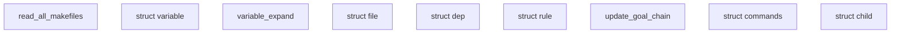

# make-4.4.1

_Lens: beginner-tutorial_

GNU Make reads makefiles, builds an internal database of targets, prerequisites, variables, and recipes, then updates only the files that are out of date. It also supports pattern rules, variable and function expansion, shell execution, parallel jobs, recursive make, and platform-specific behavior.

## Architecture

## Chapters

- [read_all_makefiles](01_read_all_makefiles.md)
- [struct variable](02_struct_variable.md)
- [variable_expand](03_variable_expand.md)
- [struct file](04_struct_file.md)
- [struct dep](05_struct_dep.md)
- [struct rule](06_struct_rule.md)
- [update_goal_chain](07_update_goal_chain.md)
- [struct commands](08_struct_commands.md)
- [struct child](09_struct_child.md)