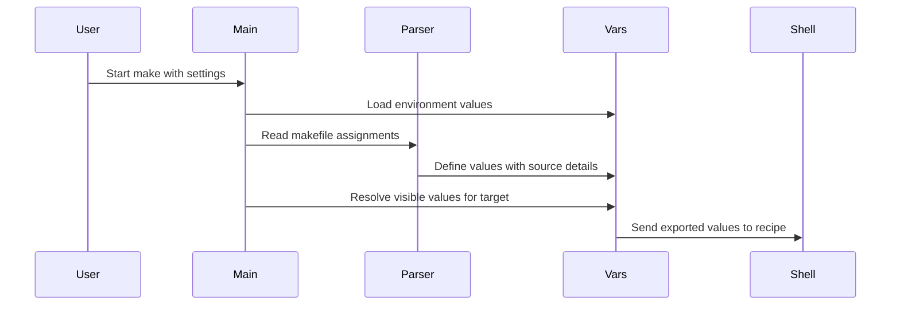

# Chapter 1: struct variable

Imagine you run:

```sh
make CC=clang
```

but your Makefile says:

```make
CC = gcc
```

Which compiler should Make use?

Or perhaps `CC` was already set in your shell environment. Or GNU Make supplied a built-in default. Or the Makefile used an `override` directive. Several values may compete for the same label, and Make must choose one predictably.

That decision begins with `struct variable`.

A variable is like a labeled note on a bulletin board:

- the **label** is its name, such as `CC`;
- the **message** is its value, such as `clang`;
- the note also says **who posted it**;
- its source determines how much authority it has;
- it records whether the message should be read now or later;
- it records whether the note should be passed to commands Make runs.

The central definition lives in [`src/variable.h`](https://github.com/mirror/make/blob/master/src/variable.h):

```c
struct variable
  {
    char *name;
    char *value;
    floc fileinfo;
    unsigned int length;
```

The first fields are the obvious identity card:

- `name` is a null-terminated variable name.
- `value` is the stored text.
- `fileinfo` records the source location when the variable came from a makefile.
- `length` caches `strlen(name)`.

Caching the name length may seem minor, but variable lookup happens constantly. Make expands variables in prerequisites, recipes, functions, conditionals, and included files. Keeping the length nearby avoids repeatedly measuring the same string.

For a Makefile line such as:

```make
CFLAGS = -O2 -g
```

Make eventually has a record conceptually like this:

```text
name:      CFLAGS
value:     -O2 -g
origin:    makefile
flavor:    recursive
export:    default behavior
```

## The authority ladder: where did the value come from?

The most important metadata is the variable’s **origin**. GNU Make represents it with `enum variable_origin`:

```c
enum variable_origin
  {
    o_default,
    o_env,
    o_file,
    o_env_override,
```

```c
    o_command,
    o_override,
    o_automatic,
    o_invalid
  };
```

The order is intentional. The comment says:

> Increasing numeric values signify less-overridable definitions.

In other words, a larger enum value has more authority. Think of this as a stack of competing notes where notes from more powerful sources cover weaker ones.

| Origin | Typical source | Authority |
|---|---|---:|
| `o_default` | GNU Make built-in defaults | lowest |
| `o_env` | inherited environment | low |
| `o_file` | ordinary Makefile assignment | higher |
| `o_env_override` | environment with `make -e` | higher |
| `o_command` | `make VAR=value` | very high |
| `o_override` | Makefile `override VAR = value` | higher still |
| `o_automatic` | `$@`, `$<`, `$^`, and similar | special/internal |

A normal build often starts with several possible definitions:

```sh
export CC=cc
make CC=clang
```

```make
CC = gcc
```

The command-line assignment wins:

```text
default value     cc or another built-in
environment value cc
makefile value    gcc
command line      clang
winner            clang
```

The reason is not a collection of special-case `if` statements scattered throughout Make. It is mostly one numeric comparison in `define_variable_in_set()` from `src/variable.c`.

```c
if ((int) origin >= (int) v->origin)
  {
    free (v->value);
    v->value = xstrdup (value);
```

```c
    v->origin = origin;
    v->recursive = recursive;
  }
```

Read this as:

1. Find the existing note for this variable name.
2. Compare the authority of the incoming note with the existing one.
3. Replace the old note only when the new note is equally or more authoritative.

Equal authority matters. Two ordinary Makefile assignments have the same origin, so the later assignment replaces the earlier one:

```make
MODE = debug
MODE = release
```

The second line wins because both have `o_file` origin and the new definition is allowed to replace an equal-strength one.

## A tiny experiment with `origin`

GNU Make exposes this metadata through the `origin` function:

```make
CC = gcc

show:
	@echo value is $(CC)
	@echo source is $(origin CC)
```

Running normally usually prints:

```text
value is gcc
source is file
```

But a command-line assignment changes the result:

```sh
make CC=clang show
```

```text
value is clang
source is command line
```

The implementation of `$(origin ...)` in `src/function.c` looks up the actual `struct variable` and converts its enum value into readable text:

```c
struct variable *v = lookup_variable (argv[0], strlen (argv[0]));

if (v == 0)
  o = variable_buffer_output (o, "undefined", 9);
```

The rest is a `switch` over `v->origin`. The function does not infer origin from the current value. The origin is stored directly in the variable record, like a signed label attached to the note.

## The unusual `-e` case

Normally, Makefile variables override environment variables:

```sh
export MODE=environment
make
```

```make
MODE = makefile
```

The result is `makefile`.

However, GNU Make’s `-e` option means “environment overrides.” Internally, it upgrades environment-origin variables from `o_env` to `o_env_override`.

```c
if (env_overrides && origin == o_env)
  origin = o_env_override;
```

That is a beautifully compact design: `-e` does not need a wholly separate precedence algorithm. It changes the environment variable’s place on the authority ladder.

So the same setup behaves differently:

```sh
export MODE=environment
make -e
```

```make
MODE = makefile
```

Now the environment value wins.

This is like giving every note from the environment a manager’s stamp before the meeting begins.

## Values can be immediate or delayed

Two Makefile assignments can look similar but behave differently:

```make
NOW := $(shell date +%s)
LATER = $(shell date +%s)
```

The `:=` value is expanded immediately. The `=` value is stored and expanded later whenever it is referenced.

GNU Make’s internal `struct variable` uses a single bit to capture the key distinction:

```c
unsigned int recursive:1;
```

Despite its name, `recursive` means more than “this variable might refer to itself.” It means the stored text should be expanded again when used.

| Make syntax | Internal behavior | `recursive` |
|---|---|---:|
| `NAME = value` | retain unexpanded text | 1 |
| `NAME := value` | expand before storing | 0 |
| `NAME ::= value` | also immediate | 0 |
| `NAME += value` | depends on prior flavor | varies |
| `NAME ?= value` | assign only if absent | usually 1 |
| `NAME != command` | run shell command while assigning | 1 after result is stored |

The broader parser has more detailed flavor states:

```c
enum variable_flavor
  {
    f_bogus,
    f_simple,
    f_recursive,
    f_expand,
```

```c
    f_append,
    f_conditional,
    f_shell,
    f_append_value
  };
```

But once the definition is stored, `struct variable` primarily needs to know whether use requires recursive expansion. The temporary parsing flavor answers, “What assignment operator did we see?” The stored `recursive` bit answers, “Should we expand this value again later?”

That distinction is important because Make is not merely storing strings. It is storing either:

- a finished answer, or
- a recipe for producing an answer later.

A simple variable is like a printed photograph. A recursive variable is like a live camera feed.

### Immediate expansion

In `do_variable_definition()`, a simple assignment expands the right-hand side before storing it:

```c
case f_simple:
  newval = alloc_value = allocated_variable_expand (value);
  break;
```

For this Makefile:

```make
NAME = Ada
GREETING := hello $(NAME)
NAME = Lin
```

`GREETING` remains `hello Ada`, because Make expanded it when it encountered `:=`.

### Deferred expansion

A recursive assignment keeps the original text:

```c
case f_recursive:
  newval = value;
  break;
```

So this Makefile behaves differently:

```make
NAME = Ada
GREETING = hello $(NAME)
NAME = Lin
```

Now `$(GREETING)` becomes `hello Lin`, because its value still contains `$(NAME)` when it is used.

Variable expansion deserves its own close reading, so it will be covered in [variable_expand](03_variable_expand.md).

## Parsing a variable assignment

When Make reads a Makefile, it must decide whether a line is an assignment, a rule, a directive, or something else.

For example:

```make
NAME = Ada
COUNT := 3
FLAGS += -Wall
```

The parser recognizes the assignment operator and assigns a flavor. `parse_variable_definition()` handles that work.

```c
if (c == '=')
  {
    var->flavor = f_recursive;
    break;
  }
```

For `=`, the parser chooses `f_recursive`.

For `:=`, it chooses `f_simple`:

```c
if (c == '=')
  {
    var->flavor = f_simple;
    break;
  }
```

The parser does not directly insert the variable into a table. Instead, it creates a temporary description of the assignment: name, value, and flavor. Then `try_variable_definition()` forwards those details:

```c
vp = do_variable_definition (flocp, v.name, v.value,
                             origin, v.flavor, target_var);
```

This separation is useful:

- parsing answers **what syntax appeared?**
- definition answers **what value should be stored?**
- lookup answers **which scoped definition is visible?**
- expansion answers **what text does this reference produce now?**

That division keeps the codebase from becoming one giant parser with side effects everywhere.

The next chapter, [variable_set_list](02_variable_set_list.md), explains where variables are stored and how Make searches through scopes.

## A variable remembers where it was defined

When Make reads a Makefile, it carries location information in `floc`, short for “file location.” A variable can preserve that source location:

```c
if (flocp != 0)
  v->fileinfo = *flocp;
```

This lets Make produce useful diagnostics and database output. With:

```sh
make -p
```

GNU Make can print information like:

```text
# makefile (from 'Makefile', line 4)
CFLAGS = -O2
```

The printing logic in `print_variable()` checks the origin and location:

```c
if (v->fileinfo.filenm)
  printf (" (from '%s', line %lu)",
          v->fileinfo.filenm, v->fileinfo.lineno);
```

This is another note-card detail: the record contains not just the message, but also a “posted from” address.

## Export behavior: should a recipe receive this variable?

Make variables and shell environment variables are related, but they are not identical.

Consider:

```make
COLOR = blue

show:
	@echo "make sees $(COLOR)"
	@echo "shell sees $$COLOR"
```

Make can always expand `$(COLOR)` in its own recipe text. But the shell does not automatically receive every Make variable as an environment variable.

The export state is stored here:

```c
enum variable_export
{
    v_default = 0,
    v_export,
    v_noexport,
    v_ifset
};
```

And each variable contains:

```c
enum variable_export
  export ENUM_BITFIELD (2);
```

The possible meanings are:

| Value | Meaning |
|---|---|
| `v_default` | use Make’s normal export policy |
| `v_export` | explicitly include it in child environments |
| `v_noexport` | explicitly exclude it |
| `v_ifset` | export it only if it is more than a built-in default |

A Makefile can control this with:

```make
export COLOR
```

or:

```make
export COLOR = blue
```

Then a recipe shell can see it:

```make
export COLOR = blue

show:
	@echo "shell sees $$COLOR"
```

The doubled dollar sign is essential: `$$COLOR` becomes `$COLOR` after Make expands the recipe, leaving the shell to perform environment-variable expansion.

### Which variables are exported by default?

GNU Make uses `should_export()` to make the decision:

```c
case v_noexport:
  return 0;

case v_export:
  break;
```

The default path is more selective:

```c
if (! export_all_variables
    && v->origin != o_command
    && v->origin != o_env
    && v->origin != o_env_override)
  return 0;
```

This means an ordinary Makefile variable is not generally exported unless requested. But variables inherited from the environment, variables defined on the command line, and environment values elevated by `-e` are normally eligible.

That makes intuitive sense:

- environment variables came from a parent process, so preserving them for child processes is expected;
- command-line variables are explicitly supplied by the user, so they should usually propagate;
- local Makefile settings stay local unless the Makefile author says otherwise.

It is like deciding which notes are copied into an outgoing packet for a subprocess. Not every note on Make’s bulletin board belongs in that packet.

## Building the environment for a command

Before Make runs a recipe, it builds a new environment using `target_environment()`.

```c
char **
target_environment (struct file *file, int recursive)
{
  struct variable_set_list *set_list;
  struct hash_table table;
```

This function collects visible variables, filters them through export rules, expands recursive values when needed, and finally produces strings shaped like:

```text
NAME=value
```

The core behavior is:

```c
if (! should_export (v))
  continue;

if (v->recursive)
  value = recursively_expand_for_file (v, file);
```

So a child process receives the exported, final value—not merely the raw text stored in `v->value`.

For example:

```make
NAME = Ada
export MESSAGE = hello $(NAME)
```

The stored value of `MESSAGE` may be `hello $(NAME)`, but the recipe environment gets:

```text
MESSAGE=hello Ada
```

Recipe execution, child processes, and job scheduling are explored later in [new_job](09_new_job.md). For now, the important point is that `struct variable` supplies the metadata needed to decide whether and how a value crosses the boundary from Make into a subprocess.

## Automatic variables are real variable records too

Automatic variables include:

```make
$@
$<
$^
$?
$*
```

They are special because their values depend on the target currently being built.

For a rule:

```make
app: main.o util.o
	$(CC) -o $@ $^
```

Make needs `$@` to become `app` and `$^` to become `main.o util.o` only while preparing that target’s recipe.

The origin for these values is `o_automatic`. `set_file_variables()` in `src/commands.c` creates them:

```c
DEFINE_VARIABLE ("<", 1, less);
DEFINE_VARIABLE ("*", 1, star);
DEFINE_VARIABLE ("@", 1, at);
DEFINE_VARIABLE ("%", 1, percent);
```

The helper writes these values into the current file-specific variable context. That context is why automatic variables can differ for each target without overwriting global variables.

For example, when building two targets, `$@` is not one global mutable string that changes randomly. Each target gets an appropriate variable context.

The storage and lookup chain enabling that behavior is the subject of [variable_set_list](02_variable_set_list.md).

## Target-specific and private variables

A `struct variable` has several flags that do not apply to every ordinary assignment:

```c
unsigned int append:1;
unsigned int conditional:1;
unsigned int per_target:1;
unsigned int private_var:1;
```

These are small metadata flags with large behavioral consequences.

### `conditional`

This records a `?=` assignment:

```make
CC ?= cc
```

The value is installed only if no existing `CC` is visible. It is like posting a fallback note only if the bulletin board has no note with that label.

### `append`

This matters especially for target-specific `+=` values:

```make
app: CFLAGS += -DAPP
```

Make must remember that this is an append operation, not a complete replacement. During expansion, it can combine the target-specific text with inherited values.

### `per_target`

This marks a definition as target-specific:

```make
debug: MODE = debug
release: MODE = release
```

The assignments do not globally redefine `MODE`. They belong to target contexts and can affect prerequisites inherited from that target.

### `private_var`

This records the `private` modifier:

```make
app: private TOKEN = secret
```

A private target-specific variable applies to the target itself but does not flow down to prerequisite builds. It is a note marked “do not forward.”

These fields make `struct variable` more than a pair of strings. It is a policy-carrying record: one that says how a definition participates in scope, inheritance, expansion, and export.

## The life of a variable

Here is the typical path from input to recipe execution:



A few important phases occur in `main()`:

1. Initialize the global variable table.
2. Import environment variables.
3. Parse command-line variable assignments.
4. Install built-in variables.
5. Read Makefiles.
6. Build targets and recipes using target-specific and automatic variables.

Environment import happens early in `src/main.c`:

```c
v = define_variable (envp[i], len, ep, o_env, 1);
v->export = export;
```

Every valid `NAME=value` entry from the process environment becomes a Make variable with `o_env` origin.

Later, command-line arguments such as `CC=clang` go through:

```c
v = try_variable_definition (0, arg, origin, 0);
```

For actual command-line arguments, `origin` is `o_command`, giving the result a stronger precedence level.

Finally, Makefile assignments are parsed in `src/read.c`:

```c
enum variable_origin origin =
  vmod.override_v ? o_override : o_file;
```

An ordinary assignment receives `o_file`; an assignment prefixed by `override` receives `o_override`.

The entire precedence model follows naturally from this one detail: every definition arrives with an origin label.

## A practical debugging recipe

When a variable behaves unexpectedly, ask four questions:

1. **What is its current value?**
2. **Where did it come from?**
3. **Is it recursive or simple?**
4. **Will it be exported to the recipe shell?**

You can inspect the first three directly:

```make
debug-vars:
	@echo CC is $(CC)
	@echo CC source is $(origin CC)
	@echo CC flavor is $(flavor CC)
```

For a more complete view, use:

```sh
make -p
```

Then search the output for the variable name. GNU Make’s database printer uses the same `struct variable` fields discussed here: origin, value, recursive status, source location, and target-specific context.

## Key takeaways

`struct variable` is GNU Make’s record for one variable definition. It stores:

- **identity**: `name` and `length`;
- **content**: `value`;
- **source location**: `fileinfo`;
- **precedence**: `origin`;
- **expansion behavior**: chiefly the `recursive` bit;
- **export policy**: `export` and `exportable`;
- **special behavior**: append, conditional, target-specific, private, and special flags.

Most importantly, GNU Make does not treat `CC=gcc`, `CC=clang` from the command line, and an inherited `CC` environment variable as indistinguishable strings. Each is a note with a source and authority level. When notes conflict, the stronger note wins.

Now that one variable record makes sense, the next question is: where do all these records live, and how can Make find the right one for a particular target? That is the role of [variable_set_list](02_variable_set_list.md).