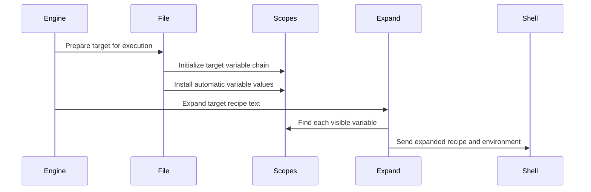

# Chapter 2: variable_set_list

Why can the same spelling mean different things while Make is building different targets?

Consider this Makefile:

```make
CFLAGS = -O2

debug: CFLAGS = -O0 -g
release: CFLAGS = -O3
```

When Make builds `debug`, `$(CFLAGS)` should be `-O0 -g`. When it builds `release`, it should be `-O3`. Everywhere else, it should remain `-O2`.

Make cannot solve that by keeping one global `CFLAGS` value and repeatedly rewriting it. Parallel builds, prerequisite inheritance, recursive expansion, and automatic variables such as `$@` would quickly turn that approach into a pile of race-prone confusion.

Instead, GNU Make asks a more useful question:

> Which definitions are visible **from the current place**?

That question is answered by `struct variable_set_list`.

A variable set list is a chain of scopes. Think of it as transparent sheets stacked on top of a page:

- each sheet can define a few names;
- reading starts at the top sheet;
- a name found on the top sheet hides lower definitions;
- if a sheet does not mention the name, Make looks through it;
- some sheets represent a parent target, which changes how `private` variables behave.

This chapter connects the individual variable records from [struct variable](01_struct_variable.md) to the places where Make stores and finds those records.

## The three pieces: variable, set, and list

The previous chapter introduced one `struct variable`: one labeled definition with a value, origin, flavor, and flags.

GNU Make groups those definitions into a `struct variable_set`:

```c
struct variable_set
  {
    struct hash_table table;
  };
```

A set is one scope’s dictionary. Its hash table maps a name such as `CFLAGS` to a `struct variable`.

Then Make chains sets with `struct variable_set_list`:

```c
struct variable_set_list
  {
    struct variable_set_list *next;
    struct variable_set *set;
    int next_is_parent;
  };
```

The fields are small, but they describe the whole lookup model:

| Field | Meaning |
|---|---|
| `set` | The current layer’s hash table of definitions |
| `next` | The less-specific layer below it |
| `next_is_parent` | The next layer belongs to a parent target |

So the data structure is not a list of variables. It is a list of **places where variables may live**.

A target can therefore see a chain like this:

```text
automatic variables
    ↓
target-specific variables
    ↓
matching pattern-specific variables
    ↓
parent target variables
    ↓
global variables
```

Not every target has every layer, but this is the mental model to keep.

## The global scope is the floor

GNU Make has one global variable set:

```c
static struct variable_set global_variable_set;
```

It also creates a list node that points at that set:

```c
static struct variable_set_list global_setlist
  = { 0, &global_variable_set, 0 };
```

And, initially, all lookup begins there:

```c
struct variable_set_list *current_variable_set_list = &global_setlist;
```

Picture `global_setlist` as the ground floor of a building. It contains definitions imported from the environment, supplied on the command line, created by built-in defaults, and read from ordinary Makefile assignments.

For example:

```make
MODE = normal
```

usually creates a `struct variable` in the global variable set.

A later lookup starts from `current_variable_set_list`. At startup, that pointer refers to the global list node, so global lookup is all there is.

The name “current” matters. Make changes this pointer temporarily when it expands a recipe for a target, enters a function-local scope, or evaluates target-specific definitions.

## Lookup is simple: search downward

The central routine is `lookup_variable()` in `src/variable.c`.

It first creates a lightweight lookup key:

```c
var_key.name = (char *) name;
var_key.length = (unsigned int) length;
```

Then it walks the list from the current scope toward the global scope:

```c
for (setlist = current_variable_set_list;
     setlist != 0; setlist = setlist->next)
  {
    const struct variable_set *set = setlist->set;
```

For each scope, Make searches that scope’s hash table:

```c
v = hash_find_item ((struct hash_table *) &set->table, &var_key);

if (v && (!is_parent || !v->private_var))
  return v;
```

This is the entire “topmost visible definition wins” rule.

Notice what lookup does **not** do:

- it does not compare variable origins across scopes;
- it does not merge ordinary values from every scope;
- it does not search the entire chain and choose the strongest origin.

Scope comes first. If a visible definition exists in the current set, that definition wins. The variable’s origin still controls whether a *new assignment into that same set* may replace it, as explained in [struct variable](01_struct_variable.md).

That distinction is crucial:

```text
Scope answers: which definition do we see?
Origin answers: may this definition replace another in one set?
```

A target-specific definition is a separate note on a higher transparent sheet. It does not have to beat the global note through origin comparison just to be visible.

## A concrete lookup walk

Suppose Make is preparing a recipe for `debug`:

```make
MODE = normal

%.dbg: MODE = pattern

debug: MODE = target
```

For target `debug`, the chain conceptually becomes:

```text
debug target variables: MODE = target
pattern variables:      MODE = pattern
global variables:       MODE = normal
```

A lookup for `MODE` stops immediately:

```text
search debug layer     found target
result                 target
```

If `debug` had no target-specific `MODE`, Make would continue:

```text
search debug layer     not found
search pattern layer   found pattern
result                 pattern
```

And if neither specific layer defined it:

```text
search debug layer     not found
search pattern layer   not found
search global layer    found normal
result                 normal
```

This is like asking for a document in a stack of folders. You open the desk drawer first, then the team cabinet, then the company archive. The first matching document is the one you use.

## Target-specific variables belong to files

A target is represented by `struct file`, covered more fully in [struct file](05_struct_file.md). For this chapter, the important field is:

```c
struct variable_set_list *variables;
```

Each target may own a variable-set list.

When Make parses this:

```make
app: CFLAGS = -DAPP
```

`read.c` recognizes that the text after `app:` is a target-specific assignment. It calls `record_target_var()`.

That function makes sure the target has a variable context:

```c
initialize_file_variables (f, 1);

current_variable_set_list = f->variables;
v = try_variable_definition (flocp, defn, origin, 1);
current_variable_set_list = global;
```

The temporary switch is deliberate:

1. initialize `app`’s variable chain;
2. make `app`’s scope the current scope;
3. define `CFLAGS` into its top variable set;
4. restore the original global context.

The final `1` passed to `try_variable_definition()` means this is a target-variable definition. That affects operations such as `+=`, which must preserve target-local append behavior.

The definition is also marked:

```c
v->per_target = 1;
```

That flag records that this variable belongs to a target context rather than being an ordinary global definition.

## Building a target’s base chain

`initialize_file_variables()` constructs the chain for a target.

If the target has no variable set yet, Make allocates one:

```c
l->set = xmalloc (sizeof (struct variable_set));
hash_init (&l->set->table, PERFILE_VARIABLE_BUCKETS,
           variable_hash_1, variable_hash_2, variable_hash_cmp);
```

This top set is the target’s own private dictionary. It is intentionally much smaller than the global variable table:

```c
#define PERFILE_VARIABLE_BUCKETS 23
```

A target usually has only a handful of special definitions: perhaps a target-specific `CFLAGS`, an exported setting, and later automatic variables.

After establishing the target’s own set, Make chooses what sits below it.

For a target with no parent, the chain ends at global variables:

```c
if (file->parent == 0)
  l->next = &global_setlist;
```

Conceptually:

```text
target variables → global variables
```

But a prerequisite being built for another target gets a different chain:

```c
initialize_file_variables (file->parent, reading);
l->next = file->parent->variables;
```

Conceptually:

```text
prerequisite variables → parent target variables → global variables
```

Finally, Make records that this next link crosses into a parent context:

```c
l->next_is_parent = 1;
```

That one bit supports inherited target-specific variables and the `private` modifier.

## Parent-target inheritance

Target-specific variables propagate to prerequisites by default.

```make
program: CFLAGS = -DPROGRAM
program: main.o util.o

main.o util.o:
	@echo $@ uses $(CFLAGS)
```

When Make builds `main.o` as a prerequisite of `program`, it can see `program`’s variable layer. Therefore both prerequisite recipes print:

```text
main.o uses -DPROGRAM
util.o uses -DPROGRAM
```

This is not done by copying `CFLAGS = -DPROGRAM` into every prerequisite’s own table. Instead, the prerequisite’s scope chain points toward its parent’s scope.

Like a child standing on a step stool, `main.o` can see the labels on `program`’s shelf without owning those labels itself.

This design has two useful properties:

- it avoids copying variable definitions across an entire dependency graph;
- it preserves the ability for a prerequisite to define its own more-specific value.

For example:

```make
program: CFLAGS = -DPROGRAM
program: main.o util.o

main.o: CFLAGS = -DMAIN
```

Then the lookup chains differ:

```text
main.o variables → program variables → globals
util.o variables → program variables → globals
```

So `main.o` sees `-DMAIN`, while `util.o` inherits `-DPROGRAM`.

## `private` closes the inheritance window

Now add `private`:

```make
program: private TOKEN = secret
program: main.o

program:
	@echo program has $(TOKEN)

main.o:
	@echo object has $(TOKEN)
```

The target itself can see `TOKEN`:

```text
program has secret
```

But its prerequisite cannot:

```text
object has
```

The parser records this modifier in `read.c`:

```c
if (vmod.private_v)
  v->private_var = 1;
```

During lookup, Make tracks whether it has crossed a parent boundary:

```c
int is_parent = 0;
```

After each scope transition, it updates that state:

```c
is_parent |= setlist->next_is_parent;
```

Once lookup is searching a parent’s variables, private definitions are hidden:

```c
if (v && (!is_parent || !v->private_var))
  return v;
```

The wording in the condition can feel backward at first. Read it this way:

- if this is not a parent layer, a private variable is visible;
- if this is a parent layer, skip private variables.

A `private` target-specific variable is like a note marked “for this target only.” The target may read it, but it is not handed down the prerequisite chain.

## Pattern-specific variables form a middle layer

A pattern-specific variable looks like this:

```make
%.o: CFLAGS = -Wall
debug.o: CFLAGS = -g
```

The first assignment applies to matching targets; the second is specific to one target.

Pattern-specific definitions are not stored directly in every possible file. That would be impossible: Makefiles can describe targets that do not exist yet.

Instead, Make stores pattern rules in a global linked list of `struct pattern_var` objects:

```c
static struct pattern_var *pattern_vars = NULL;
```

Each entry remembers a target pattern and its variable definition:

```c
struct pattern_var
  {
    struct pattern_var *next;
    const char *suffix;
    const char *target;
    size_t len;
    struct variable variable;
  };
```

For:

```make
%.o: CFLAGS = -Wall
```

the pattern entry stores something conceptually like:

```text
target pattern: %.o
variable name:  CFLAGS
variable value: -Wall
```

Later, when Make needs variables for `debug.o`, it searches the pattern list and gathers all matching definitions into a real variable set attached to that file.

## Why pattern variables are found later

While Make is still reading Makefiles, more pattern-specific assignments may appear later in the input.

So `initialize_file_variables()` deliberately postpones pattern matching when `reading` is true:

```c
if (!reading && !file->pat_searched)
  {
    /* Search matching pattern variables. */
  }
```

This timing matters.

Imagine:

```make
app: main.o

%.o: CFLAGS = -Wall
```

When Make first reads `app: main.o`, it creates a file record for `main.o`. But it should not permanently conclude that `main.o` has no pattern-specific variables, because `%.o: CFLAGS = -Wall` has not been parsed yet.

Later, during the build, Make initializes `main.o` with `reading == 0`. Only then does it search the complete pattern-variable collection.

This is like waiting until all transparent stencils have been placed on a table before deciding which ones cover a particular drawing.

## Pattern matching and ordering

Pattern-specific variables may overlap:

```make
%.o: CFLAGS = generic
src/%.o: CFLAGS = source
src/main.o: CFLAGS = exact
```

GNU Make needs a deterministic ordering for patterns. `create_pattern_var()` stores them ordered by pattern length:

```c
if (*v == 0 || (*v)->len > len)
  {
    p->next = *v;
    *v = p;
    break;
  }
```

The list is arranged with shorter patterns first. The lookup function then proceeds through matching patterns in list order:

```c
p = lookup_pattern_var (0, file->name, targlen);
```

Matching pattern definitions are inserted into a temporary target pattern scope. Definitions encountered later in that scope can replace equal-origin definitions encountered earlier, so more-specific matching patterns receive the intended priority.

For a target such as `src/main.o`, the final visible order is conceptually:

```text
explicit target-specific variables
matching pattern-specific variables
parent target-specific variables
global variables
```

An explicit target-specific assignment therefore sits above pattern-specific values:

```make
%.o: CFLAGS = -Wall
main.o: CFLAGS = -g
```

`main.o` sees `-g`.

## Attaching the pattern layer

Once matching pattern variables have been gathered, Make inserts their variable set between the target’s own layer and its inherited layer:

```c
file->pat_variables->next = l->next;
file->pat_variables->next_is_parent = l->next_is_parent;
l->next = file->pat_variables;
l->next_is_parent = 0;
```

Before insertion:

```text
target layer → parent or global layer
```

After insertion:

```text
target layer → pattern layer → parent or global layer
```

The target’s own definitions still win. Pattern definitions are visible only when the target layer does not provide the requested name.

The assignment `l->next_is_parent = 0` is also important. The pattern layer is not a parent target. It is simply another local overlay belonging to this target’s lookup context.

## Temporary scopes for functions

Not every scope belongs to a target. Some exist only while Make evaluates a function.

Take `foreach`:

```make
WORDS = red green blue
RESULT = $(foreach color,$(WORDS),item-$(color))
```

During each iteration, `color` must temporarily have a different value. It must hide any global variable named `color`, but disappear when the function returns.

In `function.c`, `func_foreach()` pushes a new scope:

```c
push_new_variable_scope ();
var = define_variable (vp, strlen (vp), "", o_automatic, 0);
```

Then each loop iteration updates that temporary variable:

```c
free (var->value);
var->value = xstrndup (p, len);

result = allocated_variable_expand (body);
```

Finally, the scope is discarded:

```c
pop_variable_scope ();
```

The result becomes:

```text
item-red item-green item-blue
```

The global scope remains unchanged.

This is much like putting a sticky note over a word in a book while reading one paragraph. The note changes what you see locally, then comes off without altering the printed page beneath it.

The `let` function uses the same strategy for several temporary bindings:

```make
PAIR = Ada Lovelace
TEXT = $(let first last,$(PAIR),$(last), $(first))
```

Both `foreach` and `let` rely on variable-set-list push and pop operations rather than inventing their own variable systems.

## Pushing a scope

`create_new_variable_set()` allocates a new set and places it above the current list:

```c
setlist->set = set;
setlist->next = current_variable_set_list;
setlist->next_is_parent = 0;
```

It returns the new node, but does not itself change the global current pointer.

`push_new_variable_scope()` does that:

```c
current_variable_set_list = create_new_variable_set ();
```

In the ordinary case, this creates the expected shape:

```text
new temporary scope → old current scope → lower scopes
```

For example, inside `$(call ...)`, Make creates bindings such as `$(0)`, `$(1)`, and `$(2)` in a temporary scope. The implementation pushes a scope before defining those automatic variables:

```c
push_new_variable_scope ();

for (i = 0; *argv; ++i, ++argv)
  define_variable (num, strlen (num), *argv, o_automatic, 0);
```

That is why a macro can safely use `$(1)` without colliding with some unrelated global variable named `1`.

Function-local scopes are not an abstract language feature layered on top of Make. They use the same concrete scope-chain machinery as target-specific variables.

## The unusual global-scope adjustment

`push_new_variable_scope()` contains a surprising special case:

```c
if (current_variable_set_list->next == &global_setlist)
  {
    /* Rearrange the global scope chain. */
  }
```

Why is this necessary?

File-specific variable lists point directly at `global_setlist`. If Make simply changed `current_variable_set_list` to a new node above the global node, existing target lists would not see that temporary global-adjacent scope.

So when the current context is global, Make rearranges the list to preserve the identity of `global_setlist` while inserting a new scope beneath it.

The comment explains the intended transformation:

```text
new → global
```

becomes effectively:

```text
global → new
```

while the current pointer remains the stable global list node.

This is an implementation detail, but it reveals an important design constraint: many targets share the same global tail. Make must preserve that shared anchor while temporarily adding layers around it.

It is like renovating the lobby of a building without changing every tenant’s recorded address.

## Popping a scope restores the old view

After a function finishes, `pop_variable_scope()` removes the top scope.

The normal case is direct:

```c
setlist = current_variable_set_list;
set = setlist->set;
current_variable_set_list = setlist->next;
```

Then Make frees the removed list node, its variable table, and the variable names and values stored in it.

The function-scope lifetime is therefore strict:

```text
push scope
define temporary variables
expand body
pop scope
forget temporary variables
```

That rule is why these bindings behave predictably even when functions nest:

```make
$(foreach x,a b,$(foreach x,1 2,$(x)))
```

The inner `x` hides the outer `x` only while the inner `foreach` runs. Once it ends, the outer `x` becomes visible again.

## Variable expansion uses the current chain

The lookup chain matters only if expansion consults it. That connection appears in `expand.c`.

When Make expands a reference such as `$(CFLAGS)`, it calls:

```c
v = lookup_variable (name, length);
```

If a definition is found, Make chooses whether to use the stored value directly or recursively expand it:

```c
value = (v->recursive ? recursively_expand (v) : v->value);
```

The parsing details and recursive-expansion behavior belong to [variable_expand](03_variable_expand.md). For now, the key point is simpler:

> Expansion does not have its own separate scope algorithm. It uses `lookup_variable()`, which walks `current_variable_set_list`.

So if Make changes the current list, it changes what every ordinary variable reference can see.

## Expanding specifically for one target

Recipe expansion must use the target’s scope chain, not whatever scope happened to be current elsewhere in the program.

`variable_expand_for_file()` does exactly that:

```c
savev = current_variable_set_list;
current_variable_set_list = file->variables;

result = variable_expand (line);

current_variable_set_list = savev;
```

This is a controlled context switch:

1. save the old variable view;
2. install the target’s variable-set list;
3. expand the recipe text;
4. restore the old view.

Suppose the Makefile says:

```make
CFLAGS = -O2
debug: CFLAGS = -O0 -g

debug:
	@echo $(CFLAGS)
```

When Make expands the `debug` recipe, `current_variable_set_list` points at `debug->variables`, so lookup finds the target-specific definition before the global one.

That is the mechanism behind target-aware recipe text.

## Automatic variables join the target’s top scope

Automatic variables are another reason every target needs a local variable set.

Before Make runs a recipe, `execute_file_commands()` prepares the target context:

```c
initialize_file_variables (file, 0);
set_file_variables (file, file->stem);
```

`set_file_variables()` defines values including `$@`, `$<`, `$^`, and `$*` in the file’s top variable set.

For example:

```make
app: main.o util.o
	$(CC) -o $@ $^
```

Make creates target-local definitions conceptually like:

```text
@: app
<: main.o
^: main.o util.o
*: app or an implicit-rule stem
```

Those definitions are installed with `define_variable_for_file()`:

```c
#define DEFINE_VARIABLE(name, len, value) \
  (void) define_variable_for_file (name,len,value,o_automatic,0,file)
```

This means automatic variables sit at the very top of the target’s local scope. They are visible while Make expands that target’s recipe, but they do not rewrite global variables or leak into another target’s recipe.

The connection is:

```text
file record
    owns a variable set list
        whose top set receives automatic variables
            which recipe expansion can read
```

The full life of automatic variables is introduced in [struct variable](01_struct_variable.md), and recipe execution returns in [new_job](09_new_job.md).

## Appending across target scopes

Target-specific `+=` has behavior that would be difficult to implement with only “first match wins.”

Consider:

```make
CFLAGS = -O2

app: CFLAGS += -DAPP
app: main.o
```

The expected value for `app` is:

```text
-O2 -DAPP
```

The target-specific assignment is not a complete replacement. It is an instruction to append to a lower visible value.

GNU Make records that fact in the variable’s `append` bit. During recursive expansion, `allocated_variable_append()` walks the set chain and reconstructs the full result.

The recursive helper starts by checking the current scope:

```c
v = lookup_variable_in_set (name, length, set->set);
```

If it finds an appending definition, it first obtains lower contributions:

```c
if (v->append)
  buf = variable_append (name, length, set->next, nextlocal);
```

Then it adds the current scope’s value.

The resulting conceptual walk is:

```text
global CFLAGS        -O2
app appended CFLAGS  -DAPP
combined result      -O2 -DAPP
```

This is an exception to the usual “first definition stops lookup” picture, but only because `+=` explicitly means “combine with an inherited value.”

A normal target-specific assignment cuts off lower values:

```make
app: CFLAGS = -DAPP
```

An appending assignment intentionally preserves them:

```make
app: CFLAGS += -DAPP
```

## Command-line assignments still matter

A command-line variable assignment is powerful:

```sh
make CFLAGS=-fsanitize=address app
```

A plain target-specific assignment should not silently defeat that user request:

```make
app: CFLAGS = -O0
```

While reading a target-specific definition, `record_target_var()` checks for a global command-line or environment-override definition:

```c
gv = lookup_variable (v->name, len);

if (gv && v != gv
    && (gv->origin == o_env_override || gv->origin == o_command))
```

If it finds one, it replaces the target-local value with that stronger global assignment:

```c
v->value = xstrdup (gv->value);
v->origin = gv->origin;
v->recursive = gv->recursive;
v->append = 0;
```

So the target gets its own local record, but that record reflects the command-line value.

This preserves the user-facing rule that command-line variables normally override ordinary Makefile definitions—even target-specific ones.

To force a target-specific assignment to win, the Makefile author can use `override`:

```make
app: override CFLAGS = -O0
```

That causes the parser to assign `o_override` origin. Then `record_target_var()` skips the command-line replacement logic.

Again, scope and origin cooperate:

- the scope chain decides which target-local record is visible;
- origin determines whether a stronger command-line definition replaces the contents of that record.

## Looking up a variable for a chosen file

Sometimes Make needs to inspect a variable for one target without permanently changing global state.

`lookup_variable_for_file()` provides that small transaction:

```c
savev = current_variable_set_list;
current_variable_set_list = file->variables;

var = lookup_variable (name, length);

current_variable_set_list = savev;
```

For example, command execution uses this when examining `.SHELLFLAGS` for a specific target. A target-specific `.SHELLFLAGS` assignment should affect that target’s recipe shell without affecting every other target.

This helper is a reminder that `current_variable_set_list` is global mutable state. The code must save and restore it carefully, much like temporarily changing the current working directory.

## One build, many variable views

Here is the overall flow when Make prepares a target recipe.



The important detail is that the `Scopes` participant is not a single universal dictionary. It is a chain selected for the target currently being processed.

That is why Make can expand the same recipe template differently for different targets.

## Reading the code without getting lost

When exploring GNU Make’s variable scoping code, keep these landmarks in mind:

| Question | Main location |
|---|---|
| What is one variable definition? | `struct variable` in `src/variable.h` |
| What is one scope dictionary? | `struct variable_set` in `src/variable.h` |
| How are scopes linked? | `struct variable_set_list` in `src/variable.h` |
| Where does ordinary lookup happen? | `lookup_variable()` in `src/variable.c` |
| How does a target receive a scope? | `initialize_file_variables()` in `src/variable.c` |
| Where are target-specific assignments parsed? | `record_target_var()` in `src/read.c` |
| Where do function-local scopes appear? | `foreach`, `let`, and `call` in `src/function.c` |
| Where are automatic variables installed? | `set_file_variables()` in `src/commands.c` |
| How does recipe expansion use a target’s scopes? | `variable_expand_for_file()` in `src/expand.c` |

A useful debugging question is:

> What does `current_variable_set_list` point to right now?

Once you know that, variable lookup becomes much less mysterious.

## A practical scope experiment

This Makefile demonstrates global, pattern-specific, target-specific, inherited, and private values:

```make
LEVEL = global

%.o: LEVEL = pattern
app: LEVEL = target
app: main.o util.o
```

```make
app:
	@echo app sees $(LEVEL)

main.o:
	@echo main sees $(LEVEL)

util.o:
	@echo util sees $(LEVEL)
```

The expected result is:

```text
main sees pattern
util sees pattern
app sees target
```

Why do the object files see `pattern` rather than `target` here? Their own matching pattern-specific layer sits above the parent target layer.

Now remove the pattern-specific assignment:

```make
# %.o: LEVEL = pattern
```

Then the prerequisites inherit from `app`:

```text
main sees target
util sees target
app sees target
```

Finally, make the target variable private:

```make
app: private LEVEL = target
```

Now the prerequisite lookup crosses into a parent layer and skips the private definition:

```text
main sees global
util sees global
app sees target
```

That one experiment captures the transparent-overlay model:

```text
own target layer
pattern layer
parent layer unless private
global layer
```

## Key takeaways

A `variable_set_list` is GNU Make’s scoped-variable search path.

It combines several kinds of variable contexts:

- a shared global variable set;
- a target’s own target-specific definitions;
- matching pattern-specific definitions;
- inherited definitions from the target that requested a prerequisite;
- temporary function scopes for `foreach`, `let`, and `call`;
- automatic variables created while preparing a recipe.

The essential lookup rule is simple:

1. start at `current_variable_set_list`;
2. search the current set’s hash table;
3. return the first visible matching variable;
4. continue downward only when that scope has no usable definition.

The `next_is_parent` marker adds one important refinement: a `private` variable remains visible to its own target but is hidden after lookup crosses into a parent target’s scope.

Finally, this chain is the foundation for expansion. When Make sees `$(CFLAGS)`, it does not merely retrieve text from one global map. It searches the variable overlays appropriate to the target, function, or evaluation context currently active.

Now that we know where Make finds a variable definition, the next question is what Make does with the definition’s text—especially recursive values containing more variable references and function calls. That is the subject of [variable_expand](03_variable_expand.md).