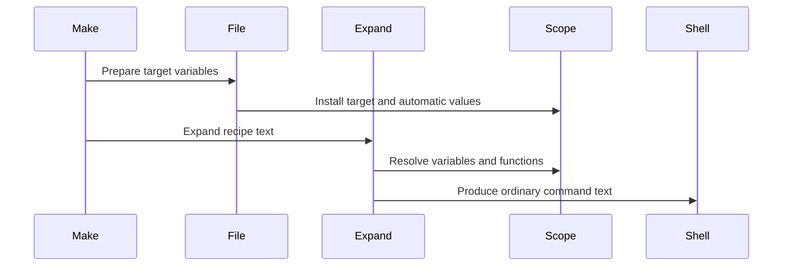

# Chapter 3: variable_expand

You write this recipe:

```make
app: main.o util.o
	$(CC) $(CFLAGS) -o $@ $^
```

But Make does not hand that text directly to the shell. The shell would not know what `$(CC)` or `$@` means. Before a command can run, Make must turn the template into something ordinary, such as:

```sh
cc -O2 -o app main.o util.o
```

How does it do that without confusing:

- `$(CC)` with `$(patsubst %.c,%.o,$(SOURCES))`;
- `$@` with shell syntax;
- a variable name constructed by another variable;
- a recursive variable with an infinite loop;
- a function argument that should *not* be evaluated yet?

The component doing this work is `variable_expand()` in `src/expand.c`.

It is GNU Make’s text-rendering engine. It reads Make syntax, looks up variable definitions through the current scope chain, runs built-in functions, and writes the resulting plain text into an output buffer.

The variable records themselves were introduced in [struct variable](01_struct_variable.md), and the scope chain used for lookup was covered in [variable_set_list](02_variable_set_list.md). This chapter follows the next step: turning a stored value into usable text.

## Expansion is everywhere

Expansion is not only for recipes.

Make expands text while processing:

- immediate assignments such as `:=`;
- variable references in other variables;
- function calls such as `$(sort ...)`;
- conditionals such as `$(if ...)`;
- include-file names;
- ordinary prerequisite lists;
- second-expanded prerequisite lists;
- recipe lines;
- exported recursive variables.

For example:

```make
SOURCES = main.c util.c
OBJECTS = $(patsubst %.c,%.o,$(SOURCES))
```

The stored value of `OBJECTS` is not necessarily the finished text:

```text
$(patsubst %.c,%.o,$(SOURCES))
```

When Make later expands `$(OBJECTS)`, it must:

1. find `OBJECTS`;
2. see that it is recursive;
3. expand its stored text;
4. recognize `patsubst` as a function;
5. expand the function arguments;
6. expand `$(SOURCES)`;
7. run the pattern substitution;
8. produce `main.o util.o`.

That work starts here:

```c
char *
variable_expand (const char *line)
{
  return variable_expand_string (NULL, line, SIZE_MAX);
}
```

`variable_expand()` is the convenient public entry point. The real scanner is `variable_expand_string()`.

Think of the two functions as a receptionist and a workshop:

- `variable_expand()` accepts a complete piece of Make text;
- `variable_expand_string()` does the detailed cutting, lookup, evaluation, and assembly.

## The output buffer: a reusable writing pad

Expansion needs somewhere to write its result. GNU Make uses a shared buffer:

```c
static size_t variable_buffer_length;
char *variable_buffer;
```

The first use initializes it:

```c
char *
initialize_variable_output ()
{
  if (variable_buffer == 0)
    {
      variable_buffer_length = 200;
      variable_buffer = xmalloc (variable_buffer_length);
```

```c
      variable_buffer[0] = '\0';
    }

  return variable_buffer;
}
```

This buffer is like a whiteboard reused for many calculations. Reusing it avoids allocating a brand-new string every time Make expands a small expression.

The helper `variable_buffer_output()` appends text and grows the whiteboard when needed:

```c
char *
variable_buffer_output (char *ptr, const char *string, size_t length)
{
  size_t newlen = length + (ptr - variable_buffer);

  if ((newlen + VARIABLE_BUFFER_ZONE) > variable_buffer_length)
    {
```

The omitted middle section reallocates the buffer if necessary. Then the helper copies the requested characters:

```c
  return mempcpy (ptr, string, length);
}
```

Callers keep the returned pointer, which marks the next free byte.

Conceptually, expanding:

```make
hello $(NAME)
```

looks like this:

```text
input:   hello $(NAME)
output:  hello
lookup:  NAME
output:  hello Ada
```

The growing output pointer acts like a pen moving across a page.

## A scan is mostly copying

Most characters in Make text are uninteresting to the expander. Ordinary letters, spaces, dashes, slashes, and punctuation are copied unchanged.

Inside `variable_expand_string()`, Make looks for the next dollar sign:

```c
p1 = strchr (p, '$');

o = variable_buffer_output
  (o, p, p1 != 0 ? (size_t) (p1 - p) : strlen (p) + 1);

if (p1 == 0)
  break;
```

This is an efficient strategy:

1. copy a whole ordinary stretch at once;
2. stop only at `$`;
3. interpret the special syntax after `$`;
4. resume scanning.

For:

```make
compile $(CC) -c $(SOURCE)
```

the scanner handles it in chunks:

```text
copy:       compile
expand:     $(CC)
copy:       -c
expand:     $(SOURCE)
```

The dollar sign is the doorway from plain text into Make’s little expression language.

## Four meanings of `$`

After finding `$`, `variable_expand_string()` examines the next character:

```c
switch (*p)
  {
  case '$':
  case '\0':
```

```c
  case '(':
  case '{':
```

```c
  default:
    ...
  }
```

Those cases correspond to the forms Make users recognize.

| Input | Meaning | Example result |
|---|---|---|
| `$$` | A literal dollar sign | `$HOME` reaches the shell |
| `$@` | One-character variable name | current target |
| `$(NAME)` | General variable or function syntax | value of `NAME` |
| `${NAME}` | Brace form of general syntax | value of `NAME` |
| `$x` | One-character variable name | value of `x` |
| `$` at end | Literal dollar sign | `$` |

### Literal dollars

The simplest case is `$$`:

```c
case '$':
case '\0':
  o = variable_buffer_output (o, p1, 1);
  break;
```

Both `$$` and a final lone `$` produce one literal dollar sign.

This is why recipes use two dollars for shell variables:

```make
show:
	@echo $$HOME
```

Make sees `$$` and writes `$`. The shell then receives:

```sh
echo $HOME
```

There are two interpreters in sequence:

```text
Make interprets dollars first.
The shell may interpret remaining dollars later.
```

A doubled dollar is an envelope addressed to the shell: “do not open this in Make; pass it on.”

### One-character variables

If the next character is neither `$`, `(`, nor `{`, Make treats it as a one-character variable name:

```c
o = reference_variable (o, p, 1);
```

So these forms are equivalent:

```make
$@
$(@)
```

Both refer to the one-character variable named `@`.

The same rule handles:

```make
$<
$^
$*
$?
```

These automatic variables are installed in the target’s local scope before recipe expansion. The setup happens in `set_file_variables()`:

```c
DEFINE_VARIABLE ("<", 1, less);
DEFINE_VARIABLE ("*", 1, star);
DEFINE_VARIABLE ("@", 1, at);
DEFINE_VARIABLE ("%", 1, percent);
```

The target-specific scope machinery behind those values is explained in [variable_set_list](02_variable_set_list.md).

## Looking up an ordinary variable

The helper responsible for a simple variable reference is `reference_variable()`:

```c
v = lookup_variable (name, length);

if (v == 0)
  warn_undefined (name, length);
```

`lookup_variable()` walks the current `variable_set_list`, beginning with the most specific scope. That means an expansion inside a recipe can see:

- automatic variables;
- target-specific variables;
- pattern-specific variables;
- inherited target variables;
- global variables.

The lookup behavior is the same one described in [variable_set_list](02_variable_set_list.md). Expansion does not need a second scope system; it simply asks the existing scope chain.

If no definition is found, Make expands the reference to nothing:

```make
MESSAGE = hello $(MISSING)
```

becomes:

```text
hello 
```

With `--warn-undefined-variables`, Make also reports a warning.

If a definition is found, Make chooses between two paths:

```c
value = (v->recursive ? recursively_expand (v) : v->value);
```

A simple variable is already finished text. A recursive variable is a recipe that must be interpreted again.

## Simple variables: printed photographs

Consider:

```make
NAME = Ada
GREETING := hello $(NAME)
NAME = Lin
```

Because `GREETING` used `:=`, its right-hand side was expanded when assigned. Its stored value is effectively:

```text
hello Ada
```

When Make later sees:

```make
$(GREETING)
```

it can copy the stored text directly.

This is the simple-variable branch:

```c
value = (v->recursive ? recursively_expand (v) : v->value);

o = variable_buffer_output (o, value, strlen (value));

if (v->recursive)
  free (value);
```

For a non-recursive variable, `v->value` is borrowed storage owned by the variable record. Make copies it into the output buffer but does not free it.

A simple variable is like a printed photograph: the scene was captured when the assignment happened.

## Recursive variables: live camera feeds

Now compare:

```make
NAME = Ada
GREETING = hello $(NAME)
NAME = Lin
```

The stored value of `GREETING` remains:

```text
hello $(NAME)
```

When `$(GREETING)` is used, Make expands that text at that moment. Therefore it becomes:

```text
hello Lin
```

A recursive variable is like a live camera feed. It does not preserve the old image; it shows whatever the referenced values mean now.

The recursive path enters:

```c
char *
recursively_expand_for_file (struct variable *v, struct file *file)
{
  ...
  v->expanding = 1;
```

```c
  if (v->append)
    value = allocated_variable_append (v);
  else
    value = allocated_variable_expand (v->value);
```

```c
  v->expanding = 0;
  return value;
}
```

The important middle operation is `allocated_variable_expand(v->value)`. It expands the stored text while using a separate output-buffer context, then returns a newly allocated result.

That allocation is important. The outer expansion may still be writing to the shared `variable_buffer`, so recursive expansion cannot safely reuse and overwrite it.

## Nested references and constructed names

Make supports nested references:

```make
LANG = CC
CC = clang

show:
	@echo $($(LANG))
```

The result is:

```text
clang
```

This is not a lookup for the literal name `$(LANG)`. Make must first expand the *name* inside the outer parentheses:

```text
$($(LANG))
  └─ expand inner reference: LANG → CC
  └─ lookup resulting name: CC → clang
```

Inside `variable_expand_string()`, Make notices a dollar sign inside the parentheses:

```c
p1 = lindex (beg, end, '$');
if (p1 != 0)
  {
    ...
    abeg = expand_argument (beg, p);
    beg = abeg;
```

`expand_argument()` makes a temporary string and expands it safely:

```c
char *
expand_argument (const char *str, const char *end)
{
  if (str == end)
    return xstrdup ("");

  if (!end || *end == '\0')
    return allocated_variable_expand (str);
```

The final part handles a substring:

```c
  memcpy (tmp, str, end - str);
  tmp[end - str] = '\0';

  r = allocated_variable_expand (tmp);
```

This is like resolving an address written on another envelope. First read the envelope to discover “CC”; then visit the `CC` mailbox.

Constructed names are useful, but they can make Makefiles difficult to read. A beginner-friendly rule is:

> Use constructed names when they make a repeated pattern clearer, not merely because they are clever.

For example, this can be reasonable:

```make
MODE = debug
debug_FLAGS = -g
release_FLAGS = -O3

CFLAGS = $($(MODE)_FLAGS)
```

But a deeply nested construction is usually a sign that a normal function or a clearer variable name would help.

## Substitution references are shorthand functions

Make also recognizes this syntax:

```make
OBJECTS = main.o util.o
SOURCES = $(OBJECTS:.o=.c)
```

The output is:

```text
main.c util.c
```

This is called a substitution reference. It is shorthand for a word-oriented pattern substitution.

The expander finds the colon and equals sign:

```c
colon = lindex (beg, end, ':');

if (colon)
  {
    const char *subst_beg = colon + 1;
    const char *subst_end = lindex (subst_beg, end, '=');
```

If both separators exist, Make looks up the variable before the colon:

```c
v = lookup_variable (beg, colon - beg);

if (v != 0 && *v->value != '\0')
  {
    char *value = (v->recursive
                   ? recursively_expand (v)
                   : v->value);
```

Then it uses `patsubst_expand_pat()` to perform the replacement.

The mental translation is:

```make
$(OBJECTS:.o=.c)
```

approximately means:

```make
$(patsubst %.o,%.c,$(OBJECTS))
```

The shorthand works particularly well for common suffix transformations. For more involved patterns, writing `$(patsubst ...)` directly is usually clearer.

## Recognizing a function before recognizing a variable

When Make sees this:

```make
$(sort b a b)
```

it must not look up a variable literally named `sort b a b`.

Before treating parenthesized text as a variable reference, `variable_expand_string()` asks `handle_function()` whether the content begins with a built-in function name:

```c
op = o;
begp = p;
if (handle_function (&op, &begp))
  {
    o = op;
    p = begp;
    break;
  }
```

If `handle_function()` succeeds, it:

1. identifies the function;
2. locates its matching closing parenthesis;
3. separates comma-delimited arguments;
4. expands arguments when appropriate;
5. invokes the C implementation;
6. appends the result to the output buffer.

If it does not recognize a function, normal variable-reference processing continues.

This ordering makes Make syntax compact:

```make
$(CC)
$(sort z a z)
$(if $(DEBUG),-g,-O2)
```

All three begin with `$(...)`, but the first is a variable lookup and the other two are function calls.

## The function table: Make’s small standard library

Built-in functions are registered in `function_table_init`:

```c
FT_ENTRY ("subst",     3,  3,  1,  func_subst),
FT_ENTRY ("patsubst",  3,  3,  1,  func_patsubst),
FT_ENTRY ("sort",      0,  1,  1,  func_sort),
FT_ENTRY ("strip",     0,  1,  1,  func_strip),
```

Each table entry records:

- the function name;
- minimum argument count;
- maximum argument count;
- whether its arguments should be expanded automatically;
- the C function that implements it.

For example:

```c
FT_ENTRY ("foreach",  3,  3,  0,  func_foreach),
FT_ENTRY ("if",       2,  3,  0,  func_if),
FT_ENTRY ("call",     1,  0,  1,  func_call),
```

Notice that `foreach` and `if` have `0` in the “expand arguments automatically” position.

That is not an accident. These functions need special control over *when* their arguments are expanded.

## Most function arguments expand first

For ordinary functions, Make expands arguments before invoking the function.

Take:

```make
EXT = c
FILES = main.c util.c

OBJECTS = $(patsubst %.$(EXT),%.o,$(FILES))
```

Before `patsubst` runs, Make expands:

```text
%.$(EXT)  → %.c
$(FILES)  → main.c util.c
```

Then the C implementation receives plain strings:

```text
pattern: %.c
replace: %.o
text:    main.c util.c
```

The argument-processing path is:

```c
if (entry_p->expand_args)
  {
    ...
    *argvp = expand_argument (p, next);
```

Each argument is expanded into separately allocated storage. Once all arguments are ready, Make calls the function:

```c
*op = expand_builtin_function (*op, nargs, argv, entry_p);
```

This is similar to evaluating arguments before calling an ordinary programming-language function.

## Some functions must delay evaluation

Now consider:

```make
MODE = debug

FLAGS = $(if $(MODE),-g,$(error MODE is required))
```

The false branch contains `$(error ...)`, but it must not run when `MODE` is nonempty.

If Make eagerly expanded every argument before calling `if`, both branches would be evaluated, and the Makefile would fail even though the true branch was chosen.

So `if` receives its arguments unexpanded. `func_if()` evaluates the condition first:

```c
expansion = expand_argument (begp, endp+1);

result = expansion[0] != '\0';
free (expansion);
```

Only after choosing a branch does it expand that branch:

```c
argv += 1 + !result;

if (*argv)
  {
    char *expansion = expand_argument (*argv, NULL);
```

That is lazy evaluation: defer work until it is known to be needed.

The same idea appears in `or` and `and`, which short-circuit their arguments.

```make
RESULT = $(or $(FIRST),$(SECOND),fallback)
```

Make expands `FIRST`. If it is nonempty, Make stops and never evaluates the remaining alternatives.

Like an emergency checklist, it does not continue opening doors after it has already found the exit.

## `foreach` creates a temporary variable

`foreach` needs even more careful timing:

```make
FILES = main.c util.c
OBJECTS = $(foreach f,$(FILES),$(f:.c=.o))
```

The result is:

```text
main.o util.o
```

Make must:

1. expand the loop-variable name;
2. expand the list;
3. leave the body untouched;
4. create a temporary `f`;
5. expand the body once per word.

The implementation begins with those first two expansions:

```c
char *varname = expand_argument (argv[0], NULL);
char *list = expand_argument (argv[1], NULL);
const char *body = argv[2];
```

Then it creates a temporary variable scope:

```c
push_new_variable_scope ();
var = define_variable (vp, strlen (vp), "", o_automatic, 0);
```

For each word, it updates the temporary variable and expands the body:

```c
free (var->value);
var->value = xstrndup (p, len);

result = allocated_variable_expand (body);
```

Finally, it removes the temporary scope:

```c
pop_variable_scope ();
```

The push-and-pop mechanism is the same scope machinery used by target-specific and automatic variables. See [variable_set_list](02_variable_set_list.md) for the underlying chain structure.

`foreach` is like placing a new name tag on a participant for each round of a game. The name tag exists only for that round, then changes for the next one, and finally disappears.

## `call` turns a variable into a parameterized template

GNU Make variables can act like user-defined functions:

```make
compile = $(CC) $(CFLAGS) -c $1 -o $2

main.o: main.c
	$(call compile,$<,$@)
```

During this call, Make binds:

```text
$(0)  → compile
$(1)  → main.c
$(2)  → main.o
```

The core setup is:

```c
push_new_variable_scope ();

for (i=0; *argv; ++i, ++argv)
  {
    char num[INTSTR_LENGTH];
```

```c
    sprintf (num, "%u", i);
    define_variable (num, strlen (num), *argv, o_automatic, 0);
  }
```

Then `call` expands the named variable in that temporary scope.

This means a user-defined Make “function” is not a separate language feature with a separate calling convention. It is an ordinary variable expansion performed while temporary automatic variables named `0`, `1`, `2`, and so on are visible.

The recursion machinery has a special accommodation for `call`, which we will see shortly.

## Expansion must survive nested expansion

The shared `variable_buffer` is efficient, but nested expansion would be dangerous if every layer wrote on the same whiteboard.

Imagine expanding:

```make
$(sort $(FILES))
```

The outer expansion is writing output. Then `sort` must expand `$(FILES)`. If the inner expansion reused the same buffer without protection, it could erase or overwrite the outer work.

`allocated_variable_expand_for_file()` solves this by temporarily installing a separate buffer context:

```c
char *obuf = variable_buffer;
size_t olen = variable_buffer_length;

variable_buffer = 0;

value = variable_expand_for_file (line, file);
```

After expansion, it restores the previous context:

```c
variable_buffer = obuf;
variable_buffer_length = olen;

return value;
```

This is like putting the current sheet of paper aside, doing a sub-calculation on a fresh sheet, then returning with the finished result.

The related helpers make the same idea explicit:

```c
void
install_variable_buffer (char **bufp, size_t *lenp)
{
  *bufp = variable_buffer;
  *lenp = variable_buffer_length;
```

```c
  variable_buffer = 0;
  initialize_variable_output ();
}
```

And later:

```c
void
restore_variable_buffer (char *buf, size_t len)
{
  free (variable_buffer);

  variable_buffer = buf;
  variable_buffer_length = len;
}
```

This buffer swapping is especially important for `$(eval ...)`, because evaluating generated Makefile text may define or replace variables while another expansion is still in progress.

## Detecting unsafe recursion

A recursive variable can refer to itself indirectly:

```make
A = $(B)
B = $(A)
```

Trying to expand `$(A)` would otherwise loop forever:

```text
A → B → A → B → A ...
```

GNU Make records whether a variable is currently expanding:

```c
unsigned int expanding:1;
```

When recursive expansion begins:

```c
v->expanding = 1;
```

Before that, Make checks whether the variable is already active:

```c
if (v->expanding)
  {
    if (!v->exp_count)
      OS (fatal, *expanding_var,
          _("Recursive variable '%s' references itself (eventually)"),
          v->name);
```

For ordinary recursive variables, `exp_count` is zero. So the second attempt to expand the same active variable is fatal.

This catches both direct recursion:

```make
A = $(A)
```

and indirect recursion:

```make
A = $(B)
B = $(C)
C = $(A)
```

The error message says “eventually” because Make does not need to know the entire cycle. Seeing the same currently-expanding variable again is enough proof.

A recursive-expansion flag is like a “currently inside” sign on a room’s door. If following a hallway leads you back to a room whose sign already says “currently inside,” you have found a loop.

## Why `call` gets an expansion allowance

Some self-reference is legitimate when used as a parameterized macro.

Consider a recursive macro that invokes itself through `call`. GNU Make needs to permit that controlled form long enough for function arguments and recursion to work.

Before expanding a called variable, `func_call()` sets:

```c
v->exp_count = EXP_COUNT_MAX;
```

The limit is defined in `variable.h`:

```c
#define EXP_COUNT_BITS  15
#define EXP_COUNT_MAX   ((1<<EXP_COUNT_BITS)-1)
```

During expansion, if Make re-enters the variable, it consumes one allowance:

```c
if (v->expanding)
  {
    if (!v->exp_count)
      ...
    --v->exp_count;
  }
```

After the call completes, `func_call()` resets the counter:

```c
v->exp_count = 0;
```

This is not permission for endless recursion. It is a large, bounded allowance for a special valid use case.

Think of normal recursive-variable protection as a locked stairwell door. `call` receives a temporary access pass, but the pass still has a finite number of uses.

## Expansion has a location for diagnostics

A variable can come from a Makefile line, a command line assignment, a built-in default, or a generated `eval` string. If expansion fails, Make tries to report the most useful source location.

The expansion code keeps a pointer to the current diagnostic location:

```c
const floc **expanding_var = &reading_file;
```

When recursively expanding a variable defined in a real file, Make temporarily uses that variable’s location:

```c
if (v->fileinfo.filenm)
  {
    this_var = &v->fileinfo;
    expanding_var = &this_var;
  }
```

That is why an error such as recursive expansion can point near the variable definition that caused it.

The `fileinfo` field belongs to `struct variable`, discussed in [struct variable](01_struct_variable.md). Expansion uses that stored metadata to make diagnostics feel connected to the Makefile the user actually wrote.

## Expansion for a particular target

The meaning of `$@` depends on the target. So does the meaning of a target-specific `CFLAGS`.

Before expanding a recipe, Make must switch to the target’s variable scope chain.

`variable_expand_for_file()` performs that context switch:

```c
savev = current_variable_set_list;
current_variable_set_list = file->variables;

result = variable_expand (line);

current_variable_set_list = savev;
```

It also adjusts diagnostic context to refer to the recipe’s source location when possible.

Suppose:

```make
CFLAGS = -O2

debug: CFLAGS = -O0 -g
debug: main.o
	$(CC) $(CFLAGS) -o $@ $^
```

When Make expands `debug`’s recipe, the active lookup chain contains:

```text
automatic variables
debug target-specific variables
global variables
```

Therefore:

```text
$(CC)      → cc or another configured compiler
$(CFLAGS)  → -O0 -g
$@         → debug
$^         → main.o
```

The complete recipe-expansion flow looks like this:



The shell receives ordinary command text, not Make syntax.

Recipe execution itself, including shell selection and child-process creation, is covered later in [new_job](09_new_job.md).

## Functions can have side effects

Many Make functions merely transform text:

```make
$(sort z a z)
$(strip   too   many   spaces )
$(patsubst %.c,%.o,$(SOURCES))
```

But some functions do more than compute a string.

### `warning`, `info`, and `error`

These functions communicate with the user:

```make
$(info building $(TARGET))
$(warning unusual configuration)
$(error required tool is missing)
```

Their shared implementation is `func_error()`:

```c
case 'e':
  OS (fatal, reading_file, "%s", argv[0]);

case 'w':
  OS (error, reading_file, "%s", argv[0]);
  break;
```

`info` prints normally, `warning` reports a nonfatal diagnostic, and `error` stops Make.

Despite their visible behavior, these functions expand to the empty string. That allows them to appear inside a larger expression:

```make
MESSAGE = $(warning checking configuration)ready
```

The resulting value is:

```text
ready
```

after Make has printed the warning.

### `shell`

The `shell` function runs a command and inserts its output:

```make
VERSION := $(shell git describe --always)
```

Its implementation eventually builds a child environment:

```c
child.environment = target_environment (NULL, 0);
```

Then it runs the command, collects standard output, and folds newlines into spaces.

Because `shell` may invoke a subprocess while Make is expanding variables, it creates a subtle recursion problem: the child environment may itself require recursive expansion.

GNU Make tracks that situation with:

```c
unsigned long long env_recursion = 0;
```

When generating an environment for `$(shell ...)`, `target_environment()` increments it:

```c
if (!file)
  ++env_recursion;
```

If an actively expanding variable is encountered during this special environment construction, Make falls back to the original process environment value when possible instead of reporting normal recursive-variable failure.

This behavior is mainly for compatibility. The practical lesson is simpler:

> Avoid recursive variables whose expansion runs `$(shell ...)` and also depends on exporting the same variable.

That is a maze where Make must build an environment to run a command, but building that environment requires expanding the value that launched the command.

## `value` reads stored text without expanding it

Normally, referencing a recursive variable expands its contents:

```make
COMMAND = echo $(NAME)
NAME = Ada

show:
	@echo $(COMMAND)
```

The reference to `$(COMMAND)` becomes:

```text
echo Ada
```

But `$(value COMMAND)` returns the stored text instead:

```make
show:
	@echo '$(value COMMAND)'
```

Conceptually, it produces:

```text
echo $(NAME)
```

The implementation is deliberately short:

```c
v = lookup_variable (argv[0], strlen (argv[0]));

if (v)
  o = variable_buffer_output (o, v->value, strlen (v->value));
```

No call to `recursively_expand()`. No second interpretation.

`value` is like opening a recipe card and reading the instructions literally, rather than cooking the recipe.

It is especially useful with `eval`, where you may need to control exactly how many rounds of expansion occur.

## Expansion and `eval`

`eval` is a bridge between text generation and Makefile parsing.

For example:

```make
define make-rule
$1: $2
	@echo building $$@
endef

$(eval $(call make-rule,app,main.o))
```

The first expansion of `eval` turns the template into Makefile syntax. Then Make parses that generated syntax as though it appeared in the original Makefile.

The built-in implementation is compact:

```c
static char *
func_eval (char *o, char **argv, const char *funcname UNUSED)
{
  char *buf;
  size_t len;
```

```c
  install_variable_buffer (&buf, &len);

  eval_buffer (argv[0], NULL);

  restore_variable_buffer (buf, len);
```

```c
  return o;
}
```

The function:

1. saves the active expansion buffer;
2. parses the generated text through `eval_buffer()`;
3. restores the original buffer;
4. expands to an empty string.

The parser entry point `eval_buffer()` lives in `src/read.c`. It reuses the same Makefile-reading machinery used for actual files.

This is powerful because `eval` lets Make text create:

- variables;
- rules;
- target-specific assignments;
- generated includes;
- more `eval` calls.

It is also easy to overuse because every extra expansion layer changes how many dollar signs are needed.

The next chapter, [eval](04_eval.md), examines that two-stage process in detail.

## A worked expansion trace

Consider this Makefile:

```make
NAME = Ada
SOURCES = main.c util.c
OBJECTS = $(patsubst %.c,%.o,$(SOURCES))

app: $(OBJECTS)
	@echo hello $(NAME): $@ needs $^
```

When Make prepares the `app` recipe, the stored recipe text is:

```text
@echo hello $(NAME): $@ needs $^
```

The expansion engine processes it approximately like this:

| Step | Input fragment | Action | Output so far |
|---|---|---|---|
| 1 | `@echo hello ` | copy ordinary text | `@echo hello ` |
| 2 | `$(NAME)` | look up recursive `NAME` | `@echo hello Ada` |
| 3 | `: ` | copy ordinary text | `@echo hello Ada: ` |
| 4 | `$@` | look up automatic `@` | `@echo hello Ada: app` |
| 5 | ` needs ` | copy ordinary text | `@echo hello Ada: app needs ` |
| 6 | `$^` | look up automatic `^` | `@echo hello Ada: app needs main.o util.o` |

The resulting command text is:

```sh
@echo hello Ada: app needs main.o util.o
```

The leading `@` is later interpreted as a recipe prefix flag, meaning “do not echo this command before running it.” The remaining text goes to the shell.

The prerequisite list itself was expanded earlier:

```make
$(OBJECTS)
```

which required:

```text
OBJECTS
  → patsubst function
  → SOURCES
  → main.c util.c
  → main.o util.o
```

The same expansion engine serves both phases.

## Reading `variable_expand` in the source

When navigating this area of the GNU Make source tree, these are useful landmarks:

| Question | Main location |
|---|---|
| Where does ordinary expansion begin? | `variable_expand()` in `src/expand.c` |
| Where is the scanner loop? | `variable_expand_string()` in `src/expand.c` |
| How are ordinary variables looked up? | `reference_variable()` in `src/expand.c` |
| How are recursive variables expanded safely? | `recursively_expand_for_file()` in `src/expand.c` |
| How are target scopes selected? | `variable_expand_for_file()` in `src/expand.c` |
| How are built-in functions recognized? | `handle_function()` in `src/function.c` |
| Where are built-in functions registered? | `function_table_init` in `src/function.c` |
| How do `foreach` and `call` make local bindings? | `func_foreach()` and `func_call()` in `src/function.c` |
| Where are automatic variables installed? | `set_file_variables()` in `src/commands.c` |
| Where does generated Makefile text get parsed? | `eval_buffer()` in `src/read.c` |

A good debugging question is:

> Is this text being copied, looked up, recursively expanded, or executed as a function?

Those are the four major paths through the expander.

## Practical debugging techniques

When expansion gives surprising results, make the timing visible.

Start with `info`:

```make
$(info CC is $(CC))
$(info CFLAGS is $(CFLAGS))
$(info OBJECTS is $(OBJECTS))
```

For a particular variable, inspect its origin and flavor:

```make
debug-vars:
	@echo value: $(CFLAGS)
	@echo origin: $(origin CFLAGS)
	@echo flavor: $(flavor CFLAGS)
```

Use `value` when you need to see stored text rather than expanded text:

```make
debug-vars:
	@echo expanded: $(CFLAGS)
	@echo raw: $(value CFLAGS)
```

And remember the dollar-sign boundary:

```make
show:
	@echo Make sees $(HOME)
	@echo shell sees $$HOME
```

The first line asks Make for a Make variable named `HOME`. The second asks Make to pass `$HOME` onward so the shell can interpret it.

## Key takeaways

`variable_expand` is the engine that converts Make-language text into ordinary text.

Its central jobs are:

- scanning ordinary text until it finds `$`;
- handling `$$`, `$@`, `$x`, `$(NAME)`, and `${NAME}`;
- looking up names through the active variable scope chain;
- copying simple values directly;
- recursively expanding recursive values;
- expanding nested or constructed variable names;
- recognizing substitution references such as `$(FILES:.c=.o)`;
- dispatching built-in functions through a function table;
- delaying evaluation for functions such as `if`, `or`, `and`, `foreach`, and `let`;
- using temporary scopes for `foreach` and `call`;
- protecting the shared output buffer during nested work;
- detecting unsafe recursive-variable cycles;
- switching to a target’s variable context when expanding recipes.

The important mental model is this:

> Make expansion is not simple search-and-replace. It is a small interpreter.

It reads templates, follows scoped names, runs built-in programs, creates temporary bindings, and carefully prevents recursive loops from running forever.

Now that we understand how Make turns text into more text, the next question is what happens when that generated text is treated as brand-new Makefile syntax. That is the subject of [eval](04_eval.md).