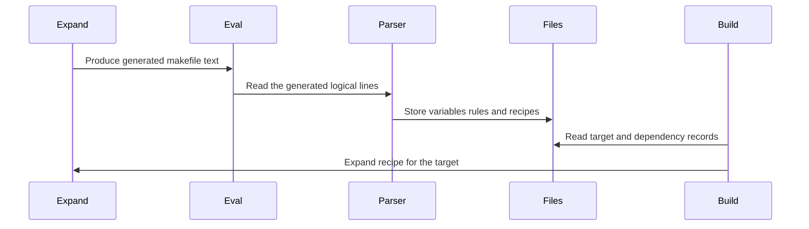

# Chapter 4: eval

How can GNU Make look at these very different lines and know what each one means?

```make
CC := clang
include config.mk
app: main.o util.o
	$(CC) -o $@ $^
```

One line defines a variable. One requests another Makefile. One creates a target and its prerequisites. One is a recipe line, even though it begins with a tab rather than a keyword.

Now make the puzzle harder:

```make
$(eval generated: generated.c)
$(eval 	@echo building $$@)
```

Those lines *create new Makefile syntax while Make is already reading Makefile syntax*.

The component that keeps this organized is `eval()` in `src/read.c`. It is GNU Make’s central Makefile parser. It reads logical lines, distinguishes variable assignments, conditionals, include directives, target rules, prerequisites, and recipe lines, then records their meaning in Make's internal database.

Think of it as a language interpreter reading a construction plan and filing each instruction into the correct project ledger:

- variables go into the variable ledger;
- targets go into the file ledger;
- prerequisites become dependency records;
- recipes are attached to targets;
- includes open another stack of plans;
- conditionals decide which instructions are currently active.

The word **eval** appears in two closely related places:

1. `eval()` is the internal parser loop that reads Makefile text.
2. `$(eval ...)` is a Make function that feeds generated text back into that parser.

The second is famous, but the first is the foundation. Without the parser loop, `$(eval ...)` would have nowhere to send its generated instructions.

The variable-expansion engine from [variable_expand](03_variable_expand.md) produces text. This chapter follows what happens when Make treats that text as fresh Makefile language.

## Two ways Make gets text to parse

GNU Make can parse text from a real file:

```make
include config.mk
```

Or it can parse text already held in memory:

```make
$(eval MODE := debug)
```

Both routes eventually arrive at the same parser:

```c
static void
eval (struct ebuffer *buffer, int flags)
{
  ...
}
```

The parser does not need to know whether its instructions came from `Makefile`, an included file, the `-E` command-line option, or the `$(eval ...)` function. It receives an `ebuffer`, short for “evaluation buffer.”

```c
struct ebuffer
  {
    char *buffer;
    char *bufnext;
    char *bufstart;
    FILE *fp;
    floc floc;
  };
```

The important ideas are:

| Field | Role |
|---|---|
| `buffer` | current logical line |
| `bufnext` | where the next line begins |
| `bufstart` | start of the whole allocated buffer |
| `fp` | input file, or `NULL` for in-memory text |
| `floc` | file name and line information for diagnostics |

An `ebuffer` is like a reader’s bookmark and clipboard combined. It remembers where Make is reading, what the current line is, and where an error should be reported.

For a normal Makefile, `fp` points to an open file stream. For generated text, `fp` is `NULL`.

## Entering through a real Makefile

When Make reads an ordinary Makefile, `read_all_makefiles()` chooses files from sources such as:

- the `MAKEFILES` variable;
- `-f FILE` command-line options;
- default names including `GNUmakefile`, `makefile`, and `Makefile`.

It then calls `eval_makefile()`.

```c
static struct goaldep *
eval_makefile (const char *filename, unsigned short flags)
{
  struct ebuffer ebuf;
  ...
}
```

After opening the file, `eval_makefile()` gives the parser an initial source location:

```c
ebuf.floc.filenm = filename;
ebuf.floc.lineno = 1;
ebuf.floc.offset = 0;
```

That location is why Make can report useful messages such as:

```text
Makefile:12: *** missing separator.  Stop.
```

The location information also becomes part of variable and recipe records. A variable’s `fileinfo` field was introduced in [struct variable](01_struct_variable.md), and recipes store similar source information in `struct commands`.

Before parsing a Makefile, GNU Make also appends its name to `MAKEFILE_LIST`:

```c
do_variable_definition (&ebuf.floc, "MAKEFILE_LIST", filename,
                        o_file, f_append_value, 0);
```

So this Makefile can reveal the reading order:

```make
$(info files read so far: $(MAKEFILE_LIST))
```

That is a useful debugging trick when several files include one another.

## Entering through `$(eval ...)`

The built-in `eval` function lives in `src/function.c`:

```c
static char *
func_eval (char *o, char **argv, const char *funcname UNUSED)
{
  ...
}
```

Its core action is remarkably small:

```c
install_variable_buffer (&buf, &len);

eval_buffer (argv[0], NULL);

restore_variable_buffer (buf, len);
```

The function temporarily gives the parser a separate expansion buffer, calls `eval_buffer()`, then restores the caller’s buffer.

Why save and restore the buffer?

Because `$(eval ...)` often appears while Make is already expanding another string. The expansion system uses a reusable global output buffer, described in [variable_expand](03_variable_expand.md). If parsing generated Makefile text reused that same workspace carelessly, it could overwrite the text currently being expanded.

It is like putting your current worksheet aside before opening a new notebook. Finish the side task, then put the original worksheet back on the desk.

`eval_buffer()` wraps an in-memory string in an `ebuffer`:

```c
ebuf.size = strlen (buffer);
ebuf.buffer = ebuf.bufnext = ebuf.bufstart = buffer;
ebuf.fp = NULL;
```

Then it invokes the same central parser:

```c
eval (&ebuf, 1);
```

The parser is shared. The source differs; the language rules do not.

## The two expansion stages of `$(eval ...)`

The most important rule about `$(eval ...)` is:

> Its argument is expanded before Make parses it as Makefile syntax.

For example:

```make
TARGET = hello

$(eval $(TARGET): hello.c)
```

The function argument expands first:

```text
$(TARGET): hello.c
```

becomes:

```make
hello: hello.c
```

Then `eval_buffer()` parses that result as a target rule.

This is why `eval` is powerful. You can use variables, functions, `foreach`, and `call` to generate Makefile structures.

```make
PROGRAMS = client server

$(foreach p,$(PROGRAMS),$(eval $(p): $(p).o))
```

Conceptually, Make generates:

```make
client: client.o
server: server.o
```

Then it parses both rules normally.

However, this also creates the classic dollar-sign problem. Suppose generated recipe text should contain `$@` for later recipe expansion:

```make
define make-rule
$1:
	@echo building $@
endef
```

This does **not** work as intended:

```make
$(eval $(call make-rule,app))
```

During the first expansion, `$@` is expanded immediately. Outside a recipe context, it is usually empty. The parser receives something like:

```make
app:
	@echo building
```

To preserve `$@` until the recipe runs, double the dollar sign:

```make
define make-rule
$1:
	@echo building $$@
endef
```

Now the stages are:

| Stage | Text |
|---|---|
| stored template | `$$@` |
| expansion for `eval` | `$@` |
| stored recipe | `$@` |
| expansion for target recipe | `app` |

This is the same Make-versus-shell boundary discussed in [variable_expand](03_variable_expand.md), but here there are two Make expansion opportunities rather than one.

A useful mental model is:

```text
template source
    ↓ first expansion
generated Makefile text
    ↓ parser
stored rule or variable
    ↓ later expansion when used
final text
```

Each arrow may consume one level of dollar escaping.

## Command-line `--eval` is related but different

GNU Make also accepts:

```sh
make --eval='MESSAGE := from command line'
```

or:

```sh
make -E 'MESSAGE := from command line'
```

In `main.c`, those strings are collected in `eval_strings`. Before Makefiles are read, Make evaluates each one:

```c
p = xstrdup (eval_strings->list[i]);
eval_buffer (p, NULL);
free (p);
```

This is related to `$(eval ...)`, but the timing differs:

- `--eval` is processed during startup, before normal Makefiles;
- `$(eval ...)` runs wherever expansion reaches it while Make is reading or expanding text.

The command-line form is like handing the site manager an extra instruction before construction plans are opened. The function form is like inserting a newly generated instruction in the middle of reading the plans.

## Reading logical lines, not merely physical lines

A Makefile is written in physical lines, separated by newline characters. But Make often reads **logical lines**.

For example:

```make
SOURCES = main.c \
          util.c \
          net.c
```

This is three physical lines but one logical assignment.

For in-memory `eval` text, `readstring()` finds a newline and checks whether it was escaped:

```c
while (p > bol && *(--p) == '\\')
  backslash = !backslash;
```

An odd number of trailing backslashes means the newline is escaped, so Make continues reading. An even number means the backslashes escape one another and the newline ends the logical line.

That detail matters for strings generated by `$(eval ...)`:

```make
$(eval FILES = one \
two)
```

The generated text can contain a continuation just like a physical Makefile can.

When reading from a real file, `readline()` performs the corresponding job with `fgets()`. It also handles long lines by growing the input buffer.

The parser later performs another normalization step for most non-recipe text:

```c
collapse_continuations (collapsed);
remove_comments (collapsed);
```

This turns line continuations into ordinary spacing and removes comments.

So this:

```make
FLAGS = -Wall \ # compiler warnings
        -Wextra
```

is interpreted approximately as:

```make
FLAGS = -Wall -Wextra
```

Recipe handling is intentionally different, because recipe text belongs to a shell language and Make should preserve more of its structure.

## Recipe lines get first priority

A line beginning with the current recipe prefix is special. Normally that prefix is a tab.

```make
app: main.o
	$(CC) -o $@ $^
```

Inside `eval()`, Make checks this before treating the line as an ordinary directive:

```c
if (line[0] == cmd_prefix)
  {
    ...
  }
```

If Make has just read target names, it appends this line to the accumulated recipe text:

```c
memcpy (&commands[commands_idx], line + 1, linelen - 1);
commands_idx += linelen - 1;
commands[commands_idx++] = '\n';
```

Notice `line + 1`: Make removes the recipe prefix character but retains the rest of the recipe exactly as text.

Make does **not** execute the recipe now. It only records it for later. The command eventually becomes a `struct commands`, then is attached to a target’s `struct file`.

That delayed execution is essential. Parsing a rule is like filing a work order. Running its commands happens only after Make decides the target needs rebuilding. The update process is covered in [update_goal_chain](08_update_goal_chain.md), and actual process creation appears in [new_job](09_new_job.md).

A recipe prefix without a preceding target is an error:

```make
	@echo orphaned command
```

The parser diagnoses this as:

```text
recipe commences before first target
```

That is why accidentally replacing a tab with spaces is such a common Makefile mistake.

## One parser loop, several ledgers

The central `eval()` function carries temporary state while it reads lines:

```c
char *commands;
unsigned int cmds_started, tgts_started;
struct nameseq *filenames = 0;
char *depstr = 0;
```

These fields represent a partially read rule:

| Temporary state | Meaning |
|---|---|
| `filenames` | target names waiting to be recorded |
| `depstr` | prerequisite text |
| `commands` | accumulated recipe text |
| `tgts_started` | source line where targets began |
| `cmds_started` | source line where the recipe began |

Why delay recording a rule?

Because a rule can span several lines:

```make
app: main.o util.o
	$(CC) -o $@ $^
	@echo built $@
```

After reading only the first line, Make knows the targets and prerequisites, but it does not yet know all recipe lines. It waits until another non-recipe statement begins, or until end of file.

The parser uses a local helper macro named `record_waiting_files()` to commit the pending rule:

```c
record_files (filenames, also_make_targets, pattern,
              pattern_percent, depstr, cmds_started,
              commands, commands_idx, two_colon, prefix, &fi);
```

The actual storage work happens in `record_files()`.

This is like collecting a target’s cover sheet, materials list, and work instructions into one folder. Make does not file the folder until it knows the folder is complete.

## Variable assignments are recognized early

Before looking for conditionals or directives, the parser checks whether a line is a variable assignment.

```c
p = parse_var_assignment (p, 0, &vmod);
if (vmod.assign_v)
  {
    ...
  }
```

The order matters.

Imagine this Makefile:

```make
ifdef = not a conditional
```

The word `ifdef` normally introduces a conditional, but here it is the name of a variable. If Make looked for conditional keywords first, it would misread the line.

`parse_var_assignment()` understands modifiers such as:

```make
export PATH = /custom/bin
override CC = clang
private TOKEN = secret
```

It records those modifiers in `struct vmodifiers`:

```c
struct vmodifiers
  {
    unsigned int override_v:1;
    unsigned int private_v:1;
    enum variable_export export_v;
  };
```

Then Make chooses the assignment’s origin:

```c
enum variable_origin origin =
  vmod.override_v ? o_override : o_file;
```

The variable machinery decides how the definition is stored and whether it outranks an existing definition. That authority model belongs to [struct variable](01_struct_variable.md).

For an ordinary assignment:

```make
MODE := release
```

the parser eventually calls:

```c
v = try_variable_definition (fstart, p, origin, 0);
```

That sequence has clear responsibilities:

1. `parse_var_assignment()` identifies modifiers and assignment syntax.
2. `try_variable_definition()` recognizes the assignment operator.
3. `do_variable_definition()` expands or preserves the right-hand side as required.
4. the variable table stores the resulting `struct variable`.

The parser is the receptionist. It recognizes that the document is a variable form and passes it to the variable department.

## `define` reads a block, not one line

A `define` directive creates a multiline variable:

```make
define banner
echo starting build
echo target is $$@
endef
```

The parser recognizes `define` as a special assignment-style directive, then calls `do_define()`.

```c
v = do_define (p, origin, ebuf);
```

`do_define()` keeps reading lines until it sees the matching `endef`.

It also tracks nesting:

```c
int nlevels = 1;
```

So a definition may contain another `define` block without ending too early.

This is important because multiline definitions often hold recipe templates:

```make
define compile-template
$1: $2
	$(CC) -c $$< -o $$@
endef
```

A `define` is a sealed envelope. Make stores its contents as variable text now; later, `$(call ...)` and `$(eval ...)` can open the envelope, fill in arguments, and parse the resulting rule.

## Conditionals change whether lines are interpreted

Consider:

```make
DEBUG = 1

ifeq ($(DEBUG),1)
CFLAGS = -g
else
CFLAGS = -O2
endif
```

Make must read every line so it can find matching `else` and `endif`, but it should only *act on* the selected branch.

The parser tracks this with `struct conditionals`:

```c
struct conditionals
  {
    unsigned int if_cmds;
    char *ignoring;
    char *seen_else;
  };
```

Think of this as a stack of traffic lights:

- green: interpret this level;
- red: skip this level;
- one stack entry per nested conditional.

The parser asks `conditional_line()` whether a line is one of:

```text
ifdef
ifndef
ifeq
ifneq
else
endif
```

When Make is already skipping an outer branch, it does not expand inner conditions. It only tracks nesting so it can stay synchronized.

That avoids accidental side effects in ignored text:

```make
ifeq (0,1)
$(shell rm -rf dangerous)
endif
```

The skipped branch is not expanded merely to evaluate its inner syntax.

This is like reading the chapter titles in a sealed appendix only far enough to find the closing divider. You do not perform the instructions inside.

Included Makefiles receive a separate conditional state. Before reading an include, Make installs a fresh conditional structure:

```c
save = install_conditionals (&new_conditionals);
```

After the included file finishes, it restores the caller’s conditional context:

```c
restore_conditionals (save);
```

That prevents an `endif` in an included Makefile from accidentally closing an `if` from its parent Makefile.

## `include` expands names, then recursively parses files

An include directive can use variables:

```make
CONFIG = build/config.mk
include $(CONFIG)
```

The parser recognizes `include`, `-include`, and `sinclude`. Then it expands the remainder:

```c
p = allocated_variable_expand (p2);
```

Only after expansion does Make split the result into file names.

```make
include config.mk platform.mk
```

may therefore include multiple files.

The parser recursively calls `eval_makefile()` for each file:

```c
struct goaldep *d = eval_makefile (files->name, flags);
d->floc = *fstart;
```

The saved `floc` points back to the include line. That gives Make enough context to report a missing included file in terms of the place that requested it.

The include variants differ in how missing files are treated:

| Directive | Missing file behavior |
|---|---|
| `include file.mk` | report an error if Make cannot obtain it |
| `-include file.mk` | do not immediately fail |
| `sinclude file.mk` | historical alias for `-include` |

A missing `-include` file may still be considered later as a Makefile that Make can try to rebuild. This behavior is part of the startup and remake process in `main.c` and [update_goal_chain](08_update_goal_chain.md).

An include is like inserting another blueprint packet at the current page. Make reads that packet completely, then returns to the next line of the original packet.

## Rules require a more careful parse

A line containing a colon might be a rule:

```make
app: main.o util.o
```

But it might instead be a target-specific variable assignment:

```make
app: CFLAGS = -g
```

And on some platforms, a colon may occur in a path. GNU Make cannot simply split every line at the first colon.

The parser’s strategy is:

1. expand enough text to identify targets and the rule separator;
2. parse target names;
3. inspect text after the colon;
4. if the remainder is a variable assignment, record a target-specific variable;
5. otherwise treat it as prerequisite text.

The source comment describes the problem directly:

> We can't expand the entire line, since if it's a per-target variable we don't want to expand it.

That timing protects this assignment:

```make
app: CFLAGS = $(DEFAULT_FLAGS)
```

The right-hand side should become part of the target-specific variable definition. It should not be expanded prematurely as if it were a prerequisite list.

Once the parser identifies target-specific syntax, it calls:

```c
record_target_var (filenames, p2, origin, &vmod, fstart);
```

That function gives each target its own variable scope. The resulting lookup behavior is covered in [variable_set_list](02_variable_set_list.md).

For a normal rule, the parser keeps the prerequisite text and later calls `record_files()`.

## Rules become files, dependencies, and commands

`record_files()` is where parsed rule text is converted into Make’s internal database.

A rule such as:

```make
app: main.o util.o
	$(CC) -o $@ $^
```

becomes three connected kinds of records:

```text
file record for app
    ↓
dependency records for main.o and util.o
    ↓
recipe record containing command text
```

The target itself is represented by `struct file`, previewed in [variable_set_list](02_variable_set_list.md) and examined next in [struct file](05_struct_file.md).

Its relevant fields are:

```c
struct file
  {
    const char *name;
    struct dep *deps;
    struct commands *cmds;
    ...
  };
```

`record_files()` creates a recipe object only if recipe text was collected:

```c
cmds->commands = xstrndup (commands, commands_idx);
cmds->recipe_prefix = prefix;
```

It parses prerequisite text into dependency records:

```c
deps = split_prereqs (depstr);
```

Then it finds or creates the target’s file record:

```c
f = enter_file (strcache_add (name));
```

Finally, it attaches the dependency chain and recipe to that file record.

This is the key handoff:

```text
parser text
    ↓
struct file target
    ↓
struct dep prerequisites
    ↓
struct commands recipe
```

The parser does not decide whether `app` is out of date. It only files the construction plan. Later, the dependency engine walks these records to determine what needs rebuilding.

## Prerequisites are usually expanded while reading

For ordinary rules, prerequisite text is expanded during parsing:

```make
SOURCES = main.c util.c
OBJECTS = $(SOURCES:.c=.o)

app: $(OBJECTS)
```

By the time Make stores the dependencies, it normally has:

```text
main.o
util.o
```

The parser performs that expansion before saving `depstr`.

But GNU Make supports a second expansion phase through `.SECONDEXPANSION`:

```make
.SECONDEXPANSION:

app: $$(objects_for_$@)
```

The doubled dollar sign delays expansion. During the initial parse, Make stores the prerequisite text for later:

```c
deps->need_2nd_expansion = 1;
```

When Make eventually considers the target, it can expand the prerequisites with target-specific and automatic variables available.

That later stage is implemented in `expand_deps()` in `src/file.c`. It initializes target variables, sets automatic variables, and calls:

```c
p = variable_expand_for_file (d->name, f);
```

This creates an important timing distinction:

| Text location | Typical expansion time |
|---|---|
| `:=` right side | immediately when assigned |
| ordinary prerequisites | while parsing the rule |
| second-expanded prerequisites | while considering the target |
| recipe lines | while preparing the job |
| `$(eval ...)` argument | before generated text is parsed |

The expansion rules themselves belong to [variable_expand](03_variable_expand.md). The parser’s job is to decide which text should be expanded now, saved for later, or treated as raw recipe text.

## Semicolon recipes are attached immediately

Make allows a recipe after a semicolon on the same line:

```make
clean: ; rm -f *.o app
```

The parser searches for an unescaped semicolon outside variable references. It separates:

```text
target and prerequisites: clean:
recipe text: rm -f *.o app
```

Then it adds the recipe text to the same command accumulator used for tab-prefixed recipe lines.

This means the following forms are structurally similar:

```make
clean:
	rm -f *.o app
```

```make
clean: ; rm -f *.o app
```

Both result in a `struct file` for `clean` with a `struct commands` recipe attached.

The first is usually easier to read. The second is handy for small one-line rules.

## Special targets affect later parsing

Some targets are not ordinary build targets. They change Make’s interpretation rules.

For example:

```make
.RECIPEPREFIX = >
```

After this assignment, recipe lines may begin with `>`:

```make
show:
>echo hello
```

The variable system handles the assignment, but `set_special_var()` immediately updates the parser’s active prefix:

```c
cmd_prefix = var->value[0] == '\0'
             ? RECIPEPREFIX_DEFAULT
             : var->value[0];
```

That immediate update is necessary. The parser must know that `>` starts a recipe before it reads the next line.

Other special targets are noticed by `check_specials()`:

```make
.SECONDEXPANSION:
.ONESHELL:
.NOTPARALLEL:
```

For example:

```c
if (!second_expansion && streq (nm, ".SECONDEXPANSION"))
  {
    second_expansion = 1;
    continue;
  }
```

These are like signs posted at a construction site:

- `.SECONDEXPANSION` says, “review some prerequisite lists again later”;
- `.ONESHELL` says, “send an entire recipe to one shell process”;
- `.NOTPARALLEL` says, “do not perform ordinary parallel scheduling.”

The parser notices the signs early because later lines may need different treatment.

## What happens when `eval` creates a rule?

Here is a complete small example:

```make
PROGRAMS = hello goodbye

define make-program
$1: $1.o
	@echo linking $$@
endef
```

```make
$(foreach p,$(PROGRAMS),$(eval $(call make-program,$(p))))
```

The stages are easier to understand when separated.

First, `foreach` iterates over `hello` and `goodbye`. Its temporary variable scope comes from [variable_set_list](02_variable_set_list.md).

For the first iteration, `call` expands the template into text equivalent to:

```make
hello: hello.o
	@echo linking $@
```

Then `func_eval()` calls `eval_buffer()`.

The parser sees:

1. a rule line, `hello: hello.o`;
2. a tab-prefixed recipe line;
3. eventually, the next generated statement or end of buffer;
4. a completed rule ready for `record_files()`.

The internal database now contains a `struct file` for `hello`, a dependency for `hello.o`, and recipe text containing `$@`.

Later, when `hello` needs rebuilding, Make installs automatic variables and expands the recipe:

```text
@echo linking hello
```

The parser did not execute `echo`. It merely stored the text in the right project ledger.

## The complete path from generated text to a build



This diagram shows why `eval` is more than a fancy string function.

A normal function such as `sort` transforms text and returns text. `eval` transforms text into **database changes**:

- a new variable can become visible;
- a new target can become a possible goal;
- a new dependency can affect rebuild order;
- a new recipe can run later.

That makes `eval` one of GNU Make’s most powerful side-effecting functions.

## The parser cannot safely add rules forever

There is one important boundary.

After Make has finished reading Makefiles, it “snaps” dependency information into a form ready for building. `snap_deps()` marks this transition:

```c
snapped_deps = 1;
```

After that point, defining new prerequisite rules is unsafe. `record_files()` protects the database:

```c
if (snapped_deps)
  O (fatal, flocp, _("prerequisites cannot be defined in recipes"));
```

This usually appears when someone tries to invoke `$(eval ...)` from a recipe:

```make
bad:
	$(eval later: ; @echo too late)
```

By recipe execution time, Make has already built and prepared its dependency graph. Adding a new rule then is like adding a new floor to a building after inspectors have approved the structural plan.

GNU Make permits `eval` while Makefiles are being read, where the rule database is still under construction. But it rejects new prerequisites during recipe execution, after the dependency graph has been finalized.

## Diagnostics inherit the current source location

A generated `eval` string may not have a file name of its own. `eval_buffer()` chooses its location carefully:

```c
if (flocp)
  ebuf.floc = *flocp;
else if (reading_file)
  ebuf.floc = *reading_file;
```

If `$(eval ...)` occurs while Make is reading `Makefile` line 20, an error in the generated text can usually point back near that location.

For command-line `--eval`, there may be no Makefile location at all. In that case, Make creates a neutral location:

```c
ebuf.floc.filenm = NULL;
ebuf.floc.lineno = 1;
```

This is not perfect—generated Makefile text does not have a physical line in a file—but it is much better than losing all context.

When debugging complex generated rules, it often helps to print the generated text before evaluating it:

```make
$(info generated rule follows)
$(info $(call make-program,hello))
$(eval $(call make-program,hello))
```

You can also inspect the resulting internal database:

```sh
make -pn
```

Then search for the target or variable you expected `eval` to create.

## A practical debugging pattern

When `$(eval ...)` misbehaves, inspect each stage separately.

Start with the template:

```make
define make-rule
$1: $2
	@echo target is $$@
endef
```

Then inspect the result of `call`:

```make
$(info $(call make-rule,app,main.o))
```

Then evaluate it:

```make
$(eval $(call make-rule,app,main.o))
```

Finally, inspect the stored result:

```sh
make -pn | grep -A4 '^app:'
```

Ask these questions in order:

1. **Did the template expand into valid Makefile syntax?**
2. **Did the intended dollar signs survive the first expansion?**
3. **Did `eval` run while Make was still reading Makefiles?**
4. **Did the parser classify the generated line as a variable, directive, rule, or recipe?**
5. **Did the resulting target and dependencies appear in `make -p` output?**

This staged approach is much easier than treating `eval` as mysterious magic.

## Reading `eval` in the source

When exploring the parser, these landmarks are useful:

| Question | Main location |
|---|---|
| Where does Make read all primary Makefiles? | `read_all_makefiles()` in `src/read.c` |
| Where does it open and parse one file? | `eval_makefile()` in `src/read.c` |
| Where does generated text enter the parser? | `eval_buffer()` in `src/read.c` |
| Where is the main parser loop? | `eval()` in `src/read.c` |
| How are recipe lines accumulated? | `eval()` in `src/read.c` |
| How are variable modifiers recognized? | `parse_var_assignment()` in `src/read.c` |
| How are `define` blocks read? | `do_define()` in `src/read.c` |
| How are conditionals tracked? | `conditional_line()` in `src/read.c` |
| How are target-specific variables recorded? | `record_target_var()` in `src/read.c` |
| How are normal rules stored? | `record_files()` in `src/read.c` |
| Where is the `$(eval ...)` function? | `func_eval()` in `src/function.c` |
| Where are generated prerequisites rejected too late? | `record_files()` in `src/read.c` |

The most useful orientation question is:

> Is Make still interpreting source text, or is it already executing a stored recipe?

If it is still reading source text, `eval` can add to the construction plan. If it is executing recipes, the dependency graph is already meant to be stable.

## Key takeaways

`eval()` in `src/read.c` is GNU Make’s central Makefile interpreter.

It reads logical lines and routes each instruction to the correct subsystem:

- variable assignments go through `try_variable_definition()`;
- `define` blocks go through `do_define()`;
- conditionals update a stack of active and ignored branches;
- `include` recursively parses additional Makefiles;
- target-specific assignments go through `record_target_var()`;
- ordinary rules and recipes go through `record_files()`;
- target names become `struct file` records;
- prerequisites become `struct dep` records;
- command text becomes `struct commands` data.

The `$(eval ...)` function is a bridge from expansion back into parsing:

1. expand its argument;
2. pass the resulting text to `eval_buffer()`;
3. parse that text with the same machinery used for real Makefiles;
4. return the empty string.

That bridge gives Make metaprogramming power, but it also creates multiple expansion stages. Dollar signs must survive exactly as many stages as necessary.

Now that we know how Make turns a rule line into a stored target record, the next question is: what exactly lives inside that target record, and how does Make use it to represent a file or build goal? That is the subject of [struct file](05_struct_file.md).