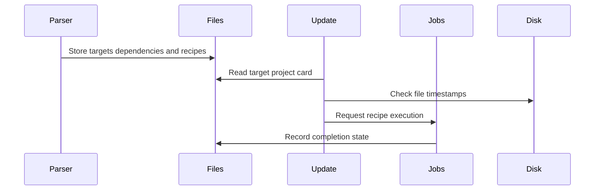

# Chapter 5: struct file

When you write:

```make
app: main.o util.o
	$(CC) -o $@ $^
```

how does Make remember that `app` exists as a target, that it needs two object files, that it has a recipe, whether it already exists on disk, and whether it has already been rebuilt during this run?

It cannot keep rereading the Makefile line whenever it needs an answer. By the time Make is deciding whether `app` is out of date, that one line has become a durable in-memory record.

That record is `struct file`.

A `struct file` is Make’s project card for one filename or target name. It may represent:

- an ordinary file such as `main.o`;
- a final artifact such as `app`;
- a source file such as `main.c`;
- a phony action such as `clean`;
- an intermediate artifact created during an implicit-rule search;
- a special target such as `.PHONY`;
- an included Makefile;
- one entry in a double-colon rule.

The parser from [eval](04_eval.md) turns target names into these records. The dependency engine in [update_goal_chain](08_update_goal_chain.md) later reads them to decide what to build. Recipe execution in [new_job](09_new_job.md) uses them to run commands.

Think of `struct file` as a project card pinned to Make’s wall:

```text
Name:          app
Needs:         main.o, util.o
Recipe:        $(CC) -o $@ $^
Last checked:  timestamp information
Build state:   not started, running, or finished
Special tags:  phony, intermediate, precious, and more
```

The central definition is in [`src/filedef.h`](https://github.com/mirror/make/blob/master/src/filedef.h):

```c
struct file
  {
    const char *name;
    const char *hname;
    const char *vpath;
    struct dep *deps;
    struct commands *cmds;
```

```c
    const char *stem;
    struct dep *also_make;
    struct file *prev;
    struct file *last;
    struct file *renamed;
```

```c
    struct variable_set_list *variables;
    struct variable_set_list *pat_variables;
    struct file *parent;
    struct file *double_colon;
```

The rest of the structure stores timestamps, update status, command state, and many one-bit properties.

This chapter introduces those fields as parts of one coherent idea: Make maintains a living record of every name it needs to reason about.

## One canonical record per ordinary filename

The first job is identity.

For ordinary single-colon rules, Make wants one shared record for each filename. If these lines appear in a Makefile:

```make
app: main.o
app: util.o
```

Make should not create two unrelated targets named `app`. It should combine the prerequisites:

```text
app
 ├── main.o
 └── util.o
```

That requires a central file database.

`file.c` owns a hash table containing known files:

```c
static struct hash_table files;
```

The lookup function is:

```c
struct file *
lookup_file (const char *name)
{
  struct file file_key;
  file_key.hname = name;
  return hash_find_item (&files, &file_key);
}
```

The real implementation also normalizes details such as leading `./` components and platform-specific path syntax. But the basic operation is simple:

1. prepare a tiny lookup key containing the name;
2. search the global file hash table;
3. return the existing project card, if any.

This is similar to a contact list. Looking up `app` should find the existing contact card rather than making a new card each time someone mentions the name.

## Creating a file card

When Make sees a name it does not know, it calls `enter_file()`:

```c
struct file *
enter_file (const char *name)
{
  struct file *f;
  struct file *new;
  struct file **file_slot;
```

The function first checks whether an ordinary record already exists:

```c
file_key.hname = name;
file_slot = (struct file **) hash_find_slot (&files, &file_key);
f = *file_slot;

if (! HASH_VACANT (f) && !f->double_colon)
  return f;
```

For a normal target, the existing record is returned. That is what allows several rules to contribute to the same target.

If there is no usable existing record, Make allocates a zero-filled record:

```c
new = xcalloc (sizeof (struct file));
new->name = new->hname = name;
new->update_status = us_none;
```

Using `xcalloc()` matters. It initializes pointer fields to null and bit fields to zero. A freshly created file record starts in a neutral state:

```text
no dependencies
no recipe
no known timestamp
not updated
not phony
not intermediate
not explicitly declared as a target yet
```

Then Make inserts it into the hash table:

```c
new->last = new;
hash_insert_at (&files, new, file_slot);
```

The `last` pointer becomes more interesting for double-colon rules later. For now, it simply points at the record itself.

## `name` and `hname`: the visible name and the lookup name

At first glance, these fields seem redundant:

```c
const char *name;
const char *hname;
```

Usually, they are the same:

```text
name:  main.c
hname: main.c
```

But Make sometimes finds a file through `VPATH`.

Suppose the Makefile says:

```make
VPATH = src

app: main.o
main.o: main.c
```

and `main.c` is actually located at `src/main.c`.

Make may begin with a record whose visible name is:

```text
main.c
```

Then VPATH search finds:

```text
src/main.c
```

The record can temporarily distinguish:

```text
name:  main.c
hname: src/main.c
```

You can think of `name` as the name written on the original work order, while `hname` is the filing-system identity currently used for hash lookup and filesystem access.

The VPATH search code eventually calls `rehash_file()` when it needs to change the hashed identity:

```c
void
rehash_file (struct file *from_file, const char *to_hname)
{
  struct file file_key;
  struct file **file_slot;
  struct file *to_file;
```

Changing a hash key is not as easy as assigning a new string to a field. The record may need to move to a different hash-table bucket, and it may collide with a file record already known under the new name.

That is why Make has a dedicated renaming path rather than casually changing `hname`.

## A file record may be renamed into another record

The `renamed` field supports this possibility:

```c
struct file *renamed;
```

Its comment explains the rule:

> After any time that a file could be renamed, call `check_renamed`.

The helper macro follows a chain of replacements:

```c
#define check_renamed(file) \
  while ((file)->renamed != 0) (file) = (file)->renamed
```

Imagine that Make first creates a project card for `main.c`, then later discovers that it should be treated as `src/main.c`, which already has its own card.

Instead of leaving two conflicting cards, Make merges information into one surviving card and points the old card’s `renamed` field to it.

That is like discovering that two customer records—“Ada Lovelace” and “Ada Byron”—belong to the same person. You merge their notes, choose one canonical record, and leave a forwarding address in the old one.

The merge in `rehash_file()` includes dependencies, variable sets, timestamps, and special properties:

```c
if (to_file->deps == 0)
  to_file->deps = from_file->deps;
else
  {
    struct dep *deps = to_file->deps;
    while (deps->next != 0)
```

The code continues by appending old dependencies, merging target-specific variable lists, and combining relevant flags.

This is one reason `struct file` is richer than “a filename plus a timestamp.” It is the stable meeting place where information from parsing, VPATH search, implicit rules, and execution comes together.

## Dependencies live beside the target

A file record points to its prerequisites here:

```c
struct dep *deps;
```

For:

```make
app: main.o util.o
```

the file record for `app` points to a chain like:

```text
app file record
    ↓ deps
main.o dependency → util.o dependency
```

The dependencies themselves are represented by `struct dep`, which is the subject of [struct dep](06_struct_dep.md).

For now, the important distinction is:

- `struct file` represents the thing Make may need to update;
- `struct dep` represents one edge from that thing to a prerequisite.

The parser builds this connection in `record_files()` from [eval](04_eval.md):

```c
deps = split_prereqs (depstr);
```

Then it attaches the result to the file record:

```c
if (f->deps == 0)
  f->deps = this;
else
  {
    struct dep *d = f->deps;
    while (d->next != 0)
```

Rules without recipes append their prerequisites after existing ones. Rules with recipes put their prerequisites first, preserving historical GNU Make behavior.

The practical result is that Make can accumulate information from several declarations:

```make
app: config.h
app: main.o util.o
app: version.h
```

All of those lines enrich one `struct file` for `app`.

## Recipes are separate objects

The recipe pointer is:

```c
struct commands *cmds;
```

For:

```make
app: main.o
	$(CC) -o $@ $^
```

the parser stores the command text in a separate `struct commands` object, then attaches it to `app->cmds`.

This separation is useful because the recipe has its own metadata:

- the text of the recipe;
- source file and line number;
- the recipe prefix in use;
- parsed command lines;
- prefix flags such as `@`, `-`, and `+`.

The parser creates the recipe object only when a rule actually has command text:

```c
cmds->commands = xstrndup (commands, commands_idx);
cmds->command_lines = 0;
cmds->recipe_prefix = prefix;
```

Then `record_files()` attaches it:

```c
if (cmds != 0)
  f->cmds = cmds;
```

The file record therefore owns the connection:

```text
target name
    ↓
recipe object
    ↓
command text and source location
```

A file record is the project card; `struct commands` is the attached instruction sheet.

When Make later decides that `app` needs rebuilding, `remake_file()` checks whether it has a recipe:

```c
if (file->cmds == 0)
  {
    if (file->phony)
      file->update_status = us_success;
```

Otherwise, it prepares and executes the stored commands.

Recipe expansion and process startup occur later in [new_job](09_new_job.md).

## Explicit rules, implicit rules, and `stem`

The `stem` field records the part matched by `%` when Make uses an implicit or static pattern rule:

```c
const char *stem;
```

Suppose Make has this rule:

```make
%.o: %.c
	$(CC) -c $< -o $@
```

and needs to build:

```text
src/main.o
```

The matching process discovers a stem, conceptually:

```text
stem: src/main
```

or, depending on the rule’s directory handling, the relevant matched portion.

Once Make chooses an implicit rule, `implicit.c` stores the result:

```c
file->stem = strcache_add_len (stem, stemlen);
file->cmds = rule->cmds;
file->is_target = 1;
```

The stem is later used to set `$*`, the automatic variable for the rule’s matched portion.

Automatic variables are installed by `set_file_variables()`:

```c
DEFINE_VARIABLE ("<", 1, less);
DEFINE_VARIABLE ("*", 1, star);
DEFINE_VARIABLE ("@", 1, at);
```

The variable scope holding these values is attached through `file->variables`, as described in [variable_set_list](02_variable_set_list.md).

So an implicit-rule match does not merely choose a recipe. It updates the file record with enough context to expand that recipe correctly later.

## Target-specific variables belong to the file

A file record can own a variable scope:

```c
struct variable_set_list *variables;
```

This is what makes target-specific variables possible:

```make
app: CFLAGS = -DAPP
app: main.o
```

The `CFLAGS` definition is not stored as a global change. It belongs to the `app` file record.

When Make parses this assignment, `record_target_var()` ensures that `app` has a variable set list:

```c
initialize_file_variables (f, 1);

current_variable_set_list = f->variables;
v = try_variable_definition (flocp, defn, origin, 1);
```

The complete lookup structure is explained in [variable_set_list](02_variable_set_list.md), but the key connection is:

```text
struct file for app
    ↓
app variable scopes
    ↓
target-specific CFLAGS and automatic variables
```

When Make expands `app`’s recipe, it temporarily uses that file’s variable context:

```c
current_variable_set_list = file->variables;
result = variable_expand (line);
```

That code lives in `variable_expand_for_file()` from [variable_expand](03_variable_expand.md).

A file record therefore represents not only “what file is this?” but also “what variable world should apply while building it?”

## Pattern-specific variables are cached separately

A related field is:

```c
struct variable_set_list *pat_variables;
```

Pattern-specific variables may apply to a target:

```make
%.o: CFLAGS = -Wall
```

But they are not stored directly in every possible `.o` file at parse time. Make does not know every future target name.

Instead, once Make is preparing a specific file, it finds matching pattern-specific definitions and attaches a generated scope layer to that file.

`initialize_file_variables()` performs this work:

```c
if (!reading && !file->pat_searched)
  {
    /* Search matching pattern variables. */
  }
```

After matching, Make inserts the pattern layer below the target’s own layer:

```c
file->pat_variables->next = l->next;
l->next = file->pat_variables;
```

The `pat_searched` bit prevents repeated searches for the same file.

Think of target-specific variables as notes physically attached to one project card. Pattern-specific variables are more like a stamp machine: when Make sees `main.o`, it applies the matching `%.o` stamps once and remembers the result.

## Parent records explain prerequisite inheritance

The `parent` field is:

```c
struct file *parent;
```

This records the immediate target that caused the current file to be considered.

For example:

```make
app: main.o
main.o: main.c
```

While updating `main.o` because `app` needs it, Make sets:

```text
main.o parent → app
```

The dependency engine does this before recursively checking a prerequisite:

```c
d->file->parent = file;
new = check_dep (d->file, depth, this_mtime, &maybe_make);
```

This relationship has two important roles.

First, it improves diagnostics. If Make cannot build `missing.h`, it can explain:

```text
No rule to make target 'missing.h', needed by 'main.o'.
```

Second, it supports inheritance of target-specific variables. A prerequisite can see variable scopes belonging to the target that requested it, unless those variables are marked `private`.

That scope-chain behavior is covered in [variable_set_list](02_variable_set_list.md), but `file->parent` is the physical link that makes the inheritance path possible.

A parent pointer is like a note saying, “This work order was opened because project `app` asked for it.”

## Timestamps: what did the filesystem say?

A file record stores two timestamps:

```c
FILE_TIMESTAMP last_mtime;
FILE_TIMESTAMP mtime_before_update;
```

They answer different questions.

| Field | Meaning |
|---|---|
| `last_mtime` | The most recently known modification time |
| `mtime_before_update` | The time before Make attempted updates in this run |

Why keep both?

Suppose Make checks `app`, sees that it is older than `main.o`, then runs a recipe. After the recipe, Make needs to know whether `app` actually changed.

That comparison is meaningful only if Make remembers its previous timestamp.

Think of these fields as “current reading” and “reading before repair” on a utility meter.

The timestamp cache begins in an unknown state:

```c
#define UNKNOWN_MTIME 0
```

Other special values represent useful non-filesystem states:

```c
#define NONEXISTENT_MTIME 1
#define OLD_MTIME 2
#define NEW_MTIME INTEGER_TYPE_MAXIMUM (FILE_TIMESTAMP)
```

These special values let Make express more than ordinary clock times:

| Value | Meaning |
|---|---|
| `UNKNOWN_MTIME` | Make has not checked yet |
| `NONEXISTENT_MTIME` | The file does not exist |
| `OLD_MTIME` | Treat the file as older than any real file |
| ordinary timestamp | Actual filesystem modification time |
| `NEW_MTIME` | Treat the file as newer than any real file |

The command-line options `-o` and `-W` use the artificial old and new values. In `main.c`, `-o FILE` marks a file very old:

```c
f->last_mtime = f->mtime_before_update = OLD_MTIME;
f->updated = 1;
f->update_status = us_success;
```

Likewise, `-W FILE` marks a file as extremely new.

This is a useful design: Make does not need a wholly separate “pretend timestamp” system. The normal timestamp fields can hold special sentinel values.

## Reading and caching modification times

The macro most code uses is:

```c
#define file_mtime(f) file_mtime_1 ((f), 1)
```

It avoids repeated filesystem calls:

```c
#define file_mtime_1(f, v) \
  ((f)->last_mtime == UNKNOWN_MTIME ? f_mtime ((f), v) : (f)->last_mtime)
```

Read that as:

1. if Make already knows the timestamp, reuse it;
2. otherwise call `f_mtime()` to check the filesystem;
3. cache the answer in `file->last_mtime`.

This is like checking a package tracking page once, then keeping the result on the project card instead of refreshing it every time someone asks.

The actual `f_mtime()` routine also handles:

- archive members;
- VPATH searches;
- library names such as `-lfoo`;
- symbolic-link timestamp checks when `-L` is enabled;
- clock-skew warnings;
- propagation across double-colon entries.

The simple field `last_mtime` is therefore the front door to a surprisingly broad filesystem policy.

## Update status: what was the result?

The result of trying to update a file is stored in `update_status`:

```c
enum update_status
  {
    us_success = 0,
    us_none,
    us_question,
    us_failed
  } update_status ENUM_BITFIELD (2);
```

The meanings are:

| Status | Meaning |
|---|---|
| `us_success` | The target was handled successfully |
| `us_none` | No final update decision has been recorded yet |
| `us_question` | It needs updating, but `make -q` prevented execution |
| `us_failed` | The attempt failed |

The ordering matters. `us_success` must be zero because zero-filled new file records should begin in the successful numeric state where code expects that default. `us_none` then means “not decided yet,” not “failure.”

The update engine uses this field after checking dependencies and running recipes.

For example, when a recipe fails, the child-reaping code sets:

```c
c->file->update_status = child_failed == MAKE_FAILURE
  ? us_failed : us_question;
```

When Make finishes a file that required no work, `notice_finished_file()` converts an unfinished neutral state into success:

```c
if (file->update_status == us_none)
  file->update_status = us_success;
```

The status is the project card’s final verdict:

```text
completed successfully
not yet decided
would need work in question mode
failed
```

## Command state: where is the work right now?

A separate enum tracks the lifecycle of recipes:

```c
enum cmd_state
  {
    cs_not_started = 0,
    cs_deps_running,
    cs_running,
    cs_finished
  } command_state ENUM_BITFIELD (2);
```

This answers a different question from `update_status`.

- `update_status` asks: **what was the outcome?**
- `command_state` asks: **what stage is the work currently in?**

| Command state | Meaning |
|---|---|
| `cs_not_started` | No recipe activity has begun |
| `cs_deps_running` | Prerequisite recipes are still running |
| `cs_running` | This target’s recipe is running |
| `cs_finished` | Recipe activity is complete |

This distinction is especially important during parallel builds.

Imagine `app` depends on `main.o` and `util.o`, and both object recipes are running simultaneously. `app` itself has not failed and has not succeeded yet. Its state is:

```text
command_state: cs_deps_running
update_status: us_none
```

The update engine records that situation:

```c
set_command_state (file, cs_deps_running);
```

Later, once the object files finish, Make can reconsider `app` and possibly run its own recipe.

This is like a delivery dashboard:

```text
Order outcome: not yet known
Current stage: waiting for parts
```

Those are related facts, but they are not the same fact.

## `updated` and `updating`: two carefully different bits

Two flags look similar:

```c
unsigned int updating:1;
unsigned int updated:1;
```

But they mean different things.

| Flag | Meaning |
|---|---|
| `updating` | Make is currently traversing this target’s dependency path |
| `updated` | Make has finished considering this target during this run |

The `updating` bit helps detect dependency cycles.

Suppose Make sees:

```make
a: b
b: a
```

While Make is considering `a`, it marks it as being updated. If it reaches `a` again through `b`, it knows that following the edge would loop.

The code abstracts this with helpers because double-colon targets need special treatment:

```c
#define start_updating(_f)  \
  (((_f)->double_colon ? (_f)->double_colon : (_f))->updating = 1)
```

And later:

```c
#define finish_updating(_f) \
  (((_f)->double_colon ? (_f)->double_colon : (_f))->updating = 0)
```

The cycle-detection branch reports and drops the circular edge:

```c
if (is_updating (d->file))
  {
    OSS (error, NILF, _("Circular %s <- %s dependency dropped."),
         file->name, d->file->name);
```

The `updated` flag, by contrast, prevents redundant work after Make has already resolved a target:

```c
if (file->updated)
  return file->update_status;
```

Think of `updating` as a “currently visiting” mark during a maze walk. Think of `updated` as a “completed inspection” stamp after leaving the room.

## `considered`: pruning repeated graph walks

Another field supports efficient traversal:

```c
unsigned int considered;
```

The update engine maintains a global scan number named `considered`. Each traversal pass increments it.

A file record stores the number of the pass in which it was examined:

```c
f->considered = considered;
```

If Make reaches the same file again during the same pass, it can often stop early:

```c
if (f->considered == considered)
  {
    DBF (DB_VERBOSE, _("Pruning file '%s'.\n"));
    return f->command_state == cs_finished
      ? f->update_status : us_success;
  }
```

This is an efficient “already visited” marker without clearing every file record between passes.

Instead of erasing thousands of checkmarks at the start of every walk, Make changes the color of today’s marker. A record marked with today’s number has already been seen today.

## Special properties are compact policy labels

The bottom half of `struct file` contains many one-bit flags:

```c
unsigned int precious:1;
unsigned int phony:1;
unsigned int intermediate:1;
unsigned int secondary:1;
unsigned int notintermediate:1;
```

These are tiny fields, but each changes Make’s behavior in a meaningful way.

### Phony targets

A phony target represents an action rather than a real file:

```make
.PHONY: clean
clean:
	rm -f app *.o
```

During `snap_deps()`, Make finds the prerequisites of `.PHONY` and marks each corresponding file record:

```c
f2->phony = 1;
f2->is_target = 1;
f2->last_mtime = NONEXISTENT_MTIME;
```

Marking the timestamp nonexistent ensures that Make will not consider a real file named `clean` to be up to date.

A phony target is like a calendar task. “Clean the build directory” is never satisfied merely because a file named `clean` exists.

### Precious targets

A precious target should not be deleted automatically after interruption or failure:

```make
.PRECIOUS: generated.c
```

The flag is:

```c
unsigned int precious:1;
```

When Make handles fatal signals or recipe failures, it checks this before removing a target:

```c
if (file->precious || file->phony)
  return;
```

A precious file is like a draft marked “do not discard.” Even if the process is interrupted, Make preserves it for inspection or recovery.

### Intermediate targets

An intermediate file is a temporary stepping stone in a build:

```text
source.c → source.o → app
```

Make may create `source.o` only because it needs it to build `app`, then remove it afterward if the object was truly temporary.

The bit is:

```c
unsigned int intermediate:1;
```

The implicit-rule engine often marks files intermediate while searching for a route to build a target.

After the build, `remove_intermediates()` checks:

```c
if (f->intermediate && (f->dontcare || !f->precious)
    && !f->secondary && !f->notintermediate && !f->cmd_target)
```

Only then is automatic deletion allowed.

This is a careful policy. “Intermediate” does not mean “always delete.” Several other flags can protect the file.

### Secondary and not-intermediate files

`.SECONDARY` protects intermediate files from deletion:

```make
.SECONDARY: generated.c
```

Make sets both:

```c
f2->intermediate = f2->secondary = 1;
```

That means, “this file may participate as an intermediate, but keep it.”

`.NOTINTERMEDIATE` has the opposite role:

```make
.NOTINTERMEDIATE: result.o
```

It prevents a file from being treated as automatically disposable:

```c
f2->notintermediate = 1;
```

These flags are like different archive labels:

- **intermediate**: temporary working material;
- **secondary**: temporary material, but retain it;
- **not intermediate**: treat this as a durable artifact.

## `is_target` and `is_explicit` are not identical

Two more fields are easy to confuse:

```c
unsigned int is_target:1;
unsigned int is_explicit:1;
```

`is_target` means Make has a rule-like description for this file. It is part of Make’s target database.

`is_explicit` means the file was explicitly mentioned in the Makefile, rather than being discovered only through an implicit-rule search.

For example:

```make
app: main.o
```

makes `app` a target and explicitly mentions `main.o` as a prerequisite.

But implicit-rule search can discover additional files that were never written directly in the Makefile. Those may be targets without being explicitly named by the user.

Why care?

Implicit-rule search treats explicitly mentioned files differently from inferred temporary files. In particular, a file explicitly named elsewhere should generally not be casually treated as a disposable intermediate.

The implicit-rule code uses this distinction when deciding whether a candidate prerequisite is intermediate:

```c
if (df && !df->is_explicit && !d->is_explicit)
  df->intermediate = 1;
```

This is like distinguishing a named deliverable in a contract from a temporary worksheet discovered while planning the work.

## Double-colon rules require several records

Single-colon rules merge:

```make
report: data.txt
report: format.txt
```

There is one `report` file record, with combined prerequisites.

Double-colon rules are different:

```make
report:: data.txt
	./make-data-report

report:: format.txt
	./make-format-report
```

Each `::` rule is independent. Make may run both recipes when their separate prerequisites require it.

That means one record is not enough.

The relevant fields are:

```c
struct file *prev;
struct file *last;
struct file *double_colon;
```

For a double-colon name, Make creates multiple file records linked together:

```text
report root record
    ↓ prev
report second rule record
    ↓ prev
report third rule record
```

The root record’s `double_colon` pointer points to the first entry in the chain.

When `enter_file()` sees that a name already belongs to a double-colon target, it creates another record:

```c
new->double_colon = f;
f->last->prev = new;
f->last = new;
```

The `prev` chain lets Make walk each independent rule. The `last` field lets Make append efficiently.

A double-colon target is like several separate maintenance contracts for the same building. They share the building’s address, but each contract has its own trigger conditions and instructions.

## Grouped targets use `also_make`

Grouped targets declare that one recipe produces several outputs together:

```make
parser.c parser.h &: parser.y
	bison -d -o parser.c parser.y
```

The field is:

```c
struct dep *also_make;
```

Each target receives a dependency-like list of its peer outputs.

Conceptually:

```text
parser.c also makes → parser.h
parser.h also makes → parser.c
```

When Make updates one grouped target, it propagates command state and update outcome to the peers.

`set_command_state()` does this for active work:

```c
file->command_state = state;

for (d = file->also_make; d != 0; d = d->next)
  if (state > d->file->command_state)
    d->file->command_state = state;
```

And `notice_finished_file()` propagates a completed recipe result:

```c
for (d = file->also_make; d != 0; d = d->next)
  {
    d->file->command_state = cs_finished;
    d->file->updated = 1;
```

This avoids running the same generator recipe once for `parser.c` and again for `parser.h`.

It also lets Make warn if an implicit grouped-target recipe claimed to produce a peer but did not actually create it.

## A file record’s life through one build

Consider:

```make
.PHONY: all
all: app

app: main.o util.o
	$(CC) -o $@ $^

main.o: main.c
util.o: util.c
```

The file records evolve through several stages.

### 1. Parsing creates the cards

The parser reads target names and uses `enter_file()`.

```text
all
app
main.o
util.o
main.c
util.c
.PHONY
```

At this point, Make has mostly structural knowledge:

```text
app has deps
app has a recipe
main.o and util.o have dependency relationships
```

### 2. Special targets add policy tags

During `snap_deps()`, Make sees that `all` is a prerequisite of `.PHONY`.

```c
f2->phony = 1;
f2->is_target = 1;
f2->last_mtime = NONEXISTENT_MTIME;
```

Now the `all` card has a permanent “phony” tag.

### 3. The update engine checks timestamps

Make begins with the goal `all`, follows its dependency to `app`, then follows `app` to the object files.

For each file, it obtains or reuses `last_mtime`.

```text
main.c exists
main.o missing
util.c exists
util.o missing
app missing
```

### 4. Implicit rules may enrich cards

If no explicit recipe exists for `main.o`, Make may find the built-in `%.o: %.c` rule.

That process adds:

```text
main.o recipe
main.o dependency on main.c
main.o stem
main.o target status
```

### 5. Commands start and states change

Before starting a recipe, Make installs automatic variables and creates a job.

```text
main.o command state: running
util.o command state: running
app command state: dependencies running
```

### 6. Completion updates the records

After each recipe finishes, Make records success or failure, refreshes timestamps when necessary, and marks the target updated.

```text
main.o updated: yes
main.o status: success
util.o updated: yes
util.o status: success
app can now run
```

The path looks like this:



The `Files` participant is the `struct file` database: the durable source of truth shared by every other subsystem.

## Inspecting file records with `make -p`

GNU Make’s database output is one of the best ways to see the user-visible consequences of `struct file`.

Run:

```sh
make -p
```

Then search for a target:

```sh
make -p | grep -A15 '^app:'
```

You may see output shaped like:

```text
app: main.o util.o
#  Implicit rule search has not been done.
#  File does not exist.
#  File has not been updated.
#  recipe to execute from Makefile line 2:
	$(CC) -o $@ $^
```

That printer reads fields directly from `struct file`:

- `deps`;
- `cmds`;
- `phony`;
- `precious`;
- `intermediate`;
- `also_make`;
- `last_mtime`;
- `updated`;
- `update_status`;
- `command_state`;
- target-specific variables.

The implementation begins:

```c
printf ("%s:%s", f->name, f->double_colon ? ":" : "");
print_prereqs (f->deps);
```

Then it prints special properties:

```c
if (f->precious)
  puts (_("#  Precious file (prerequisite of .PRECIOUS)."));
if (f->phony)
  puts (_("#  Phony target (prerequisite of .PHONY)."));
```

This makes `make -p` much more than a debugging dump. It is a readable report of Make’s project cards.

## Reading the source without getting lost

When exploring GNU Make’s target database, these locations are useful landmarks:

| Question | Main location |
|---|---|
| What fields define a target record? | `struct file` in `src/filedef.h` |
| Where are file records stored? | `files` hash table in `src/file.c` |
| How is a record found? | `lookup_file()` in `src/file.c` |
| How is a record created? | `enter_file()` in `src/file.c` |
| Where are parsed rules attached to records? | `record_files()` in `src/read.c` |
| Where are special target properties applied? | `snap_deps()` in `src/file.c` |
| Where are timestamps read and cached? | `f_mtime()` in `src/remake.c` |
| Where are targets considered for rebuilding? | `update_file_1()` in `src/remake.c` |
| Where are automatic variables installed? | `set_file_variables()` in `src/commands.c` |
| Where are recipes started? | `execute_file_commands()` in `src/commands.c` |
| Where are target records printed? | `print_file_data_base()` in `src/file.c` |

A particularly useful question while reading the code is:

> Is Make changing the description of this target, checking whether it needs work, or recording the result of work?

Those are different phases, but they all meet at the same `struct file`.

## Key takeaways

`struct file` is GNU Make’s canonical in-memory record for one target or filename.

It stores the information Make needs across the whole build:

- **identity** through `name` and `hname`;
- **dependencies** through `deps`;
- **recipe instructions** through `cmds`;
- **implicit-rule context** through `stem`;
- **grouped-output peers** through `also_make`;
- **VPATH and renaming state** through `vpath`, `hname`, and `renamed`;
- **target-specific variable scopes** through `variables` and `pat_variables`;
- **dependency ancestry** through `parent`;
- **double-colon rule chains** through `double_colon`, `prev`, and `last`;
- **filesystem knowledge** through `last_mtime` and `mtime_before_update`;
- **build progress** through `considered`, `updating`, `updated`, `command_state`, and `update_status`;
- **special policy tags** such as `phony`, `precious`, `intermediate`, `secondary`, and `notintermediate`.

The most important mental model is this:

> A Makefile line is only the beginning. After parsing, Make works primarily with a network of project cards.

Each `struct file` card knows what the named artifact needs, how it may be produced, what Make has learned about it from the filesystem, and what has happened to it during the current run.

Now that the target card itself is clear, the next question is how Make represents each individual prerequisite edge attached to that card: normal prerequisites, order-only prerequisites, second expansion, `.WAIT`, and more. That is the subject of [struct dep](06_struct_dep.md).